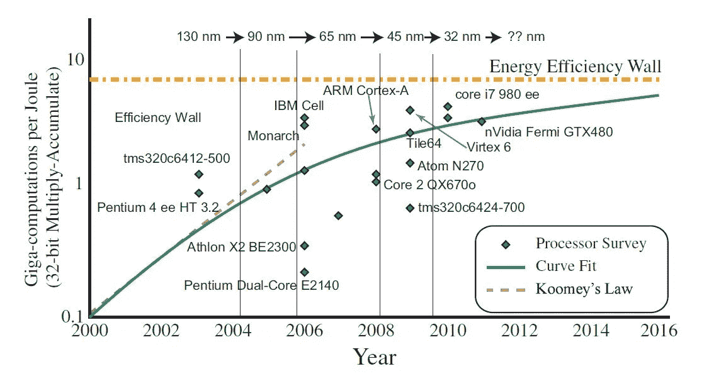
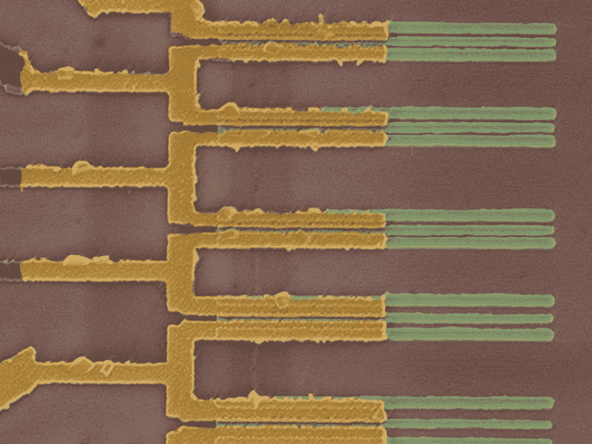
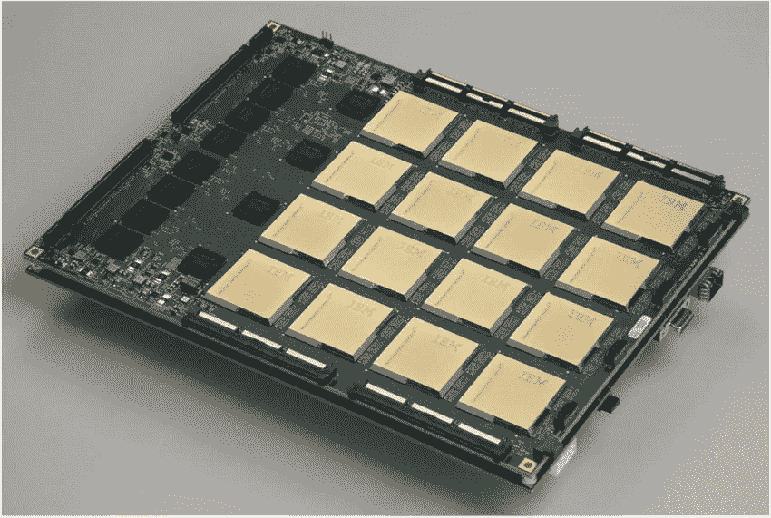
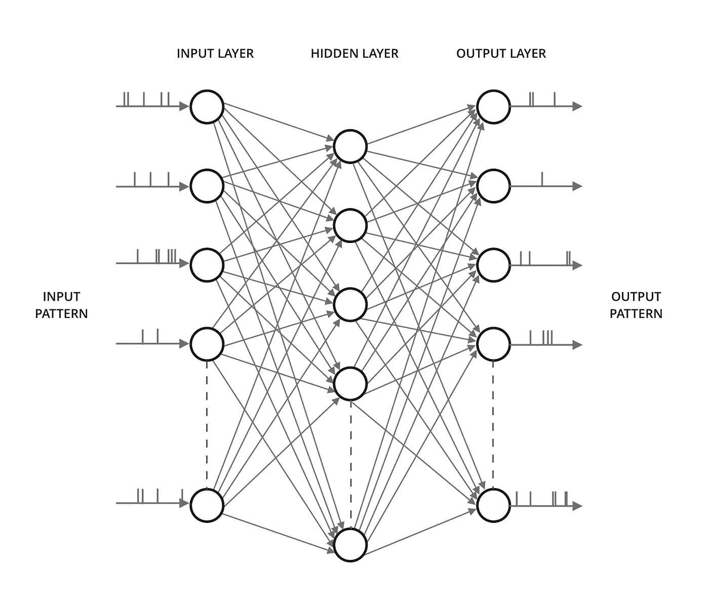

# 神经形态硬件:试图将大脑植入芯片

> 原文：<https://towardsdatascience.com/neuromorphic-hardware-trying-to-put-brain-into-chips-222132f7e4de?source=collection_archive---------9----------------------->

到目前为止，芯片制造商一直依靠著名的摩尔定律来生产下一代计算能力更强、功耗更低的芯片。现在，这些进步正慢慢停止。世界各地的研究人员正在提出替代架构，以继续生产更快、更节能的系统。本文讨论了这些备选方案，以及为什么其中一个方案在避免芯片设计行业陷入困境方面可能比其他方案更有优势。

# 什么是摩尔定律及其黄昏

摩尔定律，或者换句话说，全球芯片制造商的救星，是由英特尔公司的创始人戈登·摩尔博士在 1965 年提出的。**法律规定芯片上的晶体管数量每两年翻一番**。但是为什么是芯片制造商的救世主呢？前英特尔工程师 Robert P. Colwell 说，这个定律在半导体繁荣时期非常强大，以至于“*人们会自动购买下一个最新最棒的计算机芯片，并完全相信它会比他们现有的*更好。过去，写一个性能很差的程序不是问题，因为程序员知道摩尔定律最终会拯救他。

我们今天面临的问题是，法律几乎已经死亡！或者是为了避免冒犯摩尔的粉丝——正如博通首席技术官亨利·萨缪尔里所说——

> 它在变老，在老化，它没有死，但你必须为美国退休人员协会签署摩尔定律。"

随着我们接近原子尺度，芯片制造商要进一步缩小晶体管的尺寸变得越来越困难。该行业已经开始感受到压力。英特尔在 2015 年宣布，其新一代芯片将每 2.5 年发布一次。**这也表明晶体管可能只在未来 5 年内继续缩小。**

Source: [Finding a roadmap to achieve large neuromorphic hardware systems](https://www.frontiersin.org/articles/10.3389/fnins.2013.00118/full). Over the last several years, the computational efficiency has not scaled along the lines expected by traditional Moore’s law type scaling. A closer look suggests an asymptote is being reached in MAC computational efficiency using classical digital techniques.

那么，是什么导致这项长期存在的法律失效呢？是*量子力学*，傻！让我们更深入地了解处理器的工作原理。我们都知道处理器只理解机器代码。因此，无论它存储或处理的是 1 和 0 的形式。这些 1 或 0 的状态由逻辑门保存，而逻辑门又由晶体管组成。晶体管的工作是调节电子的流动(通过建立一个势垒)，从而在逻辑门中保持一个特定的状态。现在，当我们降低到 1 纳米= 10 个原子的尺度时，就很难调节电子流了。**即使存在势垒，由于一种叫做*量子隧道*的现象，电子流仍会继续。**因此，漏电流显著增加，导致架构效率低下。

# 替代途径

IBM’s carbon nanotubes could serve as a replacement to silicon. Source: IBM Research

研究人员和公司正试图提出替代方案，以避免在计算机架构领域陷入谷底。英特尔制造集团的前负责人暗示，该公司将采用新材料并改变晶体管的结构，以增加对电流的控制。随着深度学习的进展和新的复杂算法的开发，对能够高效执行繁重矩阵计算的芯片的需求越来越多。

全球研究人员正在探索以下新领域:

*   **量子计算**:它利用了一个亚原子粒子在任何给定时间以多于一种状态存在的能力。不像传统的比特可以存储 0 或 1，*量子比特* *可以存储更多的信息*。这意味着量子计算机可以用更少的能量存储比传统计算机多得多的信息。
*   碳纳米管:这是卷成圆柱形的微小碳片，IBM 正在积极探索。在《科学》杂志上发表的一篇论文中，他们描述了一种使用碳纳米管制造晶体管的新方法，这种晶体管可能比我们今天使用的硅晶体管小得多。
*   **并行架构**:这种方法在过去的十年中被广泛用于规避性能障碍。正在开发高度并行的架构(GPU)来执行同时操作。与**冯·诺依曼** **架构**在单核上串行执行指令不同， *GPU 拥有在多核上运行的并发线程，从而大大加快了处理速度*。焦点也转向高能效的 FPGA，以取代 GPU。
*   **神经形态硬件**:它包括任何模拟我们神经系统自然生物结构的*电子设备。目标是通过在硅中实现神经元来赋予机器认知能力。由于其更好的能效和并行性，它被认为是传统架构和高能耗 GPU 的替代方案。*

在上述领域中，量子计算和碳纳米管仍处于初级发展阶段。它们仍然不能完全替代硅，更不用说它们的商业生产了。GPU 已经使用了很长时间，但它们消耗大量的能量。神经形态硬件也相对处于发展的中间阶段，但为即将到来的性能危机提供了一个非常可能的解决方案。

# 神经形态硬件

人类大脑是地球上现存的能量效率最高、延迟最低的系统。它处理复杂信息的速度比任何计算机都快，处理方式也比任何计算机都好。这很大程度上是由于它的结构由密集的神经元组成，通过它们的突触有效地传输信号。**神经形态工程**的目标是在硅片上实现这种架构和性能。该术语是由卡弗·米德在 20 世纪 80 年代末创造的，描述了包含模拟/数字电路的系统，以模拟神经系统中存在的神经生物元素。许多研究机构一直在投资开发能做同样事情的芯片。

DARPA’s Systems of Neuromorphic Adaptive Plastic Scalable Electronics (SyNAPSE) board rocking 16 TrueNorth chips. Each chip has one million silicon “neurons” and 256 million silicon synapses between neurons. Source: IBM Corp

IBM 的神经形态芯片— [**TrueNorth**](https://www.ibm.com/blogs/research/tag/truenorth/) 有 4096 个核心，每个核心有 256 个神经元，每个神经元有 256 个突触与其他神经元进行通信。这种结构非常接近大脑，在能量上非常有效。同样，英特尔的[**Loihi**](https://ieeexplore.ieee.org/document/8259423) 拥有 128 个内核，每个内核有 1024 个神经元。曼彻斯特大学的 APT 小组最近披露了世界上最快的超级计算机— [**SpiNNaker**](https://www.manchester.ac.uk/discover/news/human-brain-supercomputer-with-1million-processors-switched-on-for-first-time/) 仅由神经形态核心组成。 [**Brainchip**](https://www.brainchipinc.com/) 是另一家为数据中心、网络安全和金融技术开发类似芯片的公司。****人类大脑项目是一项由 EU-资助的大型项目，旨在研究如何构建模仿大脑工作方式的新算法和计算机****

****所有这些系统都有一个共同点——都非常节能。****

> ****TrueNorth 的功率密度是传统冯诺依曼处理器的万分之一。****

****这种巨大的差异是因为片上处理的异步本质，就像人脑一样。不需要在每个时间步更新每个神经元。只有在行动中的人才需要力量。这被称为**事件驱动处理**，是使神经形态系统作为传统架构的合适替代方案变得可行的最重要的方面。****

# ****脉冲神经网络****

****神经形态芯片上由突触互连的密集**神经元网络被称为脉冲神经网络。神经元通过突触传递脉冲来相互交流。*上述芯片在硬件中实现了这个网络*，但也非常强调在软件中模拟它，以评估性能或解决模式识别和深度学习的其他应用的问题。******

********

****A full mesh Spiking Neural Network with input and output spike trains. The weights are updated using STDP rule.****

****脉冲神经网络以脉冲序列的形式在**时域**中对信息进行编码，即两个连续脉冲之间的时间差决定了网络的特性。网络最基本的元素——神经元——的功能由一个微分方程控制。神经元的输入是时域中离散尖峰的形式，而不是连续值。由于 SNN 的这些特性，用于训练它的方法也不同于现有的人工神经网络。代替梯度下降，一个更符合生物学原理的**赫比学习**被使用。它也被称为**尖峰时间依赖可塑性(STDP)** 。****

****Hebbian Learning in action in biological neurons. Neurons communicate by transmitting impulses over a network of synapses. Source: Unknown****

****这一切起初看起来似乎很深奥，需要时间来掌握 SNN 的网络动态。由于这个领域仍处于初级阶段，可用的文档也不全面。****

> ****这一系列博客旨在从零开始发展对 SNN 的理解，深入解释网络的每个元素，并用 Python 实现。还将讨论 Python 中用于 SNN 的现有库。****

****跟随[计算神经科学](https://medium.com/computational-neuroscience)在这个有趣的领域获得更多见解。此外，作为我的客人，为这一出版物作出贡献。欢迎合作。****