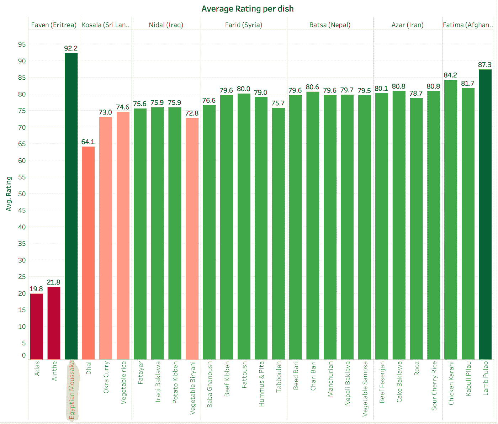
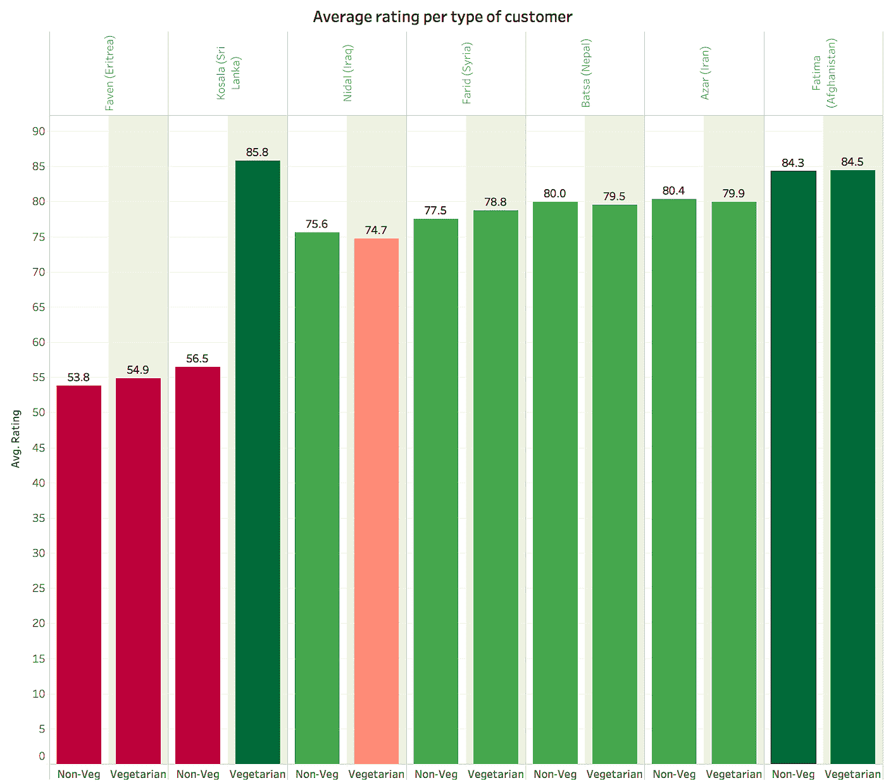

# 永远不要跨过“平均”4 英尺深的河

> 原文：<https://towardsdatascience.com/never-cross-a-river-4-feet-deep-on-average-d1a8d1ec345c?source=collection_archive---------17----------------------->

## 数据假象

## 总结战争与和平——避免常见的数据陷阱

# 一——概述战争与和平

《战争与和平》有 361 章 587287 字 559 字！一个普通人大概需要 33 个小时来读完整本书，一些学者花了一生的时间来剖析这部杰作。你会如何向从未读过这本书的人简要解释这本书？

最简短的“总结”可以是这样的:“战争与和平大体聚焦于拿破仑 1812 年入侵俄罗斯”

一个稍微复杂一点的“让你觉得这本书也有一些浪漫色彩的总结可能是”这本书讲述了文学中三个最知名的人物:皮埃尔·别祖霍夫，一个伯爵的私生子，他正在为自己的遗产而斗争，渴望精神上的满足；安德烈·博尔孔斯基王子，他离开了他的家庭去参加反对拿破仑的战争；娜塔莎·罗斯托夫(Natasha Rostov)，一个贵族的年轻漂亮的女儿，在拿破仑的军队入侵时引起了两个人的兴趣，托尔斯泰出色地跟踪了来自不同背景的人物——农民和贵族，平民和士兵——他们与他们的时代、历史和文化特有的问题进行斗争。随着小说的进展，这些人物超越了他们的特殊性，成为世界文学中最感人的人物。 *1*

Could you read a book the size of war and peace but full with raw data?

这些总结充其量是“聊胜于无”，但没有一个能恰如其分地描述托尔斯泰的杰作。事实上，给你朋友的唯一真正的建议是慢慢地、一丝不苟地阅读整本书，在笔记本上记下每一个字符，这样他们就不会被错综复杂的情节弄糊涂了。

然而，许多商业决策都是在类似的非常不完善的数据汇总的基础上做出的:商店因为季度业绩低于预期而关闭，销售人员因为年度业绩令人鼓舞或令人失望而被提升或解雇，产品线因为整体利润不如其他产品线而停产…

## 一个简短的例子

让我用一个简单的例子来说明总结是如何误导人的……几年前，我与人合伙创办了一家餐饮企业，我们雇佣了几十名难民和移民厨师，为团队午餐或公司活动提供他们的美味佳肴。

由我们自己的员工将食品交付给最终客户。准时交货是衡量客户满意度的一个关键指标，因此，我想给准时交货率最高的员工颁发一份特别奖。为了简单起见，让我们假设我们只有两个交付人员:Farid 和 Fatima

1.  一月份，法里德的平均准时分娩率高于法蒂玛:分别为 90%和 88%
2.  2 月份，Farid 的平均准时交付率再次高于 Fatima，分别为 80%和 78%

谁应该得奖？法里德显然是对的…？

如果我告诉你，一月和二月 ***合计，是法蒂玛，而不是法里德*，**的准时交付率最高，会怎么样？

你可能会想不可能——*法里德在一月和二月会更好，而法蒂玛总体上会更好？*很简单。事实上，如果你看看下表:

从数学的角度来看，推理很简单:如果 A1/C1 > B1/D1，A2/C2 > B2/D2，我们不能必然地假设(A1+B1)/(C1+D1) > (A2+B2) / (C2+D2)！这是一个基本的比率规则。换句话说，两个月的*算术平均值*(Farid 为 85%，Fatima 为 83%)与上述的*加权平均值*之间存在明显差异。

然而，从逻辑的角度来看，结论仍然可能非常违背直觉和令人不安！对我来说，问题仍然存在:谁应该获得这个奖？当然，答案取决于我们如何提问(奖金应该按月发放还是按周期发放)？你可以很容易地看到同样的推理如何应用到其他领域(例如，产品 A 在一个月的每个星期都比产品 B 有更高的利润率，但是产品 B 在这个月有更高的利润率……)

另一方面，言外之意很清楚:仅仅依靠“总结”是不够的…

## 那我们该怎么办？“读取”所有数据？

实际上，想象一下，您想要理解一个大约和《战争与和平》一样大的数据集(比如大约 500，000 个数据点)。理解它、描述它、获得洞见并付诸行动的最佳方式是什么？考虑到战争与和平小说的相似性，你可能需要花几个月的时间来观察整个数据集，观察并理解每一个小数据点，以及它与其他数据点的联系。当然，这是不切实际的:不仅要花很长时间来观察所有的数据，更重要的是，我们的大脑没有能力吸收或理解成千上万个不同的数据点。例如，当阅读一本小说时，我们的大脑有一种与生俱来的能力，并且从小就被训练来建立一个连贯的叙述，将概念联系在一起，即使你在阅读这些概念时相隔几周或几个月。然而，我们的大脑从不同的数据中构建连贯图像的能力却非常有限。在某种程度上，用我们理解 50 万字的《战争与和平》的方式来理解这 50 万个数据点，目前仍将是一个遥远的梦想。

作为一种变通方法，我们使用统计描述符(如平均值、中值、标准差)分析和总结数据，并使用相关、聚类和模式分析等工具…我们使用技术工具，并越来越多地使用人工智能来大幅提高我们分析和总结数据的速度。这些方法旨在通过简化信息，在数据的复杂性和我们人类思维的有限理解之间建立一座“桥梁”,但如果使用不当，它们也会产生不完整甚至错误的图像。

假设，如果有一个超人的大脑可以理解数百万数据行形式的原始数据，这将是一种真正实现对每个数据点的完美理解的方法。(你可能会认为人工智能是这种理解的某种版本——我认为人工智能确实有机会增强这种理解，但这应该是另一篇文章的主题)这种超人的思维当然会将任何“总结”数据的尝试视为对他们完美理解的降级。这就是我们应该如何看待数据的统计描述符——特别是平均值和方差——作为看待数据的方便但不完美的方式。它们经常带有固有的偏见，会直接导致错误的结论。它们是完美的例子，说明“半理解”实际上可能比“完全不理解”更糟糕。

在接下来的系列文章中，我将通过几个实际例子来说明我们在使用这些总结“妄下结论”时所犯的一些判断错误和偏见，并解释为什么“显而易见的答案”并不像看起来那么显而易见。

# 这是给谁的？

本系列对数据作者(准备和展示数据的人，如顾问)和数据读者(数据的接收者，或被顾问讲课的人)都有帮助。

*对于数据作者来说，*目标不是提供先进的数据分析技术。这些在今天的大量书籍中都有涉及。事实上，数据作者今天面临的主要挑战是我所谓的“法拉利错觉”:这是一种错觉，因为你开着法拉利，所以你是一个更好的飞行员，而事实上，如果你想开法拉利，你必须学会成为一个更好的飞行员。否则，当你踩下油门时，你所做的只是增加撞车的几率。在 excel 中创建一个包含类别平均值的数据透视表只需不到一分钟的时间，我仍然惊讶于 Tableau 这样快速简单的工具可以通过简单的拖放来总结和创建数十万个数据点的美丽视觉效果。向左拖动，向右拖动，神奇的是，你就有了你需要的漂亮的平均图表。这些工具正变得越来越强大、快速和花哨，但对于数据作者来说，很容易将花哨和强大与准确混淆起来。我的目标是这一背景实际上是提醒一些基本原则，即使是高级数据科学家有时也似乎忘记了，就像有经验的登山者经常在最容易的路径上绊倒，当他们不注意的时候。当然，如果考虑到正确的焦点，这些工具会变得非常方便。

*对于“数据读者”/* 来说，向人们展示数据的目的是帮助他们提出正确的问题，而不是落入数据作者通常有意为他们设置的陷阱。这些“技巧”可以被故意使用，特别是由昂贵的顾问使用，以证实他们的高级合伙人在他们对数据将说什么有一点线索之前就已经给了客户错误的结论。他们晚上仍然睡得很好，因为有时“目的可以证明手段的正当性”

下面的例子将有助于说明我们需要持怀疑态度并提出正确的问题，尤其是在被放映完美幻灯片的顾问讲课时。我的一般经验是:格式越完美，演示者越优雅，幻灯片越有光泽，你就越应该怀疑，问更多的问题。

在下一章中，我将为最流行的“汇总”统计说明上面的概念:平均值。我将用具体的例子来说明平均值可能产生误导的几种情况:

1.  被平均的数据比被平均的层具有更多的底层
2.  基于不足数据点的平均值
3.  当数据层具有不同的分散程度时，平均值会传达误导信息

# II——为什么平均值会误导人

让我们回到我的餐饮公司。公司厨师开发了几十种来自他们烹饪传统的菜肴——虽然在我看来都很特别，但他们的菜肴对典型的美国人来说或多或少是成功的。在我们不断努力为顾客提供最佳服务的过程中，我们希望了解谁是我们最好的厨师，我们发起了一项调查，顾客可以对每位厨师的烹饪进行评分。在我们承办的每个活动中，每个厨师通常都会准备一道菜。

每位厨师的平均结果如下所示

直接结论是显而易见的:

1.  Faven 的评分比她的厨师同事低得多。我们或许应该解雇她，或者至少让她在厨房帮忙，而不是用不为人知、显然不受欢迎的味道折磨我们的顾客？
2.  *法蒂玛*是我们最好的厨师！让我们宣传她，为她的美食多做些广告吧！
3.  法里德、巴特萨和阿扎尔都是同样伟大的厨师，评分也差不多。Nidal 稍微低一点但是还是可以的。科萨拉只有 70%——还可以，但是我们应该少用她。

# a)数据有多少层？

简单吧？没那么快。事实证明，所有这些结论都是错误的，或者至少是误导性的:我们的调查确实要求每个顾客对厨师进行评价，我们知道每个厨师为每个活动准备了不同的菜肴。如果我们不只是平均厨师的结果，而是平均相应菜肴的结果，会怎么样？结果如下:

我们可以清楚地看到，*最受欢迎的菜肴是埃及穆萨卡*，它是……厨师法文的创造！仅仅依靠平均每位厨师，我们就要解雇负责我们最受欢迎菜肴的人了！Faven 主厨有另外两种菜降低了她的平均水平，这些菜显然不受纽约人的欢迎，应该被淘汰。但她显然有一些天赋，我们应该鼓励她创造一些新的菜肴。

这是同一概念的另一个例子。我们的客户服务代表 Alex 很有远见地询问了每一个调查对象他们是否是素食者。当我们对引入该维度的回答进行平均时，结果如下:

这里第二个错误的结论是*科萨拉的美食其实是最受素食者欢迎的*！所以，再一次，平均每个厨师只把 Kosala 列为相当一般，并且忽略了这个关键的洞察力(特别是我们的许多顾客是素食主义者)

*这是什么意思？*

在我们上面的例子中，考虑评价菜肴而不是厨师，或者介绍顾客的类型似乎是显而易见的——这从本质上说明了这一点。但是您可以在下面的类似示例中看到这是如何产生误导的:

*“一家公司想要关闭表现不佳的店铺，它关注的是每家店铺的平均收入”。*但是想象一下，平均收入最低的商店恰好是销售最多产品、利润最高的商店，或者是最有增长潜力的商店？这是一个与厨师的例子非常相似的例子，我相信你们中的很多人都以这样或那样的形式遇到过很多次。

# b)我是否有足够的独立数据点？

现在让我们来看看每个厨师/菜肴收到的评论数量。

上表中一个值得注意的事实是，Fatima 得到的评论比她的同龄人少得多，实际上少了 100 倍！原来 Fatima 是我们最新的厨师:其他厨师通常每人承办 40 多场活动，而她在 2018 年 9 月 12 日只承办了一场活动！

现在让我们放大一下 Fatima 承办的活动，看看具体的评分:

嗯，那个活动的人对他们的评价特别慷慨，不仅仅是对 Fatima，而是对所有人！那么我们现在说什么？尽管如此，肯定法蒂玛是有史以来最好的厨师？不太确定是吧。如果你已经提升了法蒂玛，为什么不打电话给她说:“嘿，我真的很抱歉，这次提升有点仓促！你的厨艺很有前途，但是我们真的还不知道你是不是一个好厨师，在我们可以肯定地说任何事情之前，你还有许多困难要克服。现在继续好好工作，让我们几个月后再聚”

*不仅仅是观察次数…*

你可以称之为“统计显著性”,但它不仅仅是观察的数量。在这个特定的例子中，数据(事件)还有另一个维度，这使得数据点不是独立的(即，不仅 Fatima 有非常少的数据点，而且它们也不是独立的，因为它们都与单个事件相关)

# c)数据的分散程度如何？

好吧——但是法里德、巴特萨和阿扎尔呢？它们看起来非常相似:总体平均评分相似，每道菜的平均评分相似，并且都有大量的数据点。在这种情况下，平均数一定有公平的代表性，对吗？让我们看看个人评分，看看我们是否错过了什么。下图显示了每道菜在特定容器中的评级数量(例如，70 至 80 将被归入 80 桶)。

Batsa 的收视率看起来不一样吧？他们都在 70 年代和 80 年代，而法里德，阿扎尔和科萨拉都有更多的极端(或低或高)。换句话说，几乎每个人都认为 Batsa 的菜肴非常好——没有人认为它们一般或特别，而对于其他厨师，我们有一些顾客认为他们的菜肴特别或一般！这是另一个机会，可以再次对数据的所有维度(每个事件、每个客户类型……)进行切片，以了解更多信息。我不会告诉你细节，但事实证明，法里德和阿扎尔的菜在那些自称为“爱冒险的食客”并喜欢尝试不同且颇具异国情调的东西的人那里会获得极高的评分，而那些喜欢安全行事的人有时会获得较低的评分——你知道我在说谁:那些只会在泰国餐馆点泰式炒面而不会尝试其他东西的人……相比之下，Batsa 的菜是冰淇淋的“香草”风味:每个人都喜欢它，但没有人对它着迷！这被证明是非常有价值的信息，因为它将帮助我们标记我们的菜肴:“冒险”或“取悦大众”。

从技术上来说，这是通过每个维度上的方差或标准差来衡量的(较小的标准差表示较小的方差)，但是，我发现像上图这样的可视化表示比仅使用标准差度量更有说服力。

# “永远不要穿过平均深度为 4 英尺的河流”…我们何时以及如何使用平均值

我最喜欢的作家之一尼古拉斯·塔勒布说得好，“永远不要跨过平均 4 英尺深的河”。从本质上说，他是在说，数据的可变性会使平均值变得无用，并经常导致错误，正如我们上面所说明的那样。

但这是否意味着我们应该永远抛弃平均数给我们的结论？我们不要那么激进好吗？当一个人意识到上下文时，平均值会很有帮助。例如，如果我告诉你，本田奥德赛 2018 EX 在纽约的平均售价为 29，978 美元，而本田 Pilot 2018 EX 的平均售价为 39，760 美元，这实际上是一个有用的信息，可以得出购买奥德赛会更便宜的结论，并让你知道你会花多少钱。这些数据的背景是:

1.  它是基于美国各销售点成千上万的独立观察
2.  这是相当具体的(我们有型号和地理和其他方面(如颜色)不太可能影响价格明显)
3.  数据并没有那么分散:当然，有一个非常有才华的推销员能够以高出 5%的价格卖出，或者你的伊拉克朋友曾经在巴格达市场交易地毯，他会以低于你 7%的价格卖出。但总的来说，这些数据看起来像一条清晰且相当窄的钟形曲线

但是让我们再举一个平均价格没有帮助的例子。假设你要建议你那疯狂富有的亚洲朋友，在苏富比拍卖一幅毕加索的画和一幅梵高的画，出价多少。你拿出平均数据，说毕加索在拍卖会上的平均售价为 700 万美元，梵高的平均售价为 1300 万美元。正如你已经猜到的，这对你的朋友来说几乎是无用的信息，因为:

1.  对梵高或毕加索作品销售的观察并不多，而且随着时间的推移，这些观察往往会发生变化
2.  这幅画的作者并不是它价格的唯一预测者(有点像上面的厨师和菜肴)。还有其他维度(比如绘画的状态)
3.  最重要的是，数据中存在显著的差异，存在显著的极端情况(毕加索为 1 亿美元，梵高为 8000 万美元以上)。它远不是一条清晰的窄形钟形曲线

另一个我个人觉得非常有趣的日常例子是 Yelp 或 Google 上的餐厅五星评级系统。有了这个系统，每家餐厅基本上都被划分为一个等级(即在 5 星级标准中为 2.5、3 或 4.5)。这是一个完美的例子，平均过度简化了信息，抹去了每个餐厅的特质。有了这个评分,“受欢迎的人”自然会上升到首位，有点像“香草”冰淇淋比绿茶冰淇淋更受欢迎。但如果你像我妻子一样是绿茶冰淇淋的忠实粉丝，那么你可能会因为仅仅依赖明星系统而错失良机。“群众的智慧”有时是“群众的暴政”，在许多方面，老式的餐馆评论(当由不带偏见的专业人士撰写时)可以对餐馆进行更有色彩和味道的评论。

这并不是说星级评定和群体智慧应该被忽略，但它更适合于本质上同质的事物:例如，对评级至关重要的卫生和舒适度评级在商务酒店中非常普遍，不像餐厅食物那样太依赖于“味道”。

作为补充说明，我应该强调，我遇到过一个显著的例外，在这个例外中，平均值实际上比数据点的集合更能提供信息:“群体的智慧”。如果你让人们猜罐子里有多少颗软糖，你会注意到他们答案的平均值是最佳近似值(会有比平均值做得更好的“专家”,但他们不会像平均值那样“一致”——也就是说，如果你重复实验多次，平均值将是所有专家中的赢家。这就是“群体智慧”效应，这是一个引人入胜的现象，值得单独辟出一章。

# 这对数据作者和数据读者意味着什么

总的来说，你需要采取怀疑的态度，了解正确的背景。数据是棘手的，所以记住任何合成都是不完美的。当然，这是可以的，也是必要的，但是，意识到这一点会有很大帮助:

*   问自己(或作者)正确的问题:
*   我还可以在哪些维度上分割数据？是否有我看不到的隐藏的可变性？
*   每个平均值下面有多少个观察值，它们是独立的吗？
*   数据有多分散？
*   花时间观察数据——在计算任何平均值之前，使用工具对多个维度进行分割
*   获取一些基本指标:维度数量、每个维度的观察数量、每个维度的差异
*   问问自己，发言人是否有意操纵信息

1.  企鹅随机屋的描述
2.  数据分析工具、机器学习和人工智能当然可以大大提高我们分析和总结数据的速度，但问题是它们在多大程度上传达了一幅增加我们对数据理解的画面