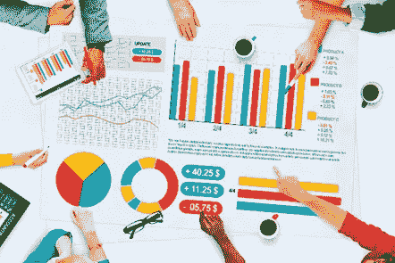
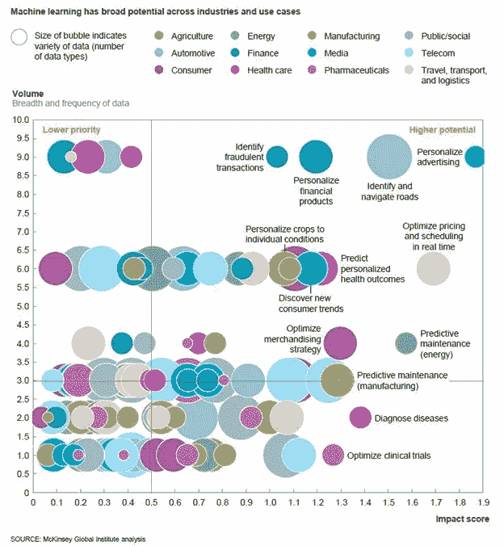
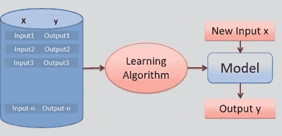
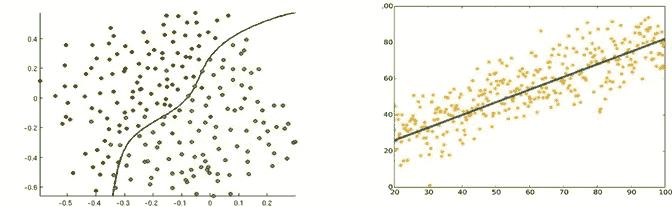
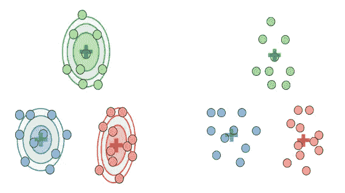
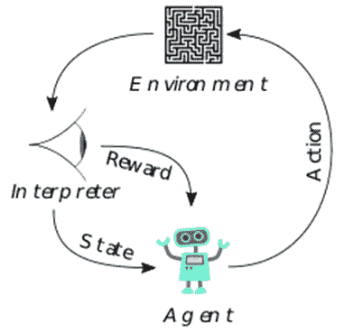
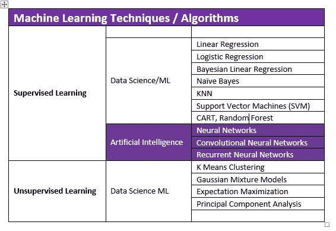
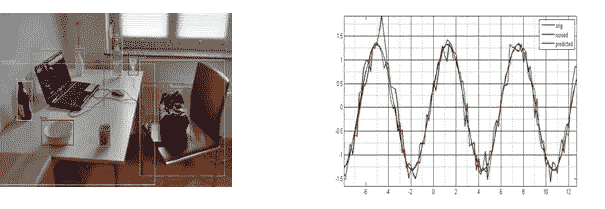
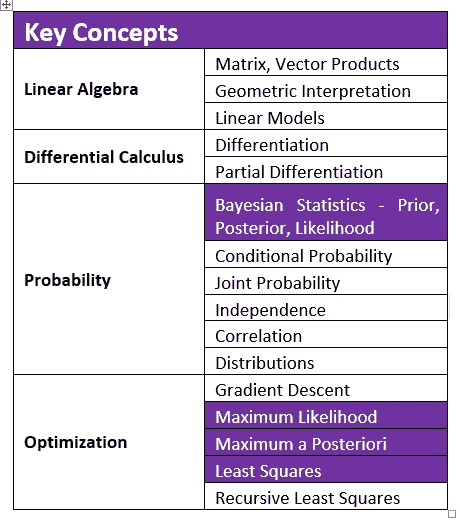
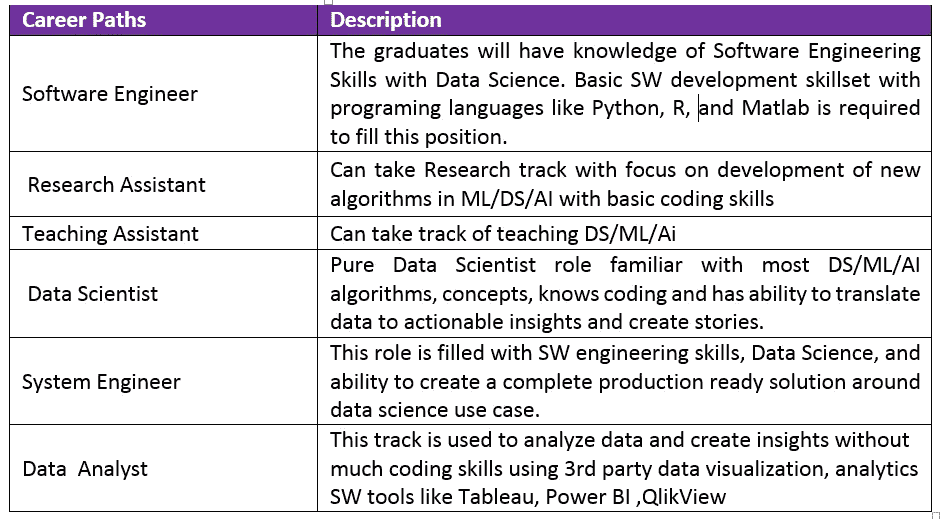

# 人工智能和机器学习时代数学/统计科学学生的新途径

> 原文：<https://towardsdatascience.com/new-avenues-for-statistical-science-students-in-the-era-of-artificial-intelligence-machine-291d630437c2?source=collection_archive---------31----------------------->

在这个从手机、家电和电子产品、城市、电子商务、医疗保健、连接到工业 4.0 标准的一切都变得“智能”的时代，我们关注统计科学的范围。人工智能和机器学习是技术的新流行语；让人想起电的发现或计算机的发明。工资最高的工作是在人工智能、人工智能和数据科学领域。没有统计科学的核心，这些途径是不可能的。我们探索统计科学毕业生在新技术领域可以利用哪些技能，以及在“智能”世界中可以弥合哪些差距。

# 1.传统统计科学

*Figure 1\. Traditional Statistics mostly into reporting and Data Analysis*

很久以前，统计学通常被认为是银行和金融部门最常用的学科。大多数毕业生无法超越银行和金融工作的范畴。从工资水平、技术挑战和影响因子来看，这个数学领域不像工程和计算机科学那么酷。然而，统计科学一直是破解最复杂问题的最有力武器，这些问题来自核物理、通信系统、机器人、空间科学和其他许多领域。

# 1.今日统计科学

随着计算机计算能力的巨大飞跃和更有效的统计算法的发明；人工智能和机器学习已经进入了一个新的领域。它的影响又远又广，几乎触及每一个生命。

A **人工**智能和机器学习是计算机科学的一个分支，它使用核心统计算法来训练计算机进行学习；通过预测、诊断或预后采取行动。AI 在学术界被广泛接受为使用(深度)神经网络的算法家族，而机器学习则是没有神经网络的统计算法家族。

学习大致分为三类

# 2.1 监督学习

*Figure 2.1.1 Supervised learning Logical Architecture* [1]

Ssupervised Learning 是一种统计学习算法，它使用一个已知的数据集——称为由输入值和响应值形成的训练数据集——来学习过去，通过损失函数优化来最小化误差，并建立一个模型来对新数据集进行预测。

监督学习分为两部分-

**分类**:分类响应值，其中数据可以被分成特定的“类”

**回归**:连续响应值。

*Figure 2.1.2 (a) Classification example showing decision boundary separating two classes (b) Linear Regression of data points. [2]*

# 2.2 无监督学习

U 监督学习是一种机器学习算法，用于从由没有标记响应的输入数据组成的数据集进行推断。

最常见的无监督学习方法是聚类分析，用于探索性数据分析，以发现数据中隐藏的模式或分组。使用基于诸如欧几里德距离或概率距离的度量定义的相似性度量来对聚类进行建模。

*Figure 2.2\. (a). Clustering of Data Samples using Gaussian Mixture Models and Expectation Maximization.(GMM-EM) (b) Clustering using K-means.[7]*

# 2.3 强化学习

这是另一类算法，通过基于动作最大化奖励和最小化惩罚来学习。它不同于监督学习算法，因为监督学习具有目标数据形式的答案，所以模型是在正确答案上训练的。在强化学习中，主体决定做什么来执行特定的任务。

*Figure 2.3.1\. Typical framing of a Reinforcement Learning (RL) scenario: an agent takes actions in an environment, which is interpreted into a reward and a representation of the state, which are fed back into the agent. [4]*

# 3.当今机器学习/数据科学中使用的算法

*Table 3.1 Most useful algorithms used in Machine Learning / AI*

虽然大多数数学/统计科学毕业生在毕业期间会遇到各种各样的算法，但表 3.1 强调了机器学习和人工智能的当代艺术中最重要的要求。在工业和研究领域，这些算法被广泛使用，并且对它们的熟悉是最受欢迎的。

**我们特别强调基于神经网络的人工智能相关算法**是未来技术进步的驱动力。接触人工智能现在是毕业生的必修课。

*Figure 3.1 Applications of AI. (a) Objects detection from the image [6] (b) Time Series prediction on some data*

A I 用于基于视觉的应用，如 o **对象检测、对象分类、对象语义字幕。自动驾驶汽车、面部识别、入侵检测**是流行的用例。

*Figure 3.2 (a) Self Driving car identifying objects on front. [3]*

*b) Speech to text used in modern day applications like Voice search, Google Maps, Voice assisted infotainment in vehicles etc.[4]*

A I 用于**序列建模，带时间语义数据。时间序列预测、来自文本数据的情感分析、语言翻译、语音识别、语音到文本和文本到语音**是一些最广泛使用的应用。

统计学毕业生需要熟悉**线性代数中的关键数学概念、微分学、优化技术，如梯度下降、最大似然和最大后验估计、贝叶斯统计、线性模型**。

*Table 3.2\. Key mathematical concepts required to be familiar with*

# 4.程序设计语言

统计科学毕业生不需要熟悉计算机科学工程，但是，至少一门编程语言的知识和将数学模型编码成软件的能力是必须的。事实上，上面提到的大多数工具和算法都是在编程练习中学会的。

ython 是数据科学家和计算机科学专业人士用来构建 ML 和 AI 应用程序的最流行的语言。Python 已经走在了传统语言的前面，如 **Java、C++、PHP** 。它很容易学习，非常强大，涵盖几乎所有应用程序的库，强大的用户基础 **Github 和堆栈溢出**。根据大多数跨行业的调查[8–12]，Python 作为最通用、最流行的编程语言占据主导地位。

通过 python 学习数据科学及其应用既简单又有趣。Python 拥有数百个数据科学库来构建强大的应用程序。

强烈建议数据科学专业的学生在学习这门课程时熟悉 Python。能够将数学模型转化为工作程序对学生来说是最大的优势。

M **ATLAB** 是最强大的商用数值计算平台。学生熟悉它是一个加分项。

R 专为统计应用而设计，但是不同平台上丰富的库使得 Python 成为更好的选择，因为解决方案需要跨各种技术栈的集成。

# 5.ML/DS 的职业前景和道路

数据科学家是过去 4 年来最好的工作[13，14]。数学/统计科学毕业生的范围是巨大的。麦肯锡全球研究所警告说，数据和分析人才严重短缺。仅美国就缺少 20 万名数据科学家和 120 万名具有数据科学知识的管理人员。其他国家的短缺并没有太大的不同。在过去的 4 年中，对 ML 和数据科学专业人员的需求增长了 10 倍[14]。

*Figure 5\. Rate of Growth of Jobs in Specific Domains [14]*

LinkedIn[14]也分析了这些工作的职业道路，以下是 5 个最常见的前角色

*Table 5\. Career Path for the Machine Learning Engineer and Data Scientist*

# 6.结论

我们强调了数据科学在各个行业领域的范围，研究了成为数据科学家/机器学习/人工智能专家所需的数据科学方面的特定技能。我们还展示了该领域毕业生的职业前景、需求和道路。培养具有上述技能的统计毕业生至关重要，以使他们符合当前的技术需求。如果以上任何一项缺失，大学最好纳入数学/统计科学毕业生的完整技能发展。

# 7.参考

1.NPTEL —机器学习简介

2.[https://kindsonthegenius . com/blog/2018/01/what-is-the-difference-that-classification-and-regression . html](https://kindsonthegenius.com/blog/2018/01/what-is-the-difference-between-classification-and-regression.html)

3.[https://blog . statsbot . co/neural-networks-for-初学者-d99f2235efca](https://blog.statsbot.co/neural-networks-for-beginners-d99f2235efca)

4.[https://9 to 5 Google . com/2017/04/18/Google-cloud-speech-API-recognition/](https://9to5google.com/2017/04/18/google-cloud-speech-api-recognition/)

5.[https://en.wikipedia.org/wiki/Reinforcement_learning](https://en.wikipedia.org/wiki/Reinforcement_learning)

6.[https://en.wikipedia.org/wiki/Object_detection](https://en.wikipedia.org/wiki/Object_detection)

7.斯坦福大学机器学习 CS229

8.[https://coding infinite . com/best-programming-languages-to-learn-2019/](https://codinginfinite.com/best-programming-languages-to-learn-2019/)

9.[https://www . techrepublic . com/article/forget-the-most-popular-programming-languages-heres-what-developers-actual-use/](https://www.techrepublic.com/article/forget-the-most-popular-programming-languages-heres-what-developers-actually-use/)

10.[https://www . geeks forgeeks . org/top-10-programming-languages-of-the-world-2019-to-begin-with/](https://www.geeksforgeeks.org/top-10-programming-languages-of-the-world-2019-to-begin-with/)

11.[https://www . fullstackacademy . com/blog/nine-best-programming-languages-to-learn-2018](https://www.fullstackacademy.com/blog/nine-best-programming-languages-to-learn-2018)

12.[https://technostacks.com/blog/top-programming-languages](https://technostacks.com/blog/top-programming-languages)

13.[https://www . Forbes . com/sites/louiscumbus/2018/01/29/data-scientist-is-the best-job-in-America-dues-2018-rankings/# 182 f4b 955535](https://www.forbes.com/sites/louiscolumbus/2018/01/29/data-scientist-is-the-best-job-in-america-according-glassdoors-2018-rankings/#182f4b955535)

14.[https://economic graph . LinkedIn . com/research/LinkedIns-2017-US-Emerging-Jobs-Report](https://economicgraph.linkedin.com/research/LinkedIns-2017-US-Emerging-Jobs-Report)

15.[https://www . Forbes . com/sites/louiscolumbus/2016/12/18/mckinseys-2016-analytics-study-defines-the-future-machine-learning/# 3aa 65 f 9514 EB](https://www.forbes.com/sites/louiscolumbus/2016/12/18/mckinseys-2016-analytics-study-defines-the-future-machine-learning/#3aa65f9514eb)

16.麦肯锡全球研究院——分析时代:在数据驱动的世界中竞争，2016