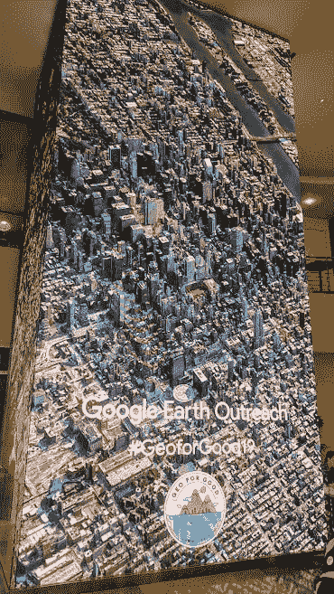
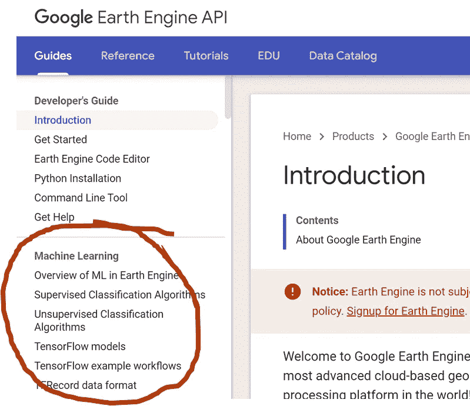
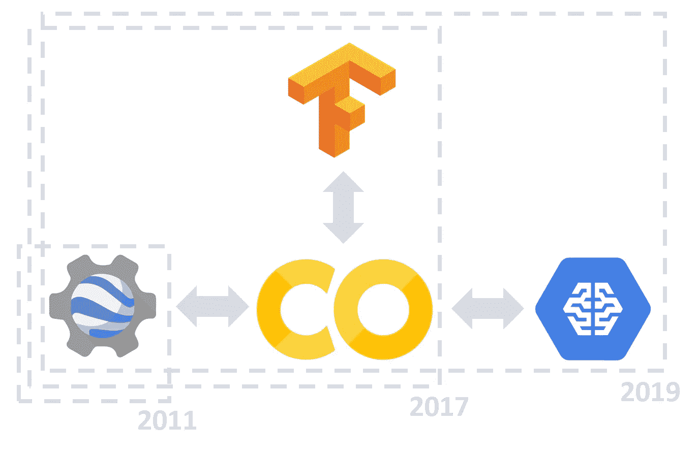
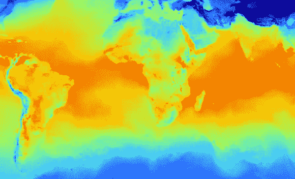

# 在 2019 年 Geo for Good 峰会上宣布了新的地球引擎功能

> 原文：<https://towardsdatascience.com/new-earth-engine-features-announced-at-geoforgood-summit-2019-57c33ef48bb8?source=collection_archive---------24----------------------->

## 改进的文档|与 Google AI 平台的集成|更酷的可视化

The Geo for Good Summit 2019 was held on 16–19 Sep 2019 at Google Event Center, Sunnyvale, California. Image by [Google Earth Outreach](https://www.google.com/earth/outreach/).

随着 2020 年 9 月 14 日 [Geo for Good Summit 2020](https://sites.google.com/earthoutreach.org/geoforgood20/home) 的临近，看看去年宣布的所有新功能可能会有所帮助。这不仅能帮助你学习新的技巧和诀窍，还能帮助你决定参加网上活动(如果你还犹豫不决的话)。

[Geo for Good Summit 2019](https://sites.google.com/earthoutreach.org/geoforgood19/home) 于 2019 年 9 月 19 日落下帷幕，作为第一次与会者，我惊讶地看到峰会上宣布的新进展数量。此次峰会是同类峰会中的第一次，它将用户峰会和开发者峰会合二为一，让用户受益于新工具的知识，让开发者了解用户的需求。因为我的主要关注点是大规模地理空间建模，所以我只参加了与谷歌地球引擎相关的研讨会和分组会议。至此，让我们来看看三个新的令人兴奋的发展，以打击地球引擎

## 1.关于机器学习的更新文档

The documentation for Machine Learning and Deep Learning has been updated. Screenshot by author from [this website](https://developers.google.com/earth-engine/).

文档真的吗？是啊！作为一名业余地球引擎用户，我对这个工具的头号抱怨是它在[应用开发者网站](https://developers.google.com/earth-engine/)、[谷歌地球博客](https://medium.com/google-earth)和它们的[堆栈交换答案](https://gis.stackexchange.com/questions/tagged/google-earth-engine)之间传播的糟糕的文档质量。因此，欢迎对文档进行任何更新。我很高兴文档已经更新，以帮助对实现机器学习和深度学习模型感兴趣的地理空间数据科学家的不断增长的用户群。

文档附带了自己的示例 Colab 笔记本。示例笔记本有[监督分类](https://developers.google.com/earth-engine/classification)、[非监督分类](https://developers.google.com/earth-engine/clustering)、[密集神经网络](https://colab.research.google.com/github/google/earthengine-api/blob/master/python/examples/ipynb/TF_demo1_keras.ipynb)、[卷积神经网络](https://colab.research.google.com/github/google/earthengine-api/blob/master/python/examples/ipynb/UNET_regression_demo.ipynb)、[Google Cloud 上的深度学习](https://colab.research.google.com/github/google/earthengine-api/blob/master/python/examples/ipynb/AI_platform_demo.ipynb)。我发现这些笔记本对我的起步非常有用，因为在流程中有相当多的非平凡数据类型转换(`int`到`float32`等等)。

## 2.地球引擎和人工智能平台集成

The Google Colab Environment is now integrated with Google AI Platform using the ee.Model API. Image by author.

尼克·柯林顿和克瑞丝·布朗共同宣布了期待已久的地球引擎+谷歌人工智能平台整合。到目前为止，用户基本上限于在 Google Colab 的虚拟机(VM)上运行小型作业，并希望与 VM 的连接不会超时(通常持续约 4 小时)。其他限制包括缺少任何任务监控或排队功能。

不再是了！新的`ee.Model()`软件包让用户可以与谷歌云服务器通信，他们可以根据自己的需要来设置服务器。不用说，这是对 VM 上以前提供的原始深度学习支持的巨大改进。尽管它是免费的，但人们不能简单地训练、验证、预测和部署任何大于几层的模型。一旦在 Google bucket 中创建了`.TFRecord`对象，就必须在 Google AI 平台上单独完成。通过这种云集成，用户可以直接在 Colab 环境中运行和测试他们的模型，从而极大地简化了这项任务。`ee.Model()`类附带了一些有用的功能，比如`ee.Model.fromAIPlatformPredictor()`可以直接从你在谷歌云上的模型预测地球引擎数据。

最后，由于你的模型现在位于人工智能平台上，你可以作弊并使用你自己离线训练的模型来预测地球上的发动机数据并绘制其输出图。注意，如果你想这样做，你的模型必须用`tf.contrib.saved_model`格式保存。流行的 Keras 功能`model.save_model('model.h5')`与`ee.Model()`不兼容。

展望未来，似乎该团队计划坚持将 Colab Python IDE 用于所有深度学习应用程序。然而，对于深受喜爱的 javascript 代码编辑器来说，这并不是致命的打击。在峰会上，我看到与会者仍然更喜欢 javascript 代码编辑器来完成他们的非基于神经的机器学习工作(如支持向量机、随机森林等)。).作为一个 python 爱好者，我也去代码编辑器快速可视化和地球引擎应用！

我没有在峰会上试用新的`ee.Model()`包，但尼克·克林顿展示了一个笔记本，上面有一个简单的工作示例来帮助我们学习函数调用。开发过程中仍然存在一些问题，比如由于“地球引擎与云平台的通信方式”，在预测期间将卷积内核限制为仅 144 像素宽，但他向我们保证，这将很快得到解决。总的来说，我对这种集成感到兴奋，因为 Earth Engine 现在是我地理空间计算工作的真正替代选择。随着地球引擎团队承诺在`ee.Model()`类中提供更多新功能，我想知道世界各地的公司和实验室是否会开始将他们的建模工作迁移到地球引擎。

## 3.更酷的可视化！

Global 24-hour temperature animated gif produced on Earth Engine using the ‘NOAA/GFS0P25’ dataset. [Link to code.](https://code.earthengine.google.com/8a0c7282a5194dcebf6f9f8ffcb75e5f) Image by author.

Matt Hancher 和 Tyler Erickson 展示了一些与可视化相关的新功能，我发现这大大简化了开发动画视觉效果的工作。使用`ee.ImageCollection.getVideoThumbURL()`功能，您可以在几秒钟内创建自己的动画 gif！我在一组数据集上试了一下，创建 gif 的速度确实令人印象深刻。

对将视频的每一次迭代导出到你的硬盘说再见吧，因为使用`print()`命令这些 gif 就出现在控制台上！上面显示的是来自“NOAA/GFS0P25”数据集的全球温度预测示例。波浪状图案是由于地球自转导致太阳在不同时间撞击我们星球的表面造成的。制作 gif 的代码可以在[这里](https://code.earthengine.google.com/8a0c7282a5194dcebf6f9f8ffcb75e5f)找到。这个动画是基于迈克尔·德威特的[原创博文中的例子，我参考了开发者页面上的这个](https://medium.com/google-earth/a-new-dimension-in-earth-engine-3c25c89d0ece) [gif 制作教程](https://developers.google.com/earth-engine/tutorials/community/modis-ndvi-time-series-animation)来制作的。

我没有涵盖峰会上介绍的所有新特性和功能。为此，请阅读[峰会重点介绍](https://medium.com/google-earth/the-stories-we-shared-at-the-geo-for-good-summit-2019-77ea4df22cf4)工具，如 Google Earth Pro，BigQuery GIS，Plus Codes 等。您还可以查看峰会的[会议资源](https://sites.google.com/earthoutreach.org/geoforgood19/agenda/breakout-sessions)，获取您感兴趣主题的演示文稿和笔记本。

#GeoforGood19