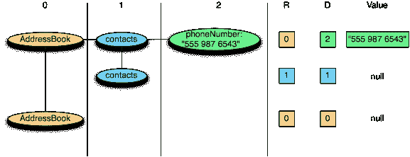

# Hadoop 中的新特性:你应该知道 Hadoop 中的各种文件格式。

> 原文：<https://towardsdatascience.com/new-in-hadoop-you-should-know-the-various-file-format-in-hadoop-4fcdfa25d42b?source=collection_archive---------5----------------------->

## *Hadoop 文件格式初学者指南*


答几周前，我写了一篇关于 Hadoop 的文章，并谈到了它的不同部分。以及它如何在数据工程中发挥重要作用。在这篇文章中，我将总结 Hadoop 中不同的文件格式。这个话题将会很简短。如果你想了解 Hadoop 是如何工作的，以及它在数据工程中的重要作用，请访问我关于 Hadoop 的文章，或者跳过它。

[](/a-brief-summary-of-apache-hadoop-a-solution-of-big-data-problem-and-hint-comes-from-google-95fd63b83623) [## Apache Hadoop 小结:大数据问题的解决方案和来自 Google 的提示

### 欢迎学习大数据和 Hadoop 简介，我们将在这里讨论 Apache Hadoop 以及如此大的问题…

towardsdatascience.com](/a-brief-summary-of-apache-hadoop-a-solution-of-big-data-problem-and-hint-comes-from-google-95fd63b83623) 

*Hadoop* 中的文件格式大致分为两类:**面向行和面向列:**

***面向行:***
存储在一起的同一行数据即连续存储:SequenceFile、MapFile、Avro Datafile。这样，如果只需要访问该行的少量数据，则需要将整行数据读入内存。延迟序列化可以在一定程度上减轻问题，但是从磁盘读取整行数据的开销是无法收回的。面向行的存储适用于需要同时处理整行数据的情况。

***面向列:***
将整个文件切割成几列数据，并将每列数据存储在一起:Parquet、RCFile、ORCFile。面向列的格式可以在读取数据时跳过不需要的列，适用于只有一小部分行在字段中的情况。但是这种读写格式需要更多的内存空间，因为缓存行需要在内存中(在多行中获取一列)。同时也不适合流式写入，因为一旦写入失败，当前文件无法恢复，而面向行的数据可以在写入失败时重新同步到上一个同步点，所以 Flume 使用面向行的存储格式。


Picture 1.(Left Side )**Show the Logical Table** and Picture 2\. ( Right Side) ***Row-Oriented Layout(Sequence File)***


Picture 3\. ***Column-oriented Layout (RC File)***

如果仍然不清楚什么是面向行和面向列，不要担心，你可以访问[这个链接](https://www.geeksforgeeks.org/dbms-row-oriented-vs-column-oriented-data-stores/)并知道它们之间的区别。

以下是一些在 Hadoop 系统上广泛使用的相关文件格式:

# **序列文件**

存储格式因是否压缩以及是使用记录压缩还是块压缩而异:


The Internal structure of a sequence file with no compression and with record compression.

**不压缩:**
按照记录长度、键值长度、值度、键值、值值顺序存储。该范围是字节数。使用指定的序列化执行序列化。

**记录压缩:**
只对值进行压缩，并将压缩后的编解码器存储在头中。

**分块压缩:**
多条记录一起压缩，利用记录间的相似性，节省空间。在块的前后添加同步标志。块的最小值是由属性设置的 io . seqfile . compress . block size。


The internal structure of a sequence file with block compression

# **地图文件**

MapFile 是 SequenceFile 的变体。在向 SequenceFile 添加索引并对其排序后，它是一个映射文件。索引存储为一个单独的文件，通常每 128 条记录存储一个索引。可以将索引加载到内存中进行快速查找——这些文件按照键定义的顺序存储数据。
映射文件记录必须按顺序写入。否则，将引发 IOException。

映射文件的派生类型:

1.  **SetFile :** 一个特殊的映射文件，用于存储一系列可写类型的键。钥匙是按顺序写的。
2.  **ArrayFile:** Key 是表示在数组中位置的整数，值可写。
3.  **BloomMapFile:** 使用动态布隆过滤器针对 MapFile get()方法进行了优化。过滤器存储在内存中，只有当键值存在时，才调用常规的 get()方法来执行读取操作。

Hadoop 系统下面列出的文件包括 RCFile、ORCFile 和 Parquet。Avro 的面向列版本是 Trevni。

# **RC 文件**

Hive 的记录列式文件，这种类型的文件首先将数据逐行划分为行组，在行组内部，数据以列的形式存储。其结构如下:


Data Layout of RC File in an HDFS block

与纯粹的面向行和面向列相比:


Row-Store in an HDFS Block


Column Group in HDFS Block

# **兽人档案**

ORCFile(优化记录列文件)提供了比 RCFile 更有效的文件格式。它在内部将数据划分为默认大小为 250M 的条带。每个条带包括一个索引、数据和页脚。索引存储每列的最大值和最小值，以及每一行在列中的位置。


ORC File Layout

在 Hive 中，以下命令用于使用 ORCFile:

```
CREATE TABLE ...STORED AAS ORC 
ALTER TABLE ... SET FILEFORMAT ORC 
SET hive.default.fileformat=ORC
```

# 镶木地板

基于 Google Dremel 的面向列的通用存储格式。尤其擅长处理深度嵌套的数据。


The internal Structure of Parquet File

对于嵌套结构，Parquet 将其转换为平面列存储，用重复级别和定义级别(R 和 D)表示，并在读取数据以重建整个文件时使用元数据来重建记录。结构。以下是研发的一个例子:

```
AddressBook {   
     contacts: {     
        phoneNumber: "555 987 6543"  
}   
 contacts: {   
} 
} 
AddressBook { 
}
```



现在，你知道 Hadoop 中不同的文件格式。如果您发现任何错误和建议，请随时与我联系。你可以通过我的 LinkedIn 联系我。

[](/forget-apis-do-python-scraping-using-beautiful-soup-import-data-file-from-the-web-part-2-27af5d666246) [## 忘记 API 用漂亮的汤做 Python 抓取，从 web 导入数据文件:第 2 部分

### API 并不都是为你准备的，但是美丽的汤会永远伴随着你。

towardsdatascience.com](/forget-apis-do-python-scraping-using-beautiful-soup-import-data-file-from-the-web-part-2-27af5d666246)