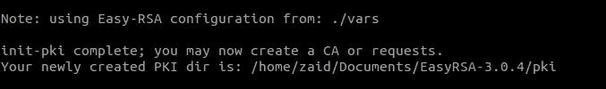
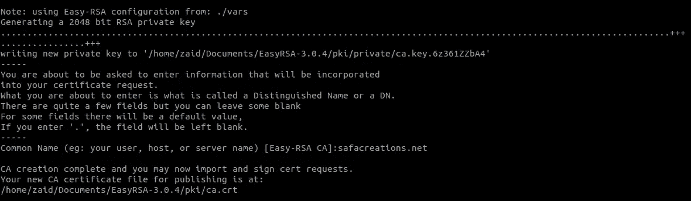
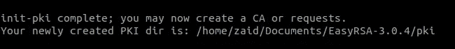
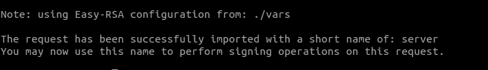
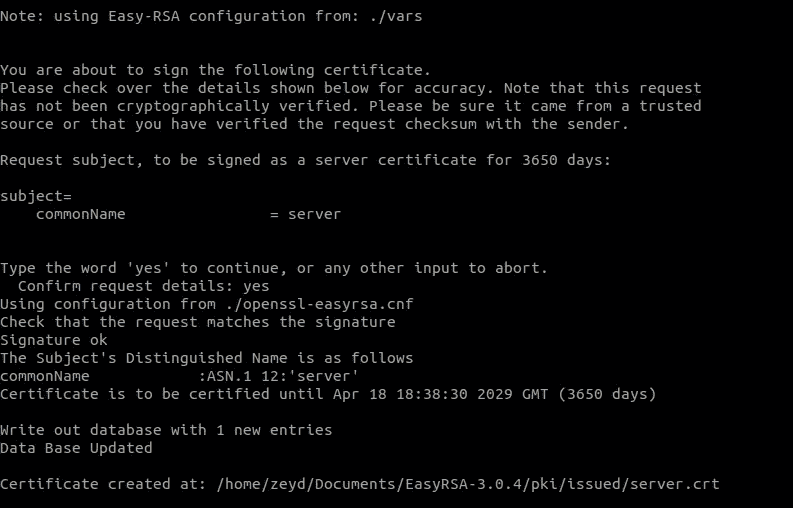
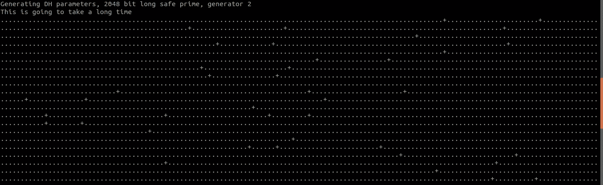
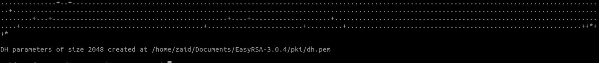
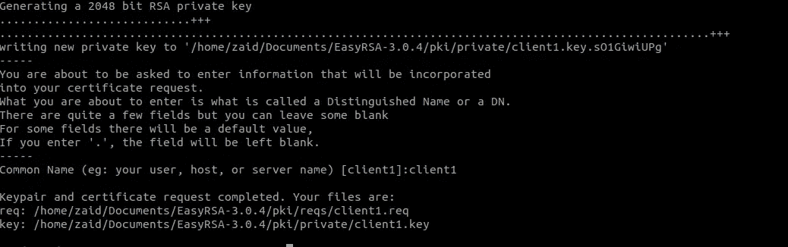
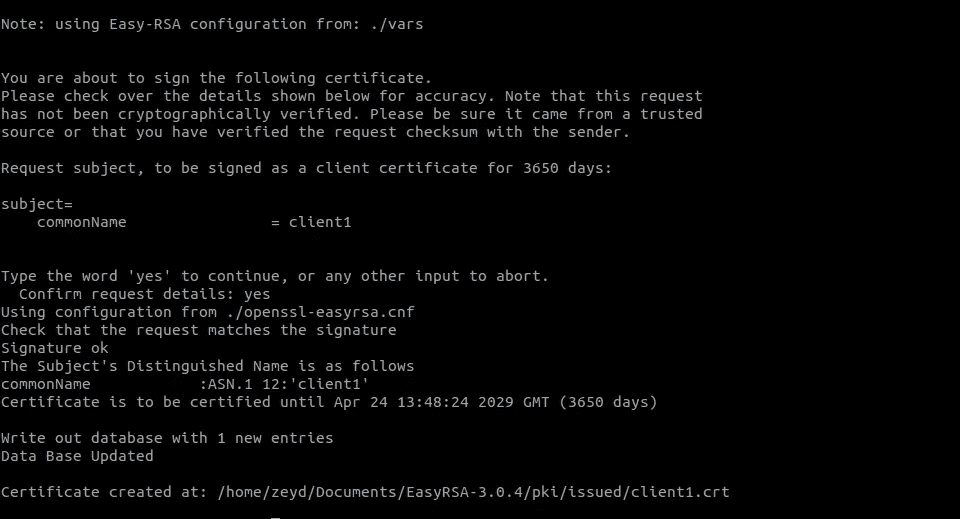

# 保护您的隐私，创建您自己的虚拟专用网络

> 原文：<https://towardsdatascience.com/new-story-a6420a1f097?source=collection_archive---------13----------------------->


[Hacking Scence.](https://www.pinterest.co.uk/pin/330310953911450778/)

当您的智能手机或笔记本电脑连接到不可信的网络(如酒店、咖啡店或图书馆的 WiFi)时，您是否希望安全可靠地访问互联网？一个[虚拟专用网](https://en.wikipedia.org/wiki/Virtual_private_network) (VPN)可以让你像在一个专用网上一样，安全地穿越不可信的网络。流量从 VPN 服务器流出，继续其到达目的地的旅程。

[OpenVPN](https://openvpn.net/) 是一款功能全面、开源的安全套接字层(SSL) VPN 解决方案，支持多种配置。在这个由两部分组成的教程中，我们将使用 digital ocean 在 Ubuntu 服务器上设置一个 OpenVPN 服务器，然后配置从 Android 对它的访问。本教程将使每个设置的安装和配置步骤尽可能简单。让我们从第一部分开始，它包括安装和配置的前五个步骤。

## 第一步:安装 OpenVPN 和 EasyRSA

这一步适用于 VPN 服务器和 CA 机器。我们开始更新我们的包索引并安装 OpenVPN。OpenVPN 在 Ubuntu 的默认存储库中可用，所以我们可以使用`apt`进行安装

```
$ sudo apt update 
$ sudo apt install openvpn
```

OpenVPN 是一种 TLS/SSL VPN。这意味着它使用证书来加密服务器和客户端之间的流量。为了发布可信证书，我们将设置简单的证书颁发机构(CA)。为此，我们将从项目的官方 GitHub 资源库下载最新版本的 EasyRSA，我们将部署它来构建我们的 CA 公钥基础设施(PKI)。

我们将在独立的服务器上构建 CA。这种方法的原因是，如果攻击者能够渗透到我们的服务器，他们将能够访问我们的 CA 私钥，并使用它来签署新的证书，使他们能够访问我们的 VPN。因此，从独立机器管理 CA 有助于防止未经授权的用户访问我们的 VPN。还要注意，作为进一步的预防措施，建议我们在不使用 CA 服务器来签署密钥时将其关闭。

为了开始构建 CA 和 PKI 基础设施，我们使用 **wget** 在我们的 CA 机器和 OpenVPN 服务器上下载最新版本的 EasyRSA。要获得最新版本，请进入官方 EasyRSA GitHub 项目的 [**发布**页面，复制以`.tgz`结尾的文件的下载链接，然后将其粘贴到以下命令中:](https://github.com/OpenVPN/easy-rsa/releases)

```
$ wget -P ~/ [https://github.com/OpenVPN/easy-rsa/releases/download/v3.0.4/EasyRSA-3.0.4.tgz](https://github.com/OpenVPN/easy-rsa/releases/download/v3.0.4/EasyRSA-3.0.4.tgz)
```

然后提取 tarball:

```
$ cd ~ 
$ tar xvf EasyRSA-3.0.4.tgz
```

我们已经成功地在服务器和 CA 机器上安装了所有需要的软件。继续配置 EasyRSA 使用的变量，并设置一个 CA 目录，从中我们将生成我们的服务器和客户机访问 VPN 所需的密钥和证书。

## 第二步:配置 EasyRSA 变量并构建 CA 证书

**我们将仅在 CA 机器上遵循这些说明**。EasyRSA 安装了一个配置文件，我们可以编辑它来为我们的 CA 定义一些变量。在我们的 **CA 机器**上，导航到 EasyRSA 目录:

```
$ cd ~/Documents/EasyRSA-3.0.4/
```

这个目录中有一个名为`vars.example`的文件。我们制作了这个文件的副本，并将副本命名为`vars`,没有文件扩展名:

```
$ cp vars.example vars
```

我们使用我们首选的文本编辑器打开这个新文件，我们可以使用另一个编辑器，例如 *nano* 编辑器:

```
$ vim vars
```

查找为新证书设置字段默认值的设置。它看起来会像这样:~/Documents/EasyRSA-3.0.4/vars

```
. . .#set_var EASYRSA_REQ_COUNTRY    "US"
#set_var EASYRSA_REQ_PROVINCE   "California"
#set_var EASYRSA_REQ_CITY       "San Francisco"
#set_var EASYRSA_REQ_ORG        "Copyleft Certificate Co"
#set_var EASYRSA_REQ_EMAIL      "me@example.net"
#set_var EASYRSA_REQ_OU         "My Organizational Unit". . .
```

取消对这些行的注释，并将突出显示的值更新为我们喜欢的值，但我们不会将它们留空:~/Documents/EasyRSA-3.0.4/vars

```
. . .set_var EASYRSA_REQ_COUNTRY    "US"
set_var EASYRSA_REQ_PROVINCE   "NewYork"
set_var EASYRSA_REQ_CITY       "New York City"
set_var EASYRSA_REQ_ORG        "DigitalOcean"
set_var EASYRSA_REQ_EMAIL      "admin@example.com"
set_var EASYRSA_REQ_OU         "Community". . .
```

完成后，保存并关闭文件。在 EasyRSA 目录中有一个名为`easyrsa`的脚本，调用它来执行与构建和管理 CA 相关的各种任务。我们使用`init-pki`选项运行这个脚本，在 CA 服务器上启动公钥基础设施:

```
$ ./easyrsa init-pki
```



在这一点上，我们再次调用`easyrsa`脚本，在它后面加上`build-ca`选项。这将构建 CA 并创建两个重要的文件`ca.crt`和`ca.key`，它们构成了 SSL 证书的公共端和私有端。

*   `ca.crt`是 CA 的公共证书文件，在 OpenVPN 的上下文中，服务器和客户端使用该文件相互通知他们是同一个信任网络的一部分，而不是某人执行的[中间人攻击](https://en.wikipedia.org/wiki/Man-in-the-middle_attack)。因此，我们的服务器和所有客户端都需要一份`ca.crt`文件的副本。
*   `ca.key`是 CA 机器用来为服务器和客户端签署密钥和证书的私钥。如果攻击者能够访问我们的 CA，进而访问我们的文件，他们将能够签署证书请求并访问我们的 VPN，从而影响其安全性。这就是为什么我们的文件应该**只有**在我们的 CA 机器上，并且理想情况下，我们的 CA 机器应该在不签署证书请求时保持离线，作为额外的安全措施。

如果我们不想每次与 CA 交互时都被提示输入密码，我们可以运行带有`nopass`选项的`build-ca`命令，如下所示:

```
$ ./easyrsa build-ca nopass
```

在输出中，我们将被要求确认我们的 CA 的通用名称:



通用名称是在证书颁发机构的上下文中用来指代该机器的名称。我们可以输入任何字符串作为 CA 的通用名称，但是为了简单起见，按下`ENTER`接受默认名称。这样，我们的 CA 就就位了，并准备好开始签署证书请求。

## 第三步:创建服务器证书、密钥和加密文件

**我们将仅在服务器上遵循这些说明**。现在我们已经有了一个准备好的 CA，我们可以从我们的服务器生成一个私钥和证书请求，然后将请求传送给我们的 CA 进行签名，创建所需的证书。我们也可以自由创建一些加密过程中使用的附加文件。首先导航到我们的 **OpenVPN 服务器**上的 EasyRSA 目录:

```
$ cd ~/Documents/EasyRSA-3.0.4/
```

从那里，用`init-pki`选项运行`easyrsa`脚本。虽然我们已经在 CA 机器上运行了这个命令，但是有必要在这里运行它，因为我们的服务器和 CA 将有单独的 PKI 目录:

```
$ ./easyrsa init-pki
```



然后再次调用`easyrsa`脚本，这次使用`gen-req`选项，后跟机器的通用名称。同样，这可以是我们喜欢的任何东西，但最好是描述性的。在本教程中，OpenVPN 服务器的通用名称将简单地称为**服务器**。一定要包括`nopass`选项。如果不这样做，将对请求文件进行密码保护，这可能会导致以后的权限问题:

```
$ ./easyrsa gen-req server nopass
```

这将为服务器创建一个私钥和一个名为`server.req`的证书请求文件。将服务器密钥复制到`/etc/openvpn/`目录:

```
$ sudo cp ~/Documents/EasyRSA-3.0.4/pki/private/server.key /etc/openvpn/
```

**我们将仅在 CA 机器上遵循这些说明**。使用一种安全的方法(比如下面例子中的 SCP ),将`server.req`文件传输到我们的 CA 机器:

```
$ scp -i ~/.ssh/id_rsa_do zaid@my_server_ip:~/Documents/EasyRSA-3.0.4/pki/reqs/server.req .
```

接下来，在**我们的 CA 机器**上，导航到 EasyRSA 目录:

```
$ cd ~/Documents/EasyRSA-3.0.4/
```

再次使用`easyrsa`脚本，导入`server.req`文件，遵循具有其通用名称的文件路径:

```
$ ./easyrsa import-req /tmp/server.req server
```



然后，我们通过运行带有`sign-req`选项的`easyrsa`脚本，后跟请求类型和通用名称，对请求进行签名。请求类型可以是`client`或`server`，因此对于 OpenVPN 服务器的证书请求，请确保使用`server`请求类型:

```
$ ./easyrsa sign-req server server
```

在输出中，我们将被要求验证请求是否来自可信的来源。键入`yes`，然后按`ENTER`确认:



如果我们加密了 CA 密钥，此时会提示我们输入密码。接下来，使用一种安全的方法将签名的证书传输回我们的 VPN 服务器:

```
$ scp -i ~/.ssh/id_rsa_do pki/issued/server.crt zaid@my_server_ip:/tmp
```

在退出我们的 CA 机器之前，我们也将`ca.crt`文件传输到我们的服务器:

```
$ scp -i ~/.ssh/id_rsa_do pki/ca.crt zaid@my_server_ip:/tmp
```

**我们将只在服务器**上遵循这些说明。接下来，重新登录到我们的 OpenVPN 服务器，并将`server.crt`和`ca.crt`文件复制到我们的`/etc/openvpn/`目录中:

```
$ sudo cp /tmp/{server.crt,ca.crt} /etc/openvpn/
```

然后导航到我们的 EasyRSA 目录:

```
$ cd ~/Documents/EasyRSA-3.0.4/
```

在这里，通过键入以下命令创建一个强 Diffie-Hellman 密钥，以便在密钥交换期间使用:

```
$ ./easyrsa gen-dh
```



这可能需要几分钟才能完成，*所以如果你在这里，我亲爱的读者，你可以喝杯茶，尽情享受。一旦完成，生成一个 HMAC 签名以增强服务器的 TLS 完整性验证能力:*

```
$ openvpn --genkey --secret ta.key
```

当命令完成时，我们将两个新文件复制到我们的`/etc/openvpn/`目录中:

```
$ sudo cp ~/Documents/EasyRSA-3.0.4/ta.key /etc/openvpn/
$ sudo cp ~/Documents/EasyRSA-3.0.4/pki/dh.pem /etc/openvpn/
```

至此，我们的服务器所需的所有证书和密钥文件都已生成。我们已经准备好创建相应的证书和密钥，我们的客户机将使用它们来访问我们的 OpenVPN 服务器。

# 第四步:生成客户端证书和密钥文件

我们将只在服务器上遵循这些说明。虽然我们可以在客户机上生成私钥和证书请求，然后将其发送给 CA 进行签名，但本指南概述了在服务器上生成证书请求的过程。

> *这样做的好处是，我们可以创建一个脚本来自动生成包含所有必需的密钥和证书的客户端配置文件。这让我们不必向客户端传输密钥、证书和配置文件，并简化了加入 VPN 的过程。*
> 
> *最佳实践*

我们将为本指南生成一个客户端密钥和证书对。如果我们有多个客户，我们可以对每个客户重复这个过程。但是请注意，我们需要为每个客户端的脚本传递一个唯一的名称值。在本教程中，第一个证书/密钥对被称为`client1`。

首先，在我们的主目录中创建一个目录结构来存储客户端证书和密钥文件:

```
$ mkdir -p ~/client-configs/keys
```

由于我们将在此目录中存储客户端的证书/密钥对和配置文件，因此作为一项安全措施，我们现在应该锁定其权限:

```
$ chmod -R 700 ~/client-configs
```

接下来，导航回我们的 EasyRSA 目录，运行带有`gen-req`和`nopass`选项的`easyrsa`脚本，以及客户端的通用名称:

```
$ cd ~/Documents/EasyRSA-3.0.4/
$ ./easyrsa gen-req client1 nopass
```



按`ENTER`确认常用名。然后，将`client1.key`文件复制到我们之前创建的`/client-configs/keys/`目录中:

```
$ cp pki/private/client1.key ~/client-configs/keys/
```

接下来，使用安全方法**将`client1.req`文件传输到我们的 CA 机器。我们将仅在 CA 机器**上遵循这些说明。

```
$ sudo scp -i ~/.ssh/id_rsa_do zaid@my_server_ip:~/Documents/EasyRSA-3.0.4/pki/reqs/client1.req .
```

我们导航到 EasyRSA 目录，并导入证书请求:

```
$ cd ~/Documents/EasyRSA-3.0.4/
$ sudo ./easyrsa import-req /tmp/client1.req client1
```


然后像我们在上一步中对服务器所做的那样对请求进行签名。不过，这次一定要指定`client`请求类型:

```
$ cd pki/reqs
$ sudo chown zeyd:zeyd client1.req
$ ./easyrsa sign-req client client1
```



在提示符下，输入`yes`以确认我们打算对证书请求进行签名，并且它来自受信任的来源。同样，如果我们加密了 CA 密钥，这里会提示我们输入密码。这将创建一个名为`client1.crt`的客户端证书文件。将此文件传输回服务器:

```
$ scp -i ~/.ssh/id_rsa_do pki/issued/client1.crt zaid@my_server_ip:~/client-configs/keys/
```

我们将只在服务器上遵循这些指示。接下来，我们也将`ca.crt`和`ta.key`文件复制到`/client-configs/keys/`目录:

```
$ cp ~/Documents/EasyRSA-3.0.4/ta.key ~/client-configs/keys/
$ sudo cp /etc/openvpn/ca.crt ~/client-configs/keys/
```

这样，我们的服务器和客户机的证书和密钥都已生成，并存储在服务器上的适当目录中。仍然需要对这些文件执行一些操作，但是这些将在后面的步骤中进行。现在，我们可以继续在我们的服务器上配置 OpenVPN。

# 第五步:配置 OpenVPN 服务

**我们将仅在服务器上遵循这些说明**。现在，我们的客户机和服务器的证书和密钥都已经生成，我们可以开始配置 OpenVPN 服务来使用这些凭证。首先将一个示例 OpenVPN 配置文件复制到配置目录中，然后提取它，以便将其用作我们设置的基础:

```
$ sudo cp /usr/share/doc/openvpn/examples/sample-config-files/server.conf.gz /etc/openvpn/
$ sudo gzip -d /etc/openvpn/server.conf.gz
```

在我们首选的文本编辑器中打开服务器配置文件:

```
$ sudo vim /etc/openvpn/server.conf
```

通过查找`tls-auth`指令找到 HMAC 部分。这一行应该已经被取消了注释，但是如果没有，那么删除"**；**“取消注释。在这一行下面，添加`key-direction`参数，设置为" 0":/etc/openvpn/server.conf

```
tls-auth ta.key 0 # This file is secret
key-direction 0
```

接下来，通过查找注释掉的`cipher`行，找到关于加密算法的部分。`AES-256-CBC`密码提供了很好的加密级别，并得到了很好的支持。同样，这一行应该已经被取消了注释，但是如果没有，那么就删除"**；**"前置:/etc/openvpn/server.conf

```
cipher AES-256-CBC
```

在此之下，添加一个`auth`指令来选择 HMAC 消息摘要算法。为此，`SHA256`是个不错的选择:/etc/openvpn/server.conf

```
auth SHA256
```

接下来，找到包含定义 Diffie-Hellman 参数的`dh`指令的行。由于最近对 EasyRSA 进行了一些更改，Diffie-Hellman 密钥的文件名可能与示例服务器配置文件中列出的不同。如有必要，通过删除`2048`来更改此处列出的文件名，使其与我们在上一步中生成的密钥一致:/etc/openvpn/server.conf

```
dh dh.pem
```

最后，找到`user`和`group`设置，去掉**；**"在每一行的开头取消对这些行的注释:/etc/openvpn/server.conf

```
user nobody
group nogroup
```

到目前为止，我们对样本`server.conf`文件所做的更改对于 OpenVPN 的运行是必要的。下面列出的更改是可选的，尽管它们对于许多常见用例来说也是必需的。

在 Udemy 上查看我们的免费课程。

> *感谢阅读。如果你喜欢这篇文章，请点击下面的按钮，这样我们就可以保持联系。*

***注来自《走向数据科学》的编辑:*** *虽然我们允许独立作者根据我们的* [*规则和指导方针*](/questions-96667b06af5) *发表文章，但我们不认可每个作者的贡献。你不应该在没有寻求专业建议的情况下依赖一个作者的作品。详见我们的* [*读者术语*](/readers-terms-b5d780a700a4) *。*