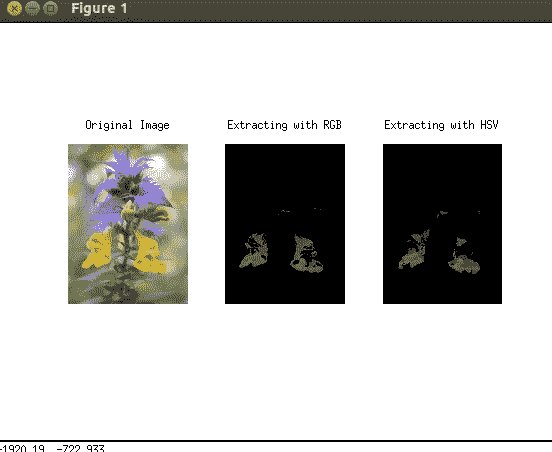
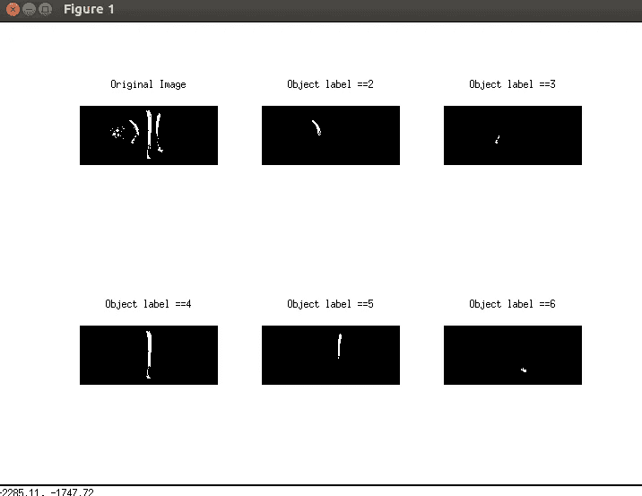
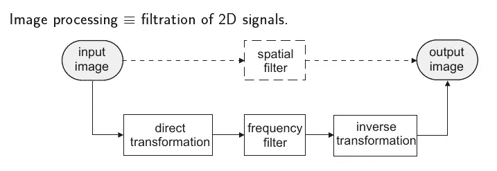
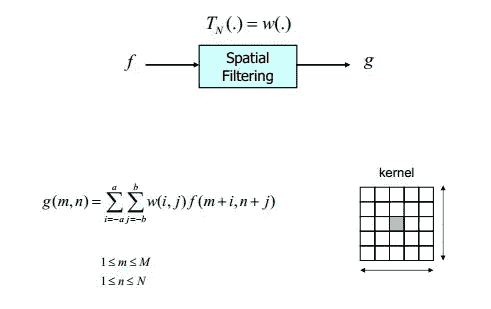
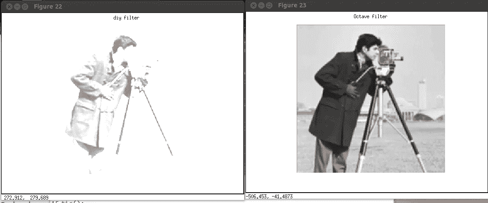
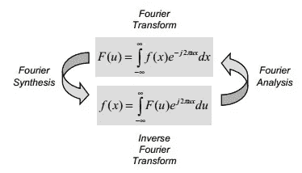
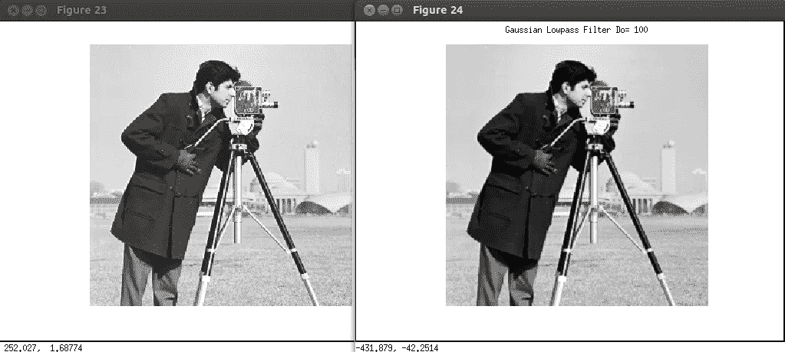
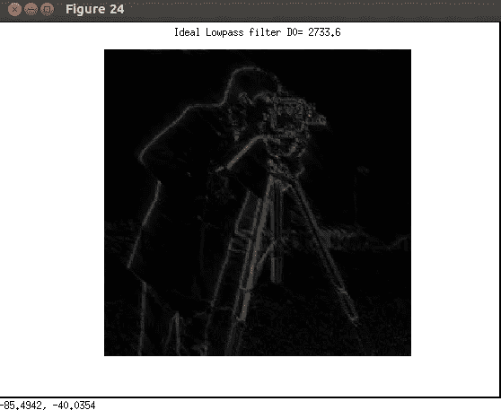

# 图像处理新手？

> 原文：<https://towardsdatascience.com/new-to-image-processing-5aa5200aa895?source=collection_archive---------36----------------------->

本文将总结最基本和最简单的图像处理技术，如 RGB 提取、对象标记，并展示对图像应用不同类型的滤镜后会发生什么。

下面例子的环境是用 Octave interpreter for Linux 在 [Octave](https://www.gnu.org/software/octave/) 中完成的。

# **RGB 与 HSV 提取**



Figure 1\. The Comparison Extracting the original image with RGB vs HSV

图像提取可以通过两种方法完成，直接从 RGB 颜色模型或通过转换到 HSV 模型。

为了在 RGB 颜色模型中只提取花的**黄色像素**，我们将不得不考虑红色、绿色和蓝色的近似值。然后对这 3 个值应用阈值。

然而，在 HSV 模型中，我们只需要对强度值应用阈值来提取花部分。色调和饱和度可以忽略不计。

# **标注对象**

此图像中有 3 个以上的对象，我们希望用大于 200 像素的连接像素来标记每个对象。



Figure 2\. Trying to label different objects in the original image.

1)我们需要创建一个 3×3 大小的结构元素，以便稍后进行侵蚀和扩张。

2)创建一组与输入图像大小相同的空白矩阵。[在这种情况下，我创建了 5 个空白矩阵，称为标签。]

3)从输入图像中，我们需要找到值为“1”的第一个像素位置，并从该点开始膨胀。这将提取第一个对象。

4)检查对象是否包含至少 200 个像素。然后将值从“1”替换为“2 ”,如标记我们的对象编号，并将该数据存储在第一个空白矩阵中。

5)在原始图像中，将所有已标记的值设置为“0”。然后为我们的下一个对象找到下一个起点。

6)重复迭代，直到原始图像被替换为“0”值，或者直到它为空。

# **过滤器**

噪声是处理图像时的主要问题之一。使用正确的过滤方法消除噪声有助于获得更清晰的图像输出。

过滤可以分为两个领域:

1)空间域

2)频域



Figure 3\. A process chart to compare spatial filters and frequency filters.

在空间域中，通常为 3×3 或 5×5 的遮罩被创建并应用于原始图像中的第一个像素，直到最后一个像素。因为在空间域中，遮罩的中心值至关重要，所以我们需要在输入图像的边界周围实现填充算法。



Figure 4\. Explains the equation for spatial filtering.

# 空间域中的滤波

## **使用均值和平均滤波器的空间滤波示例**



Figure 5\. The result of applying a Mean filter VS using the existing function in Octave.

下面的代码比较了两种过滤方法的编译时间，一种是自己编写函数，另一种是使用 Octave 库中现有的函数。

在 DIY 滤镜输出中，我使用了

```
1 0 1
1 -4 1
0 1 0
```

(均值滤波器)作为过滤遮罩。

# **频域滤波**

定义

*   这些技术基于修改图像的光谱变换
*   将图像转换为其频率表示
*   执行图像处理
*   计算回到空间域的逆变换
*   高频对应于图像中快速变化的像素值(如文本、纹理、树叶等)。)
*   强低频分量对应于图像中的大尺度特征(例如，主导图像的单个同质对象)

技术

*   傅里叶变换
*   非周期但曲线下面积有限的函数可以表示为正弦和/或正弦乘以权函数的积分



Figure 6\. Shows the equation of Fourier Transform and Inverse Fourier Transform for filtering the image in a Frequency Domain

## **使用高斯和理想滤波器的低通滤波输出示例**



Figure 7\. The image on the left is the original image and the image on the right shows the result after applying the Lowpass filter.



Figure 8\. Shows the output of the image after applying the Ideal Lowpass filter to the original image.

## **频域高斯滤波:**

[使用 fspecial()和截止频率= 100]

## **频域中的理想低通滤波**

[使用 meshgrid()，截止频率=最大距离的 67%]