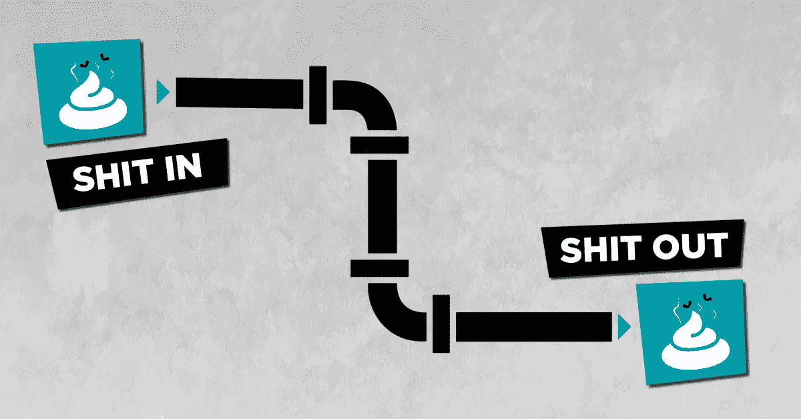
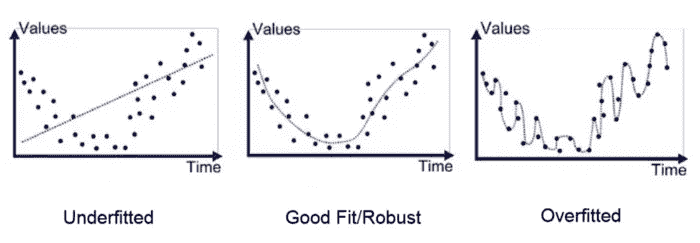

# 机器学习新手？尽量避免这些错误

> 原文：<https://towardsdatascience.com/new-to-machine-learning-try-to-avoid-these-mistakes-d54a164e2316?source=collection_archive---------23----------------------->

## 作为一名数据科学家，我艰难地学到了一些东西

机器学习是计算机科学中最热门的领域之一。如此多的人抱着这样一种错误的想法，即仅仅运行 10 行 python 代码，并期望事情在任何情况下都能神奇地工作。这篇博客是关于我艰难地学到的所有东西。希望它能为你节省一些犯同样错误的时间。

## 1.你不应该相信这是魔法

机器学习就像任何科学领域一样:它有自己的规则、逻辑和局限性。相信这是某种黑魔法无助于提高你的人工智能技能。这种信念将与你理解每个模型/层类型如何工作所需的科学好奇心相抵触。相信这是魔法是一种懒惰的方式来说服自己为什么不需要理解背后运行的机制。

> [ML 唯一神奇的地方](https://medium.com/datathings/the-magic-of-lstm-neural-networks-6775e8b540cd)就是背后没有魔法。它基于纯粹的逻辑、数学，当然还有一些随机性和运气…

Machine learning is magical but NOT magic

## 2.不要从真实的数据集开始

从真实世界的数据集开始，充满了问题和噪音不会帮助你寻求理解。取而代之的是，生成一些理想的伪数据集。例如，首先创建一个随机 x 列表和一个 y=3x+2 列表，然后测试密集层将如何学习权重 3 和偏差+2。

这允许你逆向工程反向传播背后的[机制，不同的优化器，不同的初始化方法，看看模型是否收敛得足够快。逆向工程是一种有趣的方式来理解事物是如何工作的，而不需要进入复杂的数学细节。(但如果可以，何乐而不为！)](https://medium.com/datathings/neural-networks-and-backpropagation-explained-in-a-simple-way-f540a3611f5e?source=collection_detail----83d07eece3c7-----11-----------------------)

每当试图解决一种新类型的问题时，首先尝试思考是否有办法首先生成一个理想的、无噪声的、假的数据集，以便检查哪种类型的层或 ML 模型将更容易解决这一挑战。如果一个模型不能解决这个假的/简单的挑战，那么在一个更难的嘈杂的数据集上尝试它甚至没有意义。

## 3.不要从庞大的数据集开始

立即将整个数据集投入到模型中，然后等待几个小时才能得到第一个结果，这是适得其反的。相反，最好从一小部分数据开始，先用不同的模型进行实验。一旦你得到了最初的第一个结果，你就可以去大数据。

Go step by step

## 4.首先可视化/清理数据

理解你的数据集是成功的关键点和主要因素，清理数据是 ML 中最重要的步骤之一。找出数据收集、存储、频率等方面的问题非常重要。可视化数据集有助于识别许多问题。数据是否包含大量缺失值？如何替换它们？数据采样速率相同吗？特征需要规范化吗？[特征是否独立](https://medium.com/datathings/dimensions-and-degrees-of-freedom-8b6125dbbd4a?source=collection_detail----83d07eece3c7-----1-----------------------)？我们需要先运行 PCA 吗？或许数据科学中最重要的原则如下:

Shit IN -> Shit OUT principle

## 5.特征的数量并不重要，重要的是维度的数量。

具有 100 个特征的数据集(其中所有特征都是线性相关的)可以有效地减少到只有 1 个特征，而不会丢失数据。[了解特征和维度的区别](https://medium.com/datathings/dimensions-and-degrees-of-freedom-8b6125dbbd4a?source=collection_detail----83d07eece3c7-----1-----------------------)对降低数据集的复杂性有很大帮助。

## 6.小心数据泄漏或扭曲的数据

神经网络以其欺骗和懒惰地学习我们不想让它们学习的东西的能力[而闻名。例如，如果类别之间存在很大差异，假设 99.99%的邮件不是垃圾邮件，0.01%是垃圾邮件，那么神经网络很有可能会一直懒洋洋地学习对非垃圾邮件进行分类。另一个问题是数据泄露:](https://medium.com/datathings/neural-networks-fudging-the-numbers-4b2889cfd416?source=collection_detail----83d07eece3c7-----4-----------------------)

*当您希望使用模型进行预测时，任何其值实际上不可用的特征，都是会给模型带来泄漏的特征。*

*当你用来训练机器学习算法的输入数据恰好拥有你试图预测的信息* —丹尼尔·古铁雷斯[问数据科学家:数据泄露](http://insidebigdata.com/2014/11/26/ask-data-scientist-data-leakage/)

因此，请确保没有简单的方法来作弊，并在输入和输出之间找到简单但无意义的相关性。

Take care of leakage

## 7.快速迭代，更快失败

在看了这个关于棉花糖挑战的视频后，我得到了这个观点的灵感:

Marshmallow challenge

教训是不要假设你最初的模型想法会起作用，你可能会错误地认为，你越快发现这一点，你就越快尝试其他东西，而不会浪费太多时间，达到最后期限或在发现真相之前支付巨额云计算账单。

拥有一个足够快的地面模型是一个关键点，剩下的时间可以用来改进结果和更新“到目前为止”最好模型的记录。但关键是不要等到最后一刻才验证结果。

## 8.小心不要过度装配

为一个训练阶段 0 亏的模特感到骄傲是很有诱惑力的。然而，它可能不是真实世界的最佳模型。这是一个众所周知的过拟合问题

Over-fitting illustrated

## 9.不要从复杂的 ML 模型开始

不要直接使用一个 ***双向 LSTM 变分自动编码器与*** [***注意机制模型***](https://distill.pub/2016/augmented-rnns/?source=post_page---------------------------#attentional-interfaces) ，如果你的问题已经可以简单地使用一个线性密集层解决。

> Tensorflow 很强大，但你可能不是

最好是先从简单的模型开始，你可以理解和控制，然后逐渐增加复杂性，以检查复杂性是否带来任何附加值。请记住，最后，模型越复杂，就需要越多的数据来真正验证模型没有过度拟合。

一个好的经验法则是跟踪模型中参数的数量与数据集大小的关系。如果您的模型参数数量大于您的数据集大小，这将触发一个自动警告！

Don’t go full complexity

## 10.不要犹豫，创建一个定制的损失函数

机器学习的目标是减少损失函数。在许多情况下，缺省值(RMSE，对数损失)就足够了。但是很多人害怕为一些具体问题定义自己的损失函数。

损失函数可以被看作是你希望 ML 模型实现的惩罚或奖励。因此，如果您希望 ML 模型收敛到特定行为，可以通过创建一个损失函数来实现，该函数奖励这种行为，同时惩罚针对您的特定问题和特定数据集的不当行为。

Machine learning is like a child — It needs guidance, through loss functions

# 结束点——投资

机器学习的最佳投资是在**知识**上，你越了解每一层的抽象角色、每一个功能背后的机制、局限性，就越容易更快地创建模型。

第二个最好的投资，是在一个**专用的** **硬件**上进行机器学习。一个 300 美元的 GPU 可以加速高达 20 倍的培训工作量，这意味着一天的工作可以减少到一个小时，同样的数据科学家工程师可以在相同的时间内尝试 20 倍以上的模型。

**最后一点:**

> 永远不要低估娱乐的重要性。

*如果你喜欢阅读，请关注我们:* [*【脸书】*](https://www.facebook.com/datathingslu/) *，* [*推特*](https://twitter.com/DataThingsLu) *，*[*LinkedIn*](https://www.linkedin.com/company/datathings)

*原载于 2019 年 7 月 19 日 https://medium.com**的* [*。*](https://medium.com/datathings/new-to-machine-learning-try-to-avoid-these-mistakes-f575292e8e2d)