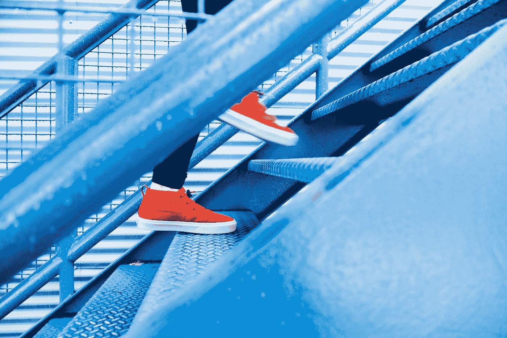

# 数据科学家的新年决心

> 原文：<https://towardsdatascience.com/new-years-resolutions-for-data-scientists-43a0d3d8b4ff?source=collection_archive---------17----------------------->

## 更好的项目和更干净的代码的新十年指南

今天是反思过去 364 年并宣布自我完善的传统日子。

这是多事之秋。像伯特这样的模特震撼了传统领域；Kubernetes 和 Docker 联手了；公司因使用有偏见的算法进行商业决策而受到抨击；争议搅乱了数据科学训练营；职位描述需要不断扩展的不相关技能。比以往任何时候都清楚的是，我们的行业是一个多面性的行业，在这个行业中，保持稳定和相关性是一项挑战。

这里有 10 条建议，每条都有助于你成为一名数据科学家和程序员，并提供有用的资源，还有 6 条可以帮助你在这个过程中保持理智:

# 通用编程

Photo by [Denis Pavlovic](https://unsplash.com/@itsdenispavlovic?utm_source=medium&utm_medium=referral) on [Unsplash](https://unsplash.com?utm_source=medium&utm_medium=referral)

1.  我将[让(我的 python 路径)成形](https://medium.com/swlh/a-guide-to-python-virtual-environments-8af34aa106ac)。
2.  我将[清理环境](/power-up-your-python-projects-with-visual-studio-code-401f78dd97eb)(而不是`pip install`每个包都要同一个)。
3.  我会学一门新的语言。
4.  为了更好的数据序列化，我将放弃 pickle T8。
5.  我将设定健康的界限([与容器化](/building-a-data-science-development-environment-with-docker-compose-1407aa5147b9))。
6.  我会写[干净](https://cleancoders.com)，[优雅](/how-to-use-regex-7aeaf4dd25e9)的代码。
7.  我将[学习足够的 C 语言](https://www.learn-c.org)在 Python 崩溃时修复它(或者至少理解它为什么会崩溃)。
8.  我将*实际上* [学会如何负责任地获得](http://gitimmersion.com)。
9.  [我将学习 bash](https://www.datascienceatthecommandline.com) 成为命令行向导。
10.  我将[扩展我的研究工具箱](https://link.medium.com/JzcicuLWQ2)以便更好地调试。

# 数据科学、机器学习和人工智能

Photo by [h heyerlein](https://unsplash.com/@heyerlein?utm_source=medium&utm_medium=referral) on [Unsplash](https://unsplash.com?utm_source=medium&utm_medium=referral)

1.  我会关注机器学习中的[偏差，争取从我的数据中消除。](https://www.excavating.ai/)
2.  我会问*为什么*事情会起作用，而不仅仅是它们会起作用。我会[批判性地评估](https://deepai.org/publication/selective-brain-damage-measuring-the-disparate-impact-of-model-pruning)预先训练好的模型，而不是天真地使用它们。
3.  如果我更倾向于实践，我会学习一些理论上的东西——比如我的模型背后的[数学](https://ocw.mit.edu/courses/electrical-engineering-and-computer-science/6-042j-mathematics-for-computer-science-fall-2010/)。
4.  如果我更学术一点，我会*动手做一些*的东西，不会让完美主义阻止我推出产品。
5.  我会加入一个以数据科学为导向的 [Slack](https://www.rfordatasci.com/) ，Discord，或者 IRC 频道去认识新同事。
6.  我会参加聚会或会议(或者至少[在线观看视频](https://pyvideo.org/))来增长我的技能。
7.  我会将我的模型可视化，或者[将它们部署到 web 应用](https://pytorch.org/tutorials/intermediate/flask_rest_api_tutorial.html)中，这样更多的人可以使用和理解它们。
8.  我会交叉训练我的大脑，提高我的领域知识。(对于 NLP 工程师，我推荐学习[语言学](https://ocw.mit.edu/courses/linguistics-and-philosophy/24-900-introduction-to-linguistics-fall-2012/)。)
9.  我将在我不擅长的领域做一个项目——如果我经常与数字打交道，就使用非结构化数据；如果我经常与文字打交道，就尝试计算机视觉。(甚至可能制作一些[艺术](https://www.artnome.com/news/2018/3/29/ai-art-just-got-awesome)！)
10.  我会在社交媒体上关注一些令人敬畏的人工智能从业者。

# 普遍建议

Photo by [Lindsay Henwood](https://unsplash.com/@lindsayhenwood?utm_source=medium&utm_medium=referral) on [Unsplash](https://unsplash.com?utm_source=medium&utm_medium=referral)

无论你想在今年做得更好，这里有一些基本的决心，为你的成功打下基础:

1.  我会优先考虑每晚至少睡 8 个小时，因为睡眠对学习来说是必不可少的。
2.  我会每天花时间运动身体，吃有营养的食物，因为健康对成功至关重要。
3.  我会找到适合我的压力管理技巧，因为我的心理健康和我的身体健康以及职业道德一样重要。
4.  除了工作和学习，我会花时间做自己喜欢的事情，因为成为一个快乐、全面发展的人不仅有利于提高生产力，也是生活的意义所在。
5.  我会记住，我作为一个人的价值与我的求职、我的 Kaggle 分数或任何其他成功的外部衡量标准无关。在这个行业里很容易精疲力竭，灰心丧气。我会尊重我的步伐和进步。
6.  如果我感到沮丧、焦虑或孤独，我会向我的朋友和同事求助。我们都在这个[一起](https://peopleofcolorintech.com/career-growth/finding-her-balance-how-this-software-engineers-mental-health-journey-inspired-a-life-saving-app/)。

后知后觉是 2020 年。从你的错误中吸取教训，确定你需要强化的地方，并制定一个计划，在这一年中改进。

但是试着享受这个过程。