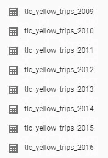
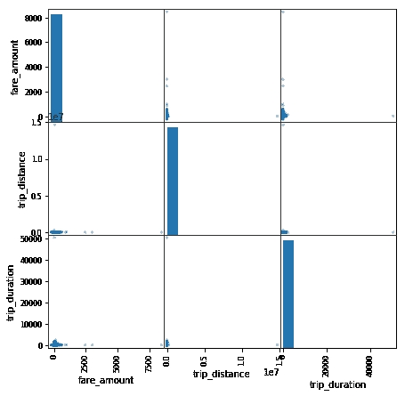
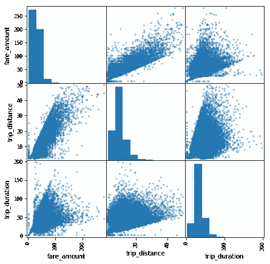
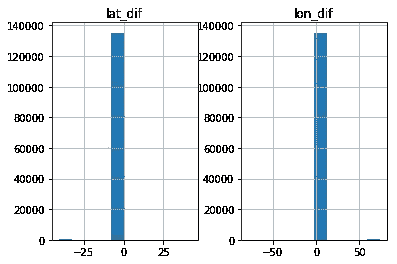
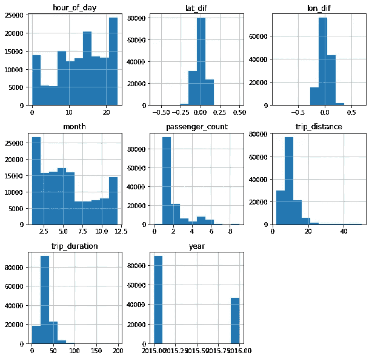
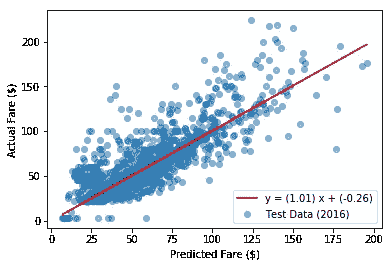

# 纽约出租车数据集分析

> 原文：<https://towardsdatascience.com/new-york-taxi-data-set-analysis-7f3a9ad84850?source=collection_archive---------14----------------------->

## 用回归模型预测出租车费用


Photo by [Anders Jildén](https://unsplash.com/@andersjilden?utm_source=medium&utm_medium=referral) on [Unsplash](https://unsplash.com?utm_source=medium&utm_medium=referral)

最近我有机会玩了一下谷歌云的大查询平台托管的纽约出租车公共数据集。我决定对数据集应用机器学习技术，尝试使用 Python 建立一些预测模型。在这篇文章中，我将尝试预测出租车费用。让我们直接开始吧！本文的所有代码都可以在 Github 的[链接](https://gist.github.com/stephenleo/731550f10522835467b7079de3384932)中找到



Google Big Query Tables

首先，在检查 Google 大查询表时，我们注意到每年有一个表。这给了我一个想法。我可以使用 2015 年的数据来训练我的机器学习模型，然后使用 2016 年的数据来测试模型的预测能力。

接下来，让我们使用 Google 的 data lab 平台查询 2015 年的随机 100K 行和 2016 年的随机 100K 行。

现在，让我们开始预测出租车费用的过程。首先，让我们导入必要的包并将数据加载到 pandas 数据框中。我使用%matplotlib 内联，因为我使用 jupyter 笔记本进行分析。

从数据框中，我们看到每一行都是一次旅行，而每一列都是与旅行相关的属性。

# 直觉:

我喜欢首先纯粹凭直觉建立一个预测模型来开始我的项目。这个简单直观的模型将给出我们的基线精度，我们将尝试使用更先进的技术来打破这个基线精度。

对于任何预测模型，我们需要考虑我们试图预测的响应变量是什么，以及可能对所述响应产生影响的特征变量是什么。在本练习中，我们想要预测的响应是 *fare_amount* 。纯粹从直觉的角度来看，我们知道出租车一般按固定的初始费用+每公里 a(总距离)+每分钟 a(总时长)收费。回头看看我们的数据框列，我们已经有了一个 *trip_distance* 列，但是我们缺少一个 *trip_duration* 列。但是，我们提供了接送日期时间，因此我们可以使用下面的这些列轻松计算出 *trip_duration* 。

现在，让我们为简单直观的模型( *fare_amount* 、 *trip_distance、*和 *trip_duration* )可视化感兴趣的列。



Visualizing the columns of interest for simple intuitive model

从图表中可以看出，所有三列都有显著的异常值。让我们执行一个离群点删除，并再次绘图。



Visualizing the columns of interest after outlier removal for simple intuitive model

好多了！此外，我们可以清楚地看到*票价 _ 金额*与*行程 _ 距离*和*行程 _ 持续时间*之间有很强的相关性，因此我们是在正确的轨道上。

在我们继续之前，让我们创建一些助手函数。第一个功能是拆分数据，以便训练数据集只包含 2015 年的数据，测试数据集只包含 2016 年的数据，如前所述。第二个功能是计算一些可用于评估模型预测能力的统计数据。在本练习中，我选择的统计数据是均方根误差(RMSE)，它给出了实际*费用 _ 金额*和预测*费用 _ 金额*之间的差异的标准偏差，单位为美元，可以计算为 sklearn 的*均方误差()*的平方根。R-square 给出了模型预测的实际 *fare_amount* 的变化量的百分比，可以直接从 sklearn 的 *r2_score()* 中获得。

太好了！现在，我们已经准备好完全凭直觉构建我们的第一个模型。让我们首先将数据分为响应(y)和特征(X)，然后使用上述帮助函数创建训练集和测试集，然后在训练数据集上拟合简单的线性回归模型，最后使用上述帮助函数检查模型结果。

```
----Training Data results (2015 data set)----
RMSE: $5.6
R2: 0.79

----Test Data results (2016 data set)----
RMSE: $5.5
R2: 0.81
```

对我们的第一次尝试来说还不错！测试数据集的 RMSE 为 5.5 美元，我们将使用它作为基线得分。现在，让我们努力提高这个分数。

# 特征工程:

我在这里采用的方法是通过特征工程的过程给模型增加更多的特征。对问题进行更深入的思考。

*   一周中的取件日和一天中的时间可能在需求和交通状况中发挥重要作用，从而对票价产生影响
*   纬度差和经度差可以是增加行程距离对费用影响的附加数据
*   由于特定位置的额外费用，上下客社区可能会对票价产生影响？

所以，让我们添加一些额外的功能如下。Geohashing 是一种基于绝对纬度和经度创建离散地理位置的方法。您可以将它视为为属于同一邻域的位置创建一个通用名称。我使用 pygeohash python 包，可以使用`pip install pygeohash`安装。由于纬度和经度列中有许多缺失的数据，让我们也删除它们。新增功能包括:

1.  提货月份
2.  一周中的提货日
3.  一天中的取件时间
4.  纬度差
5.  经度差
6.  地理哈希拾取位置
7.  地理哈希删除位置



看起来在 *lat_dif* 和 *lon_dif* 中有一些异常值，我们把它们去掉吧。此外，由于像 *month、day_of_week、hour_of_day、pickup_geohash 和 dropoff_geohash* 这样的列是分类的，所以让我们使用 pandas get_dummies 方法对它们进行编码。



Visualizing the features

现在，让我们拆分训练和测试数据集，并拟合一个简单的线性回归模型

```
----Training Data results (2015 data set)----
RMSE: $3.5
R2: 0.92

----Test Data results (2016 data set)----
RMSE: $7139352.0
R2: -338832003532.88
```

呀！该模型在训练数据集上具有更好的 RMSE，但在测试数据集上具有更差的 RMSE，这表明该模型过度拟合。这就需要使用正则化技术。我们可以用 sklearn 的 Lasso 回归进行正则化。

```
----Training Data results (2015 data set)----
RMSE: $5.6
R2: 0.79

----Test Data results (2016 data set)----
RMSE: $5.3
R2: 0.82
```

好吧，从过度拟合的角度来看，这更好，但 RMSE 模型并没有改善太多。让我们现在尝试超参数调整，以改善模型 RMSE。我们可以为 Lasso 回归调整的参数称为 alpha，它是一个乘以 L1 罚项的常数。alpha 的默认值是 1。较小的 alpha 将通过减少惩罚项使 Lasso 回归类似于线性回归。

因为我们使用套索回归，有两种方法来执行阿尔法超参数调整。第一种方法是使用 sklearn 的通用 GridSearchCV，它可以用于调整任何机器学习模型。第二种方法是使用 sklearn 自己的 LassoCV，它专门用于 Lasso 回归。让我们两个都试试，比较他们的运行时间，以及每个人能找到的最好的阿尔法。

首先，让我们运行 GridSearchCV 方法:

```
GridSearchCV execution time: 3124.58699989Lasso best params: {'alpha': 0.0004012807031942776}

----Training Data results (2015 data set)----
RMSE: $3.7
R2: 0.91

----Test Data results (2016 data set)----
RMSE: $3.8
R2: 0.90
```

哇！当 alpha 值为 0.0004 时，我们能够获得仅 3.8 美元的测试 RMSE！然而，GridSearchCV 方法的运行时间长达 3124 秒。差不多一个小时了！让我们看看 LassoCV 是否能跑得更快，但为我们提供可比较的结果。请注意，我们将对 LassoCV 使用相同的 alpha 搜索空间，以实现真正的面对面比较。

```
LassoCV execution time: 42.0979998112LassoCV best params: 0.000401280703194

----Training Data results (2015 data set)----
RMSE: $3.7
R2: 0.91

----Test Data results (2016 data set)----
RMSE: $3.8
R2: 0.90
```

太棒了。LassoCV 不仅为我们提供了相同的最佳 alpha 值 0.0004，以获得仅 3.8 美元的测试 RMSE，而且它的运行速度更快，可以在 42 秒内完成！我必须承认，我自己也对结果感到惊讶，并且必须深入研究才能理解为什么 LassoCV 比 GridSearchCV 跑得快得多。目前，看起来我们使用线性模型可以达到的 RMSE 的最佳测试分数是 3.8 美元。这比我们简单直观模型的 RMSE 低 1.7 美元！最后，让我们绘制实际票价与 LassoCV 模型预测票价的对比图，以直观地检查相关性



Actual vs Predicted Fare using LassoCV tuned model

太好了！那表情很有希望。

我们可以通过尝试更复杂的模型，如梯度增强，甚至是神经网络，来进一步改善模型的 RMSE。我们还可以通过查询 100 万行而不是 10 万行来将更多的数据添加到训练集中。你怎么想呢?请就我们如何进一步改进该模型发表评论。

感谢您的阅读！希望你觉得有趣。干杯！