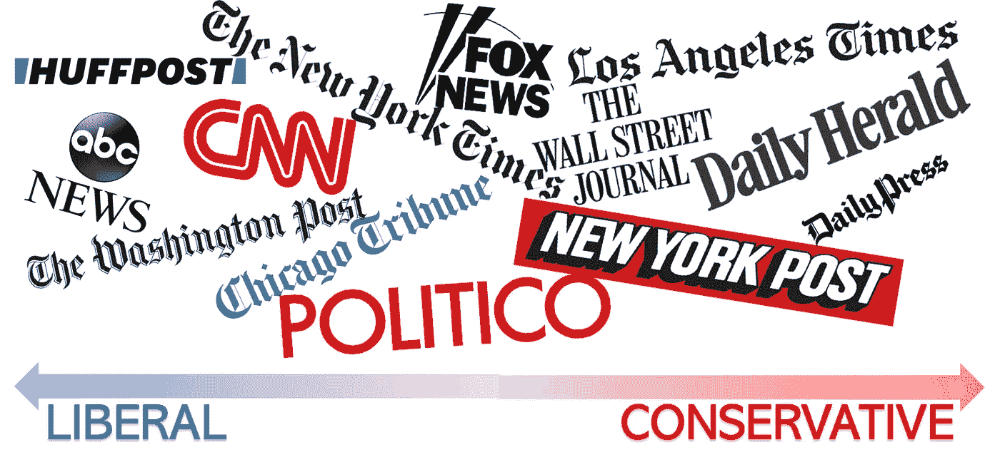
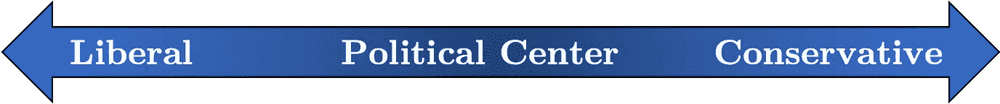
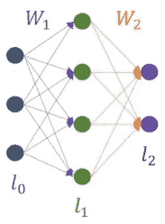
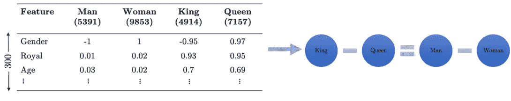
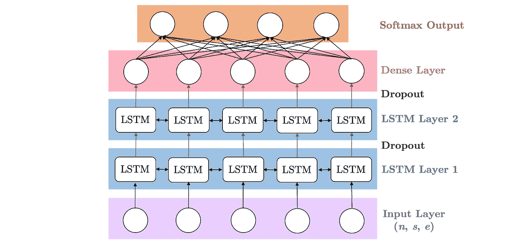
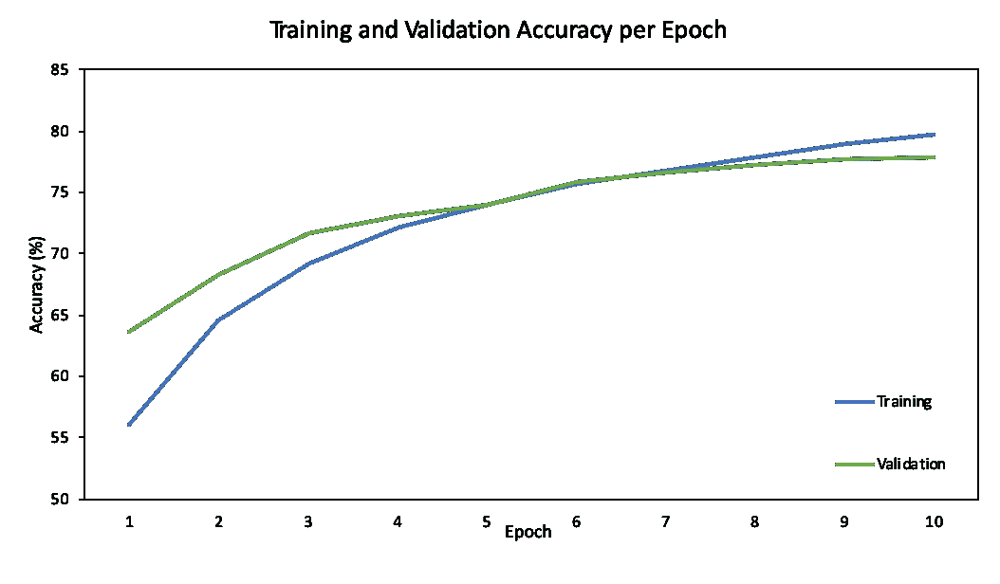
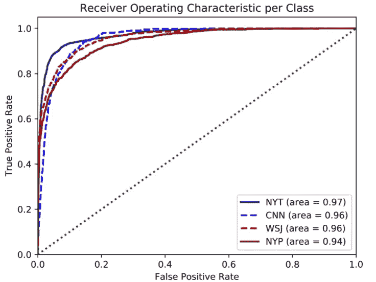
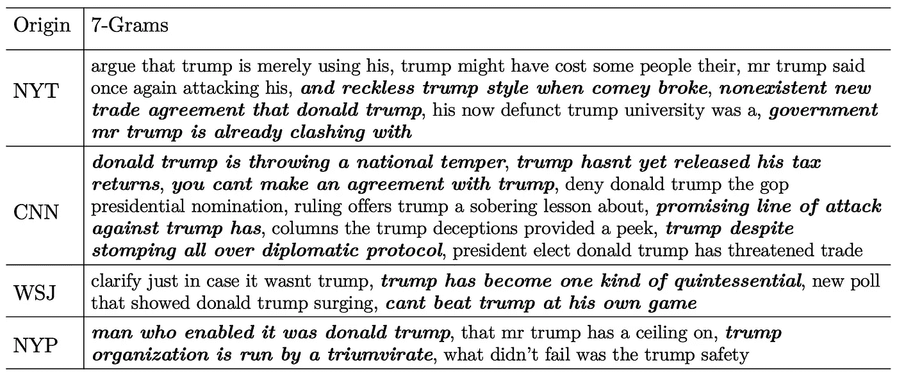
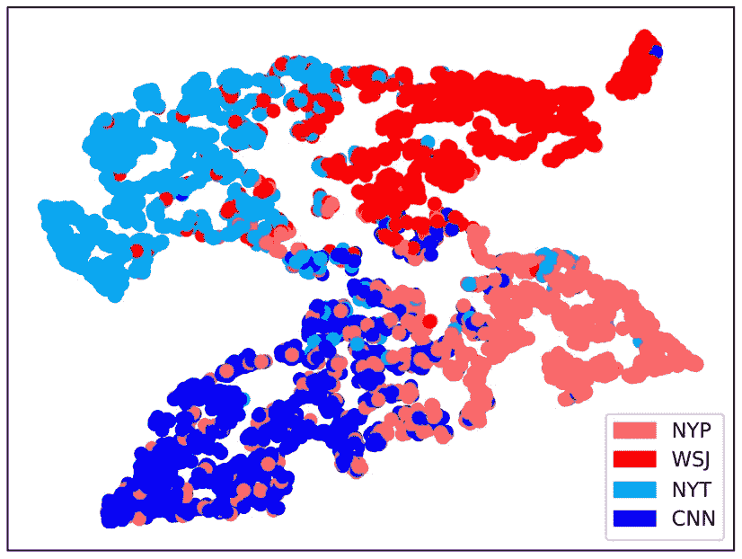

# 使用机器学习的新闻和媒体偏见检测

> 原文：<https://towardsdatascience.com/news-and-media-bias-detection-using-machine-learning-a-potential-way-to-find-fake-news-13c766aa3988?source=collection_archive---------27----------------------->

**媒体。**在美国，这一直是一个有分歧的问题，由于新闻业内隐含的偏见，媒体和报纸对关键话题的报道有所不同。*我听说过隐性偏见，但它们是什么？*从本质上讲，大型报纸机构撰写的文章往往反映了作者的继承观点，尤其是因为新闻机构往往更喜欢来自政治光谱某一领域的作者。现任美国总统唐纳德·j·特朗普(Donald J. Trump)一贯创造不同的观点:保守派人士更有可能以有利的方式报道特朗普的行动，而自由派媒体则倾向于以负面的方式描绘特朗普的行动。因此，很明显，媒体渠道在关键问题上存在很大的分歧和偏见——但如果我们能够直接识别任何新闻文章中的偏见，会怎么样呢？

Simplified representation of the American political spectrum: liberal sources tend to report more negatively about Donald Trump, while conservative sources tend to report more positively

**数据。**有大量数据代表了媒体的偏见——我发现 ProQuest 报纸数据库中有来自许多新闻来源的数千篇关于唐纳德·特朗普的文章。我还意识到，我可以使用[媒体偏见/事实核查](http://t-SNE%20visualization%20of%20the%20model%E2%80%99s%20predictions,%20showing%20its%20ability%20to%20distinguish%20between%20origins%20and%20also%20between%20political%20bias.)这个识别主要新闻来源的政治偏见的最大网站，合理地确定一个足够大的新闻机构的总体政治倾向。有了如此大量的数据，有一个很好的方法来看看我是否可以分析这些偏见的文章——机器学习。

**机器学习。**通过利用神经网络并充当人工大脑，机器能够在最少人工参与的情况下在大数据集中找到模式(当有数百万个数据点时，这真是太棒了！).由于可用数据和计算能力的增长，机器学习最近出现了巨大的增长。研究人员还一直在努力制造越来越多层的更复杂的神经网络(深度学习)，这使他们能够解决更困难的问题。机器学习本身在几乎所有可以想象的领域都有一堆应用；机器学习的最新进展包括自动驾驶汽车、语言翻译和面部识别。我之前使用机器学习来预测加密货币价格([链接](https://medium.com/datadriveninvestor/predicting-cryptocurrency-prices-with-machine-learning-1b5a711d3937)，并生成鞋子设计([链接](https://medium.com/datadriveninvestor/generating-shoe-designs-with-deep-learning-5dde432a23b8))。这一次，我将使用它来识别文章的新闻来源，并预测文章中的偏见。现在来研究一个更具体的神经网络架构…

A simple feedforward neural network

**LSTM 细胞。**一个特别的神经网络是寻找模式的真正革命性的方法，它是来自[本文](https://www.bioinf.jku.at/publications/older/2604.pdf)的长短期记忆(LSTM)递归神经网络(RNN)，它由多个单独的 LSTM 细胞组成。*但它是如何工作的呢？*它基本上是通过使用特殊的门来允许每个 LSTM 层从先前层和当前层获取信息。数据通过多个门(例如，遗忘门、输入门等)。)和各种激活功能(例如 tanh 功能)，并通过 LSTM 细胞。这样做的主要优点是，它允许每个 LSTM 细胞在一定时间内记住模式；他们本质上可以“记住”重要的信息，而“忘记”不相关的信息。这在分析文本时非常有用(例如，单词“和”不像“自由”这样的加载单词那样与政治偏见相关)。现在我已经有了数据和模型的计划，我终于可以开始了。

An LSTM cell and its internal components — cell state c. input gate i, forget gate g, output gate o, and external input gate g

**数据收集。随着我的计划准备就绪，我开始了真正的工作。我回到 ProQuest 报纸数据库，为四个新闻源下载了每个新闻源 5000 篇文章，总共 20000 篇文章。这些新闻来源是纽约时报、CNN、华尔街日报和纽约邮报(根据[媒体偏见/事实核查](http://mediabiasfactcheck.com)确定，从最自由到最保守排列)。幸运的是，这些文章下载到每个来源的一个文件中，所以我简单地根据它们的新闻来源(0 到 3)标记了四个集合。*没那么简单，对吧？*完全正确！这里的问题是我的神经网络接受数字，而不是单词…**

**单词嵌入。为了将单词输入到我的模型中，我必须使用单词嵌入方法将每篇文章中的每个单词转换成向量表示。对于这个项目，我使用了这篇论文中[的 GloVe 方法，它将单词转换成一个 300 维的向量，使得相似的单词在这个 300 维的空间中彼此靠近。但是你怎么可能用数字来表示一个单词呢？嗯，GloVe 代表一个词，有 300 个确定的特征。把它想象成这个词的特征(例如，当使用 GloVe 时，(男人减去女人)的向量表示等于(国王减去王后)，因为在这两种情况下，除了性别之外，两者的几乎所有特征都是相同的)。既然单词已经用数字表示了，我可以对我的数据进行一些最终的调整。](https://nlp.stanford.edu/pubs/glove.pdf)**

Words are embedded with “features” where similar words are close to each other

**数据预处理。**文章根据原文中的分段符分成几节。你为什么那样做？对于一个模型来说，很难一次分析整篇文章(RAM issues ouch)，所以更好的方法是浏览每一句话，并对每一句话的结果进行平均，以获得对文章的预测。我从每个来源选取了 1，000 篇文章作为我的测试集(20%拆分)，剩余的数据被放入训练集，其中 5%的训练集被用作验证集。终于可以准备开始编码我的深度学习模型了！

**深度学习模型。**我专注于使用长短期记忆递归神经网络，以允许神经网络识别数据中的重要信息，并根据它找到的属性预测文章的来源。我还决定从[这篇论文](http://jmlr.org/papers/volume15/srivastava14a.old/srivastava14a.pdf)中添加一些脱落层，以确保我的模型不太符合训练数据(尽管这听起来像是任务完成了，但实际上使模型总体上不太准确)。我使用 Keras 和 Python 3.6 中的 Tensorflow 后端来创建我的模型。这些图层是输入图层、LSTM 图层、下降图层、LSTM 图层、下降图层、密集图层和 softmax 输出图层。

Deep recurrent neural network architecture for textual origin classification

**训练。**我训练了我的模型 10 个纪元。*为什么是 10 个纪元？*这是由早期停止决定的，当验证精度停止增加时，模型自动停止训练——它只是碰巧在数字附近。我使用了一些非常标准的超参数:1024 的批量大小、分类交叉熵损失函数、AdamOptimizer 和 ReLu/softmax 激活函数。

Progress of the model’s accuracy throughout training

**结果。现在是有趣的部分！我发现有两件事我想测试我的模型的能力:预测文章的来源和预测文章的政治偏见。我通过 F1 分和二元准确率来衡量新闻源预测的能力；我通过 n-grams 和 t-SNE 可视化分析了政治偏见检测的能力。以下段落详细介绍了模型的每个分析。**

**F1 得分(准确度)。**该模型获得了 77.20%的 F1 分数(即，此类问题的准确率)。*我怎么知道模特不只是运气好？*我对这个数字做了统计显著性检验，得到 p 值为 0。实际上，我的模型碰巧准确预测到这一点的概率是 0%。接受模型是好的。

**二进制精度**。我还使用受试者工作特征(ROC)曲线下的面积测试了每个类别的模型的二进制准确性；这给了我 94%以上的所有类的二进制准确率。*这是什么意思？*这基本上意味着该模型非常擅长区分文章的来源。

Area under the ROC curve for each class

**N-Grams。**首先，我进行了一个 n-gram 测试——基本上，我从测试集中提取了 7 个单词的所有可能序列，其中一个单词必须是“Trump”(这给了我一个可能有偏见的句子)，并将这些短语反馈到模型中。我选择了可信度最高的短语，这可以被认为是一种让我看到模型与每个新闻源相关联的短语的方式。该模型能够将自由派消息来源与关于唐纳德·特朗普的负面措辞相关联(这通常是自由派消息来源对特朗普的预期报道)，并将保守派消息来源与关于唐纳德·特朗普的正面措辞相关联(这通常是保守派消息来源对特朗普的预期报道)。

Phrases of length 7 (one of the words must be “Trump”) that the model associates with each class

**t-SNE 可视化。** *这个东西听起来很复杂，是什么？*让我们后退一点——我的模型的输出是四维的，因为有四个类。我不能绘制它，所以我从 4 维输出层收集置信度，并使用 t 分布随机邻居嵌入(t-SNE)可视化方法调整它的大小。这意味着四维预测被转换成二维点。我绘制了这些点，并根据它们真正的新闻来源给它们着色(蓝色代表自由派来源，红色代表保守派来源)。一般来说，这个方法让我画出模型的预测，看看它们是如何分布的。我发现这个模型能够把自由派的资料和保守派的资料组合在一起。这种分组非常重要，你实际上可以在自由派和保守派之间划出一条非常清晰的分界线。*哇！这有点像模型有自己的文章政治光谱！有趣的是你提到了这一点，我也正打算这么说——能够看到模型如何基于偏见分析这些文章，这非常酷！但真正的问题是:我们如何应用这一发现？*

t-SNE visualization of the model’s predictions, showing its ability to distinguish between origins and also between political bias

**应用。**这种技术的一个直接应用是将模型嵌入到像苹果新闻这样的新闻应用中。这将为用户提供新闻提要中每篇文章的实时分析，并在他们点击任何内容之前通知他们任何潜在的偏见(例如，“这篇文章有 43%的机会具有适度的自由偏见”)。该项目的一个更间接的扩展是将模型作为扩展嵌入到 web 浏览器中。经过一些修改，这意味着该模型可以分析网站的不同形式的偏见(例如，识别可能为产品做广告的网站)以及政治偏见。这将给用户提供前所未有的控制，让他们能够控制自己想获取的信息，并避免有偏见的信息。*但是这个项目的长期期限是什么？为了最大限度地利用这个项目，我将使用这个模型来生成一个巨大的数据库，其中包含来自不同政治领域的句子。然后，我会训练一个 CycleGAN 或其他生成神经网络，使其能够将有偏见的句子转换为具有相同意思的同一句子的完全无偏见的版本。完成后，主要用途是应用检测模型找到有偏见的句子，然后应用生成模型将每个有偏见的句子转换成目标句子。*什么？这将是一个浏览器扩展，它不仅会告诉你是否有偏见，还会给你一个选项，让你在消除偏见的情况下阅读同一个网站！疯狂 yyyyy。**

**总结。我创建了一个机器学习模型，它不仅能够高精度地预测一篇文章的新闻来源，还能检测新闻文章的政治偏见。这表明机器学习是多么强大，以及它有多么广泛的应用。该项目的主要应用在于浏览器扩展和嵌入新闻应用程序。在这两种情况下，用户将获得对他们阅读的信息的控制，这两种应用程序都促进了公众对拥有公正观点的重要性的认识。然而，将这个项目的模型进一步应用于创建将有偏见的句子转换成无偏见的句子的神经网络具有很大的潜力，因为它能够生成有偏见的句子的无偏见版本。**

也许有一天我们能够完全控制我们接收的信息。

**常见问题。**我去了英特尔国际科学与工程展览会展示这个项目——这里是评委问我的一些问题，您可能也想知道。

*   当我可以在你提到的媒体偏见/事实核查网站上找到偏见时，你的项目有什么意义？该网站的局限性在于它是手动的，只有大型媒体公司的概况。我的模型能够单独查看文章。例如，网站可能会说 CNN 的文章实际上是保守的，因为它是一般化的，所以有点自由，但我的模型能够分析文章，并确定它是保守的，即使它来自 CNN。这种模式在小型新闻机构中也有优势，比如在脸书看到的那些可能在为某个议程做广告的新闻机构。这些组织不能在网站上检查，因为他们很小，但是模型仍然能够分析他们的帖子以找出偏见。
*   *你试过其他型号吗？*我最近看到卷积神经网络在语言任务上也表现良好，但决定坚持使用递归神经网络的标准。我将来肯定会像伯特一样尝试更多的模型。
*   *你的下一步是什么？*我可能会添加一个中立的来源，收集更大范围的政治偏见，这样我的模型就更广泛了。更多应用！
*   *你怎么知道这个模型是通过政治偏见而不是文章主题之类的东西来识别来源的？n-grams 没有显示一个明确的主题，并且它们几乎只具有政治偏见作为唯一可识别的信息。这意味着该模型似乎将政治偏见视为来源的主要指标，并且该模型必须擅长于这样做才能准确。*