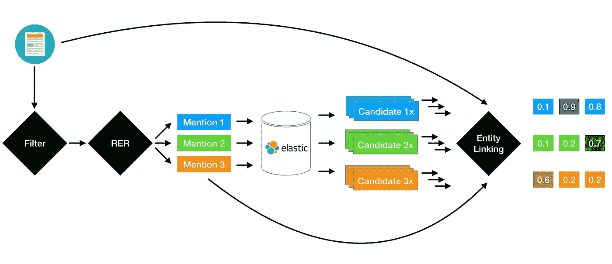

# 新闻公司与伯特联系

> 原文：<https://towardsdatascience.com/news-to-company-linking-with-bert-48a1ac9805f1?source=collection_archive---------12----------------------->

So much noise, so little signal ([source](https://flic.kr/p/5qXhAR))

我们都听说过 [Bert](https://ai.googleblog.com/2018/11/open-sourcing-bert-state-of-art-pre.html) 以及这个模型家族如何成为许多 NLP 任务的当前艺术状态。我想分享一下我们在 [Company.info](https://companyinfo.nl/en) 只用基于 Bert 的模型创建完整的新闻到公司链接渠道的经验。

我们的业务是收集和出售在荷兰注册的公司的准确信息。这对我们的客户在销售、营销和合规方面非常有帮助，可以节省大量时间。关于公司的数据不断变化，从他们的办公地点到活动和产品，要跟上这些变化是相当费力的。我们提供一体化解决方案，让我们的用户可以专注于重要的事情。

新闻是一个特别重要的信息来源。如果我们在文章发表时就收录它们，并正确地分析它们的内容，我们就能够在它们发生时提供关于公司及其活动的细节。为了实现这一点，我们建立了一个从新闻文章中摄取、链接和提取信息的渠道。

为了让您有所了解，以下是我们门户网站的新闻部分显示的关联公司(荷兰语):

A News article linked to Microsoft and Ingram Micro

对于一个合适的新闻公司链接，有几件事要做好:

*   过滤无关的新闻
*   摘录提及的相关公司
*   为每个提及生成候选人
*   挑选合适的候选人

这里是管道的概述，接下来我们将介绍每个阶段:

News to company linking pipeline

我不会讨论摄取部分，因为这是一个值得单独发布的数据工程壮举。因此，在我们的管道中，我们从一个经过清理和去重的文章数据库开始，为链接做好准备。

# 相关新闻过滤

一篇新闻文章是否相关实际上取决于出版商的业务和受众。如果你是 TechCrunch，你就不会发布关于政党丑闻的新闻。Company.info 也不例外，随着时间的推移，会创建一套标准来确定相关性。举个例子，

*   这篇文章应该是关于在荷兰有注册办事处的公司
*   股票市场的新闻是不相关的，除非他们报告一个大的损失或利润
*   关于服务中断的新闻是不相关的

虽然有很多这样的规则，但它们并不是黄金法则:您通常需要考虑不止一个，有些可能在特定时期适用，甚至不同的编写者可能会对同一篇文章做出不同的决定。

随着时间的推移，我们已经捕获了编写者的决定，这给了我们一个训练二进制分类模型的开端。深度学习模型是利用大量数据并学习自然语言中所有细微差别的首选。目前，预训练的 Transformer 语言模型提供了最好的结果，我们在多语言 Bert 的基础上创建了我们的分类器。

我们所有的实现都是基于奇妙的[变形金刚](https://github.com/huggingface/transformers)库，这个库是透明的，最新的，用 fp16 和分布式训练可以快速训练。对于这一部分，我们调整了一个`BertForSequenceClassification`模型。

我们的银牌测试集的 F1 分数对于我们的目的来说已经足够高了(抱歉，我们的法律团队不愿意分享数字)。经过误差分析，我们意识到，对于错误的预测，通常模型预测是正确的，这可以用我们的噪声数据集来解释。对于许多错误，你还需要努力思考来证明一个不同的预测，而且不可能有实际的共识。

我们正在将模型推向生产，但我们还没有将编写者排除在循环之外:当模型不自信时，我们要求他们为下一轮训练决定和收集用户行为。

# 相关实体确认(RER)

这非常类似于传统的命名实体识别(NER)问题，除了我们对所有的`ORG`类的实例不感兴趣，只对重要的实例感兴趣。一篇新闻文章可以提到几十家公司，但并不是所有的公司都有新闻价值。以下面的片段为例:

> FD Mediagroep 从 Heerhugowaard 手中接管信息和数据分析公司 Sizo。随着这项收购于周三宣布，Het Financieele Dagblad 和 BNR·尼乌斯 radio 背后的公司加强了其在公司数据领域的地位，自 2012 年收购 Company.info 以来，它一直活跃在这个市场。

这里，`**FD Mediagroup**`和`**Sizo**`是相关的公司提及，其余的应该忽略:

*   *Heerhugowaard* 是一个位置
*   《金融日报》是一份报纸
*   BNR 新闻电台是一家广播电台
*   Company.info 是一家公司，但这不是本文的重点

所以首先，你有古典 NER 的所有挑战；也就是说，您不希望将产品、专有名称或非公司缩写与公司混淆。最重要的是，如果是一家公司，你需要决定它与整篇文章的相关性。

解决这个问题的一个方法是有两个阶段:一个是传统的句子级 NER，然后是显著性模型，该模型决定哪些提取的提及值得链接。这是我们开始之前的设置，这意味着要调整两个模型；但是，如果我们将两者结合起来，端到端地解决问题，会怎么样呢？

这就是我们所做的，我们称之为相关实体识别(RER)。这基本上是一个序列到序列模型，令牌作为输入， [IOB 标签](https://en.wikipedia.org/wiki/Inside%E2%80%93outside%E2%80%93beginning_(tagging))作为输出。非常类似于 NER 的解决方案，除了我们将整篇文章作为输入，并且只为相关的提及指定 B-ORG 和 I-ORG 标签。

对于这一部分，我们还使用了基于 Bert 的实现；特别是[这个建立在`BertForTokenClassification`之上的变形金刚](https://github.com/kamalkraj/BERT-NER)的延伸。不过，它被并入主回购协议只是时间问题。同样，训练过程非常顺利，我们很快就取得了成果。新模型几乎总是报告公司名称，不会将缩写、人名或地名与公司混淆。

该模型在检索相关提及方面获得了显著的 F1 分数，其预测给我们的人类评估者留下了深刻的印象。它能够区分真正细微的差别，并有效地利用上下文来区分相关性。我们认为这是变形金刚模型中自我关注闪耀的领域；不仅因为我们能够看到一篇文章的整个上下文，而且还可以看到每一个单词是如何与另一个单词相关联的，以及如何有效地利用这些信息来学习决定相关性的关系。

# 候选生成

对于每个提取的提及，目标是从我们的 Elasticsearch 数据库中注册的 300 多万家公司中找到合适的公司。然而，对所有这些记录运行机器学习模型是不可行的，所以通常首先提取一个小得多的候选人列表，然后只对这些候选人运行链接模型。

为此，我们简单地做一个简单的 Elasticsearch 查询，使用从上一步中提取的提及信息，对照一些有意义的字段，如注册公司名称和 url。然后，我们将 top- `n`搜索结果输入链接模型进行训练或预测。因为基本事实表明了给定提及的正确公司 ID，所以我们可以为每个提取的候选人分配一个二进制标签。训练时，阳性样本将有`label = 1`，所有其他阴性样本将有`0`。上菜时，我们把所有的候选人喂给链接模型，让它挑选正确的一个。

虽然候选生成可能看起来简单，但它实际上起着重要的作用；因为如果合适的公司没有出现在候选名单中，它将没有机会被下游链接模型评分。为了衡量某种候选生成方法或搜索策略的效果，我们考察了检索召回率。也就是说，如果我们取顶部的`50`结果，那么被提及的目标公司出现在这些`50`中的频率是多少。你可以花时间优化搜索策略，或者以训练/推理时间为代价，简单地强制更多的候选人。

# 实体链接

好了，我们已经走了很远了！现在我们只需要决定一个候选(实体)成为我们目标的可能性。例如，假设提到了`Sizo`(文章中的公司名称)，我们从 Elasticsearch 中抽取了 20 名候选人，他们的名字、URL 或公司描述中都以某种方式包含了单词`Sizo`。他们没有必然的联系。例如，其中一个是咨询公司，而另一个是当地的理发店。但是如何才能选择合适的搭配呢？

你我正常做的是，先看文章，了解上下文；是科技新闻还是与银行业或本地业务相关的新闻？文章用了哪些词(想话题建模)？有没有提到地点或关键人物可以帮助做出正确的猜测？

另一方面，我们查看每个候选公司及其所有属性来猜测可能性:该公司的活动代码是什么？如果它有一个网站，他们在描述他们的产品或服务时使用的关键术语是什么？注册地点在哪里，谁是关键人员？财务信息(如年利润/资产)能给我们提供有关其经营规模的线索吗？

有了双方的这些信息，我们通常可以相当成功地挑选出正确的候选人。

实体链接是一个经典的 NLP 问题，你可以在这里查看最近的一些方法。在疯狂地混合和匹配想法之前，我们问自己:我们能想到的最简单体面的深度模型是什么？我们能单独依靠伯特来完成这项工作吗？

Bert 和许多最近的预训练模型具有将多个序列作为输入的能力。例如，在一个多任务训练设置中，Bert 本身被训练来预测两个句子是否相互跟随。在 Bert 的术语中，`text_a`是第一个，`text_b`是第二个输入序列。`text_b`是可选的，你只有在处理“序列对”问题时才使用它。

让我们花点时间想想这个双输入设置有多强大。你基本上被赋予了权力来模拟两个“任何东西”之间的关系，无论你需要什么，只要你能用有意义的文本形式来表示它们。

这种双输入设置，非常符合我们之前建立的思维过程；也就是一边看文章和上下文，另一边看每个候选人的属性。具体来说，我们将(提及，文章)对表示为`text_a`(第一个序列)，将候选公司的文本表示为`text_b`(第二个序列)。然后，我们定义一个二进制分类任务，并教导该模型对阳性样本预测 1，对阴性样本预测 0。

举个例子，考虑一下我们之前看到的同一个新闻片段:

> **FD Mediagroep** 从 Heerhugowaard 手中接管信息和数据分析公司 Sizo。随着这项收购于周三宣布，Het Financieele Dagblad 和 BNR·尼乌斯 radio 背后的公司加强了其在公司数据领域的地位，自 2012 年收购 Company.info 以来，它一直活跃在这个市场。

在这里，我们希望将提及`**FD Mediagroep**` **、**联系起来，因此我们将提及和文章(第一个序列)表示如下:

*   `text_a` : `**FD Mediagroep** | FD Mediagroep takes over information and data analysis company Sizo from Heerhugowaard. With this acquisition announced on Wednesday, the company behind Het Financieele Dagblad and BNR Nieuwsradio strengthens its position in the field of company data, a market in which it has been active since the acquisition of Company.info in 2012.`

虽然我们主要关注的是提及，但文章是决定公司的行业和活动的重要背景。在提及和文章文本之间使用`|`分隔符有点武断，我们期望我们的模型在看到足够多的样本后学习这种`key | context`语义。

现在我们必须考虑第二个序列，以及如何在单个字符串中表示一个公司及其所有属性。假设 Elasticsearch 返回的候选人具有以下属性:

*   id : `235582`
*   名称:`FD Mediagroep B.V.`
*   别名:`[FDMG, FD, Financieele Dagblad, Het Financieele Dagblad]`
*   网址:`[[www.fdmediagroep.nl,](http://www.fdmediagroep.nl,) [www.fdmg.nl](http://www.fdmg.nl)]`
*   描述:`The FD Mediagroep is a Dutch media group. The group originated from Het Financieele Dagblad, but also includes BNR Nieuwsradio, Energeia and ESB.`

我们将所有这些信息压缩成:

*   `text_b` : `**name**: FD Mediagroep B.V., FDMG, FD, Financieele Dagblad, Het Financieele Dagblad | **url**: [www.fdmediagroep.nl,](http://www.fdmediagroep.nl,/) [www.fdmg.nl/](http://www.fdmg.nl/) | **description**: The FD Mediagroep is a Dutch media group. The group originated from Het Financieele Dagblad, but also includes BNR Nieuwsradio, Energeia and ESB.`

我们遵循与`text_a`相同的`|`分离结构。最重要的是:

*   实体属性被简单地映射到`key: value`表示。
*   多值属性的值用逗号连接。
*   所有语义相似的属性如`name`和`alternate_names`都被折叠在同一个键下。
*   缺失值将简单地写成`nil`。

如上所述，Bert 模型应该很容易决定`text_b`中代表的公司是否是`text_a`中提及的正确目标。

对于这一部分，我们还调整了一个单一的`BertForSequenceClassification`模型，并将问题定义为一个二元分类任务。在训练期间，所有阳性样本(`text_a`、`text_b`对)得到标签 1；和阴性样品 0。服务时，我们预测所有候选人的可能性，并报告得分最高的候选人。

将问题公式化为二进制分类主要是出于性能原因，并且与负采样方法非常一致。将所有东西都塞进 Bert 有它的好处，包括简单性和极大地受益于考虑到`text_a`和`text_b`记号之间的良好关系的自我关注。但是有几个问题:

*   我们实际上是在寻找一个多类分类器，并且在决定最可能的匹配之前，理想的情况是同时查看所有的候选项。这不是 Bert 的设计工作方式，所以我们必须求助于二进制分类。
*   整个训练过程有点低效:对于每一个给定的提及和`x`阳性和阴性样本，我们重复`text_a`对应于提及的`x`次。理想情况下，我们应该只编码`text_a`一次。
*   与上述相关的是我们如何处理负样本数量和训练时间之间的权衡。
*   Bert 对输入长度(最大 512 个子字)有一个硬约束，这对于适应所有新闻文章和实体属性是非常严格的。

因此，虽然这个解决方案对我们的目的来说是好的，但我们可以想办法改进它。最近许多关于实体链接的工作试图将提及和实体映射到一个嵌入空间，其中匹配的提及和实体彼此更接近。例如，请参见此处的、此处的或此处的。这种方法的优点是:

1.  没有输入限制:包括候选人的所有文本、数字和分类数据。
2.  整体嵌入一个候选公司。这种 company-to-vec 对于聚类或相似建模等其他任务非常有用。

但这并不意味着我们必须抛弃 Bert，我们仍然可以使用一个经过调整的 Bert 作为文本特性的强大编码器。这就是我们现在正在做的，我将在以后的文章中省略细节。

对于没有任何调整或巧妙技巧的纯 Bert 模型来说，结果相当令人印象深刻。让您了解一下，与我们基于 xgboost 和手工制作功能的传统系统相比，它实现了`17%`绝对 F1 增益。最终用户测试也很有结论性，我们正在将这种模式推向生产。

# 最终注释

这就是你要的，一个功能齐全的新闻链接管道。我们在所有阶段都使用了相同的底层 Bert 模型，这不仅给出了令人印象深刻的结果，还极大地简化了代码重用和维护。

在我们的 Kubernetes 集群中，每个单独的模型都作为一个微服务提供，并在管道的正确步骤由一个编排服务调用(想想 AWS 步骤函数)。每个型号都可以自行扩展，我们可以为不同的服务提供不同的硬件配置。例如，过滤服务(流水线的第一步)是相当轻量级的，可以在一个小型的纯 cpu 机器上提供。尽管实体链接模型需要更多的资源，但是我们使用 gpu 机器来跟上输入负载。

我想借此机会感谢我在 Company.info 的所有同事。这是少有的拥有支持性文化、大量数据和值得解决的问题的地方之一。

如果您有问题或建议，请留下评论。谢谢，直到下一个帖子:)