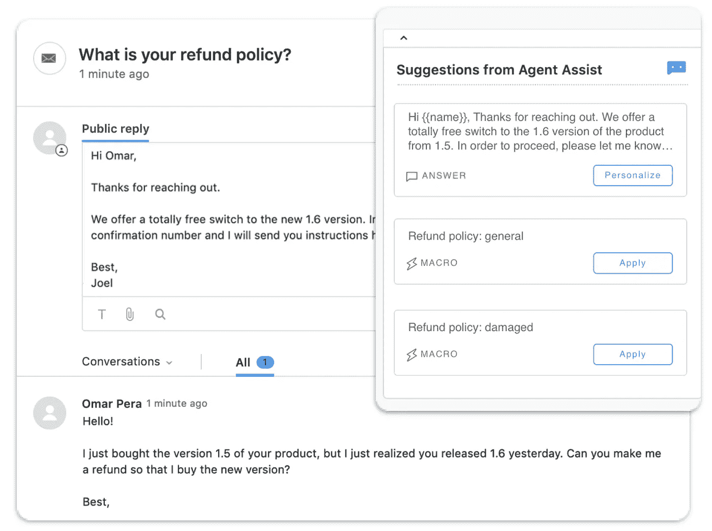
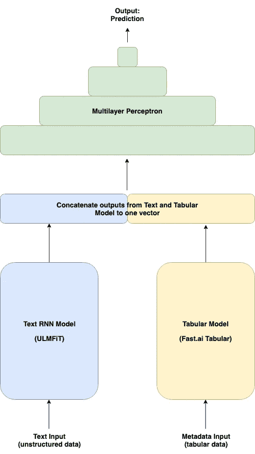

# 使用文本和元数据的下一个最佳动作预测:构建代理助手

> 原文：<https://towardsdatascience.com/next-best-action-prediction-with-text-and-metadata-building-an-agent-assistant-81117730be6b?source=collection_archive---------12----------------------->

## 利用深度学习提高客服团队的效率

# 简介和动机

我们在 [Reply.ai](https://www.reply.ai) 的使命是在与企业互动时消除挫折感，节省人们的时间。我们可以影响客户体验的方法之一是让客户支持代理更开心、更高效。我们很乐意与 ML 社区分享我们如何使用**深度学习来制作实时助手，以提高客户服务团队的效率。**

在 Zendesk、Kustomer、Khoros 这样的客服平台里，客服人员在回答罚单、聊天的时候，会做很多重复性的工作。除了其他职责之外，他们还必须对票证进行分类、添加特定标签、将票证发送给其他团队、选择模板，而不是编写独特的个性化响应。我们这个项目的目标在概念上很简单:为支持代理提供关于他们下一步最佳行动的建议。**通过帮助代理完成枯燥的任务，用户将获得更快的响应，代理可以将宝贵的时间花在更复杂的查询上**。还记得微软的 Clippy 吗？这是正确的做法，对于客户服务团队也是如此。

# 问题定式化

首先，我们把这个问题公式化为一个纯文本多类分类任务。我们所需要的只是被标记的数据，来把它作为一个有监督的机器学习问题来处理。

因此，我们分析了支持团队的历史记录，并重新创建了每个票据的整个生命周期，从其创建到被标记为由支持代理解决的那一刻。我们关注客户端和代理之间交换的消息的文本内容以及在票据上执行的任何其他操作。

产生的数据集由 23k 个票证快照样本组成，包含客户端和代理之间的对话，以及它们相关的元数据和执行的操作。我们的分类器旨在学习这些动作并建议最可能的动作。

# 扩展问题表述，将对话背景考虑在内

经过一些初步的实验，我们得出的结论是，我们必须扩展问题公式，因为我们需要做的不仅仅是纯文本分类。在许多情况下，**仅通过查看客户的文本请求**，无法建议适当的支持措施。我们需要这个模型来考虑当时的环境。否则，纯文本和指定标签之间的关系就太随意了。因此，我们摆脱了纯文本模型模式，为模型提供了上下文元数据作为额外的输入。

让我们看一个具体的例子来说明这一点。我们正在与一个电子商务平台合作，客户会经常询问他们订单的状态或抱怨延迟的项目。为了选择最佳的可能回应，我们需要知道订单的实际状态。物品已经离开仓库了吗？有交通事故吗？

这就是元数据发挥作用的地方。我们添加了一个分类变量，其中包含关于订单状态的重要信息，作为附加输入。现在，我们需要一个能够处理新输入特征的模型。

# **寻找解决方案**

现有的关于结合文本和元数据的模型的研究非常缺乏。这真的让我们很惊讶，因为我们相信这样的模型在许多现实生活中的人工智能应用中会非常有用，而不仅仅是在我们的特殊用例中。所以我们想填补这个空白，建立我们自己的！

我们决定从 fast.ai 开始，这是我们进行深度学习的首选库。我们必须承认:我们在这里确实有偏见，因为团队中的一部分人将他们的深度学习知识归功于雷切尔·托马斯和杰瑞米·霍华德非凡的教学风格，而且我们参加了当前课程的伙伴计划。在仔细查看了 fast.ai 论坛之后，我们终于找到了其他有着完全相同问题的分区器，更重要的是，还有一些有用的代码。幸运的是，另外两名学生 Quan Tran 和 José M. Fernández Portal 已经做了大量工作，我们能够进行合作。结果是在 fast.ai 库的基础上构建了一个模型，我们可以用它来处理对客户支持票据进行分类的任务，并考虑上下文元数据。

# **Concat 模型架构**

下面是我们提出的模型架构的一个非常高层次的解释。(欢迎[在评论中点击](mailto:andy@reply.ai)了解详情，或者让我们在 fast.ai 论坛的[这个帖子](https://forums.fast.ai/t/build-mixed-databunch-and-train-end-to-end-model-for-tabular-categorical-continuous-data-and-text-data/43155/11)中进行更技术性的对话。)

神经网络(NN)可以由其他更小的 NN 组成。这种类型的模块化架构由多个不同的网络组成，这些网络用于执行子任务。他们可以相互作用或独立工作，以实现输出。建议的实现利用该属性分三个阶段创建端到端解决方案:

1.  **特征提取:**输入层由两个子模块组成。文本数据被传递到用于文本分类的尖端 NN 解决方案，称为 [**【乌尔姆菲特】**](https://arxiv.org/abs/1801.06146) ，并且表格元数据由 fast.ai 表格 NN 标准实现来处理。这两个模块互不连接，独立工作，从各自的输入数据中提取特征。它们中的每一个都输出一个向量来表示这些特征。
2.  **特征组合:**在第二步中，我们通过简单地连接两个向量，将前面模块的输出组合成一个。
3.  **分类:**最后，我们将连接的向量送入第三个模块，对表示的特征进行解码和分类。对于这个任务，使用多层感知器，这是标准的方法。

Model Architecture

# 结果

**我们的最佳车型 F1 得分为 0.57** 。结果是在一个非常嘈杂的数据集上实现的，该数据集具有分布在 20 个目标类上的巨大的类不平衡。我们将其与优步·艾的[路德维希](https://eng.uber.com/introducing-ludwig/)进行了比较，后者提出了一种不同的方法来组合文本和元数据特征。我们用 Ludwig 训练的最好模型是一个使用预训练手套向量的 WordCNN。**优步·路德维希·艾的 F1 成绩要低得多，为 0.41 分**。

# 自己试试这个！

我们对这个结果不满意，因为我们客户的数据中的噪音和类别不平衡使得我们不可能获得一个清晰的概念证明。这就是为什么我们创建了一个简短的[实验](https://www.kaggle.com/adai183/metadata-enhanced-text-classification)，这样你就可以说服自己我们的 Concat 模型实际上是有效的，并自己运行一些代码。检查一下 [Kaggle 内核](https://www.kaggle.com/adai183/metadata-enhanced-text-classification)。为了简单起见，我们基于 IMDB 电影评论数据集生成了合成数据。但是请随意插入您自己的数据集，并告诉我们它是如何进行的。

# 关于回复

[Reply.ai](https://www.reply.ai/) 开发 ai 技术，为快速发展的公司提供更快、更智能的客户服务。在 Forrester 的企业客户服务排名中，我们与三星、可口可乐、霍尼韦尔和拉斯维加斯的 Cosmopolitan 等客户合作，让他们的客户更开心，让他们的客户服务团队更高效。

# 感谢

*   维克多·佩纳多在这个项目和这篇文章上的合作。
*   [Quan Tran](https://www.linkedin.com/in/anhquan0412) 和 [José M. Fernández Porta](https://ar.linkedin.com/in/josefp) l 做了很多艰苦的工作

*☞仍有疑问或想使用 AI 为您的客户提供更好的自助服务，*[*DM us on Twitter*](https://twitter.com/replydotai)*。*