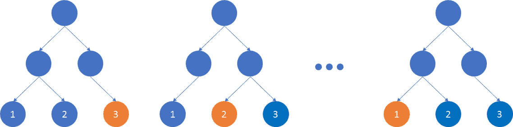
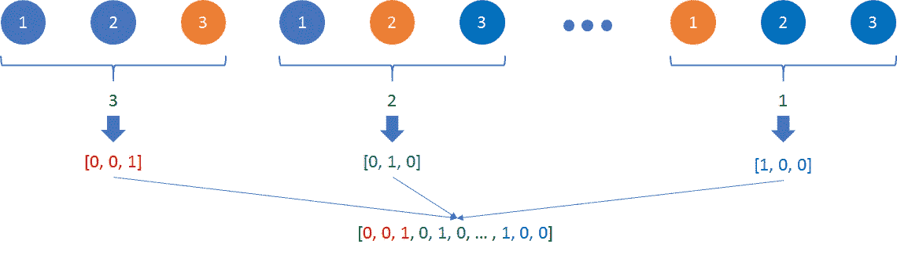
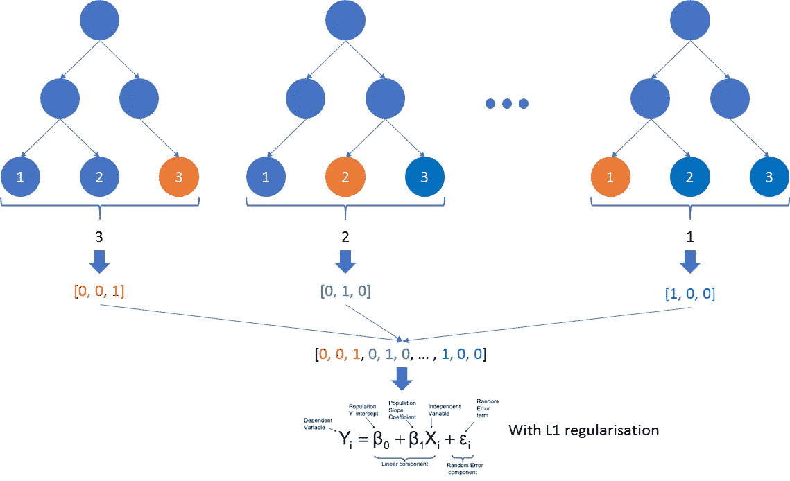
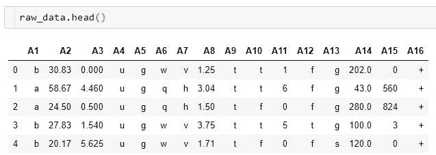
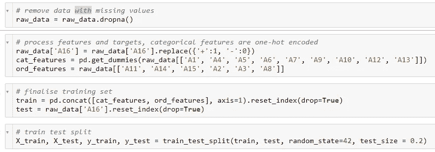
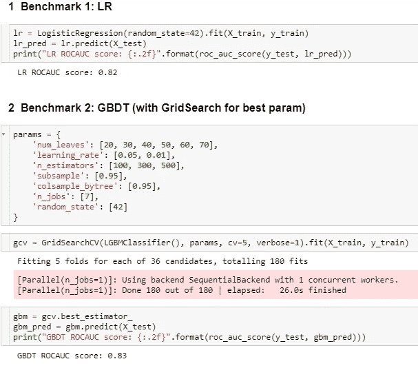
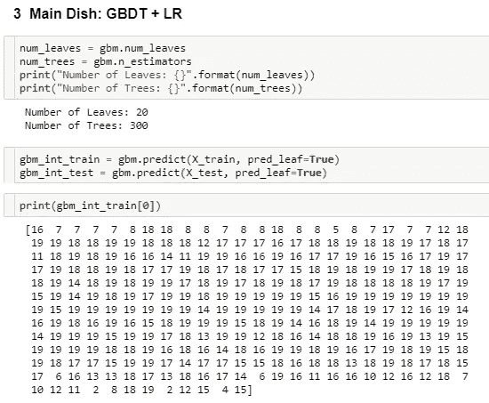
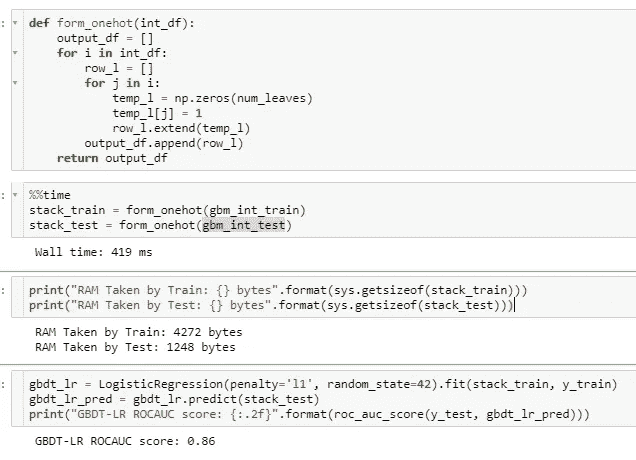
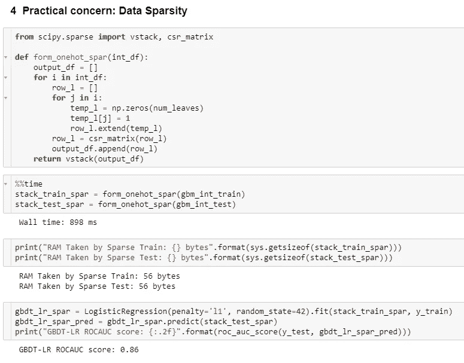

# 下一个更好的玩家？用于二元分类的 GBDT + LR

> 原文：<https://towardsdatascience.com/next-better-player-gbdt-lr-for-binary-classification-f8dc6f32628e?source=collection_archive---------18----------------------->

## 另一种有效的叠加预测算法

Clarke Quay @ Singapore

> 例如，具有逻辑回归的堆积梯度推进决策树(GBDT)在解决二元分类问题时可以是非常有效的算法。CTR 预测。

从 2014 年发布的论文[脸书](https://www.semanticscholar.org/paper/Practical-Lessons-from-Predicting-Clicks-on-Ads-at-He-Pan/daf9ed5dc6c6bad5367d7fd8561527da30e9b8dd)预测广告点击的实践经验中，脸书通过结合决策树和逻辑回归为他们的点击预测系统引入了这种算法。该算法将系统性能提高了 3%，对在线业务产生了重大影响。

在本文中，我将介绍以下议程:

*   算法解释
*   使用[信用审批](https://archive.ics.uci.edu/ml/datasets/Credit+Approval)数据集的 Python 实现
*   RAM 问题和潜在解决方案

我们开始吧！

# 算法解释

GBDT 和逻辑回归都是众所周知的分类模型。GBDT-LR 算法通过将每棵树的预测叶节点的索引作为线性分类器逻辑回归的稀疏输入来组合这两个模型。

让我们假设我们已经训练和调整了一个有 300 棵树的 GBDT 模型，每棵树有 3 个叶节点。第二步是使用该模型再次对训练数据集进行预测。然而，不是输出标签，而是为 300 棵树中的每一棵树返回预测叶节点的索引。

GBDT output prediction leaf node index

在上面的示例中，第一棵树返回 3，因为预测是在第三个叶节点上。同样，第二棵树返回 2，最后一棵树返回 1。GBDT 模型的输出将看起来像[3，2，…]。,1].由于模型包含 300 棵树，这个列表应该有 300 个元素。

One-hot encode GBDT output

接下来，列表中的每个数字都被一键编码。比如 3 变成[0，0，1]，2 变成[0，1，0]，1 变成[1，0，0]。这些一键列表被附加在一起以形成逻辑回归模型的输入。因为每棵树包含 3 个叶节点，所以最终的列表应该有 300 * 3 个元素。

Overall Structure

现在，我们已经成功地为逻辑回归构建了训练数据集。很明显，输入数据非常稀疏。因此，L1 正则化用于解决这个问题，并避免过度拟合。

# Python 实现

让我们用 UCI [信用审批](https://archive.ics.uci.edu/ml/datasets/Credit+Approval)数据集来看一下 Python 的实现。[源代码](https://gist.github.com/ianforme/6459aefb61323c529a51026e2e50bc5f)可用。数据集包含 15 个不同的标称和序数特征(A1 至 A15)以及一个二元目标标签(A16)。

Data Glance

为了快速处理数据，丢失值的记录将被删除。分类特征是一次性编码的。

Quick Data Processing

首先，让我们训练一个 GBDT 和一个逻辑回归模型用于基准测试。对于 GBDT，网格搜索用于寻找最优参数。选择 ROCAUC 分数作为评估标准。

Benchmark Models

从上面的脚本可以看出，我使用 lightgbm 来训练 GBDT 模型。Lightgbm 分类器适用于该算法，因为我们可以通过调整“num_leaves”参数来指定每棵树中的叶节点数。树的数量由“n_estimators”控制。

接下来，我们将使用经过训练的 GBDT 模型对训练和测试数据进行预测。将“pred”函数中的“pred_leaf”设置为 True，以输出每棵树的预测叶节点的索引。

Output Prediction Leaf Node Index

最后，我们需要将 GBDT 输出转换为独热格式，并使用稀疏数据来训练具有 L1 正则化的逻辑回归。

GBDT-LR Performance

嘣！GBDT-LR 算法实现了 0.86 的 ROCAUC 分数，这优于基线 GBDT (0.83)和 LR (0.82)模型。

# RAM 问题

到目前为止，一切看起来都很好，对吗？然而，这个数据集非常小。处理后只包含 653 条记录。因此，我们正在训练只有 20 个叶节点的小树。想象一下，在 GBDT 模型中，我们有一个更大的数据集，包含更多的要素，需要更多的叶节点和更多的树，这种一次性编码的输出可能非常巨大。

矩阵的大小可以通过*记录数*叶节点数*树数*来计算。在解决复杂问题时，我们需要小心处理这个矩阵。一个潜在的解决方案是将该矩阵转换成稀疏矩阵对象。

Use of Sparse Matrix

注意，通过将独热矩阵转换成稀疏矩阵，RAM 使用从 4，272 字节减少到 56 字节。然而，随着处理时间从 419 毫秒增加到 898 毫秒，这个技巧给 CPU 计算带来了更多的负担。

# 结束注释

同样，上面用作示例代码在@ [这里](https://gist.github.com/ianforme/6459aefb61323c529a51026e2e50bc5f)可用。

感谢阅读！