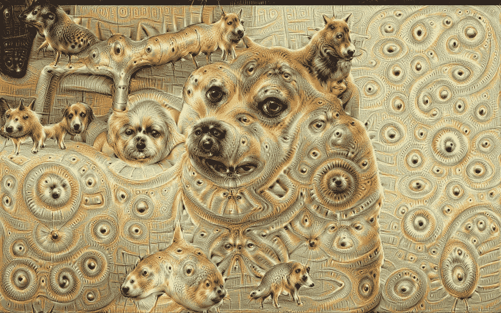
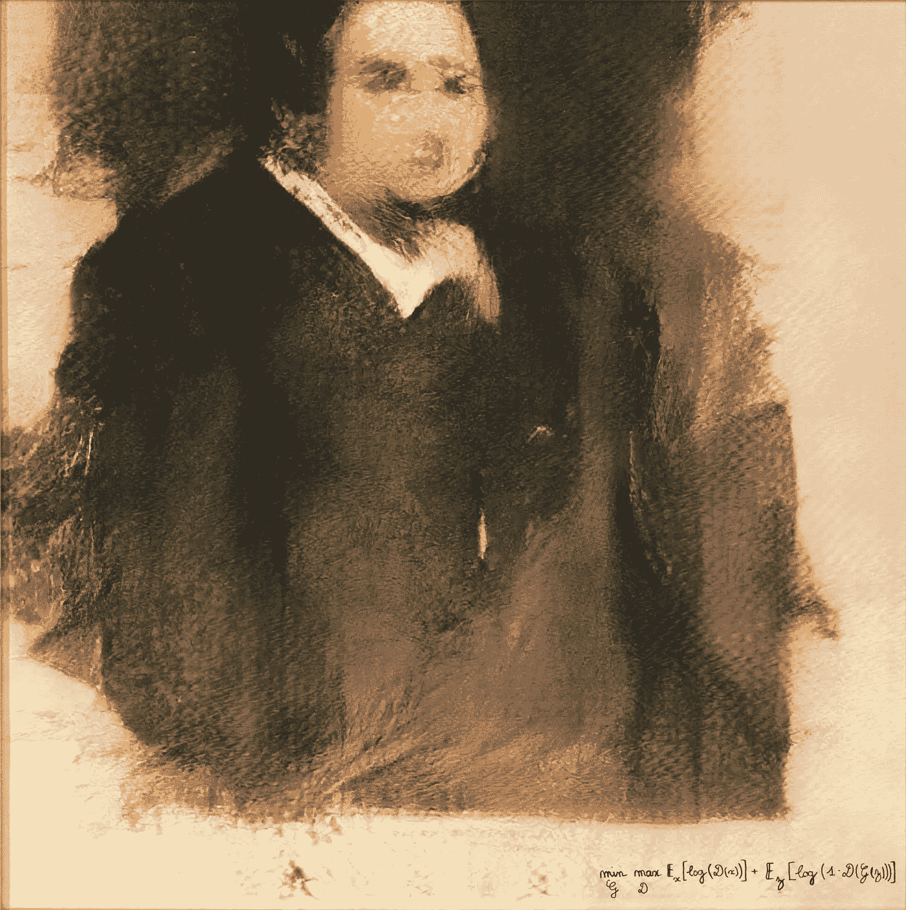
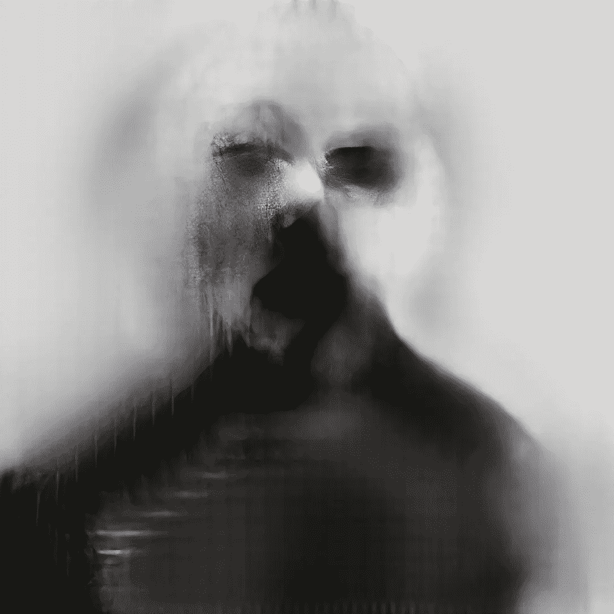
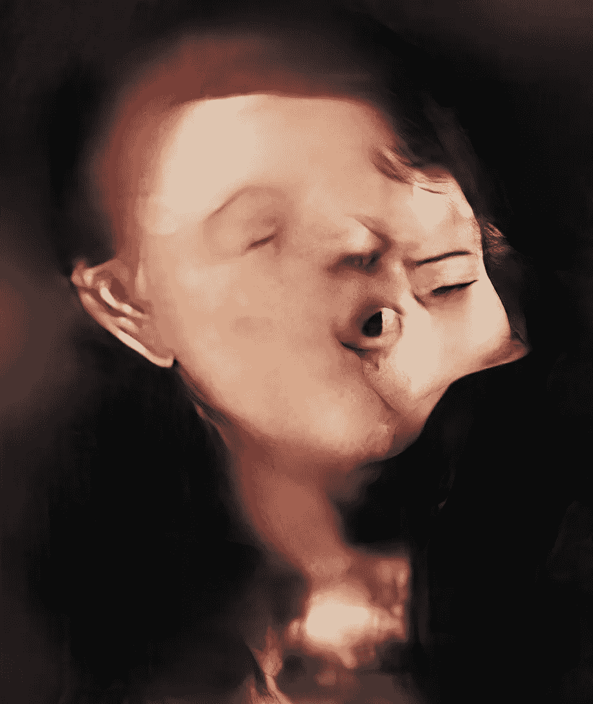
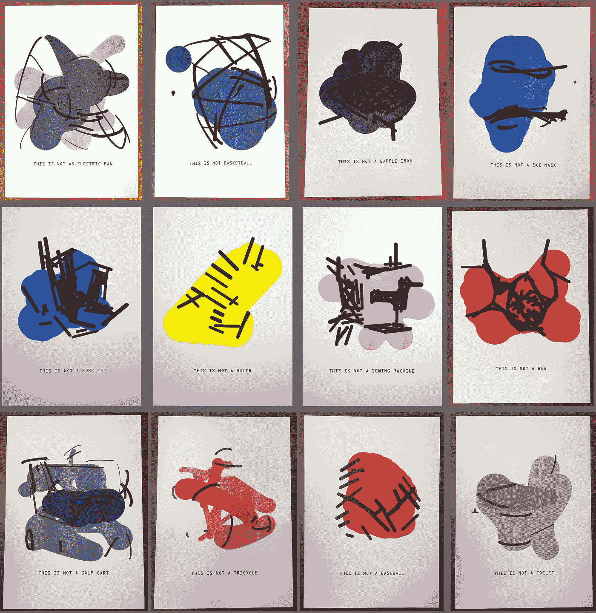
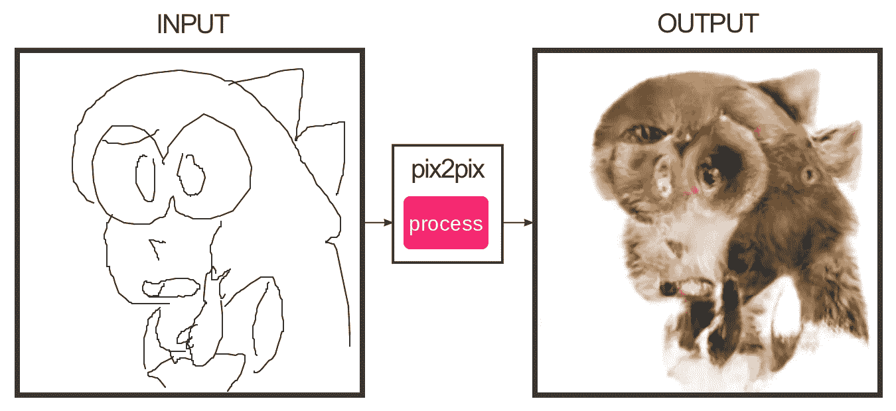
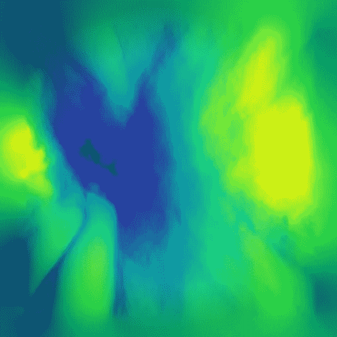

# 下一级艺术与工作和休闲的未来

> 原文：<https://towardsdatascience.com/next-level-art-and-the-future-of-work-and-leisure-f66049112e44?source=collection_archive---------19----------------------->

## 用人工智能变得更有创造力(和人性)

Photo by [Amaury Salas](https://unsplash.com/@eseamau?utm_source=medium&utm_medium=referral) on [Unsplash](https://unsplash.com?utm_source=medium&utm_medium=referral)

人工智能和深度学习对大量领域产生了巨大影响，并在过去几年中引发了许多颠覆和进步，这一事实对许多阅读本文的人来说不会感到惊讶。

然而，有些人可能会感到惊讶的是，即使是艺术和创意领域，这些一直被视为独特的人类领域，也没有受到这些最新进展的影响。

对人工智能取代工作的恐惧是围绕这些技术最常见的担忧之一。现在它甚至侵占了我们的创造性追求。这是否意味着我们不仅要担心我们的工作被人工智能抢走，还要担心我们的人性？

虽然许多人担心人工智能会取代或替代人类，或者认为人工智能永远不会有创造力，人工智能产生的任何东西根据定义都不是艺术，但我想提出一种替代观点。我相信，先进的 AI 将让我们专注于我们独特的天赋和优势，为我们提供创造性探索和表达的新工具，让我们享受更多高质量的休闲时间。

最终，它将使我们变得更有人情味。

在这篇文章中，我首先想给你一个非常简短(并且非常不完整)的关于深度学习和艺术交叉的介绍，并向你介绍一小群选择了神经网络作为他们首选媒介的艺术家。

然后，我想向您介绍我目前的公司 [Qosmo](http://qosmo.jp/en/) 在过去几年中一直在从事的一些项目，以及我自己的一些个人项目。

最后，我想和你们分享一个不仅是人工智能和创造力，更广泛的工作和人类的未来愿景。

我希望在这篇文章结束时，我会让你相信，我们既不应该害怕人工智能削弱或贬低我们的人性，也不应该认为它只会影响日常工作，但不会对我们的创造力产生任何影响。相反，我希望到最后你会对人工智能的未来感到兴奋，并准备好接受它，不是作为一个竞争对手，而是作为一个强有力的工具来重获和加强我们的人性。

边注:本文基于我在 2019 年 SciPy Japan 上的一系列演讲，以及 2019 年日经 AI 峰会上的扩展版本。如果你更喜欢看视频[，你可以在 YouTube 上找到 SciPy talk](https://youtu.be/l__OVTTt3uc)。但是这篇文章不仅是最近的，而且更有深度，特别是关于知识工作和创造力的未来的最后一部分，在 SciPy 的演讲中我根本没有时间去触及它。

# 人工智能艺术简史

人工智能和创造力之间的联系第一次从相当深奥的圈子渗透到主流意识，可能是在 2015 年谷歌宣布 *DeepDream* 的时候。

Image credit: [https://www.reddit.com/r/deepdream/comments/3cc2a2/very_wow_such_puppyslug/](https://www.reddit.com/r/deepdream/comments/3cc2a2/very_wow_such_puppyslug/)

想象一下盯着一朵云。过了一会儿，你会感觉到你可以在那里看到一个模式。也许是一张脸。你盯着云看的时间越长，越想那张脸，你实际上就越说服自己，云中真的有一张脸在盯着你。

DeepDream 本质上就是这种现象的神经网络等价物。

通过反复强化神经网络在图像中拾取的模式，最初非常微妙的模式(或其想象的暗示)逐渐变成这些模式的完整表现。这样，狗的眼睛开始长出来，蜗牛从建筑物中冒出来，风景变成了有着童话般高塔的奇异城市景观。

从高中开始，一直到我获得博士学位，我偶尔会为乐队制作音乐视频来赚点小钱。我第一个使用深度学习的项目是在 2016 年我的博士学位即将结束时，当时我使用 DeepDream 网络在我为字母和树制作的*《虚空》*的视频中实现了一种有点新奇的视觉效果。

虽然今天没有人会对此感到兴奋，但你必须记住，就深度学习而言，2016 年是史前时代。当时这是一个非常酷的效果(至少我是这么认为的)，这是我熟悉 TensorFlow(当时仍处于起步阶段)和深度学习的一个好方法。

最近，我们已经超越了对现有图像的简单处理。特别是，我们已经看到了神经网络在生成图像方面的惊人突破。很大程度上，这要归功于一种叫做 *GANs* ，*生成对抗网络*的网络。

GANs 基本上是通过让两个网络相互对抗来工作的，一个是生成假数据的生成器，另一个是必须判断数据是真实的还是由生成器网络创建的伪造品的鉴别者或评论家，他们已经在他们可以生成的图像类型中实现了令人震惊的准确性和可信度。

特别受欢迎(也很奇怪)的是(半)真实的脸相互变形的幻觉图像，这导致了令人着迷的视频。

由于这类甘赝品最近达到的真实程度，一个像这样的网站山寨产业已经兴起。每当这个特定的网站被刷新，一个新的由神经网络想象出来的照片般真实的肖像就产生了。虽然这很有趣，但它也让人们关注围绕[深度造假](https://en.wikipedia.org/wiki/Deepfake)和在近乎完美的人工智能造假时代真实数据的可信度日益增长的问题。

这一点我将在下面再次谈到。虽然人工智能艺术本身是有趣和令人愉快的，但它也像其他艺术形式一样，允许我们突出问题，表达我们的关切。通过使用这些问题或失败点作为我们工作的基础，并把它们发挥到极致，我们作为艺术家可以传播意识和教育。

最好的艺术不仅仅是审美上的愉悦，还能引发人们的思考。

2018 年 10 月，当法国集体 [*【明显】*](https://obvious-art.com) 能够在知名拍卖行*佳士得*以 432，500 美元的价格拍卖他们的甘创作的艺术品*【Edmond de Belamy】*时，人工智能艺术第一次真正成为主流。

Image credit: [https://en.wikipedia.org/wiki/Edmond_de_Belamy#/media/File:Edmond_de_Belamy.png](https://en.wikipedia.org/wiki/Edmond_de_Belamy#/media/File:Edmond_de_Belamy.png)

这在艺术和 AI 社区都引起了轩然大波，并提出了 AI 是否能真正产生艺术的问题。

然而，这远不是它提出的唯一问题，拍卖后的大部分注意力都集中在显而易见公司处理和实施这个项目的方式上。他们面临着严厉的批评，因为他们采用了别人的代码，在一个结果可疑的简单数据集上进行训练，并出售打印在画布上的生成输出。

我不想太深入整个关于明显是否值得金钱和关注的争论(如果你感兴趣，网上有很多这样的讨论，例如伟大出版物 Artnome 中的这篇文章)。然而，我想说的是，在我看来，不管我们是否认为最终的作品是艺术，在我看来，显然不是真正的艺术家。

很能说明问题的是，他们甚至没有用自己的名字，而是用 GAN 算法背后的一个关键方程来签名。就好像他们想说“不是我们做的，是人工智能做的。”

这与真正的人工智能艺术家所做的完全相反。

就像一个画家研究他的画笔和画布并完善他的笔触一样，就像一个钢琴家研究她复杂的乐器并练习她的技巧一样，一个真正的人工智能艺术家深入研究他正在工作的网络，以及他需要操纵它们的方式，以精确地实现他心目中的创造性结果。

从这个意义上说，AI 和神经网络不是创造者！它们是钢笔、刷子、照相机、小提琴、凿子等。他们是工具。

由于它们的高度复杂性和新颖性，它们可能看起来像魔法，像自主的创造者，但最终它们仅仅是(希望)熟练的创造者手中的工具。

对我来说，显而易见的是非常聪明地利用这种新颖性和高度复杂性来做好销售。无论你如何看待他们的艺术才华，他们肯定是聪明的企业家。

这有点像有人在 1985 年 MS Paint 发布前夕用它画了一个简单的草图，印在一张大画布上，然后拍卖掉。创造它的过程的纯粹的新颖性和(当时)看似很高的复杂性可能已经获得了很高的价格并给人们留下了深刻的印象。但它可能不会是“好艺术”。Paint 女士肯定不会是创造者。

就像数码相机不比模拟相机更具创造力，或者 Photoshop 不比前数字平面设计师的笔和纸更具创造力一样，人工智能和深度学习也是如此——至少在可预见的未来，我们可以现实地想象它们——不是创造者，而是创造者使用的工具。

对于那些对真正的自主创造力感到兴奋的人来说，这可能会有点失望。但我对此感到高兴，并认为这丝毫不会降低人们对这些技术的热情。它们让我们创作者真正有了新的创造性表达方式。不仅仅是作为固定的工具，它们几乎是一个元工具，允许我们不断地梦想新的工具和过程来实现我们的创造性愿景。

关于我认为什么/谁是真正的人工智能艺术家，让我简单地给你介绍几个我认为属于这一类的人。

这个列表绝不是详尽的，人工智能艺术家的社区正在不断增长。开始研究更广泛的人工智能艺术的一个好地方是由[巴鲁·埃利奥特](https://medium.com/u/a7de03f2dfac?source=post_page-----f66049112e44--------------------------------)组织的 *NeurIPS 工作室的[画廊，该工作室是关于创造性和设计的机器学习的](http://www.aiartonline.com)* 。

为了简洁起见，我也不会太深入任何一位艺术家的细节，而是鼓励你自己去看看他们的艺术(和思想)。

# 认识人工智能艺术家

可能最著名的人工智能艺术家是马里奥·克林格曼。

克林格曼，就像显而易见的一样，将他的大部分注意力集中在与甘相关的艺术上，尤其是肖像画。然而，与显而易见的相反，他真正成为了它们错综复杂的大师，确切地知道如何设计、训练和操纵它们，以达到他所渴望和设想的精确的艺术效果。

他的许多作品都有一种令人难以置信的微妙之处，让人想起更传统的艺术形式，常常怪异地将美术美学与更抽象的艺术形式混合在一起。

“Neural Glitch”; Image credit: [http://www.aiartonline.com/art/mario-klingemann/](http://www.aiartonline.com/art/mario-klingemann/)

驱动他追求人工智能艺术的是对“趣味性”的追求，正如他在[接受*艺术市场大师*](https://www.artmarket.guru/le-journal/interviews/mario-klingemann/) 采访时概述的那样。

> “我试图找到有趣的东西，这是一种永无止境的探索，因为一旦你抓住它，它就会像雪花一样在你手中融化。有趣隐藏在不熟悉、不寻常和不可思议之中，但是一旦你发现了它，并把它拖到聚光灯下，你看它的时间越长，它就变得越熟悉或正常，最终失去它的有趣性。
> 
> 我使用机器作为检测器，帮助我在不断增长的信息堆中进行搜索，这些信息正以越来越快的速度进入我们的世界。与此同时，我自己也在不断增加，用机器生成有序的信息模式，速度比我自己的设备更快。在这个过程中，有时是我决定，有时是我让机器决定。"

这个搜索方面是人工智能艺术中反复出现的主题。

我们可以想象所有可能的艺术品的抽象空间。这个空间是难以置信的高维度和巨大的(潜在的无限取决于我们所考虑的媒体)。传统上，艺术家只能非常缓慢地探索这个空间中的无限小的区域。

神经网络本质上提供了工具，允许我们以更快的速度和更广阔的视野探索这个空间。人工智能艺术家的技能往往在于知道如何将这种网络化的探索引向“高度有趣”的区域。

克林格曼最近还在苏富比拍卖行拍卖了他的一件作品*路人的回忆*。这件作品不仅仅是一件静态的艺术品，它实际上包括了生成机制本身，导致了一个完全生成的、无限进化的装置。

最后，这件作品“仅仅”卖了 3.2 万英镑，这导致了一场广泛的媒体风暴，文章题为“人工智能艺术品在拍卖中失败，机器人启示录尚未到来”，宣称短命的人工智能艺术场景只不过是一种好奇，基本上已经走到尽头。

然而，我个人认为这对人工智能艺术社区来说是一个好迹象(我认为马里奥·克林格曼也同意这一点)。32，000 英镑是一个合理且非常值得尊敬的价格，它并没有标志着人工智能艺术的终结，而是标志着人工智能艺术炒作和利用注意力/新奇经济的终结。

这标志着人工智能艺术已经成为一种严肃而受人尊敬的艺术形式，而不是一种被夸大的好奇心。

与马里奥·克林格曼的作品非常不同，但同样有趣的是土耳其媒体艺术家 [Memo Akten](https://medium.com/u/d00ac9528de3?source=post_page-----f66049112e44--------------------------------) 的作品。

克林格曼的作品非常“专注”(因为没有更好的词)，接近艺术，而阿克滕的作品则更具概念性和多样性。虽然他的最终结果可能看起来不那么“精致”，但它们都是基于通常非常简单但巧妙而具有煽动性的想法。

我强烈建议你去看看[的作品目录](http://www.memo.tv/works/)，因为它种类繁多，但是我想在这里和你分享我最喜欢的他的作品，他称之为 [*学着去看*](http://www.memo.tv/portfolio/learning-to-see/) 。

这个想法非常简单，但结果却令人震惊和深思。

在训练过程的开始，神经网络通常是随机初始化的，这意味着它们绝对没有“真实世界”的概念。在训练过程中，通过反复接触数据，他们形成了世界的图像(或者至少是数据集中所代表的世界)。如果这个数据集有偏见，那么经过训练的网络的世界观也会有偏见。

在《学会看》中，Akten 将这一想法发挥到了极致，并在非常独特的图像数据集上训练了各种神经网络。

一个网络只看到海洋和海岸线的图像，另一个网络只看到火的图像，还有一个网络只看到花的图像。

结果是，一旦网络完成了他们的训练过程，并被释放到“真实世界”,看到更多的普通图像，他们只能根据他们所学到的来解释这些图像。

例如,“花卉网络”不知道如何更好地解释它所看到的关于花卉的一切，它看到的任何地方都有花卉。

这就好像一个孩子从出生就在一个除了鲜花什么都没有的孤立环境中长大，然后突然被释放到现实世界中。它的视觉皮层和模式识别系统可能会努力解释新的模式，也可能会看到到处都是花。

虽然这是一个思想实验和纯粹的猜测，但众所周知，我们人类对我们视觉感知中的某些模式也有自然的(非常有用的)偏好，例如偏好看脸。

学会观察提出了一个有趣的问题:由于我们独特的成长和文化背景，我们每个人可能会有多少偏见。

我们看待和感知世界的方式到底有多不同？

虽然它不太可能像 Akten 网络的偏见或思想实验中的孩子那样强烈，但几乎可以肯定的是，人与人之间存在微妙的差异。

算法的偏差在过去已经引起了普遍关注。种族主义聊天机器人或性别歧视图像识别/分类模型只是一些例子。它们确实是数据驱动科学，特别是深度学习的最基本问题之一。

在某些情况下，偏见非常明显。虽然这些案例确实令人震惊和担忧，但它们不太可能是最有问题的，因为它们太明显了。随着数据驱动技术变得越来越普遍，特别是细微但无处不在的小偏差将变得至关重要，但也很难检测和消除。

虽然我们可能没有直接的解决方案，但作为艺术家，我们有能力让这个问题引起关注，并通过将它发挥到极致，让外行(以及经验丰富的从业者)更容易理解它。

这是我认为许多有趣的人工智能艺术生活的地方，特别是 Memo Akten 也参与的更具概念性的那种:采用成熟的神经网络，并将它们推向(或超越)它们的临界点或应用领域。这不仅经常导致有趣和意想不到的结果，还让我们更深入地了解如果在现实世界中盲目放任这种模型可能产生的问题。

这里我要介绍的最后一位艺术家是[计算设计讲师汤姆·怀特](http://drib.net/)。

顾名思义，他的项目*感知引擎*专注于感知在创造力中的作用。用他的话说，

> “人类的感知是创造过程中经常被低估的组成部分，因此设计一个将感知放在前面和中心的计算创造过程是一个有趣的练习。”

同样，它本质上是一种通过巧妙地改变应用领域来欺骗神经网络做它们最初不想做的事情的练习。

它使用了对立的例子的想法，并把一个有趣的艺术扭曲。特别是，怀特建立了一个反馈回路，在这个回路中，对网络的感知引导着创作过程，而创作过程又反过来影响感知。

简单地说(有点简化)，White 使用了一个经过训练的神经网络来识别图像中的对象，然后使用了第二个系统，该系统可以生成抽象形状并搜索一个结果，该结果可以“欺骗”网络对特定对象类进行高确定性预测。结果是看似抽象的形状(怀特后来把它变成了真实的丝网印刷)，仍然使网络确信是某些物体的照片般逼真的表现。

Image credit: [https://medium.com/artists-and-machine-intelligence/perception-engines-8a46bc598d57](https://medium.com/artists-and-machine-intelligence/perception-engines-8a46bc598d57)

有趣的是，一旦我们知道网络认为它看到了什么，我们在大多数情况下也可以突然看到大多数图像中的对象(尽管我怀疑有人被骗将其与真实的东西混淆)。

White 使用的真实过程实际上比我在这里给出的项目的简略大纲更加巧妙和深刻。如果你对细节感兴趣，我强烈推荐你看看他的文章。

 [## 感知引擎

### 一个视觉概述检查神经网络的能力，创造从真实的收集抽象的表现…

medium.com](https://medium.com/artists-and-machine-intelligence/perception-engines-8a46bc598d57) 

# Qosmo:计算创造力和超越

现在你已经对人工智能艺术有了一点概念，并且认识了一些在这个新兴领域工作的人，让我简单地给你讲讲我自己是如何参与进来的。

实际上，我的学术生涯始于一名物理学家，攻读量子信息理论博士学位。但是在做这个的时候，我意识到我想做一些更实用的东西。通过我共同创立的一家初创公司，我也有了一些创业经验，我认为人工智能不仅从纯粹的学术角度来看很有趣，而且也是解决一些非常酷的现实世界问题(并赚些钱)的非常有前途的工具。

因此，在获得博士学位后，我在一家初创公司工作了几年，该公司将人工智能应用于广泛领域的商业问题，例如金融和医疗保健。虽然在这些领域肯定有有趣的问题需要解决，但我个人对人工智能的创造性越来越感兴趣。

最终，在 2019 年 2 月，我终于决定辞去之前的工作，加入我的朋友 [Nao Tokui](https://medium.com/u/d9ccd9d1c0fe?source=post_page-----f66049112e44--------------------------------) 在他的公司 [Qosmo](http://qosmo.jp/en/) 。如果你对这一切是如何展开的完整故事感兴趣(以及我是如何同时成为一名作家和音乐家的)，我最近详细写了这一切:

 [## 在不到两年的时间里，从上班族变成了作家、音乐家和艺术家

### 分享你的创意项目如何改变你的生活。

medium.com](https://medium.com/swlh/from-office-worker-to-author-musician-and-artist-in-less-than-two-years-e69fbbc6f520) 

Qosmo 是一个位于东京的小型创意团队。该公司的核心理念是“计算创造力”，重点关注 AI 和音乐(但肯定不限于这些领域)。

这里我想简单介绍一下我们过去的三个项目。

## AI DJ

大概到目前为止 Qosmo 最著名的项目就是我们的 AI DJ 项目了。

最初开始于 2016 年的 AI DJ 是一场人类与 AI 的音乐对话。

在 DJing 中，播放“背靠背”意味着两名 DJ 轮流选择和混合曲目。在我们的例子中，我们有一个人和一个人工智能背靠背地玩。

具体来说，一个人(通常是 Nao)选择一首曲目并进行混音，然后 AI 接管并选择一首曲目并进行混音，以此类推，创造出一种自然、连续的合作表现。

这种增强人类创造力和处理人类与机器创造力之间关系的想法是我们在 Qosmo 所做工作的核心。我们对自主创新的机器并不特别感兴趣(我们也不真的相信它们在不久的将来是可能的)，而是对人类如何为了创新的目的与人工智能和机器进行交互感兴趣。

AI DJ 由几个独立的神经网络组成。核心是一个可以根据以前播放过的曲目选择曲目的系统，以及一个可以进行节拍匹配和混音的系统。

至关重要的是，我们使用的不是数字音频，而是真正的黑胶唱片。人工智能必须学会如何物理地操纵光盘(通过使用强化学习训练的微型机器人手臂)，以便对齐节拍，并使节奏匹配。

虽然这个项目已经有几年的历史了，但是我们仍然在不断地开发这个系统。例如，使用摄像机来分析人群行为，并通过根据这些信息调整曲目选择来鼓励人们多跳舞。

过去，我们在许多地方，包括本地和全球，都进行过这种表演。到目前为止，我们最大的表现是在谷歌 I/O 2019 上，在首席执行官桑德尔·皮帅的主题演讲之前，我们在主舞台上做了一个小时的表演，让观众热身。

你可以在我们的网站上了解更多关于 AI DJ 的详细信息。

 [## 人工智能 DJ 项目-人工智能和人类之间的对话

### “人工智能 DJ 项目”是一场现场表演，由人工智能(AI) DJ 和人类 DJ 一起演奏…

qosmo.jp](http://qosmo.jp/en/projects/ai-dj-human-dj-b2b-2/) 

## 想象的声音场景

作为人类，我们的视觉和听觉体验有着很深的联系。看看海滩的图片，你很容易想象海浪和海鸥的声音。看着繁忙的十字路口，脑海中可能会浮现出汽车喇叭声和建筑噪音。

*想象的声音场景是一项实验，让 AI 对想象的声音和图像有类似的感觉。这是一个基于网络的声音装置，让用户探索谷歌街景，同时沉浸在人工智能想象的声音场景中。*

*在技术上，它是基于跨模态信息检索技术的思想，如图像到音频或文本到图像。*

*用关于视频(即，视觉和音频)输入的两个模型来训练该系统:一个良好建立的、预先训练的图像识别模型处理帧，而另一个卷积神经网络将相关联的音频读取为频谱图图像，其损失迫使其输出的分布尽可能接近第一个模型的分布。*

*一旦经过训练，这两个网络就可以让我们从庞大的环境声音数据集中检索出与特定场景最匹配的声音文件。*

*生成的声音场景有时有趣，有时有趣，有时发人深省。其中许多符合人类的预期，而另一些则让我们感到惊讶。我们鼓励你迷失在想象的声音场景中。*

## *神经节拍盒*

*我们最近的艺术项目是 Neural Beatbox，这是一个视听装置，目前作为展览[“人工智能:超越人类”](https://www.barbican.org.uk/whats-on/2019/event/ai-more-than-human)的一部分在伦敦巴比肯展出(还展出了 Mario Klingemann 和 Memo Akten 的作品)。*

*就像 AI DJ 一样，这个作品围绕着一个音乐对话。然而，除了在人工智能 DJ 中，人工智能不是参与者，而只是推动者，对话发生在装置的不同观众之间。*

*节奏和节拍是人类最基本和最古老的交流方式。Neural Beatbox 使任何人，无论他们的音乐背景和能力如何，都能用自己的声音创造复杂的节拍和节奏。*

*当观众走近这个装置时，他们被鼓励录制自己的短片，发出声音，做鬼脸。使用该视频，一个神经网络将观众的声音分割、分析并分类为各种类别的鼓声，然后将其中一些整合到当前播放的节拍中。*

*同时，另一个网络不断产生新的节奏。*

*通过以这种方式结合后续观众的贡献，人们之间直观的音乐对话得以展开，从而产生不断发展的作品。*

*人工智能的轻微缺陷，如偶尔的错误分类或不寻常的节奏，实际上增强了创作体验，并导致有趣和独特的音乐体验。作为观众，试图通过制造“非鼓声音”来推动系统超越其预期领域，可以导致真正有趣的结果，其中一些结果实际上令人惊讶地充满音乐和灵感。*

*目前，Neural Beatbox 仅限于在巴比肯展览等公共场所展示，但我们也在考虑将它作为一个基于网络的互动作品开放。我们只是有点担心互联网上的人们可能会为这个装置贡献什么样的声音和视频…虽然结果可能会很搞笑和有趣，但它们可能也会很快包含一些 NSFW 的内容。；)*

# *生成模型和价值*

*除了我最近在 Qosmo 的工作之外，我还和 AI 一起完成了一些我自己的艺术作品和一些与创造力相关的项目。在向您展示其中一些之前，我想简单快速地进行一次技术考察。*

*创意场景中使用的许多模型都属于*“生成模型”*这一大类。上面介绍的 GANs 就是其中的一个变种。*

*生成模型本质上是这样的模型，顾名思义，学习如何生成或多或少真实的数据。物理学家理查德·费曼的一句话很好地概括了这背后的一般思想。*

> *"我不能创造的东西，我不明白。"—理查德·费曼*

*作为与人工智能合作的研究人员和工程师，我们希望如果我们能够教会我们的模型创建至少是模糊现实的数据，这些模型一定已经对真实世界的样子或行为方式有了某种“理解”。*

*换句话说，我们用创造和产生有意义的输出的能力作为智能的标志。*

*不幸的是，这种“理解”或“智能”仍然经常看起来像下面的图像。*

**

*Image credit: [https://sufanon.fandom.com/wiki/File:Pix2pix.png](https://sufanon.fandom.com/wiki/File:Pix2pix.png)*

*虽然我们的模型确实在学习真实世界的一些东西，但它们的知识领域通常非常有限，正如我们在上面的偏见例子中已经看到的那样。*

*在我之前从事实际商业应用的工作中，这是个坏消息。你不希望你的财务或医疗预测看起来像上面的图片！*

*然而现在作为一名艺术家，我发现这令人兴奋和鼓舞。事实上，正如已经指出的，许多艺术家故意寻找这些生成模型的断点或边缘案例。*

*我个人最喜欢的生成模型类型是所谓的*变分自动编码器*，或者简称为 *VAEs* 。我发现它们都非常通用，而且从信息论的角度来看，它们既漂亮又优雅。*

*简而言之，vae 将原始数据作为输入，然后通过信息瓶颈压缩和传输这些数据，最后尽可能精确地重建这些数据。*

*由于信息瓶颈(更专业地说:一个比数据空间维度低得多的潜在空间)，模型不能只是直接传递数据，而必须学习高效的抽象和概念。*

*例如，如果我们想将它应用于狗和猫的图像，而不是简单地传输每一个像素值，则模型被迫学习抽象概念，如“狗”和“猫”的概念、腿和耳朵的概念、皮毛颜色等，这允许数据的更紧凑(尽管通常不是完全无损)的表示。*

*作为这个过程的一个整洁的副产品，我们得到了我们的数据的一个紧凑的数学描述，一个所谓的潜在向量或嵌入。这使得我们可以做各种有趣的事情，如有意义的数据比较以及数据点之间的真实插值，如上面 GAN 人脸的例子。*

*如果您想更详细地了解所有这些，我从两个玩家之间合作博弈的角度写了一篇关于 VAEs 的深入讨论。*

* [## 作为双人游戏的可变自动编码器(上)

### 爱丽丝和鲍勃在自动编码奥运会上

towardsdatascience.com](/the-variational-autoencoder-as-a-two-player-game-part-i-4c3737f0987b) 

# 个人项目

我想在下面展示的项目都以这样或那样的方式使用了 VAEs。

## 潜在脉动

当 VAE 被初始化时，它的数据表示是完全随机的，因为它还没有学习任何关于训练数据的东西。然后，随着训练的展开，网络逐渐学习不同的概念和抽象，相似数据的聚类开始在潜在空间中形成，随着模型收敛，这些聚类越来越清晰。

潜在脉动显示了一个这样的训练过程，从最初的随机混沌，到模型经历不同阶段，尝试不同的表示，最后确定在一个表现出相当明显的聚类。

此处潜在空间中的每个点代表大约 30 万条消费者投诉文本中的一条，这些文本涉及大约 12 种不同的金融产品(如“信用卡”、“学生贷款”等)，用不同的颜色表示。

除了自然的学习过程，我还在嵌入中添加了一些周期性的随机噪声，以创建与轨道*【2 Minds】*[*【inside info】*](https://www.insideinfomusic.com)同步的节拍模式，时间从最初的 172bpm 延长到 160bpm，以更好地匹配视频帧速率。我选择了“两个头脑”这首歌，因为这个标题让我想起了 VAE 的编码器和解码器的关系。

通常，当用生成模型创作艺术时，我们会想到模型创作的实际输出。然而，潜在脉动颠覆了这一概念，表明潜在空间本身可以具有内在的美感和艺术品质，即使模型训练的数据显然是枯燥的，如本案例中使用的消费者投诉文本。

## 潜在景观

另一个相关的作品是*潜在景观*，它在视觉化潜在空间中根深蒂固的优雅和美丽方面走得更远。

我喜欢把这些看作是神经网络的“大脑扫描”。

从技术上来说，这些图像是通过分析潜在空间的潜在度量生成的(这件作品实际上是我们正在进行的研究论文的副产品)。粗略地说，潜在的空间不是“平的”，空间内的距离也不一致。潜在景观显示了在潜在空间的不同位置有多少弯曲，多少距离扭曲。

上面的结果也是基于在相同的金融投诉数据集上训练的 VAE，显示了令人想起外星景观或宇宙气体云的抽象形成。

就像在《潜在的脉动》中一样，网络本身，而不是生成模型的输出，成为了艺术品。

## 神经机能障碍

我要提到的最后一个项目是我迄今为止最大的个人项目。因为我之前已经[在媒体](/neuralfunk-combining-deep-learning-with-sound-design-91935759d628)上广泛地写了这个项目，我只想给你一个非常简短的概述。

NeuralFunk 是一个利用深度学习进行声音设计的实验。这是一个完全由神经网络合成的样本制成的实验轨道。

再说一次，神经网络不是音轨的创造者，但它们是用来创作音轨的唯一工具。因此，结果不是人工智能创作的音乐，而是用人工智能作为探索创造性表达新方式的工具创作的音乐。

在创建样本的过程中，我使用了两种不同类型的神经网络，一种是根据光谱图训练的 VAE 神经网络，另一种是 WaveNet 神经网络(还可以根据来自 VAE 的光谱图嵌入进行调节)。这些网络一起提供了许多工具来产生新的声音，从重新想象现有的样本或将多个样本组合成独特的声音，到完全无条件地创造全新的声音。

由此产生的样本然后被用来制作最终的轨道。

标题 NeuralFunk 的灵感来自鼓和低音子流派 *Neurofunk* 这是我最初的想法。但是在项目的过程中，它变成了更具实验性的东西，与声音设计过程本身的实验性质相匹配。

如果你想了解这个项目的全部细节(包括代码)，可以看看我写的文章。

 [## NeuralFunk -将深度学习与声音设计相结合

### 完全用神经网络产生的样本制作轨迹

towardsdatascience.com](/neuralfunk-combining-deep-learning-with-sound-design-91935759d628) 

那么我的下一步是什么？

我有一个使用人工智能的扩展现场表演的大愿景，它将结合上面介绍的许多概念(和项目)，并将它们带到一个新的水平，同时给我一种全新的音乐表演方式。

到目前为止，这不过是一个愿景，鉴于项目的规模，我甚至有点害怕开始。

然而，我目前正在非常积极热情地写一本关于休息时间的重要性的书。

虽然这看起来有点不着边际，但它实际上在几个方面完全融入了人工智能和创造力的关系。

为了让你相信这一点，让我们来做一个小小的旅行。起初，这看起来可能是随机的和不相关的，但是请耐心听我说，希望到最后你会同意我的观点，并对这个未来的愿景感到兴奋。

# 工作、休闲和创造力的未来

在人类历史的大部分时间里，工作的概念本质上等同于体力劳动。先是在田地和农场，后来在工厂。

在 20 世纪初，工厂工人平均每天工作 10 个小时以上，每周工作 6 天。

这一切都在 1926 年发生了变化，亨利·福特引入了八小时工作制和五天工作制(同时将工资大幅提高到行业标准以上)。

福特为什么要这么做？这不是因为他只是一个好人。他可能是，我不确定，但他这样做的原因更实际，更受商业驱动。

首先，他认识到，如果他提供比别人更好的工作条件，他就能轻易地吸引到最优秀的人才。这正是所发生的事情。最熟练的工人离开了他的竞争对手，排队到他的工厂工作。如果有人不表演，他就被解雇了。有足够多的人愿意接管这个职位。

第二，他认为如果人们没有空闲时间或者太累而不能利用空闲时间，他们就不会在休闲活动上花钱。

> “有更多闲暇的人必须有更多的衣服。他们吃更多种类的食物。他们需要更多的交通工具。[……]休闲是不断增长的消费市场中不可或缺的成分，因为劳动人民需要有足够的空闲时间来寻找消费品的用途，包括汽车。”

这纯粹是经济上的。

通过给他的工人更多的休闲时间(和更多的钱花在休闲上)，同样的工人最终能够并被激励去购买他们正在生产的产品。更多的空闲时间不会有害，反而会促进经济发展！

最后，也是我们讨论中最有趣的一点，他意识到他的员工可以在更短的时间内完成更好的工作，原因有两个。

对时间的限制会带来更多的创新和更好的方法。人们会真正考虑如何工作，而不仅仅是埋头苦干。

> “我们可以在五天内获得至少和六天一样多的产量，我们可能会获得更大的产量，因为压力会带来更好的方法。”—亨利·福特

此外，休息得更好的员工通常更有效率，更有动力，也更少犯代价高昂的错误。

本质上，福特认为即使对于体力劳动来说，将忙碌等同于生产力也只是在一定程度上起作用。

大约在福特缩短其工厂工作时间的同时，哲学家伯特兰·罗素于 1936 年发表了他的精彩论文*【歌颂懒惰】。*

*在这篇文章中，罗素指出，从历史上看，不是工作，而是对闲暇的庆祝让我们完成了许多我们现在认为是文明最大成就的事情。*

> *“过去有一个小的休闲阶层和一个大的工人阶层。有闲阶级享有的优势在社会正义中是没有基础的[……]它几乎贡献了我们所称的文明的全部。它培育了艺术，发现了科学；它写了书，发明了哲学，改善了社会关系。甚至被压迫者的解放通常也是从上面开始的。没有有闲阶级，人类永远不会摆脱野蛮。”*

*他继续认为，前进的道路是重新发现我们对休闲和休假的欣赏(至少是高质量的休闲，如反思和沉思，而不是无休止地滚动我们的脸书饲料)。*

*让每个人都加入休闲阶层，而不仅仅是少数人。*

> *我想严肃地说，在现代社会中，对工作美德的信仰正在造成巨大危害，而通往幸福和繁荣的道路在于有组织地减少工作。—伯特兰·罗素*

*鉴于 20 世纪初的这种趋势，我们现在应该生活在一种文化中，这种文化类似于古希腊和古罗马，高度重视休闲，并认为忙碌实际上是一种懒惰，缺乏时间管理和深刻的反思。*

*然而，事实似乎恰恰相反。我们发现自己身处一种文化中，这种文化常常把忙碌、压力和过度工作作为荣誉的象征、成就和骄傲的标志。一个按时下班并在白天充分休息的人不可能像一个日复一日长时间加班并且几乎不离开办公桌的人那样高效，对吗？*

*问题是，即使我们已经在很大程度上从体力劳动转向了知识工作，工人们仍然遭受着相当于工厂工作心态的智力折磨！*

*在某种程度上，这可能是合理的，目前仍然存在相当于工厂工作的大量智力残余。在这种工作中，投入的时间越多，产出越多(至少在一定程度上，就像亨利·福特意识到的那样)。*

*这是一种真正证明长时间工作和牺牲休息时间是合理的工作。但这也是最没有价值的一种工作。而且这个值一直在进一步递减。迅速地。这些正是被人工智能和其他生产力和自动化工具颠覆并最终取代的成熟任务。他们的日子已经屈指可数了。*

*在我之前的工作中，我领导了一个人工智能工具的开发，该工具帮助金融分析师搜索大量新闻数据，并从这些文本中产生见解。有了这个工具，分析师可以将搜索相关信息和为经理生成特定报告的时间减少 90%!在常规任务上浪费的时间减少了 90%,现在可以将这些时间重新投入到真正重要的工作中，真正利用他们的技能和创造力。*

*或者，它可以投资到休假中。这是一项值得的投资。*

*人工智能不会夺走我们的工作，也不会威胁或削弱我们的人类价值观。我的朋友和合著者约翰·菲奇和我认为事实正好相反。是的，人工智能将扰乱就业格局，但将会保留的工作以及新创造的工作将围绕创造力和同理心等人类技能。*

*这些技能相对于时间是高度非线性的。投入更多的时间绝对不等于产出更好或更高。事实上，很容易投入太多时间，忽略休息的平衡和滋养作用，结果减少一个人的产出。*

*在未来的工作中，休假将不会被认为是一件“值得拥有”的事情，或者是慷慨的雇主为吸引和留住人才而提供的诱人福利。*

*相反，有意识地休假将是关键技能和竞争优势之一。除了我们的工作伦理，我们应该认真开始思考我们的“休息伦理”。*

*约翰和我对这个未来非常兴奋，我们目前正在写一本关于休假的书。*

* [## 休假-重新发现人类最伟大的实践之一

### 重新学习在不精疲力竭的情况下实现目标的失传艺术。

www.timeoffbook.com](https://www.timeoffbook.com) 

我们希望鼓励更多的人重新发现这种似乎已经被遗忘的古老艺术，并就如何培养和利用高质量的休闲提供非常实用的技巧，以及分享历史和当代关于利用时间力量的惊人人物的不可思议的故事。

我们相信，专注于将同理心和创造力以及支持它们的休闲实践和习惯置于其企业或个人哲学核心的公司和个人将会蓬勃发展。

很快，这可能是唯一可行的选择。

忙碌工作很容易自动化，没有人，不管他们投入多少时间，牺牲多少生命，会在这些任务上胜过人工智能。

另一方面，创造力和同理心在未来很长一段时间内仍将是人类特有的。

那些理解这些技能以及新工具的人将不会把人工智能视为障碍或对手，而是作为一种使人类更上一层楼的技术。

能够让他们这样做的将是一种健康的工作和休闲节奏，以及有意识的休假实践。

所以我们不妨现在就开始练习！* 

*我希望这篇长文让你对人工智能艺术本身感到兴奋，以及人工智能将允许我们在未来更多地关注创造力的更广泛的影响。*

*我也希望我激励你自己采取行动。*

*如果你是一名人工智能从业者，希望你能玩玩你自己的人工智能艺术，也许从推动你的模型接近和超越它们的极限开始，看看它们如何表现。*

*但是不管你是否直接与人工智能一起工作，我真的希望你能考虑用更多更好的时间来练习。*

*不是偷懒，也不是偷懒。这是你对自己最好的投资之一！*

*让我们把无用功留给 AI，变得更有人情味！**