# NFL 教练是如此，如此可预测

> 原文：<https://towardsdatascience.com/nfl-coaches-are-so-so-predictable-3e15fa69bd32?source=collection_archive---------12----------------------->

## [深入分析](https://medium.com/towards-data-science/in-depth-analysis/home)

Source: Pixable

周日，深秋。我在看匹兹堡钢人队，我开始生气了。这是托德·哈利时代，你可以肯定，在比赛的某个时刻，钢人队将会遵循以下比赛顺序:**跑-跑-传球-踢**。钢人队有可能赢得这场比赛吗？他们在场上的什么位置？他们目前赢了吗？没关系——和现代 NFL 中的许多其他进攻协调人一样，Haley 也有自己的风格。某种…可预测性。他可能会改变路线和阵型，但是*类型的比赛——第一次进攻，在只剩两码的时候第三次传球——似乎太容易预测了，即使是对普通球迷来说。*

不久前，如果不为数据付费或从各种来源获取大量数据，很难量化 Haley 和其他 OCs 在他们的游戏呼叫中的可预测性。但是多亏了[马克西姆·霍洛维茨](https://twitter.com/bklynmaks)和[罗恩·尤尔科的](https://twitter.com/Stat_Ron)[NFL scraper](https://github.com/maksimhorowitz/nflscrapR)软件包，获得每场比赛的详细数据从未如此简单。所以我决定进行调查:*NFL 的比赛召唤有多可预测？*

为此，我使用 NFL scraper([所有用于分析的代码都可以在这里找到](https://github.com/davisj2007/nfl-playcalling))收集了 2009 年至 2018 年的详细数据。我想了解的第一件事是跟注的游戏条件。我最喜欢的一个包含大量游戏场景信息的指标是[获胜概率](https://arxiv.org/abs/1802.00998)，或者基于当前的游戏条件，如分数、剩余时间、场地位置等，X 队最终赢得游戏的可能性有多大。具体来说，我想了解基于球队控球时的**预扣胜率**的打法会被称为什么打法。让我们从这里开始，第一步，看看快照前成功概率的一般分布。

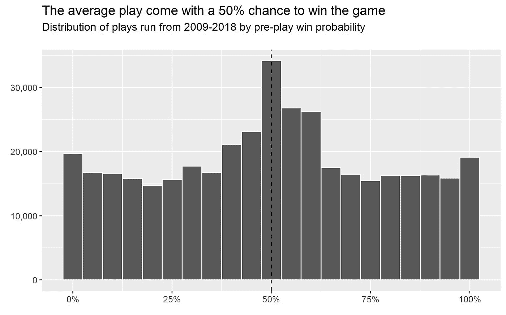

好吧，不完全是正态分布，但在被称为胜率极高或极低的比赛中，也没有太多的模式*。好了，检查完毕后，让我们来看看这是如何按玩法来划分的。在我的数据集中，有 398，645 次播放。这是按游戏类型的分类:*

*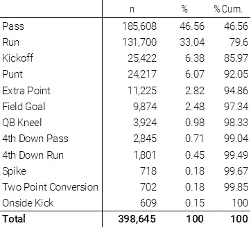*

*下面，您将看到两个独立的可视化效果——在左边，方框图显示了调用的时间汇总，在右边，我绘制了所有数据，以便更好地了解真实的分布情况:*

*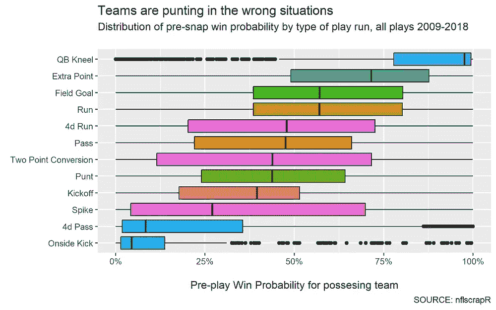**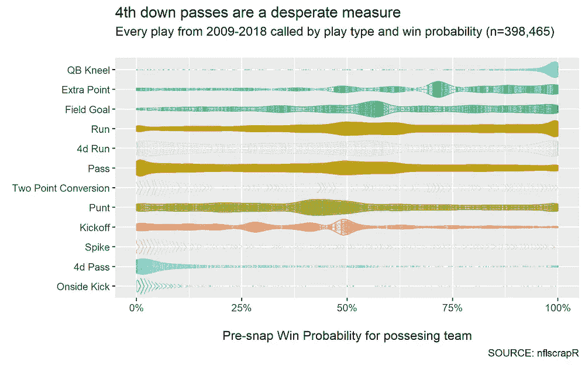*

*哇哦。教练都是疯狂保守的！当一个球队获胜的机会少于 50%时，通常会判平底球、第四次传球和越位球…而且通常在击球前的概率要低得多。你可以说我疯了，但是当球队更有可能输球而不是赢球时，他们应该尽一切努力保住控球权，然而，当拥有控球权的球队有将近 55%的概率输掉比赛时，平均的控球率就会出现。*

*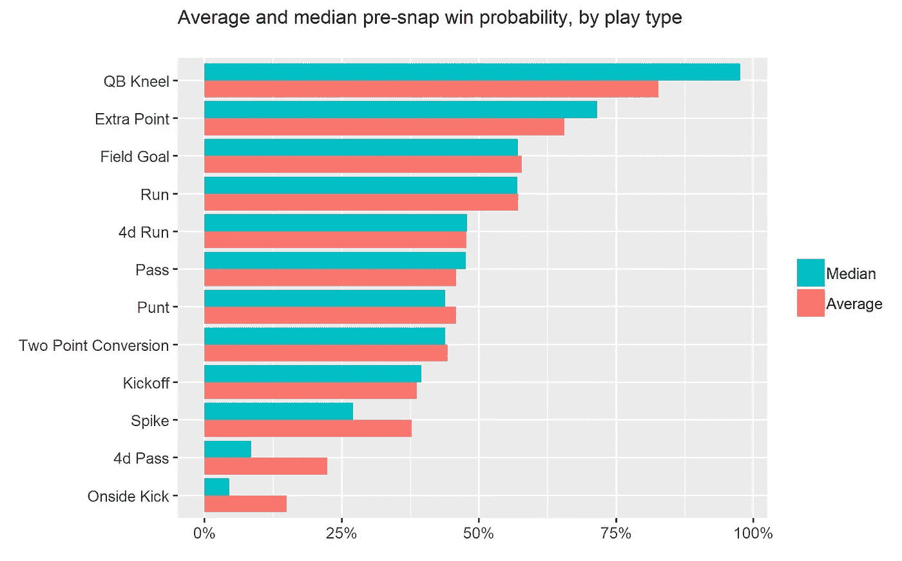*

*因此，数据告诉我们，当涉及到比赛叫牌时，教练有一些奇怪的倾向，至少在赛前获胜概率的背景下是如此。但也许还有其他的情境因素影响着他们所谓的戏剧类型，而这些戏剧在当时是最有意义的。*

*为了分析这是否是真的，我建立了一个分类模型，该模型只包含一些变量，以了解 NFL 中“可预测”的比赛召唤实际上是多少。从那里，我研究了多少可预测性如何影响胜利的可能性，以及不可预测性对每场比赛的平均和整体影响。*

*我不打算进入我如何建立分类模型的细节(或其他技术的许多细节——你可以随时查看代码或[在 Twitter](https://twitter.com/davisj2007) 上联系我)，但我想让模型尽可能“天真”——这意味着我没有让模型暴露尽可能多的信息。也就是说，我没有让模特知道谁在和谁比赛，也没有让模特知道赛季的星期。这些都是可以提高准确性的变量，但是我不希望个别球队和/或赛季动态压倒比赛召唤的情境方面。*

*也就是说，我在 2009 年至 2018 年的逐场比赛数据样本上训练了我的模型，并在同一时期随机抽取的样本上进行了测试。模型中包括的特征描述了比赛的预扣分情况— **击倒、距离、场上位置、剩余时间、比分差距、预扣分获胜概率和各种预期得分结果**(即下一次得分比赛的可能性)。我也控制了季节。*

*该模型表明，NFL 中的比赛呼叫是令人惊讶地可预测的——该模型在训练和测试集中正确地“呼叫”了大约 77%的比赛(参见代码以了解其他度量，如精度、kappa 等)。正如你在下面的混淆矩阵中看到的，这个模型在预测什么样的打法会被叫牌上没有太大的困难，只是在跑动和传球上有点混淆。如果我给出了有关团队参与的模型信息或其他更广泛的战术风格的历史特征，这可能会得到澄清。*

*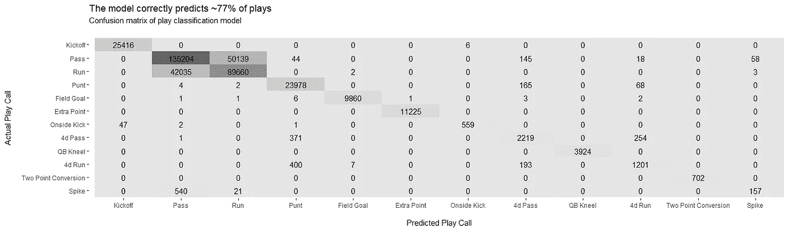*

*现在我们有了广义的“可预测性”，我们可以检查哪些团队比“平均水平”更可预测或更不可预测在分析的时间段内，新英格兰队是最难预测的球队之一，这并不令人惊讶:*

*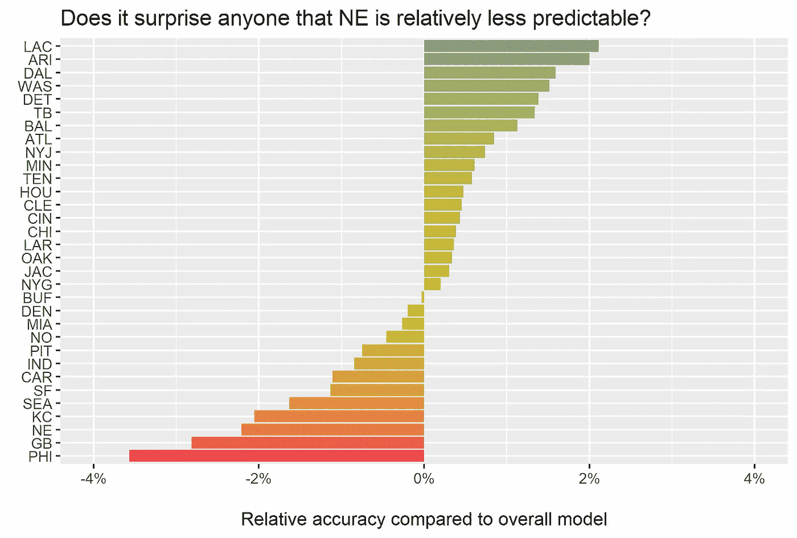*

*这张图表显示，该模型正确地预测了充电器在 2009 年至 2018 年期间播放的所有戏剧中的近 80%，这还没有提到克拉伦斯·谢尔蒙、哈尔·亨特、肯·惠森杭特、弗兰克·赖克。虽然这并不完全相关，但在这个时间段内普遍成功的团队聚集在图表中不太可预测的一侧。*

*这种相关性很有趣，部分原因是很难在 NFL 保持几年以上的好成绩，还因为该模型考虑了每一场比赛——这张图表只是从总体上考察了“可预测性”。那么每场比赛的可预测性是如何影响输赢的呢？*

*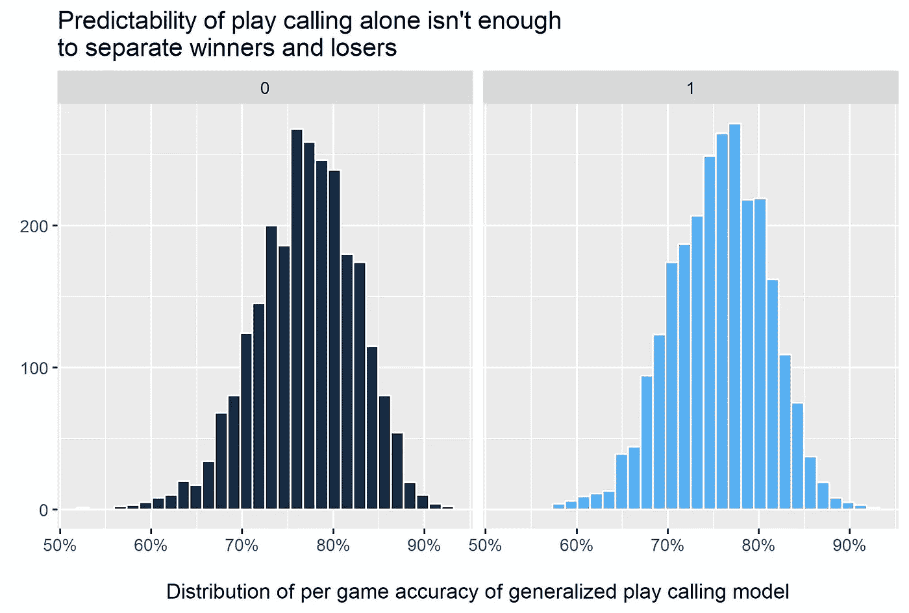*

*第一步只是看看每场比赛的可预测性有多分散。在左边，我按游戏绘制了广义分类模型的准确性，区分了输和赢(灰色= 0 =输，蓝色= 1 =赢)。该模型是全面可靠的，几乎在每场比赛中都预测了超过 60%的吹罚，并且在一些比赛中接近 95%是正确的。但是正如你从上面直方图相似的形状和高度可以看到的，仅仅是可预测性并不能很好的区分成功和失败。这表明，有一些潜在的变量可以更好地区分成败，团队质量是最明显的一个。*

*考虑到这一点，我想在控制团队实力的同时，模拟出每场比赛的可预测性对输赢的影响。通过使用可预测性和团队来拟合每场比赛结果的 [logit 模型](https://en.wikipedia.org/wiki/Logistic_regression)，我们可以做到这一点。而且结果很有意思！*

*首先要注意的是，仅仅使用团队、可预测性和一个简单的模型，我们就可以相当准确地从输家中挑选赢家。左侧的图表是一个混淆表，显示了模型的校准统计数据(基本上，如果我们分配 10 个团队有 70%的获胜机会，那么从长远来看，7 个团队应该会获胜——这与您应该如何测量天气预报的准确性类似)。在右边，我们可以看到一旦我们控制了整个团队的力量，可预测性是如何影响胜利的可能性的。基本上，你的叫牌越不可预测，你赢得比赛的可能性就越大(某人，请将这篇文章发给 [Randy Fichtner](https://en.wikipedia.org/wiki/Randy_Fichtner) )。*

*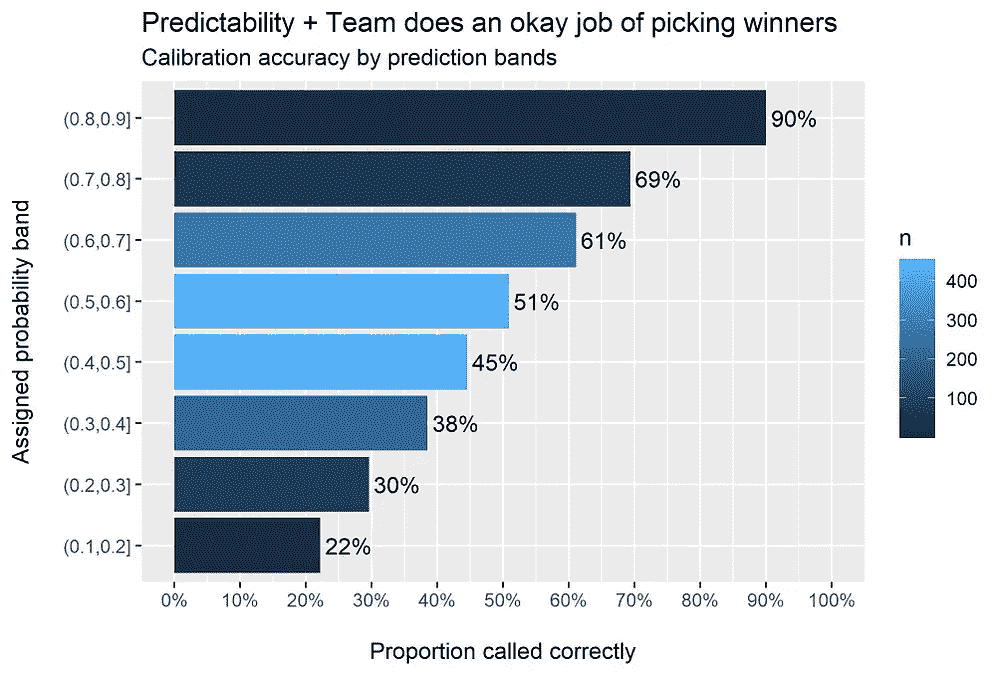**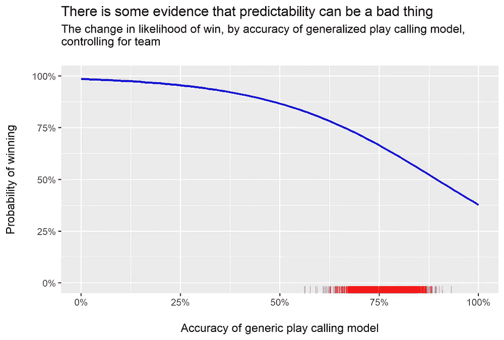*

*所以结论是…在你的叫牌中少一些可预测性，你就能赢得比赛。对吗？*

*不完全是。这项分析之前的一切主要集中在 NFL 的比赛召唤是否是普遍可预测的。它**没有检查正在被调用的戏剧是好是坏**。毕竟，如果教练已经在优化他们的战术选择，那么可预测性可能是好的。这种分析并没有深入到*中*的比赛实际上叫什么，场上有什么人员，以及一个团队执行得有多好。但我们可以大致估计，当其他教练转向时，转向是否有价值。*

*为了做到这一点，我使用了另一个我喜欢的叫做胜利概率的指标。基本上，你在比赛开始前测量一个队获胜的可能性，然后在比赛结束后再次测量这个可能性。这两个概率的差异是该游戏在促成胜利方面的成功或不成功程度(增加的胜利概率可以是负的，只是你在你的起始位置“增加”了一个负值)。*

*我们可以使用观察到的 WPA 来创建一个 eWPA 模型，或按游戏类型创建预期的 WPA。然后，我们针对模型“称之为”错误的打法，将实际的 WPA 与 eWPA 进行比较，因为这些打法是教练偏离他们的平均水平的打法。然后，我们可以看到当他们偏离时团队的效率如何，以及这在整个赛季中对他们团队的帮助有多大。*

*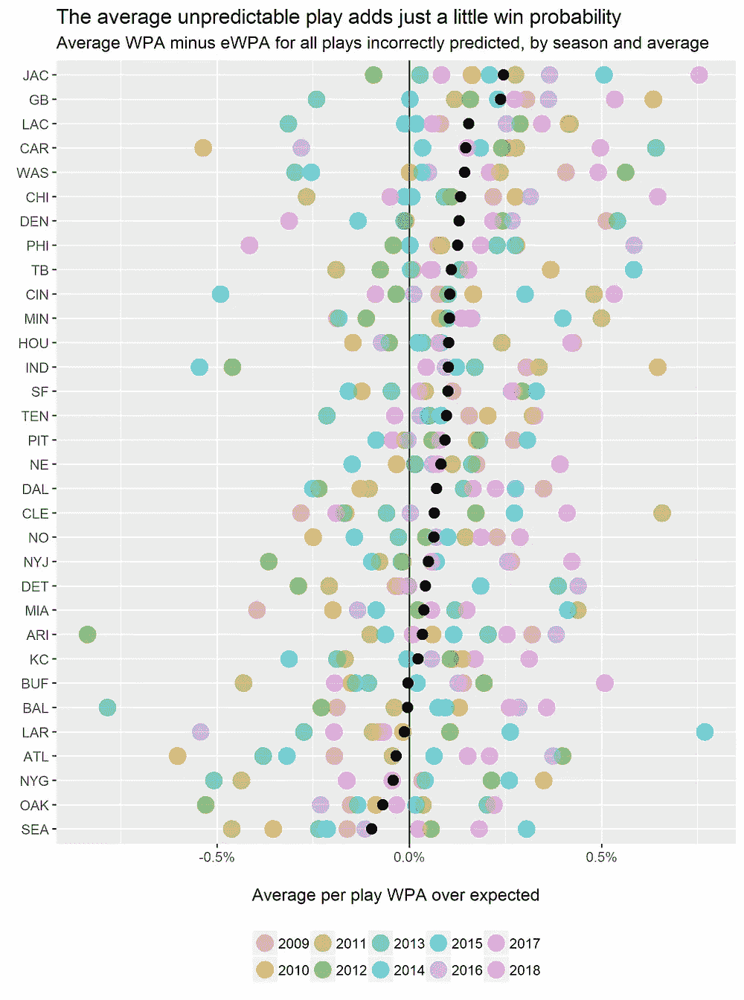**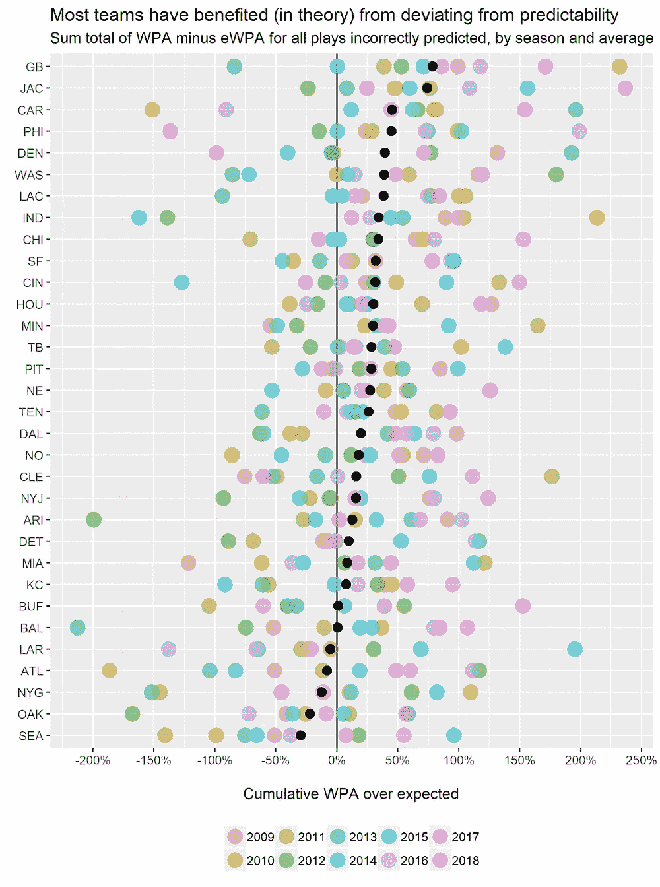*

*正如你从上面的图表中看到的，有一些证据表明，偏离预期的行动号召会增加一个团队获胜的几率。在每场比赛的基础上，一场意想不到的比赛**价值约 0.07%的额外 WPA** 跨越团队赛季。这听起来可能不多，但是整个赛季加起来，平均每个队加起来有 21%的获胜概率**。只有 5 支队伍在曲折前进而不是曲折前进时产生的 WPA 比预期的少。这就是大多数球队都在跑的时候球队应该投球的决定性证据吗？不一定。但是*有一些*统计证据表明 NFL 的比赛召唤是次优的。我不是第一个得出这个结论的分析师(或粉丝)。***

*无论是哪种情况，我希望你喜欢这次对 NFL 比赛召唤倾向的深入研究，以及如何将高级分析技术应用于比赛数据可以产生一些有趣的见解。现在，我们需要做的就是让教练在他们预计会输的时候停止踢皮球…*