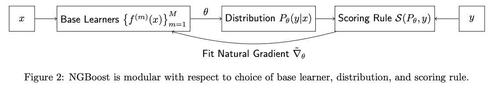
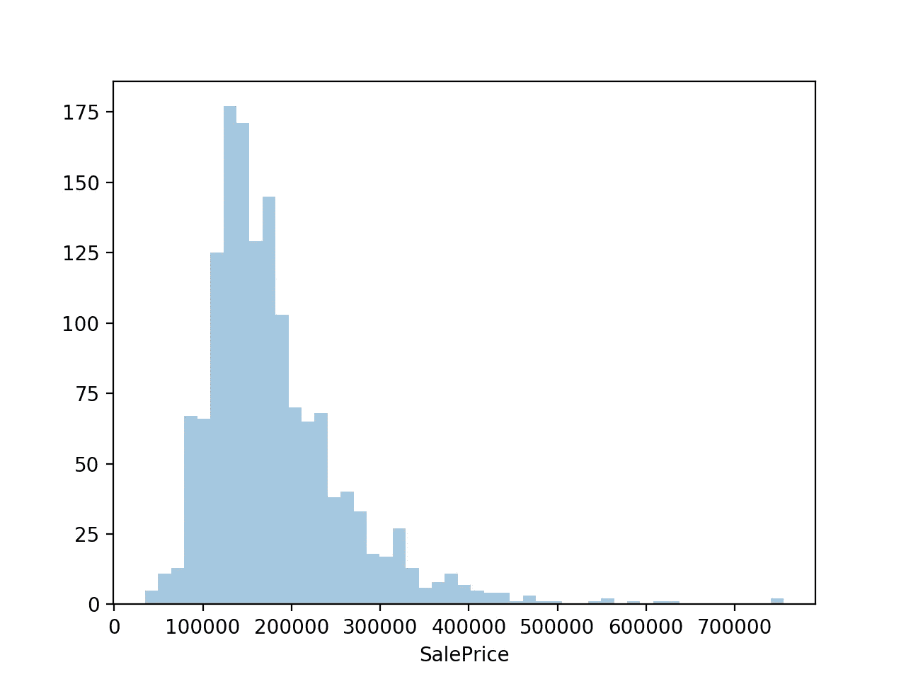
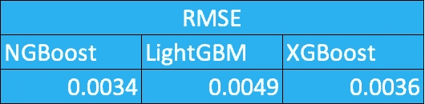
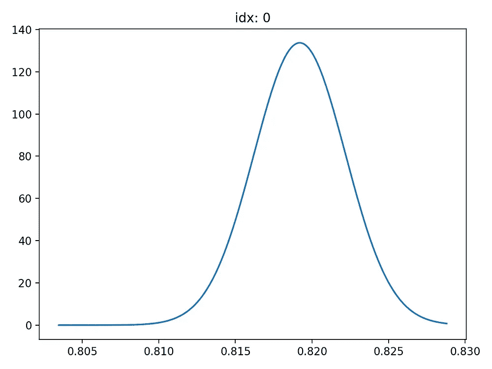
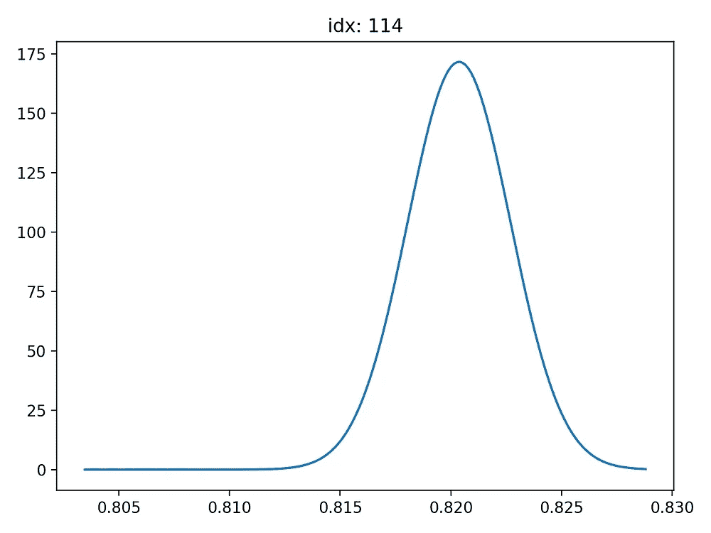

# NGBoost 解释道

> 原文：<https://towardsdatascience.com/ngboost-explained-comparison-to-lightgbm-and-xgboost-fda510903e53?source=collection_archive---------4----------------------->

## [现实世界中的数据科学](https://towardsdatascience.com/data-science-in-the-real-world/home)

## 与 LightGBM 和 XGBoost 的比较


Photo by [James Pond](https://unsplash.com/@jamesponddotco?utm_source=medium&utm_medium=referral) on [Unsplash](https://unsplash.com?utm_source=medium&utm_medium=referral)

[Stanford ML Group](https://stanfordmlgroup.github.io/projects/ngboost/) 最近在他们的[论文](https://arxiv.org/abs/1910.03225)，【1】Duan et al .，2019 及其[实现](https://github.com/stanfordmlgroup/ngboost)中公布了一种新算法，名为 NGBoost。该算法通过使用**自然梯度**将不确定性估计包括到梯度增强中。本文试图理解这种新算法，并与其他流行的 boosting 算法 LightGBM 和 XGboost 进行比较，看看它在实践中是如何工作的。

# 内容

1.  **什么是自然渐变增强？**
2.  **经验验证—与 LightGBM 和 XGBoost 的比较**
3.  **结论**

1.  **什么是自然渐变增强？**

正如我在简介中所写的，NGBoost 是一种新的提升算法，它使用自然梯度提升，这是一种用于概率预测的模块化提升算法。该算法由**基本学习器**、**参数概率分布**和**评分规则**组成。我将简要解释这些术语是什么。



From the paper, Duan, et at., 2019

*   **基础学习者**

该算法使用基础(弱)学习器。它采用输入 *x* ，输出用于形成条件概率。那些基础学习者对树学习者使用 scikit-learn 的决策树，对线性学习者使用岭回归。

*   **参数概率分布**

参数概率分布是一种条件分布。这由基础学习者输出的附加组合形成。

*   **评分规则**

评分规则采用预测的概率分布和对目标特征的一次观察来为预测评分，其中结果的真实分布在预期中获得最佳评分。该算法使用最大似然估计或 CRPS。

我们刚刚学习了 NGBoost 的基本概念。我绝对推荐你阅读原文进一步理解(有数学符号的算法更容易理解)。

**2。经验验证—与 LightGBM 和 XGBoost 的比较**


Photo by [billy lee](https://unsplash.com/@billy2000?utm_source=medium&utm_medium=referral) on [Unsplash](https://unsplash.com?utm_source=medium&utm_medium=referral)

让我们实现 NGBoost，看看它的性能如何。原论文也在各种数据集上做了一些实验。他们比较了 MC dropout、Deep Ensembles 和 NGBoost 在回归问题中的表现，NGBoost 显示了其极具竞争力的性能。在这篇博文中，我想展示一下模型在 Kaggle 上著名的[房价预测数据集](https://www.kaggle.com/c/house-prices-advanced-regression-techniques/data)上的表现。该数据集由 81 个要素、1460 行组成，目标要素是销售价格。让我们看看 NGBoost 可以处理这些情况。



Distribution of the target feature

由于测试算法的性能是这篇文章的目的，我们将跳过整个特征工程部分，将使用那那西的[解决方案](https://www.kaggle.com/jesucristo/1-house-prices-solution-top-1)。

导入包；

```
# import packages
import pandas as pdfrom ngboost.ngboost import NGBoost
from ngboost.learners import default_tree_learner
from ngboost.distns import Normal
from ngboost.scores import MLEimport lightgbm as lgbimport xgboost as xgbfrom sklearn.model_selection import train_test_split
from sklearn.metrics import mean_squared_error
from math import sqrt
```

这里我将使用上面的默认学习者、分布和评分规则。用这些东西来玩会很有趣，看看结果会有什么变化。

```
# read the dataset
df = pd.read_csv('~/train.csv')# feature engineering
tr, te = Nanashi_solution(df)
```

现在用 NGBoost 算法预测。

```
# NGBoost
ngb = NGBoost(Base=default_tree_learner, Dist=Normal, Score=MLE(), natural_gradient=True,verbose=False)ngboost = ngb.fit(np.asarray(tr.drop(['SalePrice'],1)), np.asarray(tr.SalePrice))y_pred_ngb = pd.DataFrame(ngb.predict(te.drop(['SalePrice'],1)))
```

对 LightGBM 和 XGBoost 进行同样的操作。

```
# LightGBM
ltr = lgb.Dataset(tr.drop(['SalePrice'],1),label=tr['SalePrice'])param = {
'bagging_freq': 5,
'bagging_fraction': 0.6,
'bagging_seed': 123,
'boost_from_average':'false',
'boost': 'gbdt',
'feature_fraction': 0.3,
'learning_rate': .01,
'max_depth': 3,
'metric':'rmse',
'min_data_in_leaf': 128,
'min_sum_hessian_in_leaf': 8,
'num_leaves': 128,
'num_threads': 8,
'tree_learner': 'serial',
'objective': 'regression',
'verbosity': -1,
'random_state':123,
'max_bin': 8,
'early_stopping_round':100
}lgbm = lgb.train(param,ltr,num_boost_round=10000,valid_sets=[(ltr)],verbose_eval=1000)y_pred_lgb = lgbm.predict(te.drop(['SalePrice'],1))
y_pred_lgb = np.where(y_pred>=.25,1,0)# XGBoost
params = {'max_depth': 4, 'eta': 0.01, 'objective':'reg:squarederror', 'eval_metric':['rmse'],'booster':'gbtree', 'verbosity':0,'sample_type':'weighted','max_delta_step':4, 'subsample':.5, 'min_child_weight':100,'early_stopping_round':50}dtr, dte = xgb.DMatrix(tr.drop(['SalePrice'],1),label=tr.SalePrice), xgb.DMatrix(te.drop(['SalePrice'],1),label=te.SalePrice)num_round = 5000
xgbst = xgb.train(params,dtr,num_round,verbose_eval=500)y_pred_xgb = xgbst.predict(dte)
```

现在我们有了所有算法的预测。让我们检查一下准确性。我们将使用与这次卡格尔比赛相同的标准，RMSE。

```
# Check the results
print('RMSE: NGBoost', round(sqrt(mean_squared_error(X_val.SalePrice,y_pred_ngb)),4))
print('RMSE: LGBM', round(sqrt(mean_squared_error(X_val.SalePrice,y_pred_lgbm)),4))
print('RMSE: XGBoost', round(sqrt(mean_squared_error(X_val.SalePrice,y_pred_xgb)),4))
```

以下是预测结果汇总。



Summary of the results

看起来 NGBoost 胜过了其他著名的 boosting 算法。平心而论，我感觉如果调一下 BGBoost 的参数，会更好。

NGBoost 与其他 boosting 算法的最大区别之一是可以返回每个预测的概率分布。这可以通过使用 ***pred_dist*** 函数来可视化。该功能能够显示概率预测的结果。

```
# see the probability distributions by visualising
Y_dists = ngb.pred_dist(X_val.drop(['SalePrice'],1))
y_range = np.linspace(min(X_val.SalePrice), max(X_val.SalePrice), 200)
dist_values = Y_dists.pdf(y_range).transpose()# plot index 0 and 114
idx = 114
plt.plot(y_range,dist_values[idx])
plt.title(f"idx: {idx}")
plt.tight_layout()
plt.show()
```



Probability distribution examples

上面的图是每个预测的概率分布。x 轴显示销售价格的对数值(目标特征)。我们可以观察到，索引 0 的概率分布比索引 114 更宽。

**4。结论和想法**

从实验结果来看，NGBoost 和其他著名的 boosting 算法一样好。然而，计算时间比其他两种算法要长得多。这可以通过使用二次抽样方法来改善。此外，我有一个印象，NGBoost 包仍在进行中，例如没有提前停止选项，没有显示中间结果的选项，选择基础学习者的灵活性(到目前为止，我们只能在决策树和岭回归之间选择)，设置随机状态种子，等等。我相信这几点很快就会落实。或者你可以为项目做贡献:)

你也可以在我的 [GitHub 页面](https://github.com/kyosek/NGBoost-experiments)上找到我在这篇文章中使用的代码。

# 包裹

*   NGBoost 是一种新的 boosting 算法，它返回概率分布。
*   自然梯度推进，一种用于*概率预测*的模块化推进算法。这由**基本学习器**、**参数概率分布**和 S **取芯规则**组成。
*   NGBoost 预测与其他流行的 boosting 算法相比具有很强的竞争力。

如果你觉得这个故事有帮助，有趣或什么的，或者如果你有任何问题，反馈或字面上的任何东西，请随时在下面留下评论:)我真的很感激。还有，你可以在 [LinkedIn](https://www.linkedin.com/in/kyosuke-morita-58329286/) 上找到我。

# 参考:

[1] T. Duan 等， [NGBoost:概率预测的自然梯度推进](https://www.semanticscholar.org/paper/NGBoost%3A-Natural-Gradient-Boosting-for-Prediction-Duan-Avati/3b432eea984904c926e2d6cc4dc2b70753499ca5) (2019)，ArXiv 1910.03225