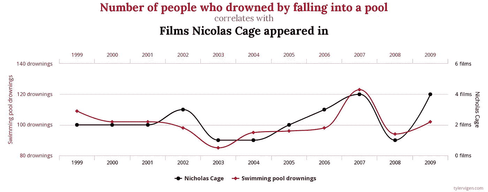
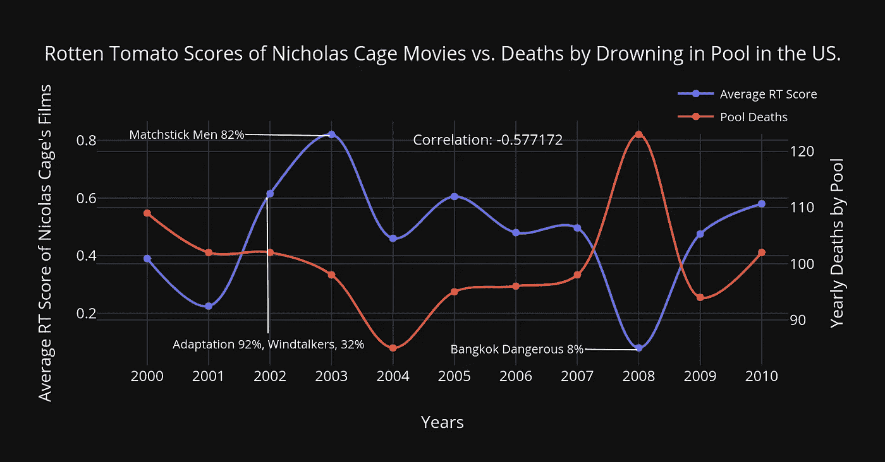

# 尼古拉斯·凯奇——虚假的泳池救星？

> 原文：<https://towardsdatascience.com/nicholas-cage-pool-saviour-9c13feafff6f?source=collection_archive---------17----------------------->

Photo by [Brooklyn Morgan](https://unsplash.com/@brooklynmorgan?utm_source=unsplash&utm_medium=referral&utm_content=creditCopyText) on [Unsplash](https://unsplash.com/s/photos/pool?utm_source=unsplash&utm_medium=referral&utm_content=creditCopyText)

## 测试虚假的相关性

好吧，我坦率地告诉你，我不完全确定我在这里发现了什么。不知何故，我觉得在我周末做的这个有点仓促的分析背后有一个秘密的意义。不知何故，在某个地方，电影中尼古拉斯·凯奇的魔力并不局限于我的内心深处，但事实上，就像标题图片中尼古拉斯·凯奇在 Con Air 的华丽鬃毛一样，他涵盖了整个世界。让我们来看看我可能不应该做的事情。如果你想跳到精彩的部分，你要找的图表就在页面的一半，非常有趣。

# 好吧，我们从头开始…

在你漫游互联网的时候，你可能会碰到这个有趣的图表。

from: [http://tylervigen.com](http://tylervigen.com/)

这个图表和其他类似的 tylervigen.com 图表的目的是教育人们相信相关性等于因果关系的谬论。现在，虽然尼古拉斯·凯奇出演的电影数量和掉进游泳池淹死的人数之间看起来确实有关系，但我们知道事实并非如此。

然而，作为尼古拉斯·凯奇的超级粉丝，我相信除了这种简单的关联，也许还有更多证据。如果我们尝试针对我们的池数据设置一组不同的 Nicholas Cage 相关数据会怎么样？我们能找到相关性吗？更好的是，我们会发现负相关吗？我们会发现尼古拉斯·凯奇和他辉煌的电影生涯减少了溺死在泳池中的人数吗？我必须弄清楚。

# 传奇开始了…

最明显的地方开始检查尼古拉斯凯奇效应对我们的泳池溺水数据将是看他的电影质量。也就是好的尼古拉斯凯奇电影有助于减少泳池死亡吗？为此，我前往烂番茄，去看看老好人尼克的职业生涯。匆匆一瞥，他的职业生涯跨越了令人印象深刻的 38 年，有 100 多部电影值得称赞。它们各不相同，从热门的《T2 离开拉斯韦加斯》到票房炸弹的《T4》《幽灵骑士》……以及它的续集(*)说真的，我喜欢这个家伙，但是谁会为此买单呢？！* ) *。*

A sample of the data we will be using.

因此，在使用美丽的汤进行了一些轻微的网络搜索之后(*对不起，烂番茄，这是为了更大的利益！我现在自豪地拥有尼古拉斯·凯奇的分级电影记录。下一步是清理数据。我想特别针对尼古拉斯·凯奇不仅仅是制片人、导演或任何其他职位的电影。我觉得最好的成功指标是尼古拉斯·凯奇出现在屏幕上的电影，或贡献出他独特的声音和措辞，历史上曾让观众高兴。所以再见了*大卫·盖尔的一生* ( *不知道他是制片人*)，再见了*吸血鬼的影子* ( *真的？太酷了！我需要尼古拉斯凯奇这个传奇人物！**

接下来，我想清除没有分数的电影。这些电影要么是凯奇参演但从未公映的，要么是公映后从未评论的。前者的优势更大。我确实遇到了一个异常情况，由艾迪·墨菲主演的《一千个字》，它在评论家中的评分为 0%，但幸运的是，凯奇只被认为是这部电影的制片人，所以我们可以安全地删除它。

Admit it, you’re going to watch it for its 0% rating. So bad its good?

最后，为了对我们的数据进行排序，我们使用一个 Pandas groupby 命令来计算每年的平均分数。这将有助于把我们的分数和溺水数据联系起来。最后的结果？非常令人满意。

# 你们期待已久的时刻

这不是很神奇吗？？现在，我坦率地承认，我在这里做了另一个虚假的相关图，但很难抗拒真正看看这个，并得出一些有趣的结论，当然都是虚假的。

例如，2003-2005 年是尼古拉斯·凯奇最好的几年。2003 年*火柴人*问世，2004 年*国宝、战争之王、*和*天气预报员*紧随其后。这些是尼古拉斯·凯奇最具代表性的电影，非常成功，我们看到这些年溺水死亡人数呈稳步下降趋势。从 2006 年开始，事情开始变得有点疯狂，一开始是评价很高的《世界贸易中心》，T19 但以无限记忆的《柳条人》，结束，我们看到尼古拉斯·凯奇穿着熊装，打了一个穿得像 18 世纪定居者的女人。

随着 2007 年《幽灵骑士》(T0)、Next、和*国宝 2* 的上映，事情开始失去控制，只有他在罗伯特·罗德里格兹 *GrindHouse 的短暂露面才挽救了局面。*2008 年，集体“不良”终于达到顶点，凯奇最差的电影(在这个例子中为*),曼谷危险*，泳池死亡人数上升到 123 人。最后，还有一个有趣的负相关性-0.577172。这不是最好的，但比我预期的要高很多，虽然真的比我希望的要低。

最后，出于好玩，我使用 statsmodel 的 OLS 对模型进行了简单的线性回归，得出了以下结果:

我们的 R 值很低，我更喜欢 0.6 到 0.7 的值，这有助于证明尼古拉斯·凯奇是我们的精神生命卫士。这个数据中一个有趣的数字是位于 OLS 汇总中间的系数。它基本上表明，在一定程度的误差下，尼古拉斯·凯奇的电影每得一分，泳池溺水人数每年下降 0.0119 人，这多少有助于我们的案例。

# 最终结论

好了，完成了，但是即使我没有得到我想要的相关性或因果关系，结果仍然很有趣。我不禁认为，尼古拉斯·凯奇的两组数据显示了溺水死亡与泳池死亡之间的关系，这两者之间没有什么关联。阻碍我的一件事是缺乏更多关于泳池溺水死亡的数据。疾病预防控制中心对溺水死亡有非常广泛的分类，我无法确定哪些是在游泳池中，哪些是在其他类型的水体中。数据的原始来源是涵盖 1999 年至 2009 年的一次完成周报。也许另一个将于 2009-2019 年发布。有了更多的数据，也许我能找到更强的关系。毕竟，我们知道尼古拉斯·凯奇的职业生涯出现了戏剧性的下滑，我不禁想知道泳池死亡人数的上升是否与他的职业生涯相关。也许我的下一个笼子分析将围绕票房回报和池死亡。原因可能在于尼古拉斯·凯奇的票房吸引力，即人们正在观看他的电影并远离游泳池吗？只有进一步的分析才能告诉我们！最后，我想我只能说，银幕传奇尼古拉斯·凯奇与泳池安全有关！还有，松露猪的新电影？绝对看那个！

*此分析的所有代码可在我的* [*Github*](https://github.com/hamiltonchangcodes/the_nicholas_cage_project.git) 上获得

## 来源:

 [## 尼古拉斯·凯奇

### 尼古拉斯凯奇名人简介-查看最新的尼古拉斯凯奇照片库，传记，照片，图片…

www.rottentomatoes.com](https://www.rottentomatoes.com/celebrity/nicolas_cage)  [## 15 件相互关联的疯狂事情

### 为什么这些事情相互关联？这 15 个相关性会让你大吃一惊。(这个标题够煽情吗……

tylervigen.com](http://tylervigen.com/spurious-correlations) 

在 LinkedIn 上与我联系！

 [## 汉密尔顿·张，CRPC·CSPO-熨斗学校-纽约，纽约| LinkedIn

### 具有财务规划背景的数据科学家和机器学习工程师。我有专家级的知识…

www.linkedin.com](https://www.linkedin.com/in/hamilton-chang-crpc%C2%AE/)