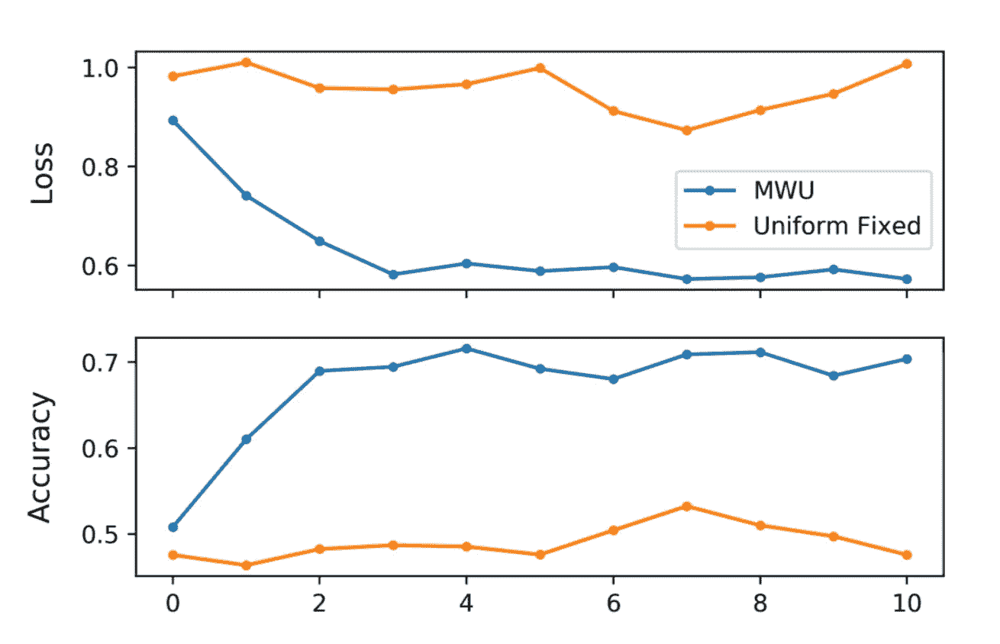

# NIPS 2018 年关于“金融风险稳健分类”的论文——摘要

> 原文：<https://towardsdatascience.com/nips-2018-paper-on-robust-classification-of-financial-risk-summary-93445019d4f0?source=collection_archive---------18----------------------->

在这篇短文中，我将概述一篇名为[“金融风险稳健分类”](https://arxiv.org/abs/1811.11079)的研究论文。该论文被 [NIPS 2018](https://nips.cc/Conferences/2018) 关于*“人工智能在金融服务中的挑战和机遇”*的研讨会接受，旨在解决使用深度学习模型进行信贷借贷时出现的非常有趣和独特的问题。

# 概观

## 作者

这篇论文是由哈佛大学的 4 名计算机科学家撰写的。

## 出版

[论文](https://arxiv.org/abs/1811.11079)于 2018 年 11 月 27 日发布，是 NIPS 2018 年关于*“人工智能在金融服务中的挑战和机遇”*研讨会的一部分。

## 问题

已经观察到，输入数据的微小变化可以显著改变机器学习模型的结果。当试图在现实世界的系统中部署这种模型时，这带来了挑战，特别是在金融服务中，因为它允许精心构造的输入“愚弄”模型做出错误的决策。

## 解决办法

作者旨在使用*“鲁棒优化算法”*解决该问题，该算法增强了神经网络模型，以关注产生更高分类损失的变化(扰动)。

## 结果

通过比较两个神经网络之间的准确性和损失来进行评估。两个模型使用相同的底层结构(4 层，每层具有相同数量的单元和激活)，但其中一个还使用了*“鲁棒优化算法】*。结果直接取自论文:

Credits to the authors of “Robust Classification of Financial Risk”

如您所见，损耗从 1.0 下降到 0.6，准确度从 50%提高到 70%。

## 书面演练

这项研究旨在回答这两个问题:

1.  *输入数据的微小扰动会导致错误分类吗？*
2.  *稳健分类能否帮助金融服务中使用的机器学习模型在扰动的例子上表现更好？*

该分析是在一个[数据集上进行的，该数据集包括从 LendingClub](https://www.lendingclub.com/info/download-data.action) (一个点对点借贷平台)获得的 421，095 份申请的借贷数据。作者使用了 4 种类型的扰动(输入数据的变化),包括:

*   *快速梯度符号法(FGSM)* —在损失函数相对于输入的梯度方向上扰动输入。换句话说，该方法将 [*符号*](https://en.wikipedia.org/wiki/Sign_function) 函数应用于梯度，以确定输入应该朝哪个方向(正、负或零)变化。每次变化的大小由常数 *e* 决定。更多细节，参见论文中的*第 2.2 节*并浏览这篇[伟大的张量流教程。](https://www.tensorflow.org/beta/tutorials/generative/adversarial_fgsm)
*   *预计梯度下降*——与 FGSM 相同，但使用与其*符号*值相反的实际梯度。
*   *基于雅可比矩阵的显著性映射攻击* —扰动对损失函数影响最大的输入。
*   *最大显著性攻击* —以设定的百分比增加或减少来单独扰动每个特征，并找出这些特征中哪一个产生最高的成功误分类率。之后，作者选取其中一两个受影响最大的特征，用一个固定的百分比变化来干扰它们。

*注意:“扰动”是输入中的一种变化，这种变化对人类来说可能是微小的或不明显的，但实际上却使网络误分类，产生巨大的误差。*

回到问题 1，作者指出:

> 我们首先表明，在我们高精度贷款等级预测模型上的小扰动是成功的，每个特征 1.3%的平均扰动导致 95%输入的错误分类。

该模型是一个神经网络，具有大小为 100 和 60 的两个密集的 *ReLU* 层，使用 0.2 的漏失和具有 7 种可能结果的最终 *softmax* 层。结果的数量是根据数据确定的——lending club 使用一种信用系统，给任何候选人分配 A-G 的分数。

对于第二个问题，作者使用***鲁棒优化算法，该算法通过识别哪些扰动具有高分类损失来增强网络，并且在训练期间更加关注那些扰动类型。***

*您在上面看到的结果是在训练神经网络和使用*“鲁棒优化算法”*的网络之后获得的，训练集在每次迭代中对扰动类型具有固定的均匀分布。*

**换句话说，在每个训练步骤中，作者均匀地随机挑选一个数据集，其中应用了四种扰动类型中的一种。**

*正如您所看到的，所提出的优化算法具有显著的效果。有关该算法如何工作的更多细节，请阅读论文中的第 2.3 节。*

# *关键要点*

*下面列出了论文中发现的一些有用的观点:*

*   *深度学习模型容易受到使用敌对输入的攻击。一个这样的例子是信用风险评估，其中抵御这种攻击的鲁棒性是必不可少的。*
*   *类似于本文中应用的算法可以增强现有的模型，以识别这种错误分类。*
*   *有用的资源是 LendingClub 数据集，其中包括数千名候选人的贷款数据。*

# *谢谢你的阅读。希望你喜欢这篇文章🤩我祝你今天过得愉快！*