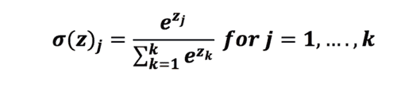
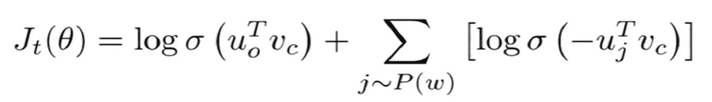
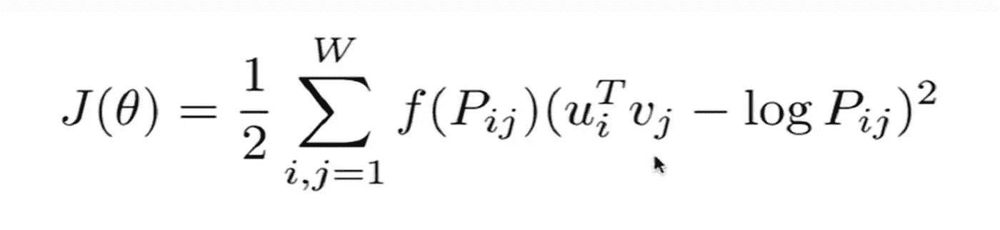

# NLP 102:阴性取样和手套

> 原文：<https://towardsdatascience.com/nlp-101-negative-sampling-and-glove-936c88f3bc68?source=collection_archive---------3----------------------->

## 让 Word2Vec 变得越来越好。

Photo by [Joshua Sortino](https://unsplash.com/@sortino?utm_source=medium&utm_medium=referral) on [Unsplash](https://unsplash.com?utm_source=medium&utm_medium=referral)

从语料库中生成高质量单词嵌入的一种方法是使用 [Word2Vec — CBOW 或 Skip-gram 模型](/nlp-101-word2vec-skip-gram-and-cbow-93512ee24314)。这两种模式有一些共同点:

*   训练样本由一对基于出现的接近度选择的单词组成。
*   网络的最后一层是 softmax 函数。

## CBoW/Skip-gram 的问题

首先，对于每个训练样本，**只有对应于目标词的权重可能得到显著更新**。在训练神经网络模型时，在每次反向传播过程中，我们都尝试更新隐藏层中的所有权重。对应于非目标单词的权重将接收到微小的变化或根本没有变化，即在每一遍中，我们仅进行非常稀疏的更新。

其次，对于每一个训练样本，**使用 softmax 计算最终概率是一个非常昂贵的操作**，因为它涉及对我们词汇表中所有单词的分数求和以进行标准化。

The softmax function.

因此，对于每个训练样本，我们执行一个昂贵的操作来计算单词的概率，这些单词的权重甚至可能不会更新，或者更新得如此之少，以至于不值得额外的开销。

为了克服这两个问题，我们尝试减少为每个训练样本更新的权重数量，而不是强行创建训练样本。

# 负采样

负采样**允许我们只修改一小部分权重，而不是每个训练样本的所有权重**。我们通过稍微修改我们的问题来做到这一点。我们不是试图预测词汇表中所有单词的邻近单词的概率，而是试图预测我们的训练样本单词是否是邻近单词的概率。参考我们之前的例子(*桔子*，*果汁*)，我们并不试图预测果汁成为邻近词的概率，即 P( *果汁* | *桔子*)，我们试图通过计算 P(1| < *桔子*，*果汁*)来预测(*桔子*，*果汁*)是否是邻近词

因此，我们现在已经把它变成了 10，000 个二进制分类问题，而不是一个巨大的 soft max——在 10，000 个类别中分类。

我们通过随机选择少量“负面”词*(一个超参数，假设为 5)来更新权重，从而进一步简化问题。(在这种情况下,“否定”单词是我们希望网络输出 0 的单词)。*

*对于我们的训练样本(*橘子*，*果汁*，我们将取五个词，说*苹果*，*晚餐*，*狗*，*椅子，房子*作为负样本。对于这个特定的迭代，我们将只计算*果汁、苹果、晚餐、狗、椅子、房子的概率。*因此，损失将只为它们传播回来，因此只有对应于它们的权重将被更新。*

## *目标函数*

**

*Overall Objective function in Skip-gram and Negative Sampling. Here sigmoid = 1/(1+exp(x)), t is the time step and theta are the various variables at that time step, all the U and V vectors.*

***第一项试图最大化位于上下文窗口中的实际单词的出现概率，**即它们共现。而第二项，**试图迭代一些不在窗口中的随机单词 *j* ，并最小化它们同现的概率**。*

*我们根据随机单词出现的频率对它们进行采样。P(w) = U(w)的 3/4 次方，其中 U(w)是一个[单图](https://en.wikipedia.org/wiki/N-gram)分布。3/4 次幂使得不太频繁的单词被更频繁地采样，如果没有它，采样诸如“The”、“is”等频繁单词的概率将比诸如“斑马”、“大象”等单词高得多。*

*在我们上面提到的例子中，我们试图最大化概率 P(1| <*桔子*，*果汁* >)和最大化(因为在我们的目标函数中它前面有一个负号，所以当我们将选择最大值时，我们将鼓励它们不要发生)我们的负样本的概率 P(1| < *桔子，苹果* >)，P(1| < *桔子，晚餐* >)，P(1*

*对于大型数据集，选择一个小的值 *k* ，大约在 2 到 5 之间。而对于较小的数据集，相对较大的值是优选的，大约 5 到 20。*

# *子采样*

*语料库中单词的分布是不均匀的。有些词比另一些词出现得更频繁。诸如“the”“is”“are”等词出现得如此频繁，以至于在训练模型时省略一些实例不会影响其最终嵌入。此外，它们的大多数出现并没有告诉我们它的上下文含义。*

*在二次抽样中，我们通过限制样本出现的频率来限制一个词的样本数量。对于频繁出现的单词，我们会删除一些作为相邻单词和输入单词的实例。*

# *性能考虑因素*

*在多 CPU 机器上使用并行训练可以显著减少 word2Vec 的训练时间。超参数的选择对性能(速度和精度)至关重要，但不同的应用会有所不同。要做出的主要选择是:*

*   ****架构*** : skip-gram(较慢，对不常用词更好)vs CBOW(快)。*
*   ****训练算法*** :分级 softmax(对不常用词更好)vs 负采样(对常用词更好，对低维向量更好)。*
*   **常用词的子采样:可以提高大型数据集的精度和速度(有用值在 1e-3 到 1e-5 范围内)。**
*   *****词向量的维度*** :通常越多越好，但也不尽然。**
*   *****上下文(窗口)大小*** :对于 skip-gram 通常在 10 左右，对于 CBOW 在 5 左右。**

**几乎所有使用的目标函数都是凸的，所以初始化很重要。在实践中，使用小随机数来初始化单词嵌入会产生好的结果。**

# **基于计数的方法**

****

**在 word2vec 中，我们本质上要做的是捕获单词的共现，但是一次一个滑动窗口。如果我们在一个矩阵中一次性捕捉到 co 出现的频率，会怎么样？这将在计算上比训练神经网络更简单和容易。使用这种方法，问题有点类似于我们面对的一次性表示(在[以前的帖子](/nlp-101-word2vec-skip-gram-and-cbow-93512ee24314)中讨论过)。虽然我们在一定程度上解决了捕获单词间相似性的问题，但其他维度问题仍然存在。**

**总而言之，通过使用**基于窗口的方法**来学习我们的嵌入，我们**能够捕获复杂的模式**而不仅仅是单词相似度，但是我们**对统计数据**的使用效率很低。通过使用纯粹基于计数的方法，我们使统计数据得到了有效的利用，但是当我们将这些嵌入应用到外部任务时，这些复杂的潜在模式非常有用。**

# **手套**

**它是基于计数和基于窗口的模型的混合**。GloVe 的优势在于，与 Word2vec 不同，GloVe 不仅仅依赖于局部统计(单词的局部上下文信息，基于窗口的模型)，而是融入了全局统计(单词共现，基于计数的模型)来获取单词向量。****

## **目标函数**

****

**Objective function for the GloVe model.**

****对于每一对可能同时出现的单词 *i* 和 *j* ，我们试图最小化它们单词嵌入的内积与 *i* 和 *j* 的对数之差。术语**f(P*ij)*允许我们降低一些非常频繁的共现的权重，并限制非常频繁的单词的重要性。**

**这里的 *u* 和 *v* 向量是可以互换的。我们在这里使用两组不同的向量，因为它在优化时提供了更多的稳定性。如果我们只使用一组向量，我们将执行一个与它本身的内积，我们将有一个表现不太好的目标函数。在我们的最终评估中，我们将通过执行元素相加来简单地将两者结合起来。**

## **优势**

*   **快速训练:与基于窗口的方法不同，在基于窗口的方法中，我们过去常常一次优化一个窗口(可能多次对相同的同现进行训练)，在 GloVe 中，我们一次只优化一个计数。**
*   **可扩展:在庞大的语料库中，罕见的单词不会经常出现，但 GloVe 允许我们捕捉语义，而不管单词出现的次数。**
*   **有效使用统计数据:这有助于模型在小语料库和小向量上表现良好。**

# **突出**

## ****最近的邻居****

**两个单词向量之间的欧几里德距离(或余弦相似度)提供了一种测量相应单词的语言或语义相似度的有效方法。**

## ****线性子结构****

**这种计算两个词之间相似性的简单性可能是有问题的，因为两个给定的词几乎总是表现出比单个数字更复杂的关系。比如*男*可能被认为和*女*相似，两个词都是描述人类的；另一方面，在现实世界中，我们知道不应该认为男人=女人。这种差异不仅是生物学上的，也是社会学上的。{性别平等仍然是许多人渴望的理想，却没有人去实现}。为了以定量的方式捕捉区分*男人*和*女人*的细微差别，模型有必要将一个以上的数字与单词对相关联。**

# **参考**

*   **[单词和短语的分布式表示及其组合性](https://papers.nips.cc/paper/5021-distributed-representations-of-words-and-phrases-and-their-compositionality.pdf)**
*   **[Chris McCormick Word2Vec 教程第 2 部分—负采样](http://mccormickml.com/2017/01/11/word2vec-tutorial-part-2-negative-sampling/)**
*   **[斯坦福手套博客](https://nlp.stanford.edu/projects/glove/)**
*   **谷歌:Word2Vec**

# **我认为你会喜欢:D 的其他文章**

*   **[是的，你应该听听安德烈·卡帕西的话，了解一下反向传播](/back-propagation-721bfcc94e34)**
*   **[NLP 模型评估—最新基准](/evaluation-of-an-nlp-model-latest-benchmarks-90fd8ce6fae5)**
*   **[在深度学习中获得注意力](/attaining-attention-in-deep-learning-a712f93bdb1e)**

> **我很高兴你坚持到了这篇文章的结尾。*🎉我希望你的阅读体验和我写这篇文章时一样丰富。*💖****
> 
> **请在这里查看我的其他文章。**
> 
> **如果你想联系我，我会选择推特。**