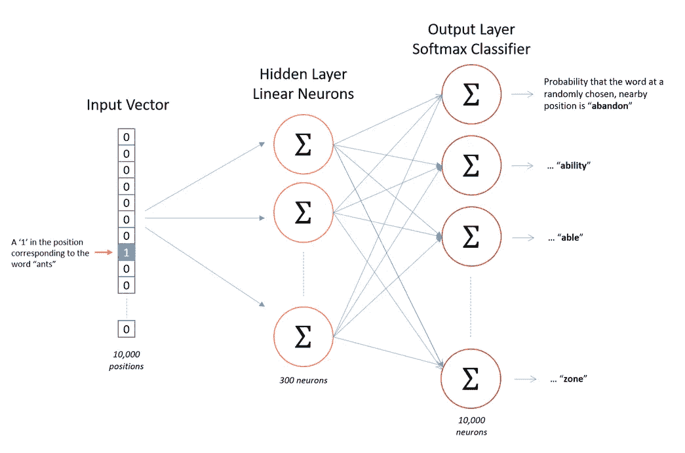

# NLP 101: Word2Vec — Skip-gram 和 CBOW

> 原文：<https://towardsdatascience.com/nlp-101-word2vec-skip-gram-and-cbow-93512ee24314?source=collection_archive---------0----------------------->

## 单词嵌入速成班。


Photo by [Sincerely Media](https://unsplash.com/@sincerelymedia?utm_source=medium&utm_medium=referral) on [Unsplash](https://unsplash.com?utm_source=medium&utm_medium=referral)

# 单词嵌入是什么意思？

单词嵌入只是单词数字表示的一种花哨说法。一个很好的类比是我们如何使用颜色的 RGB 表示。

# 为什么我们需要单词嵌入？

作为一个人，从直觉上来说，想要用数字来表示单词或宇宙中的任何其他对象没有多大意义，因为数字是用来量化的，为什么需要量化单词呢？

在科学课上，我们说我的车的速度是 45 公里/小时，我们得到了我们开得有多快/多慢的感觉。如果我们说我的朋友以 60 公里/小时的速度开车，我们可以比较一下我们谁开得更快。此外，我们可以计算在某个时间点我们将在哪里，当我们知道我们旅程的距离时，我们将到达我们的目的地等等。类似地，在科学之外，我们用数字来量化质量，当我们报出一件物品的价格时，我们试图量化它的价值，一件衣服的尺寸，我们试图量化它最适合的身体比例。

所有这些表述都是有意义的，因为通过使用数字，我们可以更容易地根据这些品质进行分析和比较。鞋子和钱包哪个更值钱？尽管这两种物品不同，但有一种方法可以回答这个问题，那就是比较它们的价格。除了量化方面之外，这种表示没有任何其他可获得的东西。

既然我们知道对象的数字表示通过量化某种质量来帮助分析，问题是我们想要量化什么质量的词？

答案是，我们要量化 ***语义*** 。我们希望用一种人类能够理解的方式来表达单词。不是这个词的确切意思，而是上下文的意思。例如，当我说单词 *see，*时，我们确切地知道我在说什么动作——上下文——即使我们可能无法引用它的意思，那种我们可以在字典中找到的，我们头顶的意思。

# 什么是好质量的单词嵌入，如何生成？

最简单的单词嵌入是使用一键向量。如果你的词汇表中有 10，000 个单词，那么你可以将每个单词表示为一个 1x10，000 的向量。

举个简单的例子，如果我们的词汇表中有 4 个单词— *芒果、草莓、城市、德里—* ，那么我们可以将它们表示如下:

*   芒果[1，0，0，0]
*   草莓[0，1，0，0]
*   城市[0，0，1，0]
*   德里[0，0，0，1]

上面的方法有一些问题，首先，我们的向量的大小取决于我们的词汇的大小(这可能是巨大的)。这是一种空间浪费，并且以指数方式增加了算法的复杂性，导致了维度的诅咒。

其次，这些嵌入将与它们的应用紧密耦合，使得迁移学习到使用相同大小的不同词汇的模型，从词汇中添加/删除单词几乎是不可能的，因为这将需要再次重新训练整个模型。

最后，创建嵌入的全部目的是捕捉单词的上下文含义，这是这种表示法所不能做到的。意思或用法相似的词之间没有关联。

```
**## Current situation** 
Similarity(Mango, Strawberry) == Similarity(Mango, City) == 0**## Ideal situation**
Similarity(Mango, Strawberry) >> Similarity(Mango, City)** Note: Similarity(a,b) = *a.b/(||a||*||b||*) Cosine similarity
```

## 连续词袋模型(CBOW)和跳格

两者都是通过使用神经网络来学习每个单词的底层单词表示的架构。


Source: [*Exploiting Similarities among Languages for Machine Translation*](https://arxiv.org/pdf/1309.4168v1.pdf) paper.

在 **CBOW** 模型中，上下文(或周围单词)的分布式表示被组合起来**预测中间的单词**。而在**跳格**模型中，输入单词的分布式表示用于**预测上下文**。

任何神经网络或任何监督训练技术的先决条件是具有标记的训练数据。你如何训练一个神经网络来预测单词嵌入，当你没有任何标记数据，即单词和它们相应的单词嵌入？

## 跳格模型

我们将通过为神经网络创建一个“假”任务来进行训练。我们不会对这个网络的输入和输出感兴趣，相反，我们的目标实际上只是学习隐藏层的权重，这实际上是我们试图学习的“单词向量”。

Skip-gram 模型的假任务是，给定一个单词，我们将尝试预测它的相邻单词。我们将通过窗口大小——一个超参数——来定义一个相邻单词。


The word highlighted in yellow is the source word and the words highlighted in green are its neighboring words.

给定句子:
*“我早餐吃橘子* ***果汁*** *和鸡蛋。”*
且窗口大小为 2，如果目标词是*果汁，*其邻词将是*(有、橙、和、蛋)。*我们的输入和目标词对将是(果汁，有)，(果汁，橙)，(果汁，和)，(果汁，鸡蛋)。
还要注意，在样本窗口中，单词与源单词的接近度不起作用。所以*有，橙，和，*和*蛋*在训练时会被同等对待。



Architecture for skip-gram model. Source: [McCormickml tutorial](http://mccormickml.com/2016/04/19/word2vec-tutorial-the-skip-gram-model/)

输入向量的维数将是 1xV——其中 V 是词汇表中的*个单词—* ,即单词的一键表示。单个隐藏层将具有维度 VxE，其中 E 是单词嵌入的大小，并且是超参数。隐藏层的输出将是 1xE 的尺寸，我们将把它输入到一个 [softmax 层](http://ufldl.stanford.edu/tutorial/supervised/SoftmaxRegression/)。输出层的维度将是 1xV，其中向量中的每个值将是目标单词在该位置的概率得分。
根据我们之前的例子，如果我们有一个向量[0.2，0.1，0.3，0.4]，这个词成为*芒果*的概率是 0.2，*草莓*是 0.1，*城市*是 0.3，*德里*是 0.4。

对应于源单词的训练样本的反向传播在一次反向传递中完成。所以对于*果汁，*我们将完成所有 4 个目标词 *( have，orange，and，eggs)的正向传递。*然后我们将计算对应于每个目标单词的误差向量【1xV dimension】。我们现在将有 4 个 1xV 误差向量，并将执行逐元素求和以获得 1xV 向量。隐藏层的权重将基于这个累积的 1xV 误差向量进行更新。

## CBOW

CBOW 中的假任务有点类似于 Skip-gram，在某种意义上，我们仍然采用一对单词，并教导模型它们共同出现，但我们不是添加错误，而是添加相同目标单词的输入单词。

我们的隐藏层和输出层的尺寸将保持不变。只有我们的输入层的维度和隐藏层激活的计算将改变，如果我们对于单个目标单词有 4 个上下文单词，我们将有 4 个 1xV 输入向量。每个都将乘以 VxE 隐藏层，返回 1xE 向量。将对所有 4 个 1xE 向量进行元素平均，以获得最终的激活，然后将该激活馈入 softmax 层。

**Skip-gram** :适用于少量的训练数据，甚至可以很好地表示罕见的单词或短语。
**CBOW** :训练速度比 skip-gram 快几倍，对常用词的准确率略高。

在本帖第二部分[NLP 101:阴性采样和手套](/nlp-101-negative-sampling-and-glove-936c88f3bc68)中，我们讨论了:

*   **负采样** —一种在不影响嵌入质量的情况下改善学习的技术
*   另一个单词嵌入叫做 **GloVe** ，它是基于计数和基于窗口的混合模型。

# 参考

*   [讲稿 cs 224d:NLP 第一部分的深度学习](http://cs224d.stanford.edu/lecture_notes/notes1.pdf)
*   [讲稿 cs 224d:NLP 第二部分的深度学习](https://cs224d.stanford.edu/lecture_notes/LectureNotes2.pdf)
*   [麦考密克，C. (2016 年 4 月 19 日)。 *Word2Vec 教程——跳格模型*。](http://mccormickml.com/2016/04/19/word2vec-tutorial-the-skip-gram-model/)

## 我认为你会喜欢:D 的其他文章

*   [是的，你应该听听 Andrej Karpathy，并了解反向传播](/back-propagation-721bfcc94e34)
*   [NLP 模型评估—最新基准](/evaluation-of-an-nlp-model-latest-benchmarks-90fd8ce6fae5)
*   [理解深度学习中的注意力](/attaining-attention-in-deep-learning-a712f93bdb1e)
*   [变形金刚](/transformers-89034557de14)——谷歌的伯特[和 OpenAI 的 GPT](https://medium.com/@ria.kulshrestha16/keeping-up-with-the-berts-5b7beb92766) 等模型的基本模块。

> 我很高兴你坚持到了这篇文章的结尾。*🎉我希望你的阅读体验和我写这篇文章时一样丰富。*💖**
> 
> 请点击这里查看我的其他文章[。](https://medium.com/@ria.kulshrestha16)
> 
> 如果你想联系我，我会选择推特。