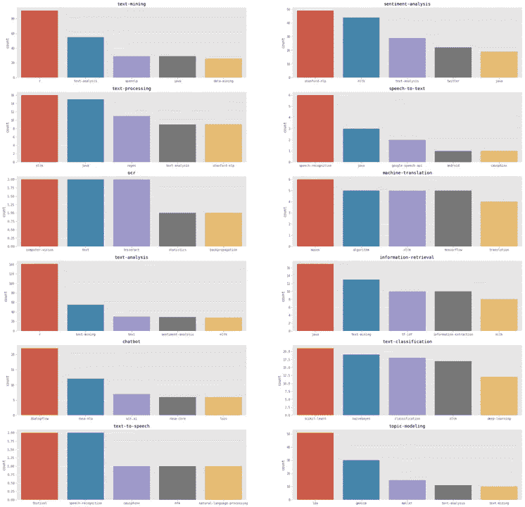

# NLP(人工智能)现实…混乱

> 原文：<https://towardsdatascience.com/nlp-ai-reality-decluttered-3dd34f6daba0?source=collection_archive---------29----------------------->

诗歌生成器、推文生成器、新闻生成器、聊天机器人、破解考试的机器……唷……自然语言处理(NLP)已经离我们很远很远了。还是我们在媒体炒作的回音室里？现实是怎样的？

现实是开发人员在哪里…他们在编码什么，出现了什么问题，发生了什么对话？像 Stack Overflow 这样的顶级开发者网站对此有很好的描述。这也是一个很好的预示未来的指标(今天正在开发明天的解决方案)。让我们[解混](https://medium.com/datadriveninvestor/ai-sees-itself-via-humans-8bdfe3f8c25e)得到 NLP 现实。

这是开发者提出的问题的摘要、基本标签和标题。截至 2019 年 6 月，在 1867 个标签上分析了 11000 个查询。

属性:标签数据来自堆栈溢出

注:2019 年的数据是今年迄今为止的数字，因此会出现下降。按比例计算，2019 年在 6 个月内约为 2018 年的 70%，并有望大幅超过 2018 年。

Top 15 tags

*   NLP 正在兴起，尤其是在 2016 年之后
*   机器学习比深度学习用得更多……深度学习正在逐级提升
*   早些年出现了 Java、PHP 等…现在主要是 python
*   NLP 仍然是一流的 NLTK(自然语言工具包)库，它已经强大了十年
*   嵌入/矢量技术在最近几年有所发展…先驱 word2vec 仍然占据主导地位
*   文本分析是文本分类的主要用例

*注:参见插图“矢量化标签网络”来理解这些技术术语是如何获得的。*

快速进入这些领域…向量、库和用例。

**矢量:**下面的图表显示了一部分关于矢量生成技术的见解。Word2Vec 占主导地位，但像 elmo、bert 等新架构的快速发展正在蚕食它的份额。

Vector Generation

**库:**NLTK 最简单免费的库，Scikit-learn 独霸。斯坦福大学在 70 年代以基于规则的文本处理开创了自然语言处理，并继续赢得人们的忠诚。

鉴于 Word2Vec 的受欢迎程度，在那里看到 Gensim 并不奇怪。Spacy 是在 NLP 中取得巨大进展的软件包。有趣的是，bigtech 驱动的 NLP APIs 还没有引发很多讨论。

**用例:**用例主要是在文本分析/挖掘中。近年来，文本分类和情感分析的份额越来越大。情感分析是文本分类的一种形式，很明显，文本分类是开发人员正在讨论的用例。

快速浏览每个用例可以发现，文本分析和信息提取主要利用了 regex、tf-idf、nltk 等。文本分类/情感分析是深度学习出现的地方。

使用主题建模技术理解文档继续沿用旧的 LDA 和 Gensim 方法。利用嵌入和深度学习让机器理解语言还没有出现。

总之，自然语言处理越来越受到重视，尽管是现有技术的更高组合。向量和深度学习概念的探索获得更多份额。

NLP 现实…通过“AI+代码”去杂乱。