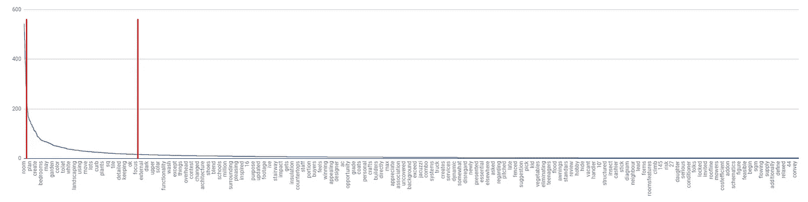

# 基于自然语言处理的提高预测模型精度的数据预处理方法

> 原文：<https://towardsdatascience.com/nlp-based-data-preprocessing-method-to-improve-prediction-model-accuracy-30b408a1865f?source=collection_archive---------12----------------------->

## 自然语言处理如何帮助均匀化异构数据集以优化机器学习回归任务的预测模型。


Photo by [Milad Fakurian](https://unsplash.com/@fakurian?utm_source=medium&utm_medium=referral) on [Unsplash](https://unsplash.com?utm_source=medium&utm_medium=referral)

# 任务概述

如今，将[机器学习用于点对点市场](https://greenice.net/3-ways-use-machine-learning-p2p-marketplace/)非常流行，因为它可以提高 UX，增加客户忠诚度。在第一部分的[中，我描述了众包平台【Arcbazar.com】基于 ML 的奖项推荐系统](/data-structure-evaluation-to-choose-the-optimal-machine-learning-method-eec66076f97a)的主要阶段，客户发起设计师竞赛并设立奖金。ML 系统在已完成的带有付费奖项的竞赛的数据集上进行训练，以帮助客户为某个建筑项目设置最佳奖项。经过数据分析，选择了最佳回归算法。

# 问题

正如在上一篇文章中提到的，我对数据集做了一些简化。我将训练数据集的三个文本描述字段替换为一个有数值的字段——字符总数。因此，我得到了 5 个字段的数据集，而不是 7 个字段。

然而，测试表明，模型的准确性可以提高。

在这篇文章中，我将告诉您如何使用自然语言处理来升级数据集预处理的预测模型。

# 假设

古希腊哲学家苏格拉底说:“说话，让我能看见你”。这句格言的意思是，我们的言语比我们想说的更多地揭示了我们的个性。此外，它还提示了一个假设，即项目的文本描述可能与奖励金额相关联，并且这些关系比大量字符更强。

我决定使用自然语言处理方法将文本描述的字符串类型数据转换为数值，目的是丰富和均匀化数据集。

ML 系统升级分为三个主要步骤:

1.  文本清理。
2.  文本到数字的转换。
3.  选择最佳回归方法。

# 文本清理

对于数据库的每个文本描述字段，我使用 Python 语言的[自然语言工具包](https://www.nltk.org/)和 [gensim](https://radimrehurek.com/gensim/index.html) 库应用了文本清理算法。但是，您可以使用您喜欢的任何 NLP 库。我将文本转换成小写，去掉标点符号和英语停用词。

```
#Transform to lower case
import stringfeatures['description'] = features['description'].str.lower()#Remove punctuation
table = str.maketrans('', '', string.punctuation)
features['description'] = [features['description'][row].translate(table) for row in range(len(features['description']))]#Remove stopwords
import nltk
nltk.download('stopwords')
from nltk.corpus import stopwords
stop = stopwords.words('english')features['description'] = features['description'].apply(lambda x: " ".join(x for x in x.split() if x not in stop))
```

# 文本到数字的转换

然后，每个字段中最常用和最不常用的单词都被删除。语义分析中常用(最频繁)词的含义非常接近停用词。他们给文本添加了一种类似噪音的模式。此外，最不常用的词的意义可以忽略不计，它们可以被过滤掉。这一步的目的是筛选出最有价值的单词。我使用了图形分析，绘制单词和它们的频率。

```
#Find words spreading (each word frequency)
freq_d = pd.Series(‘ ‘.join(features[‘description’]).split()).value_counts()#Plot the words distributionfreq_d.plot(kind=’line’, ax=None, figsize=None, use_index=True,
            title=None, grid=None, legend=False, style=None,
            logx=False, logy=False, loglog=False, xticks=None,
            yticks=None, xlim=None, ylim=None, rot=None,
            fontsize=None, colormap=None, table=False, yerr=None,
            xerr=None, label=None, secondary_y=False)
```

词频可视化帮助我筛选出频率大约在 5 到 200 之间的词。



```
#Remove the least frequent words
rare_d = pd.Series(' '.join(features['description']).split()).value_counts()[-17528:]rare_d = list(rare_d.index)features['description'] = features['description'].apply(lambda x: " ".join(x for x in x.split() if x not in rare_d))#Remove the most frequent words
freq_d = pd.Series(' '.join(features['description']).split()).value_counts()[:30]freq_d = list(freq_d.index)features['description'] = features['description'].apply(lambda x: " ".join(x for x in x.split() if x not in freq_d))
```

然后每个文本记录被标记化——一个文本被分割成一个单词数组。

```
features['description'] = [text.split() for text in features['description']]
```

单词及其频率的组合给出了一个文本向量，其中每个单词都用它的索引代替。相似的向量表示相似的文本。这就是语义搜索引擎的工作方式。与现代搜索引擎不同，这里我只关注可能的相似性的一个方面——它们的文本(单词)的明显语义相关性。没有超链接，没有随机游走的静态排名，只是对布尔关键字匹配的语义扩展。

```
#Create a set of text records for each field
from gensim import corporadict_d = corpora.Dictionary(features['description'])
```

将文本转换成单词包(BoW)格式，即(token_id，token_count)元组的列表，是由类`gensim.corpora.dictionary.Dictionary()` — `.doc2bow()`的属性完成的。

```
#Convert tokenized text (corpora) to vectorscorpus_d = [dict_d.doc2bow(line) for line in features['description']]
```

为了得到一个实数而不是一个向量，我使用了一个范数，它是一个函数，为向量空间中的每个向量指定一个严格为正的长度或大小。

```
#Transform vectors of texts to scalar values (calculating norms of vectors)
from numpy import linalg as LAcorpus_d_vec_norm = [LA.norm(vec) for vec in corpus_d]
#Replace text descriptions in the database with norms of vectors
features[‘description’] = corpus_d_vec_norm
```

最后，我得到了一个同质的 7 场数据集。

# 选择最佳回归方法

我使用了之前测试中评级最高的机器学习方法——随机森林回归器——来计算模型如何适应我们的新数据集。决定系数 R 的平方是 5 字段数据集(0.37)的两倍(约 0.75)。


Random Forest Regressor results distribution on 7-field data

最初，我有混合数据集:前三个字段(下拉菜单)显然是相互依赖的，接下来的三个字段(描述)更具波动性。

由于我的假设，描述域在哲学上(甚至心理学上)更接近于奖励值。所以，我把 ML 方法改成了人工神经网络。顺便说一下，该算法在之前的 5 字段数据集测试中被拒绝，因为它的 R 平方非常低，为 0.05。


Image source: [scikit-learn.org](http://jmlr.csail.mit.edu/papers/v12/pedregosa11a.html)

然而，[多层感知器](https://scikit-learn.org/stable/modules/neural_networks_supervised.html)只有三个隐藏层的回归器给出了 R 平方为 0.999962 的惊人结果。


Multi-layer Perceptron Regression on 7-fields dataset.

```
import sklearn
from sklearn.neural_network import MLPRegressormlpreg = MLPRegressor(hidden_layer_sizes=(3,), activation=’relu’,
         solver=’adam’, alpha=0.001, batch_size=’auto’,
         learning_rate=’adaptive’, learning_rate_init=0.01,
         power_t=0.5, max_iter=1000, shuffle=True, random_state=9,
         tol=0.0001, verbose=False, warm_start=False, momentum=0.9,
         nesterovs_momentum=True, early_stopping=False,
         validation_fraction=0.1, beta_1=0.9, beta_2=0.999,
         epsilon=1e-08)
```

# 结论

1.所获得的结果显示了向量的范数对于替换文本向量的适用性，而没有显著的数据丢失。

2.客户对他/她的需求的口头描述比下拉菜单更接近于奖金数额，因为这些文字可能表达了人类的本质或共同的动机。

3.基于人工神经网络的算法在“理解”人性方面比随机森林更好，首先是因为它在结构上与人脑相似。