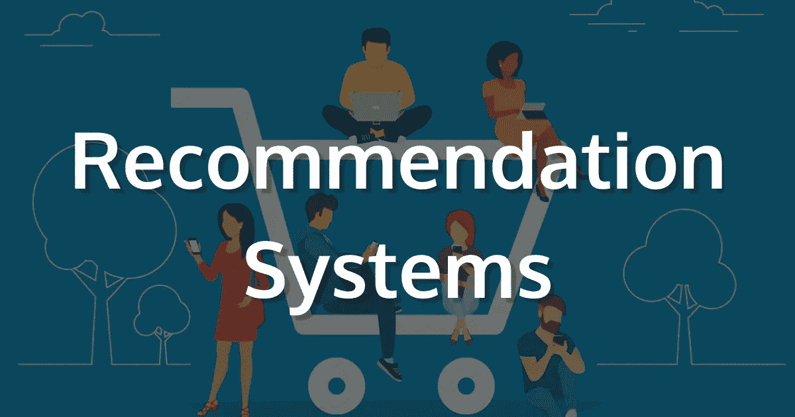
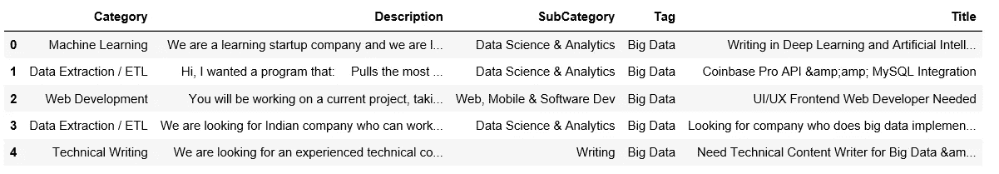

# 基于自然语言处理的无用户偏好推荐系统

> 原文：<https://towardsdatascience.com/nlp-based-recommender-system-without-user-preferences-7077f4474107?source=collection_archive---------5----------------------->



**推荐系统** (RS)已经发展成为帮助用户做出明智决策和选择的基本工具，尤其是在大数据时代，客户必须从大量产品和服务中做出选择。人们提出了许多遥感模型和技术，其中大多数都取得了巨大的成功。其中，基于内容的粗糙集和协同过滤粗糙集是两个有代表性的。研究界和工业界都证明了它们的有效性。

我们将在自然语言处理方法的基础上建立一个基于内容的推荐系统，当我们处理以描述或标题(一般是文本数据)为特征的产品，如新闻、工作、书籍等时，这种方法非常有用..

开始吧！

# 数据

我们将使用来自一些自由职业者网站的项目数据集，这些项目是出于教育目的从 RSS 源解析而来的。

我们将根据自由职业者以前做过的项目，尝试向他们推荐感兴趣的项目。

```
import pandas as pd
projects = pd.read_csv("projects.csv")
projects_done= pd.read_csv("projects_done_by_users_history.csv")
projects.head()
```



Dateframe of projects

项目完成历史表包括 2 行，用户标识和项目标识。

现在让我们准备数据并清理它。

```
projects = projects.drop_duplicates(subset="Title", keep='first', inplace=False)
projects["Category"] = projects["Category"].fillna('')
projects["Description"] = projects["Description"].fillna('')
projects["SubCategory"] = projects["SubCategory"].fillna('')
projects['Title']= projects['Title'].fillna('')
```

让我们将每个文档的所有行合并为一行

```
projects["text"] = projects["Category"] + projects["Description"] + projects["SubCategory"] + projects["Title"]
```

现在我们将计算 **TF-IDF** “项频率—逆数据频率”

```
from sklearn.feature_extraction.text import TfidfVectorizertf = TfidfVectorizer(analyzer='word',ngram_range=(1, 2),min_df=0, stop_words='english')
tfidf_matrix = tf.fit_transform(projects['text'])
```

是时候生成余弦 sim 矩阵了

```
from sklearn.metrics.pairwise import linear_kernel, cosine_similaritycosine_sim = linear_kernel(tfidf_matrix, tfidf_matrix)
```

现在我们完成了，我们的自由职业者是免费的开放项目..给他们推荐几个有意思的项目吧:))

getUserDone 函数将返回一个列表，其中包含用户已完成项目的所有 id。

get_recommendations 将返回一个列表，其中包含与特定用户完成的项目最相似的项目，该列表将按升序排序。

```
titles = projects['Title']
indices = pd.Series(projects.index, index=projects['Title'])
```

让我们推荐 id 为 20 的用户可能感兴趣的前 25 个项目。

```
get_recommendations(20).head(25)
```


Top 25 Recommendations

# 结论

在本文中，我们使用 NLP 方法构建了一个基于内容的推荐器，它对于包含文本数据的产品非常有用。

不需要用户的偏好，我们可以从他们完成的项目中为他们推荐高质量的推荐。

这种方法也有优点，这就是为什么总是建议使用多种方法，并结合它们以获得准确的结果。