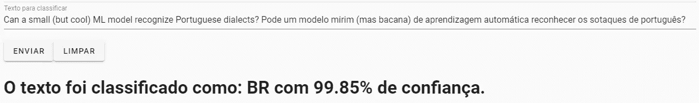
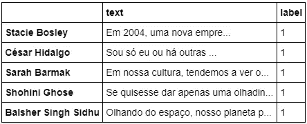
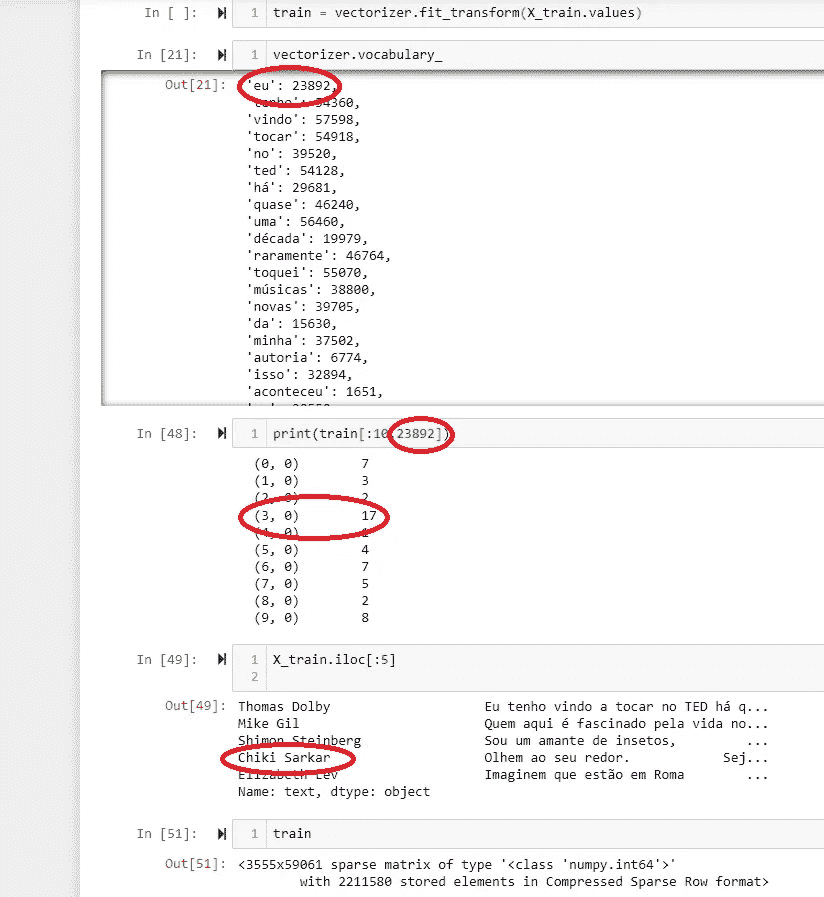
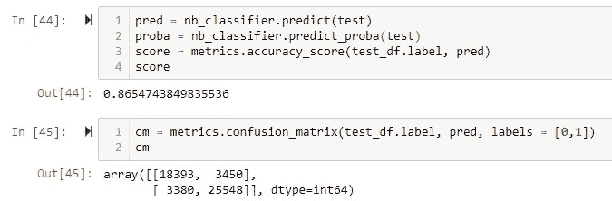
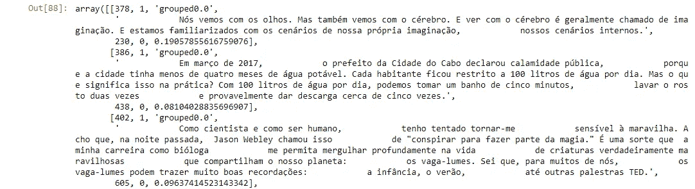
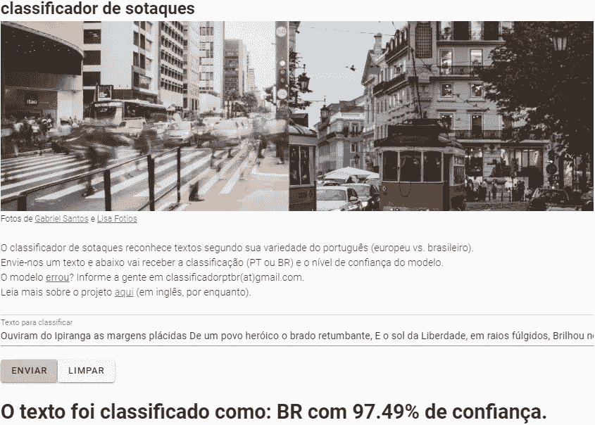

# NLP 基础，动手操作:一个语言分类器，分 3 步在线部署

> 原文：<https://towardsdatascience.com/nlp-basics-hands-on-a-portuguese-dialect-classifier-deployed-online-in-3-steps-53a8b3b88ea9?source=collection_archive---------28----------------------->


São Paulo or Lisbon? (Photos by [Gabriel Santos](https://www.pexels.com/photo/road-with-crowd-2014700/) and [Lisa Fotios](https://www.pexels.com/photo/people-at-city-1534560))

## TL；dr:我用 scikit-learn 创建了一个葡萄牙方言分类器，用了 5000 篇 TED 演讲。然后我修补了 Flask 和 Vue.js 来[与你分享。](https://marekcichy.alwaysdata.net)

[*小团体*](https://medium.com/data-hackers/como-criar-um-detector-de-sotaques-de-portugu%C3%AAs-com-palestras-ted-3487672f4f3b)

是的，我是最近决定加入数据科学潮流的一群人中的一员。人们说，边走边学。他们说，想出一个问题并找到它的解决方案。他们说，不要害怕在路上打碎东西。我也在努力。作为一名波兰-葡萄牙语翻译，我立刻想到了一个现实世界的问题:



你知道，葡萄牙语是横跨大西洋的一种语言。巴西和旧世界(葡萄牙+讲葡萄牙语的非洲和亚洲国家)的变体在词汇、语法和发音方面有所不同。

与此同时，波兰的自由葡萄牙语翻译市场相当狭窄。我没有足够的时间专门研究和坚持其中一个品种。我头上戴着两顶帽子，有时在同一个工作周，我必须加倍小心地保持给定翻译的一致性。这就是为什么我对 NLP 项目的第一个想法是葡萄牙语方言分类器。

无论是在自然语言处理还是人工智能领域，这都不是开拓性的研究。我在这里的动机与我之前关于 tweet bot 的 [Medium 文章类似——展示在 Python 中进行自然语言处理的第一步是多么简单。作为一个没什么技术背景的人，我尽量用通俗易懂的英语来呈现。](https://medium.com/@marekkcichy/how-to-set-up-an-obscenely-easy-tweetbot-in-python-7837d776e706)

这篇文章分为三个主要部分:

*   准备源数据(Scrapy)；
*   训练模型(sci kit-learn)；
*   使用模型(Flask+Vue.js)部署 API。

# 准备源数据


A lecture. Could be a TED one. Photo by [Samuel Pereira](https://unsplash.com/@samuelpereira?utm_source=medium&utm_medium=referral) on [Unsplash](https://unsplash.com?utm_source=medium&utm_medium=referral)

我需要什么数据，从哪里收集，如何收集？在这种情况下，我选择 TED.com 作为我的来源。这是一个相当大的数据库，方便转录讲座。在这种情况下，特别重要的是，TED 的翻译团队严格区分两种葡萄牙语方言(例如，维基百科就不是这种情况)。

TED 曾经维护了一个官方 API，但他们在 2016 年停止了它，所以我建立了一个 [Scrapy spider](https://github.com/MarekCichy/pt-br-classifier/blob/master/PTCrawler.py) 来收集数据。大部分是基于[刺儿头教程](https://docs.scrapy.org/en/latest/intro/tutorial.html)的样板。蜘蛛在指定语言的 TED 演讲目录中循环，并跟踪各个演讲的链接:

```
def parse_front(self, response):

   talk_links = response.css(“a.ga-link::attr(href)”) 
   links_to_follow = talk_links.extract()    for url in links_to_follow: 
      url = url.replace(‘?language’, ‘/transcript?language’) 
      yield response.follow(url=url, callback=self.parse_pages)
```

然后，第二种解析方法抓取各个讲座的标题和文本，并将它们添加到字典中:

```
def parse_pages(self, response): 
   title = response.xpath(‘//head/title/text()’).extract_first()    
   title = title.strip() 
   title = title.split(‘:’)[0] 
   talk = response.xpath( ‘//div[@class=”Grid__cell flx-s:1 p-r:4"]/p/text()’).extract() 
   for i in range(len(talk)): 
      line = talk[i].strip() 
      line = line.replace(‘\n’,’ ‘) 
      talk[i] = line.replace(‘\t’,’ ‘) 
   talk = ‘ ‘.join(talk) 
   talk = talk.replace(‘\n’,’ ‘) 
   ted_dict[title] = talk
```

完成后，字典被转储到一个 CSV 文件中。我需要做的就是确定合适的 xpaths。我还设置了每次下载之间的半分钟延迟(如果没有它，我会过于频繁地访问服务器，这会阻塞我的查询):

```
class TedSpiderPt(scrapy.Spider): 
   name = “ted_spider_pt” 
   download_delay = 0.5
```

剩下的资料准备和训练过程都可以在 Jupyter 笔记本[这里](https://github.com/MarekCichy/pt-br-classifier/blob/master/pt-br-classifier.ipynb)伴随。下面，我浏览了一下，并强调了关键时刻。

我为葡萄牙语的每个版本搜集了大约 2500 个 TED 演讲，每个演讲大约有 12000 到 18000 个字符。清理完格式后，我将 PT-PT(欧洲葡萄牙语)的转录标记为“0 ”, PT-BR 的转录标记为“1 ”,然后用 scikit-learn 的 CountVectorizer 拟合并转换它们。



An example of data prepared for CountVectorizing.

如果这篇文章是对自然语言处理的介绍:CountVectorizer 将一组文本文档转换成字数。这种数字形式的文本数据极大地提高了处理它的能力。

首先，我按照 2:1 的比例将讲座分成训练集和测试集。该模型将仅在训练数据上学习。测试部分用于在向世界发布之前检查其性能。

然后，我将向量机与训练数据相匹配——简单地说，它会为在那里找到的每个单词分配一个唯一的数字，从而创建一个词汇表。为了消除极端的异常值，我将参数 **min_df** 设置为 2——只出现一次的单词不考虑在内。然后，我转换训练集——即统计词汇表中每个单词的出现次数。在计数矢量化之后，在组成训练集的 3555 个谈话的每一个中计数 59061 个单词中的每一个。

请参见下面的图示:



Tracking down a particular word.

单词“eu”(葡萄牙语中的“me”)在词汇表中被索引为“23892”。在这个指数的字数统计中，我们看到一个演讲中“eu”的数量明显较高。我们可以追溯到演讲的转录……事实上，个人经历在 Chiki Sarkar 的 [TED 演讲](https://www.ted.com/talks/chiki_sarkar_how_india_s_smartphone_revolution_is_creating_a_new_generation_of_readers_and_writers/transcript)中发挥了重要作用。

除了向量化和计数，我避免任何其他预处理。我不做词干分析，因为我想保留两种语言版本之间的语法差异(如动词变化差异)。举个例子:把“[a] fazer”和“fazendo”减少到它们的词干会模糊我想要抓住的 PT/BR 区别。

# 训练模型


Photo by [Jelmer Assink](https://unsplash.com/@jelmerassink?utm_source=medium&utm_medium=referral) on [Unsplash](https://unsplash.com?utm_source=medium&utm_medium=referral)

然后，我在训练集上训练一个多项式朴素贝叶斯分类器。尽管这种方法相当基础，但在 NLP 应用程序中，比如这个，它的效果非常好。

再次，一些简单的英语解释:NaiveBayes 分类器基本上比较给定单词在 BR 和 PT 集中的频率，从而确定该单词是否建议更“巴西”或“葡萄牙”的文本。在预测时，对文本中的所有单词进行加权，我们获得最终的概率。

在训练分类器之后，我使用与之前相同的矢量器来转换测试集。它已经填充了训练集词汇，并且它将只计算出现在其中的单词。

然后使用多项式贝叶斯对矢量化的测试集进行分类。在这个特殊的例子中，我对测试集做了一点调整——我想测试它对短文本进行分类的能力。因此，我将测试集的讲座分成 200-760 个字符的小块。相比之下，你现在正在阅读的段落包含 370 个字符。结果呢？



How’s that for a score?

我在短文本上实现了 86.55%的准确率，错误分类的 PT-PT 和 PT-BR 示例的比例几乎相同。这是一个足够好的分数吗？我不是这里最客观的法官，但我会说这很体面。让我们看一些错误分类短语的例子来帮助我们评估模型。



Three examples of PT-BR texts classified as PT-PT

即使你不熟悉这两种葡萄牙语变体，也可以想象一下，有些句子听起来既不像典型的美式英语，也不像典型的英式英语。这就是这里许多分类错误的短语的问题。无论如何，我将在本文的后续部分更深入地研究改进模型的方法。现在，让我们与世界分享吧！

# 使用模型部署 API


Image source and all the rest of Flask goodness: [https://palletsprojects.com/p/flask/](https://palletsprojects.com/p/flask/)

如果我想在 Jupyter 笔记本之外使用我的模型，我需要一种导出它的方法。对于这个任务，我使用了 [joblib 序列化库](https://joblib.readthedocs.io/en/latest/index.html)，它提供了这个问题的轻量级解决方案。

扔给模型的每个新文本都需要由矢量器进行转换，然后进行分类。因此，我将矢量器和分类器打包成一个 scikit-learn [管道](https://scikit-learn.org/stable/modules/generated/sklearn.pipeline.Pipeline.html)。然后只需将它转储到 joblib 文件中:

```
pipeline = Pipeline([('vectorizer',vectorizer), 'classifier',nb_classifier)])dump(pipeline, 'ptclassifier.joblib', protocol = 2)
```

“轻量级”这个术语也适用于 [Flask](https://flask.palletsprojects.com/en/1.1.x/#) ，一个我用来部署 API 的精益 web 应用框架。我的 Flask 应用程序的完整代码是 GitHub repo 中的[。它基本上加载 joblibbed 模型并监听带有一个参数的 GET 请求:一个文本数据字符串。一旦接收到，它通过管道传递字符串，并返回预测的标签和该预测的置信度值。](https://github.com/MarekCichy/pt-br-classifier/blob/master/flask_app.py)

我还应用了 [flask-cors](https://flask-cors.readthedocs.io/en/latest/) 包来允许来自不同来源的请求。在我们的例子中，我稍后将介绍的托管在其他地方的前端应用程序需要访问这个 Flask API。你可以在这里阅读更多关于 CORS 的信息。

我在 [PythonAnywhere](https://www.pythonanywhere.com) 上托管了我的 Flask 应用，我在 [tweetbot 文章](https://medium.com/@marekkcichy/how-to-set-up-an-obscenely-easy-tweetbot-in-python-7837d776e706)中详细描述了这项服务。如果你从在线托管的 Python 脚本开始，我全心全意地推荐 PyA 支持团队总是对我的初学者问题很有帮助。

# 我通向 ML 前端的痛苦之路


You always need a frontend, as scrappy as it may be. Photo by [Eric Muhr](https://unsplash.com/@ericmuhr?utm_source=medium&utm_medium=referral) on [Unsplash](https://unsplash.com?utm_source=medium&utm_medium=referral)

啊，前台。我巨大挫败感的根源和原因。我确信，在最后一英里，建立一个带有文本框和“发送”按钮的最简单的页面是相当容易的。我深信不疑，结果陷入了恶性循环。

首先，我得到一个建议，我应该使用 [Vue.js](https://vuejs.org/) ，但是从一本关于 JavaScript 本身的书开始，比如 [EloquentJS](http://eloquentjavascript.net) 。啊啊。不要误会我，我喜欢 EJS，它的在线版本，有练习用的沙盒，非常容易上手。但在一周的课程后，我意识到我此刻的目标是缝合一个基本的前端，然后回去构建模型。我仍然觉得 Python 不够流利，无法开始一门新的语言。

然后我谷歌了“简单机器学习前端模板”和类似的关键词，结果喜忧参半。我掉进的陷阱？我对最小可行解决方案的耐心持续的时间比我理解和部署模板所需的时间要少。

最后，我找到了一个对我的急性子足够有效的方法——由 James Salvatore 在 Uptake Tech 博客中提出。我拿了他的模板，并根据我的需要做了一些调整。为了简单起见，我去掉了工具栏，添加了一个图片作为标题，并且只保留了一个文本框。我在 [AlwaysData](http://alwaysdata.net) 上托管了该应用的生产版本，这是我可以推荐的另一项服务。

如果你还没有看到最终的结果[在这里](http://marekcichy.alwaysdata.net)。



The Brazilian anthem is classified as 97.5% Brazilian. What’s the result for its Portuguese counterpart? [Check for yourself here.](https://marekcichy.alwaysdata.net)

随便玩玩，就算不懂葡萄牙语。如果你在上面打碎了什么东西并告诉我，我会非常高兴的！此外，对库中[代码的任何建设性的批评都会赢得我永远的感激。](https://github.com/MarekCichy/pt-br-classifier)

# 下一步是什么？

本文将有第二部分。在不久的将来，我想:

*   添加一个功能，向我的前端应用程序的用户显示单个单词如何影响预测；
*   刮一些其他文字来源(新闻、博客、电影字幕)，在上面检查模特的表现；
*   探索分类器的错误并尝试发现模式；
*   尝试用 LSTM 方法解决问题，并比较结果；
*   最后但同样重要的是，希望我能从读者那里得到一些值得分享的反馈！

## 奖金(葡萄牙语者)！

我偶然发现了两个人们用葡萄牙方言解决类似问题的例子:

*   [巴西区域自动识别研究，作者 Nathalia Alves Rocha (pdf)](http://repositorio.unicamp.br/jspui/bitstream/REPOSIP/334048/1/Batista_NathaliaAlvesRocha_M.pdf)
*   [Rodrigo card oso 的《PHP 中的机器学习》](https://imasters.com.br/back-end/criando-um-detector-de-sotaques-com-machine-learning-em-php)

*感谢*[*Piotr migda*](https://medium.com/u/50fed9fd6145?source=post_page-----53a8b3b88ea9--------------------------------)*对本项目和其他项目的指导，感谢 Kamil Herba 和*[*Piotr Kaznowski*](https://github.com/caseneuve)*对本文和 webapp 的见解。*