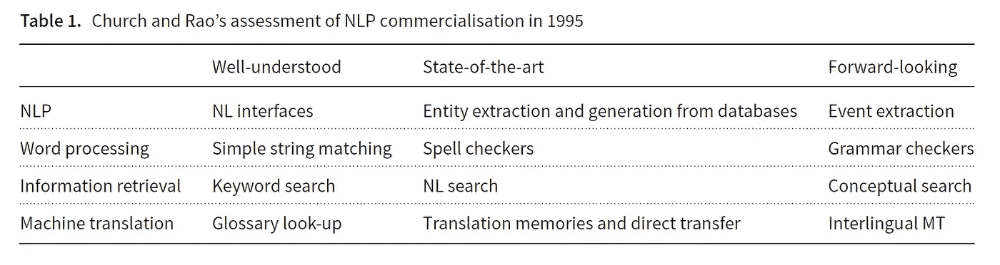
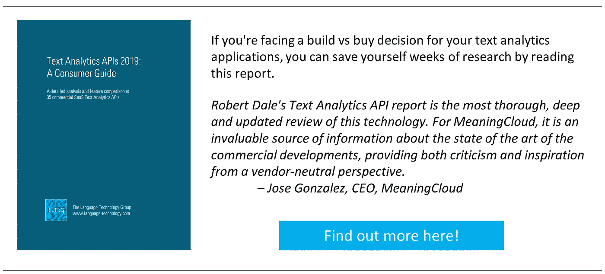

# 过去 25 年中的 NLP 商业化

> 原文：<https://towardsdatascience.com/nlp-commercialization-in-the-last-25-years-6468d8119fcd?source=collection_archive---------22----------------------->

Photo by [Thomas Kelley](https://unsplash.com/@thkelley?utm_source=medium&utm_medium=referral) on [Unsplash](https://unsplash.com?utm_source=medium&utm_medium=referral)

*[*自然语言工程期刊*](https://www.cambridge.org/core/journals/natural-language-engineering) *现在已经是第 25 个年头了。早在 1995 年第一期的编辑序言中就强调，该杂志的重点是自然语言处理(NLP)技术的实际应用:这是一个严肃的出版物，有助于鼓励研究想法进入实际产品的时机已经成熟。那时 NLP 技术的商业化已经开始，但是在过去的四分之一世纪里，事情已经有了巨大的进展。因此，为了庆祝杂志的周年纪念，我们来看看商业 NLP 产品在过去 25 年中是如何发展的。**

**这篇文章的一个版本也出现在 2019 年 5 月的《自然语言工程》杂志上。**

# *一些背景*

*对许多研究人员来说，自然语言处理工作有双重吸引力。一方面，语言理解或语言产生的计算模型经常被视为探索语言学和心理语言学理论问题的手段，一般的论点是，如果你能建立某种现象的计算模型，那么你很可能朝着理解这种现象的方向前进了一些。另一方面，自然语言处理技术的实际应用范围一直很诱人:我们可以构建真正有用的与人类语言一起工作的计算工件的想法可以追溯到 20 世纪 50 年代早期机器翻译实验领域的起源。*

*然而，直到 20 世纪 90 年代早期，NLP 的商业应用才真正开始蓬勃发展，特别是在美国的定向研究的推动下，其中大部分是由 DARPA 通过消息理解会议(MUC)等项目资助的，而在欧洲，则是通过许多大规模前瞻性的 EU-资助的研究项目。正是在这种活动的背景下，*自然语言工程杂志*应运而生，其明确的目标是主要关注实践贡献而非理论贡献。*

*《华尔街日报》现在已经是第 25 个年头了，我们有一个很好的借口来看看 NLP 商业化的历史，并反思我们在这 25 年里走了多远。*

# *起点*

*除了是该杂志创刊的一年，1995 年还发生了大量与计算机相关的事件。这是视窗 95 和网景问世的一年；Java 1.0 出现，JavaScript 被开发出来；DVD 问世了，索尼在北美发布了 PlayStation。也是在这一年，NSFNet 退役，消除了互联网商业化的最后限制。Yahoo.com、eBay.com 和 Amazon.com 都是在 1995 年启动的。IBM 推出了“深蓝”,这一计算机系统后来打败了国际象棋世界冠军加里·卡斯帕罗夫。啊，那是令人兴奋的日子！*

*为了我们现在的目的，1995 年也是肯·丘奇和丽莎·劳发表了一篇关于自然语言处理程序商业化的文章的一年。值得回顾一下当时该领域是如何出现的。丘奇和劳着眼于四个领域的发展:一般的自然语言处理，文字处理，信息检索和机器翻译。在每一个案例中，他们都试图描述什么是广为人知的技术，什么是最先进的，什么是更具前瞻性的。表 1 重述了该论文中相关汇总数字的内容。*

**

*在某些方面，看起来似乎没有什么变化:尽管丘奇和饶认为前瞻性的每个主题都取得了进展，但它们不是你所说的完全解决的问题，所以我认为它们在某些方面仍然是前瞻性的，也许沿着真正的人工智能是我们尚未建立的东西的路线。但是在下面我们将探讨的各种方式中，该领域已经在许多方面向前发展，并且今天日常使用的基于 NLP 的产品在 25 年前我们不会认为是合理的。*

*当然，最值得注意的是，由于广泛采用机器学习和统计技术，解决许多问题的方法发生了变化；在 20 世纪 90 年代中期，人们对统计方法进行了研究，但任何已经达到产品状态的东西，就其技术基础而言，都可能主要是基于规则的。新技术不仅为老问题提供了新的解决方案，还将新问题带到了舞台上，产生了我们以前想不到的产品创意。*

# *商业景观*

*出于这里提供的分析的目的，我将采用 NLP 应用程序和技术的空间分解，它与 Church 和 Rau 使用的略有不同，并且对应于我在以前的专栏中使用的空间分解。这种世界观将商业 NLP 领域分为六个关键领域:*

***机器翻译**:将源自然语言中的语言内容翻译成目标自然语言的保义翻译。*

***语音技术**:将对应于语言话语的波形转换成该话语的文本呈现(语音识别)；或者相反，将语言表达的文本表示转换成相应的音频形式(语音合成或 TTS)。*

***对话界面**:交互式界面，允许用户提出自然语言问题(通过语音或文本)并获得答案，可能在较长的多回合对话中。*

***文本分析**:检测文本来源中有用的内容或信息，通常通过分类或提取。*

***自然语言生成**:从一些潜在的非语言信息表示中生成语言输出。*

***写作辅助**:体现一些语言知识的技术，目的是提高人类创作的语言内容的质量。*

*当然，还有其他方法可以分解能量场。我发现这种看待事物的方式很有用，因为它相当好地对应了该领域供应商倾向于使用的一组自我分配的类别。有争议的是，语音技术不再代表一个独立的类别，已经在某种程度上被吸收到更广泛的对话界面领域。然而，至少早在 20 世纪 90 年代，用于将语音转换为文本的技术与用于处理文本的技术之间就有着明显的区别。*

*在本文的剩余部分，我们将依次研究这六个类别中的每一个。*

# *机器翻译*

*如前所述，机器翻译的第一次实验开始于 20 世纪 50 年代，随着现在著名的 1954 年乔治敦-IBM 俄语到英语的翻译演示获得了广泛的关注。商业提供商在 20 世纪 60 年代末和 70 年代初出现，事实上，该领域最早的公司之一， [Systran](http://www.systransoft.com) (成立于 50 多年前的 1968 年)
仍然是领先的翻译工具和服务提供商。*

*早期的机器翻译系统纯粹是象征性的，基于大量手写规则，将一种语言的语言内容转换成另一种语言。商业机器翻译软件的 PC 版本在 20 世纪 90 年代初开始出现。直到 20 世纪 90 年代后期，基于网络的翻译才出现(回想一下，网络在 1991 年才公开)，1997 年 AltaVista 的 Babel Fish translator 使用了 Systran 的技术。因此，25 年前，商业机器翻译是一种基于规则的努力，商业重点是体现功能的工作台，如翻译记忆，这可以提高生产率。虽然 IBM 在 20 世纪 80 年代末发表了关于统计机器翻译(SMT)的研究，但直到 2007 年，随着谷歌翻译
的推出，基于网络的翻译才成为统计翻译。*

*今天，翻译行业处于不断变化的状态。有时粗糙的 SMT 被
认为对于某些目的来说已经足够好了，毫无疑问，深度学习技术的使用已经改善了结果。但是机器翻译在质量和准确性方面仍有一些不足，因此有越来越多的混合解决方案试图将机器翻译的可扩展性与人工翻译的精确性和准确性结合起来；例如，参见 [Lilt](https://lilt.com) 。机器翻译的广泛可用性和低成本在更广泛的翻译行业引发了大量的反思:每当机器翻译的质量提高时，[人工翻译不得不重新考虑他们给这个团体带来了什么](https://slator.com/sponsored-content/how-augmented- translation-will-redefine-the-value-of-translators/)。这种
是一种存在主义焦虑，我们可以期待在未来几年里看到它继续上演。*

*但是回到 1995 年，谁会想到你可以将手机摄像头对准日文菜单，然后在屏幕上看到英文翻译？那是科幻小说里的东西。*

# *语音技术*

*语音社区早在 NLP 世界的其余部分之前就接受了统计技术；特别是，hmm 在 20 世纪 70 年代的采用是一个重大突破，导致了识别性能的显著提高。但是语音识别的进步仍然受到当时内存和计算能力的限制。在 20 世纪 70 年代末，IBM 拥有可以识别 1000 个单词的词汇的技术——前提是每个单词作为一个独立的单元说出，并且在下一个单词之前有一个停顿。到了 20 世纪 90 年代，技术得到了改进，计算能力也提高到了在 PC 桌面上进行语音识别的程度。1990 年为基于 DOS 的计算机发布的 Dragon Dictate 售价 9000 美元，但仍只能识别孤立的单词。Dragon Naturally
Speaking 于 1997 年 7 月问世，它可以每分钟识别多达 100 个单词的连续语音(一旦你对它进行 45 分钟的训练，使它适应你的声音),同年晚些时候，IBM 发布了一款名为 ViaVoice 的竞争产品与之匹敌。*

*20 世纪 90 年代中期，是语音识别商业应用的早期。与其他任何领域相比，过去 25 年取得的惊人进步在这里最为明显:将 20 世纪 90 年代初的孤立单词识别与我们现在对 Alexa、Siri 和谷歌助手的识别准确性的期望进行对比。*

*在过去的 25 年里，商用语音合成技术也经历了巨大的改进。自 20 世纪 90 年代初以来，许多计算机操作系统都包括了语音合成器。机器人 DECtalk——以斯蒂芬·霍金的声音而闻名——于 20 世纪 80 年代中期推出，但语音合成技术到 1995 年并没有太大变化。在 20 世纪 90 年代采用串联合成产生了听起来更自然的合成输出，但仍然有听觉故障，并且感觉输出不太令人信服。然而，由于深度学习技术的应用，过去几年已经取得了重大发展。今天部署的语音合成的高质量是最明显的，如果你听听[谷歌双工的对话贡献](https://ai.googleblog.com/2018/05/duplex-ai-system-for-natural- conversation.html)，完成
犹豫和填充，或者 Alexa 最近引入的[新闻播音员的声音](https://techcrunch.com/2019/01/16/alexa-gets-a-professional- newscaster-voice-for-reading-the-days-news)。*

# *对话界面*

*我使用术语“对话界面”来涵盖许多不同的技术:*

*   *20 世纪 60 年代和 70 年代早期基于文本的对话互动实验，例如约瑟夫·韦森鲍姆的《伊莉莎》。*
*   *基于文本的自然语言数据库界面在 20 世纪 70 年代和 80 年代是人们关注的焦点，它允许用户输入诸如“有多少销售人员比我挣得多？”而不是必须制定一个意思相同的 SQL 查询。*
*   *20 世纪 90 年代的语音对话系统，在基于电话的应用中，[有限状态对话模型
    与基于语法的语音识别](http://www.voicexml.org)相结合。*
*   *现在的虚拟助手，比如 Siri，Alexa，Google Assistant。*
*   *今天的基于文本的聊天机器人，在许多网站和消息应用程序上都可以找到，
    显示了广泛的功能(或者，通常是缺乏功能)。*

*这些看起来似乎都是非常不同种类的应用程序，但是它们都有一个共同点，那就是它们都试图支持某种形式的自然语言对话。如今，这项技术已经出现在大多数日常用户面前，这种对话通常仅限于一次性的问答环节(“嘿，Alexa，几点了？”).然而，在过去的几年中，许多供应商已经提出了变得更加会话化的需求，在多个回合中保持对话，因此必须处理诸如会话上下文和回指之类的对话现象。因此，交互式语音识别开发人员在 20 世纪 90 年代和 21 世纪初学到的许多经验正在被今天的聊天机器人开发人员重新学习。布鲁斯·巴伦廷在这个
话题上的重要[贡献在今天和 10-20 年前一样重要。](https://www.amazon.com/s?k=Bruce+Balentine&ref=nb_sb_noss)*

*马克·吐温被指责几乎引用了每一句名言，据说他说过“历史不会重演，但它常常会重复”。因此，当新的对话设计者正在重复他们 20 年前的前辈的错误时，今天的区别是语音识别实际上工作得足够好，以至于基于文本的界面和基于语音的界面之间几乎没有区别。在 20 世纪 80 年代和 90 年代，NLP 在对话方面的工作通常只是假设存在完美的语音识别，这个问题需要由大楼中的其他团队来解决；但当时的高识别错误率意味着，如果在真实的口语中放任自流，这些系统从根本上说是不可行的。*

*但是，自那时以来，我们已经走过了漫长的道路。1992 年，美国电话电报公司推出了用于呼叫路由的语音
识别服务，证明了即使使用极其有限的五个术语词汇也可以开发出有用的应用程序:该应用程序用于对方付费和向第三方付费的长途呼叫，并识别对录音语音提示的五种不同响应:“电话卡”、“对方付费”、“第三方”、“个人对个人”和“接线员”。20 世纪 90 年代早期的 DARPA 口语系统计划，特别是 ATIS(航空旅行信息系统)共享任务，展示了在实验室中可以实现的令人印象深刻的结果，并鼓励了交互式语音识别行业的开始。即将成为基于电话的 IVR 的重量级公司 Nuance 和 SpeechWorks 都是在 20 世纪 90 年代中期在 DARPA ATIS 任务取得进展的背景下成立的；到 20 世纪 90 年代后期，越来越多的商业上有用的应用被开发出来，如上所述，结合了有限状态对话建模和基于语法的语音识别来管理语音识别错误。*

*今天，我们仍然没有解决长期的自然主义对话所带来的问题。但是，即使它的应用领域很窄，也很难不对谷歌双工展示的对话能力印象深刻。*

# *文本分析*

*我使用术语“文本分析”来涵盖通常应用于文档的各种分类和提取过程。DARPA 资助的 MUC 会议是定义和发展这一技术领域的关键，早期的最初重点是命名实体识别。到 20 世纪 90 年代中期，开始出现旨在将这些方法商业化的商业实体。其中只有一小部分仍然作为独立的公司存在；据我所知，只有两家是成立于 1995 年的 [Basis](http://www.basistech.com) 和成立于 1996 年的 [NetOwl](http://www.netowl.com) 。然而，许多其他早期参与者已经被收购，并仍然以其他形式活跃:特别是，1998 年成立的 ClearForest，现在成为汤森路透文本分析解决方案的一部分，品牌为[路孚特](http://www. opencalais.com)。*

*如果您将这些老供应商与该领域的许多新进入者进行比较，产品的成熟度，尤其是在功能广度方面，是显而易见的。但老玩家没有满足于他们的荣誉:Basis 和路孚特似乎都在跟上时代，引入深度学习技术，就像新的竞争对手将这些技术作为起点一样。*

*也许在过去的 25 年中最显著的发展是情感分析作为一项关键技术的出现；以至于一些文本分析公司，如 Clara bridge T1，已经重生为专注于客户体验分析的 T2 技术提供商。*

*与其他所有事情一样，深度学习已经进入了文本分析领域，相当多的新进入者自豪地谈论他们使用这些新技术作为区分自己和保守派的一种方式。尚不清楚这些方法是否真的比那些更成熟的参与者提供了更好的结果，这些参与者当然受益于在其间的几十年中调整了他们的技术。有趣的是，早在 1995 年，Church 和 Rao 就将事件提取视为该领域的前瞻性主题:对于少数选择接受它的商业文本分析提供商来说，它仍然是一个挑战。在另一个历史押韵的例子中，地名词典——最早的命名实体识别方法的支柱——又回来了，但是是从 DBpedia 等来源构建的更丰富形式的知识图。事实证明，字符串匹配在 1995 年是一个好主意，今天仍然是一个好主意。*

**

# *自然语言生成*

*1995 年，NLG 几乎没有任何商业活动。据我所知，当时活跃在该领域的唯一一家公司 [CoGenTex](http://cogentex.com) 成立于 1990 年，主要依靠政府合同生存。但是
今天的情况很不一样；在过去的 5-10 年里，越来越多的公司宣称自己是 NLG 的供应商。[叙事科学](https://narrativescience.com)和[自动洞察](/ automatedinsights.com)是这里最引人注目的玩家，但还有[阿里亚·NLG](http://www.arria.com)、 [Ax 语义学](http://www.ax-semantics.com)和 [Yseop](https://yseop.com) 等等。据我所知，这些公司中的大多数似乎都在使用某种“智能模板”来生成常规文本，如财务报告或数据驱动的新闻报道。这些供应商中的许多还在为 Tableau 和 Qlik 等商业智能工具制作[插件，为这些工具已经制作的高质量可视化内容添加叙事内容。几乎没有证据表明，商业 NLG 产品利用了更丰富的语言概念，如聚合和引用表达式生成，这些概念是在研究社区中开发的；我的感觉是，到目前为止正在探索的用例并不保证使用这些想法。随着越来越复杂的应用程序的尝试，这种情况当然会改变。](https://www.tableau.com/about/blog/2016/8/bringing-power- natural-language-tableau-58325)*

*更非传统形式的 NLG 的商业应用——至少从传统 NLG 研究议程的角度来看——也已经出现。仅举两个例子: [Phrasee](https://phrasee.co) 为电子邮件生成优化的推送
消息和主题行；此外，利用图像字幕方面的最新进展，[微软的视觉人工智能](http://www.microsoft.com/en-us/seeing-ai)通过为图像制作描述来帮助那些视力受损的人。尤其是后者，在 1995 年还没有出现。*

# *写作辅助*

*1995 年，自动化写作辅助包括拼写检查器、风格检查器和基于模式匹配的非常简单的语法检查器。Word Perfect 是 20 世纪 90 年代初微软 Word 的主要竞争对手，它授权并随后收购了一款名为 Grammatik 的产品；MS Word 许可了一个名为 CorrecText 的竞争工具。像当时所有可用的语法检查器一样，这些工具的灵感来自 Unix Writer's Workbench 中使用的简单字符串匹配方法。我们不得不等到 1997 年，微软才发布了自己的基于语法的语法检查器，作为微软 Word 的一部分，使用的是由 Karen Jensen 和 George Heidorn 开发的技术，他们之前负责 IBM 的 Epistle
语法检查系统:[论文发表在 20 世纪 80 年代初的 Epistle](https://ieeexplore.ieee.org/document/5387835/) 上，但正是 Word 中基于语法的语法检查在 14 年后将 NLP 技术应用于数百万台桌面上。*

*到了 20 世纪 90 年代中期，Word Perfect 开始走下坡路(尽管它直到-
日仍可使用)，微软似乎赢得了桌面战争。Word 的垄断意味着进一步开发语法检查功能的动力很少，而且对新玩家来说门槛很高。因此，在 2009 年 Grammarly grammar 和 style checker 出现之前，这方面的商业活动并不多。到 2017 年，Grammarly 声称拥有[690 万日活跃用户](https://producthabits.com/how-grammarly-quietly-grew-its-way-to-7- million-daily-users)，其中大部分用户免费使用该服务。这与微软 2016 年[的 12 亿 Office 用户](https://www.windowscentral.com/there-are-now-12-billion-office-users-60- million-office-365-commercial-customers)相比是一个微小的用户群，但当然不是每个使用 Word 的人也使用 Word 的语法检查器；没有真正可比的数字。碰巧的是，2017 年微软[开始推出对其语法检查器](https://redmondmag.com/articles/2017/06/21/making-word-grammar-checker- better.aspx)的改进，最近在 Build 2019 大会上[发布了一些重要公告](https://venturebeat.com/2019/05/06/microsoft-debuts-ideas-in-word-a-grammar-and-style-suggestions-tool-powered-by-ai/)。因此，经过多年的停滞，我们可能希望 Grammarly 作为一个严重的竞争对手的到来将为这一领域的发展注入新的活力。我自己的观点是，我们将在未来几年看到一些重大的产品改进，将 NLG 的想法与提供写作帮助结合起来。*

# *总结*

*这就是你要去的地方:在《自然语言工程杂志》的生命周期中，商业 NLP 是如何发展的旋风之旅。很明显，NLP 行业在这段时间里已经走过了很长的路。早在 1995 年，该领域之外相对较少的人知道如何扩展缩写词“NLP ”,任何随机的个人都可能认为它指的是神经语言学编程。今天，几乎每个拥有智能手机的人都有过通过 Siri 或谷歌助手直接使用 NLP 技术的经历，这个术语被广泛理解。*

*在某种程度上，我们的期望已经无限增长。我们越来越习惯于向我们的智能扬声器抛出随机问题。通过基于网络的化身，我们将机器翻译视为随时可用的商品。但与此同时——我发现这是一个令人着迷的发展——我们的期望在某种程度上也更加现实。如果 Alexa 误解了我们的问题，或者 Google Assistant 给出了一个看似虚假的答案，我们不会特别不安；我们承认这些技术偶尔出错是正常的。同样，我们知道我们应该谨慎对待机器翻译的结果，怪异的翻译不再保证它们曾经产生的幽默关注。我们似乎已经到达了这样一个点，尽管不完美，但技术已经足够好，可以在日常生活中使用。通过无处不在的曝光和足够好的组合，NLP 已经成为我们日常体验中被接受的一部分。从 25 年前的角度来看，这的确令人印象深刻，而《自然语言工程》杂志在这一过程中发挥了自己的作用。*

**如果你想要一种简单的方法来跟上商业 NLP 世界的关键发展，可以考虑注册本周 NLP* *的* [*，这是一份每周周五出版的简短时事通讯。*](http://www.language-technology.com/twin)*