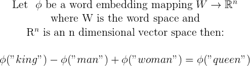
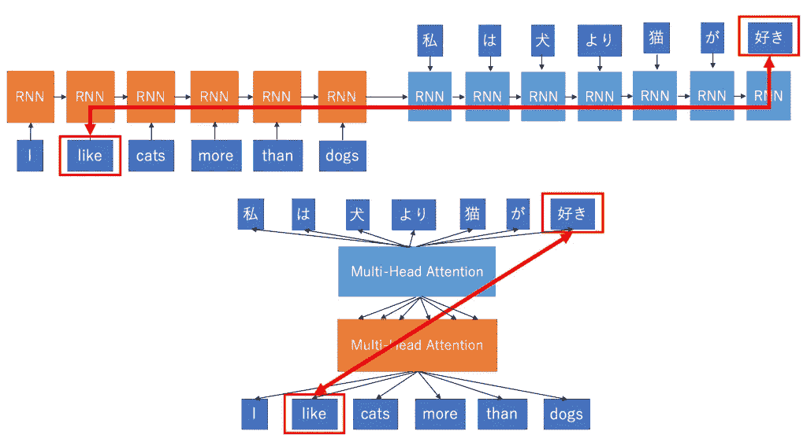
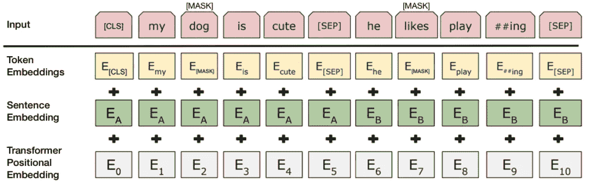
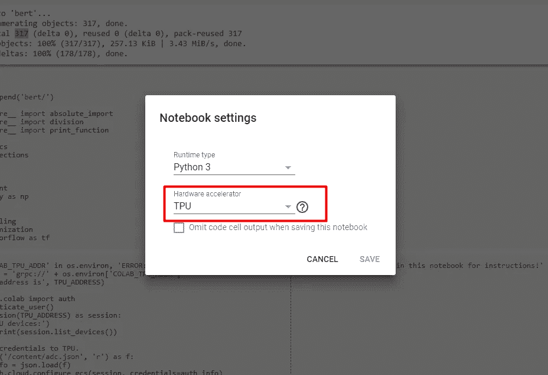

# NLP:来自 BERT 的语境化单词嵌入

> 原文：<https://towardsdatascience.com/nlp-extract-contextualized-word-embeddings-from-bert-keras-tf-67ef29f60a7b?source=collection_archive---------1----------------------->

## 使用 Keras 和 TF 从 BERT 中提取上下文化的单词嵌入


Photo by [Eugenio Mazzone](https://unsplash.com/photos/6ywyo2qtaZ8?utm_source=unsplash&utm_medium=referral&utm_content=creditCopyText) on [Unsplash](https://unsplash.com/search/photos/words?utm_source=unsplash&utm_medium=referral&utm_content=creditCopyText)

毫无疑问，自然语言处理(NLP)研究在相对静止了几年之后已经有了巨大的飞跃。首先，谷歌来自 Transformer (BERT) [1]的双向编码器表示在 2018 年底成为亮点，在许多自然语言处理任务中实现了最先进的性能，不久之后，OpenAI 的 GPT-2 通过承诺更惊人的结果抢了风头，据报道，这些结果太危险了，无法发布！考虑到这些出版物背后的时间框架和参与者，不难意识到目前该领域有很多活动。

也就是说，我们将在这篇文章中关注 BERT，并试图通过提取像 ELMo [3]一样的预训练上下文化的单词嵌入来获得一小块蛋糕。

为了给你一个简要的概述，我将首先给出一点背景知识，然后对 BERT 的体系结构做一个高层次的概述，最后在解释一些棘手的部分的同时跳到代码中。

为了更加方便，我将使用 Google 的 Colab 进行编码，但是相同的代码也可以在您的本地环境中运行，无需做太多修改。

如果您只是为了编码部分而来，请跳到“ **BERT 单词嵌入提取**”部分。在这里找到完成的笔记本代码。

## 单词嵌入

首先，嵌入只是高维向量空间中一个点的(适度)低维表示。同样，单词嵌入是单词在低维空间中的密集向量表示。第一个，利用神经网络的单词嵌入模型由谷歌的研究于 2013 年发表[4]。从那以后，在今天实践中使用的几乎每个 NLP 模型中都遇到了单词嵌入。当然，坦率地说，如此大规模采用的原因是它们的有效性。通过将一个单词翻译成一个嵌入，就有可能以数字形式模拟一个单词的语义重要性，从而对其执行数学运算。为了更清楚地说明这一点，我会给你一个最常见的例子，你可以在单词嵌入的上下文中找到它



当 word2vec 模型首次实现这一点时，这是一个惊人的突破。从那里，许多更高级的模型浮出水面，它们不仅捕捉静态语义，还捕捉语境化的含义。例如，考虑下面的两个句子:

> 我喜欢苹果。
> 
> 我喜欢苹果 macbooks

注意，apple 这个词在每个句子中有不同的语义。现在有了语境化的语言模型，单词 apple 的嵌入将有一个不同的向量表示，这使得它对于 NLP 任务来说更加强大。

然而，我将把如何工作的细节留在这篇文章的范围之外，只是为了保持简短和中肯。

## **变形金刚**

坦率地说，NLP 领域的许多进展都可以归功于一般深度学习研究的进步。更特别的是，谷歌(又来了！)在一篇开创性的论文[5]中提出了一种新的神经网络架构，称为转换器，它比传统的顺序模型(LSTM、RNN、GRU 等)有许多好处。优点包括但不限于，对时间序列中的记号之间的长期依赖性进行更有效的建模，以及通过消除对先前记号的顺序依赖性来更有效地训练模型。

简而言之，转换器是一种编码器-解码器架构模型，它使用注意机制将整个序列的更完整图像一次转发给解码器，而不是按顺序转发，如下图所示。



Source: [http://mlexplained.com/2017/12/29/attention-is-all-you-need-explained/](http://mlexplained.com/2017/12/29/attention-is-all-you-need-explained/)

同样，我不会描述注意力如何工作的细节，因为这将使这个话题更加混乱，更难消化。请随意阅读参考资料中的相关论文。

OpenAI 的 GPT 是第一个创建带有微调的基于转换器的语言模型的人，但更准确地说，他只是使用了转换器的解码器。因此，使**语言建模单向**。放弃编码器的技术原因是，语言建模将成为一项琐碎的任务，因为要预测的单词最终会看到自己。

## 来自变压器的双向编码器表示(BERT)

到目前为止，模型的名称应该更有意义，并给你一个大概的概念。BERT 将所有东西结合在一起，使用编码器而不是解码器来构建一个基于双向转换器的语言模型！为了克服“看到自己”的问题，谷歌的人有了一个巧妙的想法。他们雇佣了**蒙面语言建模**。换句话说，他们隐藏了 15%的单词，并利用它们的位置信息进行推断。最后，他们还稍微混合了一下，让学习过程更有效。

尽管这种方法对收敛时间有负面影响，**它甚至在收敛之前就超过了最先进的模型**，从而确保了模型的成功。

通常，BERT 代表一种支持迁移学习和特定任务微调的通用语言建模，然而，在这篇文章**中，我们将仅通过使用 Keras 和 TensorFlow 从 BERT 中获取 ELMo 类单词嵌入来触及其特征提取方面。**

但是不要着急！在我们进入代码之前，让我们快速探索一下 BERT 的架构，以便我们在实现时有一些背景知识。相信我，这会让事情更容易理解。

事实上，BERT 开发人员创建了两个主要模型:

1.  **基:** *变压器块数(L): 12，隐层尺寸(H): 768，注意头(A): 12*
2.  **大:** *变压器块数(L): 24，隐藏层大小(H): 1024，注意头(A): 16*

在这篇文章中，我将使用基本模型，因为它足够了(而且更小！).

从一个非常高的角度来看，BERT 的架构是这样的:


这看起来很简单，但请记住，每个编码器模块都封装了一个更复杂的模型架构。

在这一点上，为了使事情更清楚，理解 BERT 作者用于微调和特定任务训练的特殊记号是很重要的。这些是:

1.  **【CLS】**:每个序列的第一个令牌。一种分类令牌，通常与 softmax 层一起用于分类任务。对于其他任何事情，可以放心地忽略它。
2.  **【SEP】**:序列定界符 token，用于序列对任务的预训练(即下一句预测)。需要序列对任务时必须使用。当使用单个序列时，它只是附加在末尾。
3.  **【掩码】:**用于掩码字的令牌。仅用于培训前。

接下来，BERT 期望的输入格式如下所示:



Source: [https://arxiv.org/pdf/1810.04805.pdf](https://arxiv.org/pdf/1810.04805.pdf)

因此，与 BERT 一起使用的任何输入都必须进行格式化以匹配上述内容。

**输入层**只是序列记号和特殊记号的向量。上例中的“***# #ing”****记号可能会引起一些人的惊讶，所以为了澄清，BERT 利用了 WordPiece [6]进行记号化，这实际上是将类似“playing”的记号拆分为“play”和“# ing”。这主要是为了涵盖更广泛的*非词汇(OOV)* 词汇。*

***记号嵌入**是每个记号的词汇 id。*

***句子嵌入**只是一个数字类，用来区分句子 A 和 b。*

*最后，**变换器位置嵌入**表示每个单词在序列中的位置。关于这个的更多细节可以在[5]中找到。*

*最后，还有最后一件事。到目前为止，一切都很好，但是我如何从中获得单词嵌入呢？！？如前所述，BERT 基本模型使用了 12 层变换器编码器，**每一层的每一个输出都可以作为一个单词嵌入！**你可能想知道，**哪一个是最好的呢？**嗯，我想这取决于任务，但根据经验，作者认为最好的选择之一是**对最后 4 层求和**，这就是我们将要做的**。***

**

*Source: [http://jalammar.github.io/illustrated-bert/](http://jalammar.github.io/illustrated-bert/)*

*如图所示，最好的执行选项是连接最后 4 层，但在本文中，为了方便起见，使用了求和方法。更具体地说，**性能差异不是很大**，而且**更灵活地进一步截断维度，**不会丢失太多信息。*

## ***伯特单词嵌入提取***

*理论说够了。让我们继续练习。*

*首先，创建一个新的 [Google Colab](https://colab.research.google.com/notebooks/welcome.ipynb#recent=true) 笔记本。进入*编辑- >笔记本*设置，确保硬件加速器设置为 TPU。*

**

*现在，第一个任务是克隆官方的 BERT 存储库，将它的目录添加到 path 中，并从那里导入适当的模块。*

```
*!rm -rf bert
!git clone [https://github.com/google-research/bert](https://github.com/google-research/bert)import syssys.path.append('bert/')from __future__ import absolute_import
from __future__ import division
from __future__ import print_functionimport codecs
import collections
import json
import re
import os
import pprint
import numpy as np
import tensorflow as tfimport modeling
import tokenization*
```

*从 BERT 导入的两个模块是**建模**和**标记化**。建模包括 BERT 模型实现，而标记化显然是为了标记化序列。*

*除此之外，我们从 colab 获取我们的 TPU 地址，并初始化一个新的 tensorflow 会话。(注意这只适用于 Colab。本地运行时，不需要)。如果您在运行下面的块时看到任何错误，请确保您使用 TPU 作为硬件加速器(见上文)*

*接下来，我们选择想要使用的 BERT 模型。*

*正如你所看到的，有三种模型可供我们选择，但实际上，在官方的 BERT GitHub 资源库中甚至有更多预先训练好的模型可供下载。这些只是已经被谷歌下载并存放在一个开放的桶中的模型，因此可以从合作实验室访问。(对于本地使用，您需要下载并提取一个预先训练好的模型)。*

*回想一下之前的参数:12 L(变形块)768 H(隐藏层大小)12 A(注意头像)。“不区分大小写”只适用于小写序列。在本例中，我们将使用无案例的 BERT 基本模型。*

*此外，我们为模型定义了一些全局参数:*

*上面的大多数参数都是不言自明的。在我看来，唯一有点棘手的是层数组。回想一下，我们使用的是 12 个隐藏编码器的最后 4 层。因此，层保持它们的索引。*

*下一部分将专门为处理前和处理后的输入定义包装类(特性)。*

*在 ***InputExample*** 类中，我们已经将 *text_b* 默认设置为 *None* ，因为我们的目标是使用单个序列而不是序列对。*

*而且 ***InputFeatures*** 类封装了 BERT 输入需要的特性(见上面的输入图)。 *tokens* 属性显然是输入记号的向量， *input_ids* 是与词汇表中的记号相对应的 id， *input_mask* 从填充中注释真实的记号序列，最后， *input_type_ids* 将段 A 与段 B 分开，因此它在这里实际上并不相关。*

*现在，添加以下代码:*

*这是为了设置我们的估计器。估计器只是 tensorflow 提供的模型的抽象，以及用于训练、评估和预测的 API。因此，我们的定制估算器是 BertModel 的包装器。诚然，有部分代码可以从上面删除，但我坚持谷歌提供的例子只是为了保持一致。重要的部分是第 60 行——在这里定义了 bert 模型——和第 100 行,在这里提取了前 4 层的预测。*

*继续添加以下内容:*

*这是负责输入处理的函数。换句话说，它将*输入样本*转换为*输入特征*。*

*除此之外，我们还创建了一个函数，用于将一个普通的字符串序列转换成 *InputExample* :*

*现在，对于代码的最后一位，我们定义了一个函数，该函数接受一个字符串数组作为参数，接受嵌入输出的所需维度(max 768 ),并返回一个字典，将令牌作为键，将嵌入向量作为值。*

*上面的代码片段简单地构建了估计器，并基于给定的输入调用预测。*

*让我们通过运行以下命令来测试我们的模型:*

```
*embeddings = get_features([“This is a test sentence”], dim=50)
print(embeddings)*
```

*如果一切顺利，您将拥有一个包含每个令牌大小为 50 的嵌入的字典。请记住，这些是上下文化的嵌入，所以如果您在不同的序列上有重复的标记，那么只有最后一个标记的嵌入会保留在字典中。要保留两者，请用不同的数据结构替换字典。*

*你可以在这里找到完整的笔记本。*

## *未来的工作*

*现在，这些嵌入可以用作为定制任务构建的其他模型的输入特性。然而，我将把它留到另一篇文章中。或者甚至可以实现一个 BERT Keras 层来实现无缝嵌入集成。*

## *结论*

*这都是我给你们的。我希望你喜欢这篇文章，并希望对伯特有一个更清晰的了解。欢迎在评论区发表您的反馈或问题。*

# *参考资料:*

*[1] J.Devlin，M. Chang，K. Lee 和 K. Toutanova， [BERT:用于语言理解的深度双向转换器的预训练](https://arxiv.org/abs/1810.04805) (2018)*

*[2]，Alec，Wu，Jeff，Child，Rewon，Luan，David，Amodei，Dario，Sutskever，Ilya，[语言模型是无监督多任务学习器](https://github.com/openai/gpt-2) (2019)*

*[3] M. Peters，M. Neumann，M. Iyyer，M. Gardner，C. Clark，K.Lee 和 L.Zettlemoyer，[深度语境化的词语表征](https://arxiv.org/abs/1802.05365) (2018)，计算语言学协会北美分会*

*[4] T.Mikolov，I. Sutskever，K. Chen，G. Corrado 和 J. Dean，[单词和短语的分布式表示及其组合性](https://arxiv.org/pdf/1310.4546.pdf) (2013)*

*[5]A .瓦斯瓦尼、n .沙泽尔、n .帕尔马、j .乌兹科雷特、l .琼斯、A .戈麦斯、l .凯泽和 I .波洛苏欣，[注意力是你所需要的全部](https://arxiv.org/pdf/1706.03762.pdf) (2017)*

*[6]吴、舒斯特、陈、乐、、马切里、克里昆、曹、高、马切里、克林纳、沙阿、约翰逊、刘、Kaiser、S. Gouws、Y. Kato、T. Kudo、H. Kazawa、K. Stevens、G. Kurian、N. Patil、W. Wang、C. Young、J. Smith、J. Riesa、A. Rudnick、O. Vinyals、G. Corrado、M. Hughes 和 J. Dean [谷歌的神经机器翻译系统:弥合人类和机器翻译之间的鸿沟](https://arxiv.org/pdf/1609.08144.pdf) (2016)*