# 面向初学者的 NLP:清理和预处理文本数据

> 原文：<https://towardsdatascience.com/nlp-for-beginners-cleaning-preprocessing-text-data-ae8e306bef0f?source=collection_archive---------2----------------------->

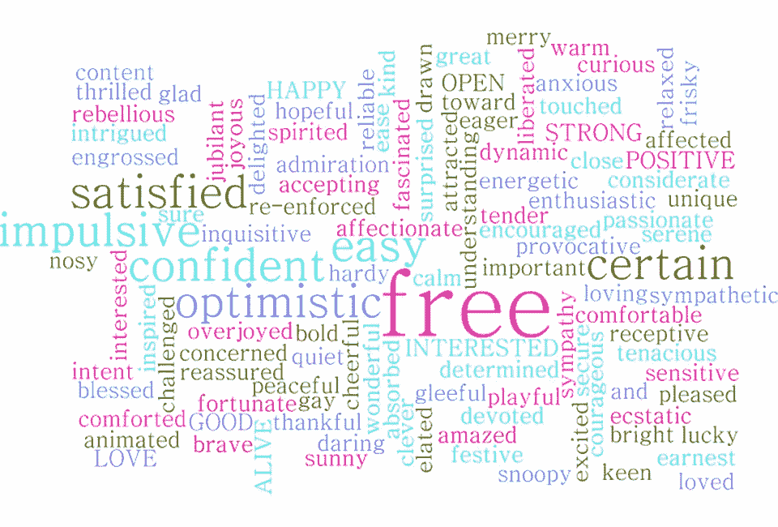

NLP 是自然语言处理的缩写。你可能知道，计算机不像理解数字那样擅长理解单词。这一切都在改变，尽管 NLP 的进步每天都在发生。事实上，苹果的 Siri 和亚马逊的 Alexa 等设备可以(通常)理解我们询问天气、方向或播放某种类型的音乐，这些都是自然语言处理的例子。你的电子邮件中的垃圾邮件过滤器和你在小学学会打字后使用的拼写检查是你的计算机理解语言的一些其他基本例子。

作为一名数据科学家，我们可能会使用 NLP 进行情感分析(将单词分类为具有正面或负面含义)，或者在分类模型中进行预测，等等。通常情况下，无论我们是得到数据还是不得不搜集数据，文本都是自然的人类格式的句子、段落、推文等。在我们开始分析之前，我们必须做一些清理工作，将文本分解成计算机容易理解的格式。

对于这个例子，我们正在检查亚马逊产品/评论的数据集，可以在 [data.world](https://data.world/promptcloud/fashion-products-on-amazon-com) 上找到并免费下载。我将在 Jupyter 笔记本中使用 Python。

以下是使用的导入:

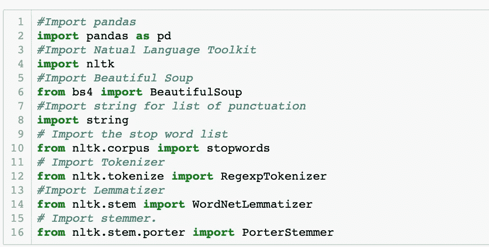

(如果您以前从未使用过，您可能需要在单元格中运行`nltk.download()`。)

读入 csv 文件，创建数据框并检查形状。我们从 10，000 行和 17 列开始。每一行都是亚马逊上不同的产品。

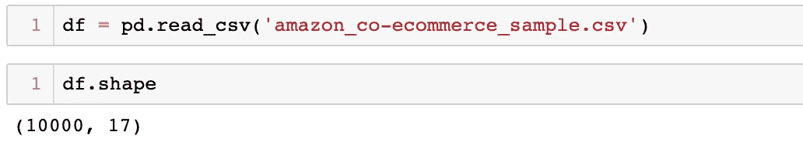

我进行了一些基本的数据清理，现在我不会详细介绍，但如果你想要一些提示，你可以在这里阅读我关于 EDA [的帖子。](/the-basics-of-eda-with-candy-83b2e8ad9e63?source=your_stories_page---------------------------)

为了使本例的数据集更易于管理，我首先删除了空值过多的列，然后删除了所有剩余的空值行。我将`number_of_reviews`列的类型从 object 改为 integer，然后创建了一个新的 DataFrame，只使用不超过 1 个 review 的行。我的新形状是 3705 行 10 列，我把它重新命名为`reviews_df`。

*注意:如果我们真的要使用这个数据集进行分析或建模，或者除了文本预处理演示之外的任何事情，我会建议* ***而不是*** *删除这么大比例的行。*

下面的工作流程是我被教导使用和喜欢使用的，但是步骤只是让你开始的一般建议。通常我必须根据文本格式进行修改和/或扩展。

1.  删除 HTML
2.  标记化+去除标点符号
3.  删除停用词
4.  词汇化或词干化

在清理这些数据时，我遇到了一个以前从未遇到过的问题，并从[geeksforgeeks.org](https://www.geeksforgeeks.org/python-pandas-split-strings-into-two-list-columns-using-str-split/)那里学到了一个很酷的新技巧，将一列中的字符串按照空格或指定字符拆分成多列。

我最感兴趣的列是`customer_reviews`，但是，仔细一看，它目前在由`//`分隔的一个单元格中包含评论标题、评级、评论日期、客户名称和评论。

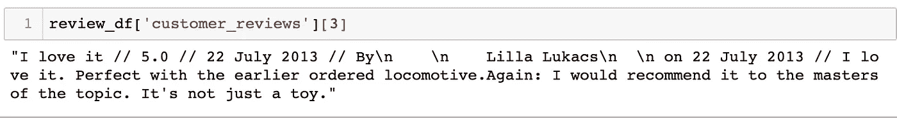

熊猫`.str.split`的方法可以适用于一个系列。第一个参数是你想要分割的字符串的重复部分，`n=`最大分割数，`expand=True`将分割成新的列。我将 4 个新列设置为一个名为`reviews`的新变量。

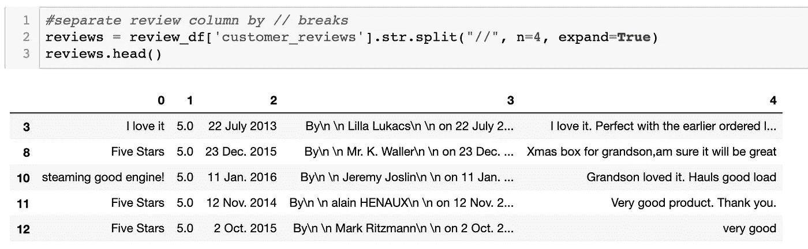

然后可以在原来的`reviews_df`中重命名新的 0，1，2，3，4 列，去掉原来乱七八糟的列。

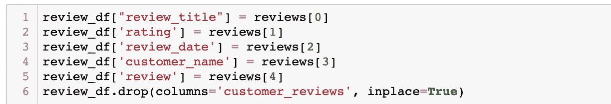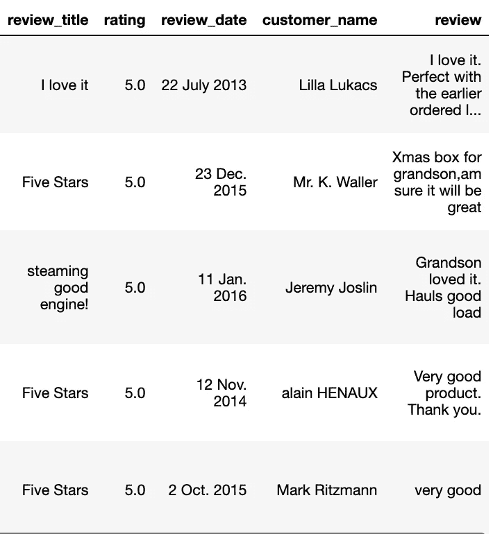

我对新的`customer_name`列运行相同的方法，在`\n \n`上进行拆分，然后删除第一列和最后一列，只留下实际的客户名称。如果这是一篇更长的文章，我们还可以做更多的事情！马上，我可以看到名字和日期仍然可以使用一些清洗，把他们放在一个统一的格式。

**删除 HTML** 是我这次没有做的一个步骤，但是，如果数据来自网络抓取，从这个步骤开始是个好主意。这是我会使用的函数。

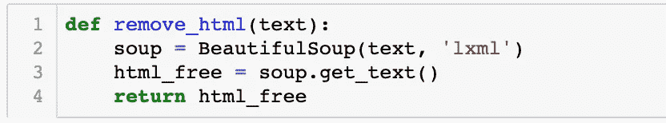

几乎每一步都包括创建一个函数，然后将其应用于一个系列。做好准备，lambda 函数将很快成为你的新朋友！您也可以构建一个函数来一次性完成所有这些工作，但是我想展示分解并使它们更容易定制。

**去掉标点符号**:

一种方法是通过 list comprehension 循环遍历整个系列，并保留不在`string.punctuation`中的所有内容，这是我们在开始时用`import string`导入的所有标点符号的列表。

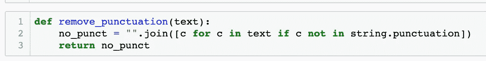

“ “.join will join the list of letters back together as words where there are no spaces.

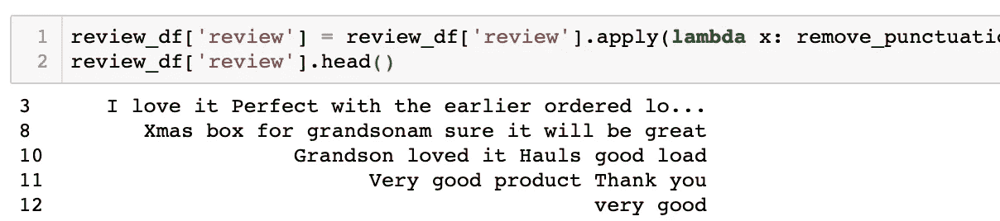

If you scroll up you can see where this text previously had commas, periods, etc.

然而，正如您在上面的第二行输出中看到的，这个方法没有考虑用户输入错误。客户输入了“孙子，am**”**，一旦去掉逗号，这个单词就变成了一个单词“grandsonam**”**。我仍然认为如果你需要的话，知道这些是很方便的。

**符号化**:

这使用正则表达式(也称为 RegEx)根据指定的模式将字符串分解成单词或片段的列表。我这次选择使用的模式(`r'\w'`)也去掉了标点符号，尤其是对于这些数据来说，这是一个更好的选择。我们还可以在 lambda 函数中添加`.lower()`，让所有内容都变成小写。

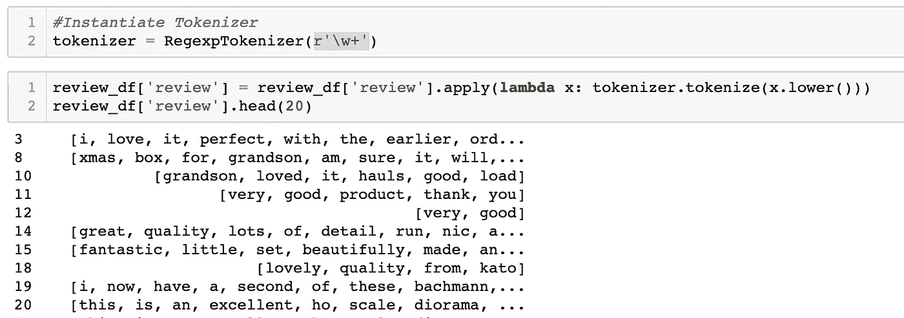

see in line 2: “grandson” and “am” are now separate.

正则表达式的其他一些例子有:

`‘\w+|\$[\d\.]+|\S+’` =按空格或不与数字相连的句点分割

`‘\s+’, gaps=True` =获取除空格以外的所有内容作为令牌

`‘[A-Z]\w+’` =只有以大写字母开头的单词。

**删除停止字**:

我们在开头用`from nltk.corpus import stopwords`从 NL 工具包中导入了一个最常用单词的列表。您可以运行`stopwords.word(insert language)`来获得每种语言的完整列表。有 179 个英语单词，包括'我'，'我'，'我自己'，'我们'，'你'，'他'，'他的'，例如。我们通常希望删除这些，因为它们的预测能力较低。有些时候你可能想保留它们。例如，如果您的语料库非常小，删除停用词会使单词总数减少很大一部分。

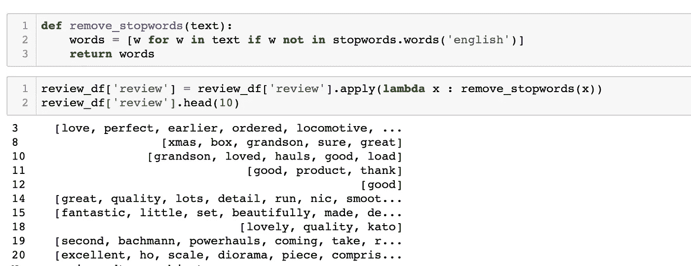

**词干化&词汇化**:

这两种工具都将单词缩短回其词根形式。词干有点激进。它会根据常见的前缀和/或词尾进行删减。它有时会有所帮助，但并不总是如此，因为很多时候新单词是如此的根以至于失去了它的实际意义。另一方面，词汇化将常见单词映射到一个库。与词干提取不同，它总是返回一个可以在字典中找到的合适的单词。我喜欢比较两者，看哪一个更适合我的需要。我通常更喜欢 Lemmatizer，但令人惊讶的是，这一次，词干似乎有更多的影响。

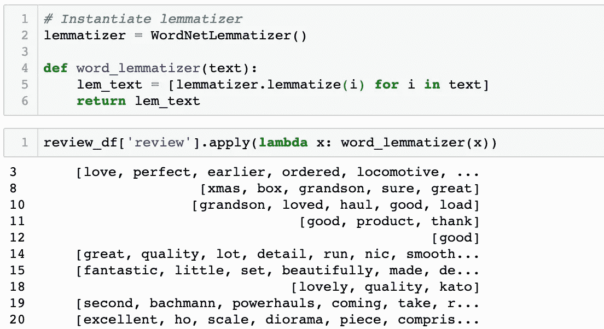

Lemmatizer: can barely even see a difference

你在斯特梅尔身上看到了更多的不同，所以我会保留这一点。因为这是最后一步，所以我在函数中添加了`" ".join()`来将单词列表连接在一起。

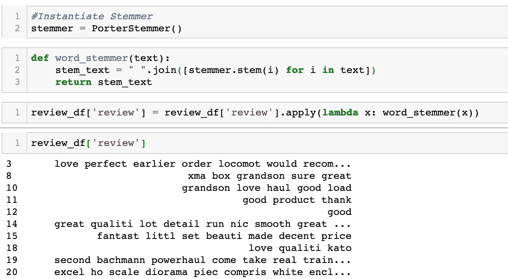

现在你的文本已经可以被分析了！您可以继续使用这些数据进行情感分析，可以使用评级或制造列作为基于单词相关性的目标变量。也许建立一个基于用户购买或商品评论或客户分类的推荐系统。可能性是无限的！

[https://pixabay.com/photos/thank-you-neon-lights-neon-362164/](https://pixabay.com/photos/thank-you-neon-lights-neon-362164/)