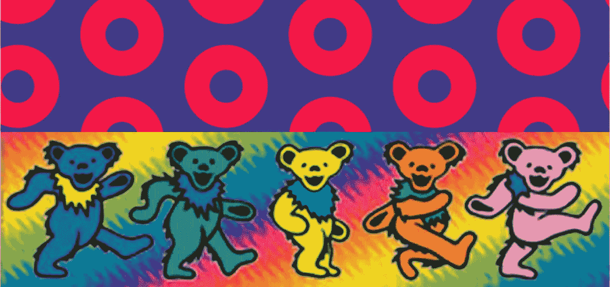
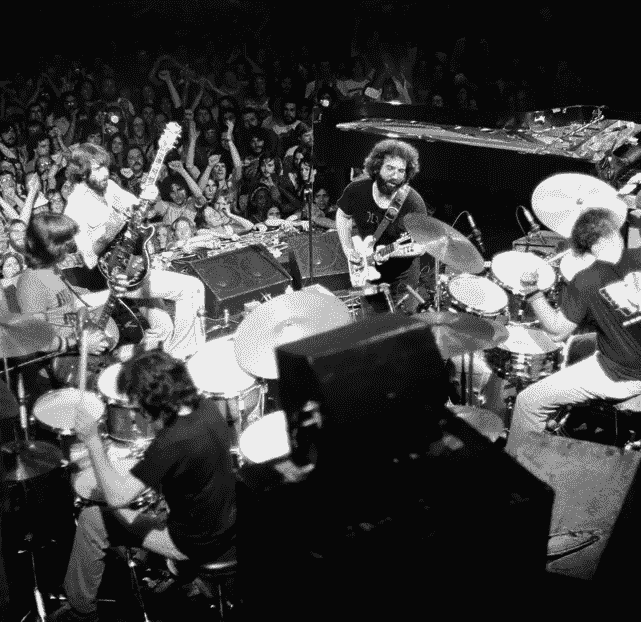
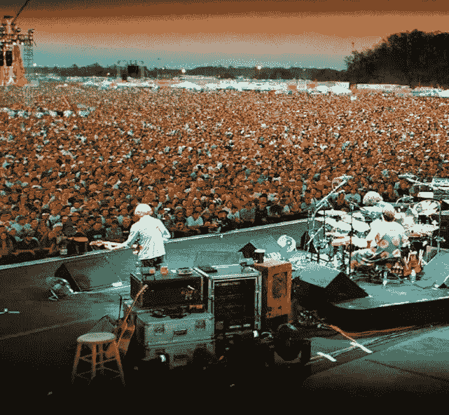
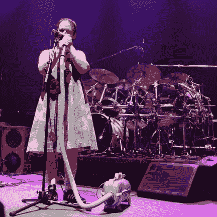
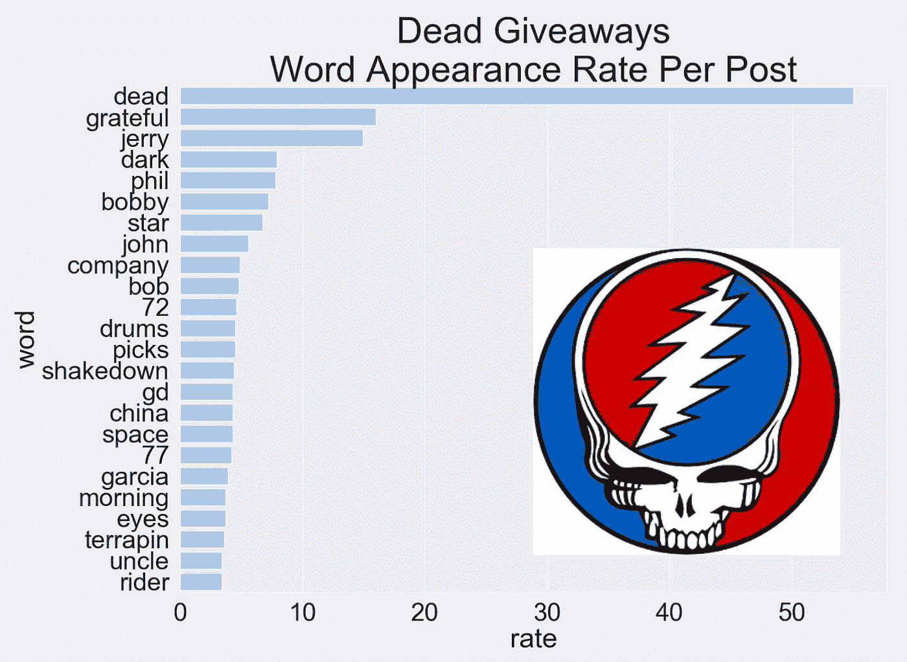
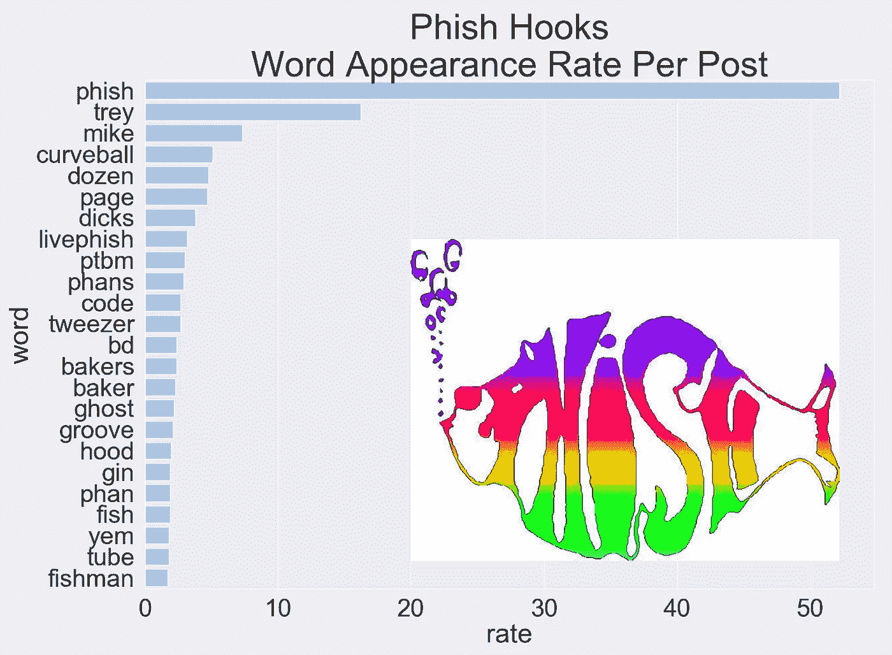

# NLP 果酱:感恩而死和费西合唱团

> 原文：<https://towardsdatascience.com/nlp-jam-the-grateful-dead-and-phish-4933063361d2?source=collection_archive---------26----------------------->

## 在这篇博文中，我将分享我在数据科学训练营中完成的一个项目。

# 介绍

我的数据科学训练营班级被分配了构建 NLP 模型的任务，该模型将接收 reddit 帖子，并根据文本将其分类为属于某个子编辑。项目的第一步是选择两个不同的子街道。

感恩而死乐队和费西合唱团经常被联系在一起，因为这两个乐队有着类似的艺术手法，这与大多数音乐不同，因为他们强调现场音乐会表演而不是录音室专辑。这两个粉丝群都很早就开始使用互联网，所以他们有非常活跃的 reddit 页面以及其他几个在线论坛。作为一个对这两个乐队都着迷的人，感恩而死乐队和费西合唱团·萨伯雷迪兹乐队似乎是一个显而易见的选择。

乐队的简短描述:

The Grateful Dead

感恩而死在 60 年代作为旧金山反文化运动的一部分而声名鹊起。他们吸收了各种音乐的影响——蓝草音乐、古典音乐、民谣、乡村音乐、蓝调音乐、爵士乐——并形成了自己独特的音乐风格。他们开创了一种演奏独特音乐会的风格，主要是即兴演奏。由于他们的演唱会与众不同，他们吸引了粉丝，这些粉丝成为了狂热的追随者，以至于一些粉丝会和乐队一起“巡演”。感恩而死的粉丝被称为“死鬼”。

Phish

费西合唱团成立于 1983 年，当时他还是大学生，并很快开发了一个疯狂原创的声音和歌曲目录。在大约 10 年内，他们在全国范围内拥有了自己的铁杆粉丝。尽管有不同的音乐影响和风格，他们遵循感恩而死的模式，使他们的音乐会与众不同，并强调他们的表演即兴。显然，他们的粉丝被称为“费西合唱团头”。

如果你对这几个乐队的音乐感兴趣，我会在这篇文章的最后链接到几个签名音乐。很明显，你能从一首歌或一段音乐中分辨出的东西是有限的，但是我希望能告诉你以下几点:

*就乐队的乐器构成而言，有一些音乐上的相似之处，但总体而言，音乐风格相当独特。与此同时，这些乐队有一个共同的音乐表演方法，他们用自己的歌曲作为即兴创作空间的发射台。*

对我来说，这是比较费西合唱团和死者最有趣的地方之一。有时候，我觉得有一种普遍的误解，认为这两个乐队有非常相似的音乐，但我认为真正将这些乐队联系在一起的是他们的粉丝。

死脑筋和费西合唱团头脑是出了名的忠诚。两个乐队都有数百首歌曲，任何给定的音乐会都由这些歌曲的一些样本组成，无论这些歌曲的顺序是在表演时自发构建的。此外，许多歌曲都附加了即兴部分，每个人的表演都不一样。结果是每场音乐会都是一场独特的演出。这也是为什么这些粉丝会不远千里重复观看演出的原因。对我来说，这表明了这两个歌迷群体在如何联系和消费音乐，以及他们如何对待生活方面的相似之处。

由于这种相似性，我希望——除了乐队本身的主要讨论主题——这两个留言板在某种程度上是可以互换的。这两个论坛大概都包含了很多关于音乐的类似讨论。这两个论坛可能都包含了很多关于时事、个人故事、哲学等各种各样的讨论。关键是，我确信有很多帖子，即使是像我这样的相关专家也能够准确分类。最重要的是，这也是我为什么要建立一个模型来对来自这些子主题的帖子进行分类的原因——我的 NLP 分类器会像经常访问这些留言板的人一样准确吗？

也许是这样，也许不是…

# 假设

I can tell your future, just look what’s in your hand…

在进行任何数据收集之前，我对 NLP 分类模型的性能有一些想法。

1.  我认为建立一个精确的模型是相当简单的。这是基于这样一种想法，即会有许多特定于乐队的术语反复出现。这可能是像乐队成员姓名、歌曲名称、专辑名称或乐队不重叠的年份这样的词。我认为这些子主题的大部分帖子至少会包含一些这类术语。
2.  我认为一个模特很难对模糊的帖子进行分类。我认为会有很多帖子不会明确提到任何一个乐队。
3.  我认为该模型在分类“交叉”帖子时会有挑战，其中一个乐队在另一个乐队的子编辑中被讨论。由于两个乐队都有很多粉丝，我知道这种讨论确实经常发生。

# 数据

这个分析的数据是使用 Reddit pushshift API 收集的。我从这些子主题中收集了大约 6000 篇帖子，时间跨度大约为两年。我只收录了原帖标题和“自文”，没有收集到相应的评论。

The data called for some routine cleaning…

一旦有了数据，我必须执行一些数据清理操作:

*   数据包含不包含任何“自我文本”的条目。这是用户附加到帖子上的文本，独立于帖子的标题。这些空值被替换为空白单元格。
*   许多条目包含不代表用户语言的文本，如“\n”、“[已删除]”、“[已删除]”或 URL。这些都是从数据中过滤出来的(扔掉你最终不需要的东西)。
*   我对文本进行了词条分类，以便将具有相同词根的单词组合在一起(保留重要的内容)。

这样做之后，数据就可以进行分析了。

# 建模

让我们认真对待事实真相吧！

我在分析中尝试了以下模型:

*   计数矢量化逻辑回归
*   计数矢量化的朴素贝叶斯
*   采用 TF-IDF 矢量化的逻辑回归
*   带 TF-IDF 矢量化的朴素贝叶斯
*   计数矢量化的支持向量机
*   带计数矢量化的随机森林
*   具有 TF-IDF 矢量化的支持向量机
*   带 TF-IDF 矢量化的随机森林

所有的模型都表现得相当准确，而且它们都有相当大的差异。

逻辑回归模型和朴素贝叶斯模型的精确度最高，但差异最大(约 90%的测试精确度/~99%的训练精确度)。

随机森林模型减少了方差，但是具有最大的偏差(大约 90%的测试精度/大约 85%的训练精度)。

带有 TF-IDF 矢量化的支持向量机模型是我的首选模型。它具有最低的方差，并且其测试精度足够接近表现最好的逻辑回归/朴素贝叶斯模型。该模型对测试数据分类的准确率为 90%，对训练数据分类的准确率为 94%。

# 结果

在这一部分，我将浏览一些我认为最有趣的结果。

在每个子编辑的帖子中，哪些区别词出现得最频繁？

我想找出哪些区别词或“流行语”在这些子词中最常见。这些词特指某个乐队。它们大多是乐队成员的名字、歌曲标题和相关日期。有趣的是，这些词中有许多在两个论坛中都频繁出现，所以仅仅出现一个流行语不足以做出准确的分类，尽管它可能是一个强有力的指标。

Buzzwords that appeared most frequently on the Dead subreddit

Buzzwords that appeared most frequently on the Phish subreddit

***哪些词在误分类帖子中出现频率最高？***

在调查分类错误的帖子时，我研究了哪些词出现得最频繁。为了构建下面的情节，我把普通的词过滤掉了。

Words that appeared most frequently in misclassified posts

死子旋涡和费西合唱团子旋涡的错误分类比例是多少？

有 161 个死帖被错误分类，相比之下，费西合唱团有 142 个帖子被错误分类。这个看起来比较平衡。看看这种趋势是否能在更大样本的结果中保持下去将会很有趣。这种轻微的不平衡可能是因为费西合唱团论坛包含了更多针对乐队的讨论，因为他们仍然是一个活跃的乐队，而感恩而死乐队的成员现在在场外表演。

***哪些类型的帖子容易分类错误？***

浏览错误分类的帖子时，我注意到有一些常见类型的帖子模型很难正确分类:

*   与门票交易/销售相关的帖子经常被错误分类，因为这些帖子往往主要涉及日期、地点和位置。

一些例子:

> 最好的换票地点？我不是要硬着头皮或超越面值，只是想用我的 GA 换一个好的硬座。矮老婆意味着我需要第一排。
> 
> 有人拿到票了吗？想知道价格范围是多少，这样我就知道该把什么放在一边，谢谢！
> 
> 芝加哥门票警告…对于所有寻找便宜芝加哥门票的人来说，不要从 Craigslist 购买硬票。现在 CL 上到处都是假票。就像棕色的酸。离远点。但是如果你想尝试，那就去买彩票吧。注意安全，聪明点

*   在一个乐队的子编辑中提到另一个乐队的帖子自然容易被错误分类

一些例子:

> 到今天为止，特雷比杰瑞活得久。永远感激我们能够听到和看到他们每个人。他们对音乐的贡献将会持续很长时间。
> 
> 我在 Dead subreddit 上发了帖子，但是还有其他以感恩而死/网络钓鱼/甜蜜乐队为主题的梦幻棒球联盟吗？
> 
> 1997 年秋，1977 年春，逝者乐队发行了 1977 年 5 月的套装和今年的康奈尔。我想现在是费西合唱团发布 97 秋季套装的时候了。今年夏天我花了很多时间听这两个巡演，他们都以自己的方式分享了好的放克，有着理想的能量和紧绷感。只是想说出来。我要我那该死的套装。

*   没有明确提到任何一个乐队的模糊帖子自然有被错误分类的倾向。

一些例子:

> YouTube 上最喜欢的完整节目？考虑今晚上演一出老剧。你会推荐什么？
> 
> 谁知道星期天在凤凰城的表演结束后，我可以把车停在哪里？
> 
> 你在场地上对邪教有什么体验？我一直在读关于十二个部落的书，并且很有兴趣听听你和他们或者任何其他邪教的冲突。我想写一篇关于它们的研究论文。你认为它们太危险了，不能去吗？谢谢！

声明似乎最终都是徒劳的…

# 结论

在测试各种不同的 NLP 模型时，这是一个有用的练习。我认为我的模型的性能总体来说相当不错，但仍有改进的潜力。

总的来说，我的假设——模型可能是准确的，但在某些类型的职位上容易被错误分类——被证明是正确的。

我的第一个想法是在未来改进这个模型，获取更多的数据。为此，我要么获取更多的帖子，要么包含我在建模过程中分析的每个帖子的评论文本。拥有更大的数据集将允许模型学习更多特定于乐队的流行语，并且它将允许模型潜在地辨别任何正在进行的内部笑话或重复出现的引用，这些引用是一个子编辑或另一个子编辑所独有的。

正如我的假设所反映的那样，我认为在这些子主题之间对帖子进行分类的任何模型中都存在一些不可避免的偏差是合理的。这两个子主题都包含了大量关于音乐和音乐会的类似对话，并不一定专门针对任何一个乐队。此外，两个留言板都包含了很多关于其他乐队的对话。费西合唱团和感恩而死乐队有很多粉丝，在两个子栏目中也有很多关于这两个乐队的讨论。

有趣的是，每个乐队的一些热门词汇在两个子栏目中都很常见。由于论坛之间有很多交叉讨论，“费西合唱团”和“死亡”是这样的词，虽然特别有可能出现在各自的子主题中，但也很有可能出现在其他子主题中。这意味着，仅仅有一个“流行语”不足以对每个帖子进行正确分类。这可能是许多错误分类的一个因素。

有趣的是，用另外两个在粉丝群方面联系不那么紧密的子乐队来重复这个练习。在两个非音乐子唱片上重复这个练习也是很有趣的。我想知道准确性如何比较，以及同类模型是否会成为最佳模型。

谢谢你迁就我！我相信你和我一样觉得这很有趣。不知何故，我继续寻找新的方式来娱乐费西合唱团和死者。在发展我对 NLP 的理解以及随之而来的工具方面，我还有很长的路要走，但至少我很享受这一过程！

最后，让空气中充满歌曲…

10/18/74 Dark Star — Winterland Ballroom

10/20/13 Tweezer — Hampton Coliseum