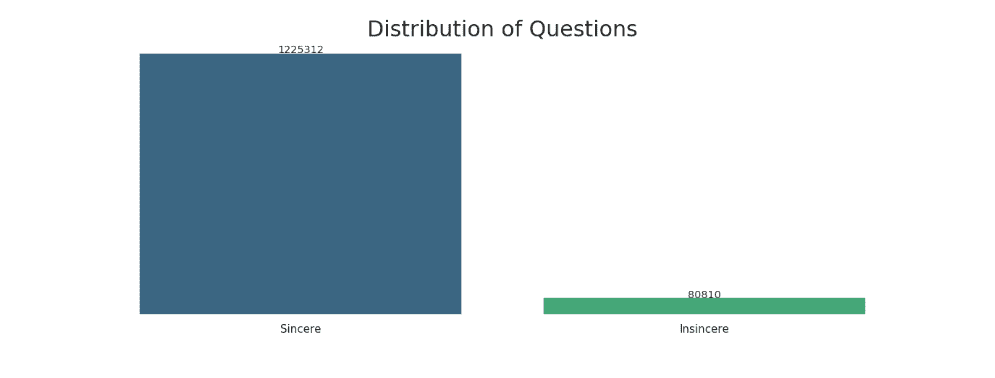
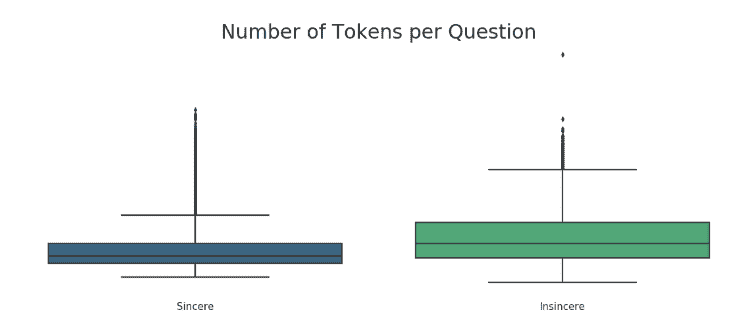
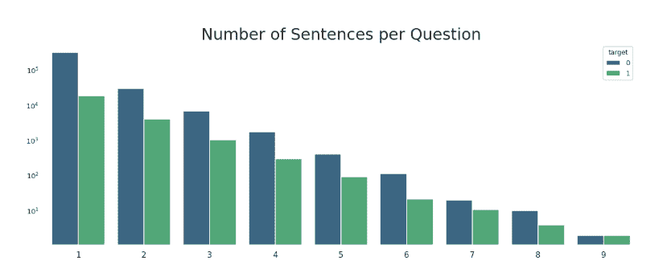
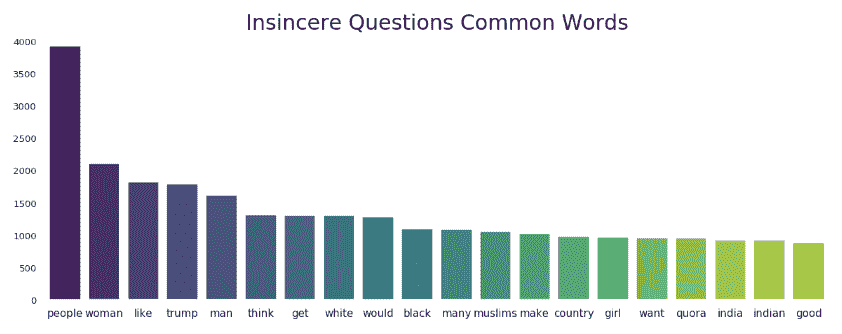
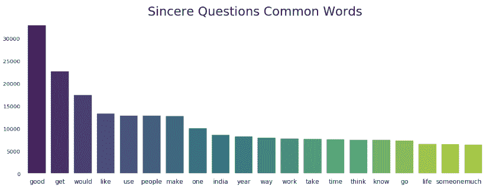

# Kaggle 的 NLP 竞赛入门

> 原文：<https://towardsdatascience.com/nlp-kaggle-competition-a3f22ecbbe6f?source=collection_archive---------22----------------------->

## NLP 入门笔记本和探索性数据分析

Photo by [Jon Tyson](https://unsplash.com/photos/RUsczRV6ifY?utm_source=unsplash&utm_medium=referral&utm_content=creditCopyText) on [Unsplash](https://unsplash.com/search/photos/question?utm_source=unsplash&utm_medium=referral&utm_content=creditCopyText)

Quora 不真诚问题分类竞赛是一项自然语言处理任务，目标是预测问题的意图是否真诚。

[Quora](https://www.quora.com/) 是一项帮助人们互相学习的服务。在 Quora 上，人们提问和回答问题——提供这种服务的一个关键挑战是过滤掉不真诚的问题。Quora 试图过滤掉有毒和分裂的内容，以维护他们的政策:

> 友善点，尊重点。

# 什么是不真诚的问题？

一个不真诚的问题被定义为一个旨在陈述而不是寻找有用答案的问题。根据 [Kaggle 竞赛](https://www.kaggle.com/c/quora-insincere-questions-classification/data)的描述，一个言不由衷的问题的特征包括:

## 有非中性声调的:

*   用夸张的语气来强调一群人的观点。
*   是修辞性的，意在暗示对一群人的陈述。

## 具有贬义或煽动性:

*   提出针对受保护人群的歧视性观点，或寻求对刻板印象的确认。
*   对特定的人或人群进行诋毁性的攻击/侮辱。
*   是基于一群人的古怪前提。
*   贬低一种不可修正和不可测量的特性。

## 并不基于现实:

*   基于错误的信息，或包含荒谬的假设。
*   使用性内容(乱伦，兽交，恋童癖)来获得震撼价值，而不是寻求真正的答案。

基本上，任何问题的意图都是愤怒或冒犯，而不是为了获取信息。一些不真诚的问题包括:

*   为什么中国人讨厌唐纳德·特朗普？
*   去伊朗旅行的美国人有精神疾病吗？

我们可以清楚地看到，这些问题旨在煽动而不是获取信息，需要从 Quora 的平台上排除。

# 预期的困难

## 大型数据集

训练数据超过一百万行。我预计在处理大型数据集时会有挑战。挑战可能包括遇到内存错误和过长的处理时间。

为了应对大型数据集，可以尝试几种技术，包括使用较小的数据样本进行训练和降维。我预计功能选择和工程以及模型优化将是重要的。

## 不平衡数据集

数据集非常不平衡，只有 6%的样本属于目标(不真诚)类。我预计这将导致召回的挑战。最大化回忆，或真正的阳性率，在这里可能是一个困难，因为少量的虚假样本。我预计重采样技术和数据扩充可以提高模型性能。

## 向他人学习的重要性

正如[威尔·科尔森](https://towardsdatascience.com/@williamkoehrsen)在他的[住宅信贷违约风险篇](/machine-learning-kaggle-competition-part-one-getting-started-32fb9ff47426)中所说:

> 数据科学家不是站在巨人的肩膀上，而是站在成千上万为了所有人的利益而公开其工作的个人的背上。

他称 Kaggle 竞赛为“合作项目”，这是千真万确的。Kaggle 社区非常支持，不仅是学习新技术和技能的好地方，也是挑战自我提高的好地方。

# 探索性分析

这个[的第一个笔记本](https://www.kaggle.com/tboyle10/quora-insincere-questions-eda)被设计用来熟悉手头的问题，并设计一个前进的策略。

一个很好的开始是想象我们目标的分解。

Distribution of Questions

从上面的图中我们可以看到我们有一个阶级不平衡的问题。

Comparison of Number of Tokens per Question

上面的图显示了每个类别中标记数量的显著差异。这可以通过完成 t 检验来证实:

*   t 值:-106.72
*   p 值:0

Number of Sentences per Questions (plotted on log scale)

通过 t 检验，每个问题的句子数量的差异也被确认为显著:

*   t 值:-56.09
*   p 值:0

另一件有趣的事情是在真诚和不真诚的问题中出现的最常见的单词。

Insincere Questions Most Common Words

Sincere Questions Most Common Words

# 阶级不平衡

正如我们上面看到的，我们有一个阶级不平衡的问题。

不平衡类是机器学习分类中的一个常见问题，其中每个类中的观察值比例不成比例。(在这篇[帖子](https://medium.com/@terrah27/methods-for-dealing-with-imbalanced-data-5b761be45a18)中，我探索了处理阶级不平衡的方法。)

只有 6.6%的数据集属于目标类，我们肯定会有一个不平衡的类！

这是一个问题，因为许多机器学习模型被设计成最大化整体准确性，特别是对于不平衡的类，这可能不是使用的最佳度量。

分类准确度被定义为正确预测的数量除以总预测数乘以 100。例如，如果我们简单地预测所有问题都是真诚的，我们将获得 93%的分类准确率！

# 竞争指标

在继续创建基线模型之前，了解我们的竞争指标很重要。

这项比赛使用 F1 分数，它平衡了精确度和召回率。

*   精度是真正肯定的数量除以所有肯定的预测。精度也叫阳性预测值。它是对分类器准确性的一种度量。低精度表示大量的误报。
*   召回率是测试数据中真阳性的数量除以阳性值的数量。回忆也称为敏感度或真实阳性率。它是对分类器完整性的一种度量。低召回率表示大量的假阴性。

# 数据准备

因为我们有一个不平衡的数据集，所以我们将对多数类进行缩减采样，使其等于少数类的大小。这不仅会平衡我们的数据集，还会由于训练数据中样本数量的减少而减少处理时间。

在建模之前，我们使用 [Gensim](https://radimrehurek.com/gensim/) 应用一些基本的文本预处理。

Gensim 是一个很棒的 NLP 库——它的速度非常快，并提供了文本清除和 n-gram 生成的工具——我们在这个[基线建模内核中使用了这两种工具。](https://www.kaggle.com/tboyle10/baseline-models-with-downsampling)

# 基线模型

对于我们的基线模型，我们将尝试:

*   逻辑回归:分类的线性模型。它们训练和预测速度快，伸缩性好，易于解释，因此是基线模型的良好选择。
*   朴素贝叶斯:这些分类器训练速度非常快，可以很好地处理高维稀疏数据，包括文本。它们是基于应用[贝叶斯定理](https://en.wikipedia.org/wiki/Bayes%27_theorem)的，并且是“幼稚的”,因为它们假设了特征之间的独立性。Scikit-Learn 实现了几种广泛用于文本数据的朴素贝叶斯分类器，包括 Bernoulli(我们在这里使用)和多项式。
*   XGBoost(极限梯度提升):梯度提升决策树的实现，旨在提高速度和性能。因此，它经常胜过其他算法——似乎是 Kaggle 竞赛中非常受欢迎的选择。
*   集成模型: [Scikit-learn](https://scikit-learn.org/stable/modules/ensemble.html#ensemble) 陈述了“集成方法的目标是组合用给定学习算法构建的几个基本估计量的预测，以提高单个估计量的可推广性/稳健性。”我们将使用 scikit-learn 的投票分类器来组合上述三个模型。

# 解释结果—分类报告

*   **精度**是真阳性的数量除以所有阳性预测。精度也叫阳性预测值。它是对分类器准确性的一种度量。低精度表示大量的误报。
*   **召回**是测试数据中真阳性的数量除以阳性值的数量。回忆也称为敏感度或真实阳性率。它是对分类器完整性的一种度量。低召回率表示大量的假阴性。
*   **F1-得分**是精确度和召回率的调和平均值。
*   **Support** 是每个类的真实结果数。

## 基线测试集结果

*   逻辑回归 F1: 86.9
*   朴素贝叶斯 F1: 86.5
*   XGBoost F1: 70.9
*   合奏 F1: 86.6

这些结果看起来很有希望。

然而，当提交给比赛时，我得到了 0.483 的公共排行榜分数。根据 F1 分数的下降，我们可以假设我们的模型不能很好地概括未知的验证数据。我们绝对有很大的提升空间！

# 结论

这篇文章和介绍性的内核展示了我对 Kaggle 竞赛的开始，并提供了改进的基线。在未来的内核和文章中，我们将探索其他重采样技术和深度学习，以提高我们的竞争分数。