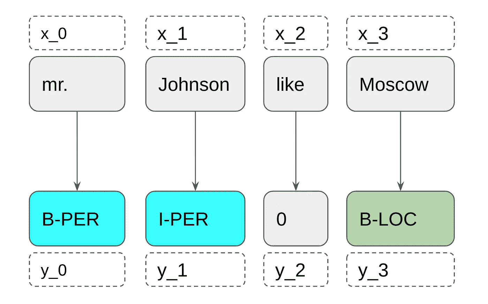
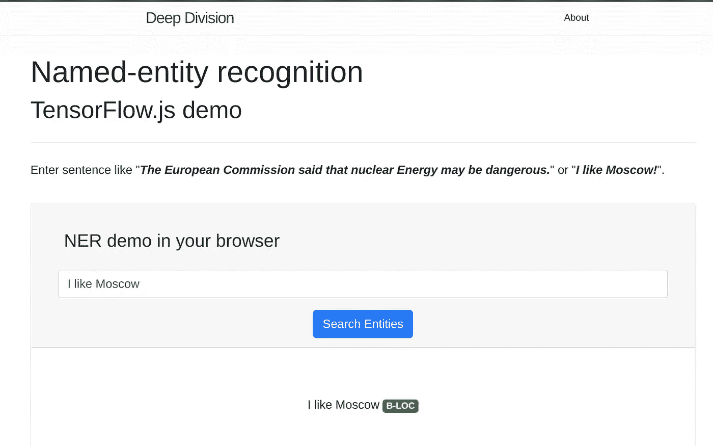

# TensorFlow.js 浏览器中的 NLP Keras 模型

> 原文：<https://towardsdatascience.com/nlp-keras-model-in-browser-with-tensorflow-js-f4d5035466a2?source=collection_archive---------6----------------------->

## 如何在带有 tensorflow.js 的浏览器中使用 Keras 模型

在这篇文章中，我将尝试涵盖三件事:

1.  如何编写简单的[命名实体识别](https://en.wikipedia.org/wiki/Named-entity_recognition)模型——典型的[自然语言处理](https://en.wikipedia.org/wiki/Natural_language_processing) (NLP)任务。
2.  如何将此模型导出为 [TensorFlow.js](https://www.tensorflow.org/js) 格式。
3.  如何制作一个简单的 WEB 应用程序在没有后端的情况下搜索字符串中的命名实体？

你可以在我的个人网站上测试一下。

首先，这篇博客是写给那些了解深度学习主要阶段(RNN，注意)和 JavaScript 基础的人的。如果你不擅长 RNN，我推荐你阅读 Andrej Karpathy 的《[循环神经网络的不合理有效性](http://karpathy.github.io/2015/05/21/rnn-effectiveness/)》。

> TensorFlow.js 是一个 JavaScript 库，用于用 JavaScript 开发和训练 ML 模型，并在浏览器或 Node.js 上部署。

对于这个例子，我们将使用简单的 keras 模型来解决经典的 NER 任务。我们将在 2003 年的数据集上进行训练。我们的模型只是单词嵌入、GRU 和非常简单的注意机制。之后，我们将在浏览器中可视化注意力向量。如果你熟悉解决类似任务的现代方法，你知道，这种方法不是最先进的。但是，对于在浏览器中运行它，例如，它就足够了。此外，如果您熟悉 NER 任务，您可以跳过 Keras 上关于命名实体识别、数据和 NER 神经网络模型的下两个部分，查看源代码。

# 任务和数据

根据你的经验，你可能以不同的名称来了解它，比如序列标签、词性标签或者像我们的任务中的命名实体识别。

通常，命名实体识别(NER)任务是 seq2seq 任务。对于来自 x_i 的每个标记，我们必须预测标记 y_i，其中 x 是输入序列，y 是命名实体的序列。

在本例中，我们将寻找人员(B-PER，I-PER)、地点(B-LOC，I-LOC)和组织(B-ORG，I-ORG)，此外，该模型将定义特殊的实体-杂项-命名的实体，而不是人员、地点和组织。

首先，我们必须为计算机准备数据(是的，我们将使用计算机来解决这个任务:)。

在这篇博文中，我们的目标并不是在 CoNLL2003 数据集上得到 SOTA 结果，这就是为什么我们的预处理不是很好。但仅举一个例子，我们将通过 ***load_data*** 的方法加载数据:

如你所知，神经网络不能处理文字，只能处理数字。这就是为什么我们应该用数字来表示单词。这不是一个困难的任务，我们可以列举所有独特的单词，并写单词的数量，而不是单词。为了储存数字和单词，我们可以创造词汇。这个词汇表应该支持“未知”(<unk>)的单词，因为当我们用词汇表中没有的新单词对一个新字符串进行预测时。单词“padded”(<pad>)是因为对于神经网络来说，所有的字符串应该具有相同的大小，当一些字符串比另一个小时，我们用这个单词来填充间隙。</pad></unk>

此外，让我们写一个简单的助手，把句子翻译成数字序列。

正如你在上面读到的，我们应该用神经网络填充序列，为此，你可以使用内部 Keras 方法[*pad _ sequences*](https://keras.io/preprocessing/sequence/#pad_sequences)*。*

# 模型

> 让我猜猜……RNN？

是的，是 RNN。更具体地说，它是 [GRUs(门控循环单元)](https://arxiv.org/pdf/1412.3555.pdf)和简单的注意层。作为文字表述用手套。在这篇博文中，我将不再赘述细节，只留下模型的代码。希望很好理解。

建立模型后，要对模型进行编译、训练和保存。您可以猜测，为了在浏览器中运行这个模型，我们不仅要保存模型的权重，还要保存模型描述以及单词和标签的词汇表。让我们定义将模型和词汇表导出到 JavaScript 支持的格式(基本上是 JSON)的方法。

最后，让我们编译、训练和导出模型:

这个步骤的完整代码，你可以在我的 [GitHub 资源库中找到 train.py.](https://github.com/MihailSalnikov/NERjs/blob/master/train.py)

# 发展环境

模型已经准备好了，现在，我们应该开始开发一个 web 应用程序，在浏览器中评估这种模式。我们需要一个开发环境。基本上，如何存储模型、权重和词汇并不重要，但是对于“简单开始”，我将向您展示我的解决方案——node . js 本地服务器。

我们需要两个文件: *package.json* 和 *server.js.*

在 server.js 中，我们定义了静态文件夹来存储模型、js 脚本和所有其他文件。要使用此服务器，您应该输入

***npm 安装& &节点 server.js***

在你的终端里。之后，您可以通过 [http://localhost:8081](http://localhost:8081) 在浏览器中访问您的文件

# 网络应用

有【index.html】、 *predict.js* 和上一步生成的文件。如你所见，这是一个非常小的网络应用程序。index.html 包含输入字符串的要求和输入字段。

现在，博文最有趣的部分—关于 tensorflow.js .你可以通过***TF . loadlayersmodel***方法调用 ***await*** 操作符来加载模型。这很重要，因为我们不想在加载模型时阻塞我们的 web 应用程序。如果我们加载模型，我们将得到只能预测令牌的模型，但注意力向量呢？如何从关注中获得激活？为了从内部层获取数据，在 tensorflow.js 中，我们应该创建一个新模型，其输出层将包含原始模型的输出和其他层，如下所示:

这里， ***模型*** 是原始模型， ***emodel*** 是以*注意力向量*为输出的模型。

## 预处理

现在我们必须像在 Python 脚本中一样实现字符串的预处理。对我们来说这不是一个困难的任务，因为 Python 和 JavaScript 上的正则表达式非常相似，其他方法也很相似。

## 做预测

现在我们应该提供从简单的文本字符串格式到 TF 格式的转换数据—张量。在上一节中，我们编写了将字符串转换为数字数组的助手。现在我们应该从这个数组中创建 ***tf.tensor*** 。如你所知，模型的输入层有形状 ***(无，113)*** ，这就是为什么我们要扩大输入张量的维数。好了，就这些了，现在我们可以通过 ***在浏览器中进行预测。预测*** 的方法。之后，您应该将预测数据打印到浏览器中，您的无后端神经网络 web 应用程序就准备好了。

# 结论

TensorFlow.js 是一个用于在 chrome、Firefox 或 safari 等浏览器中使用神经网络的库。如果你在 iPhone 或 Android 智能手机上打开这个网络应用，它也能工作。

可以通过这个链接在我的个人网站上测试:[http://deep division . net/2019/03/20/NLP-keras-model-in-browser-with-tensorflowjs . html](http://deepdivision.net/2019/03/20/nlp-keras-model-in-browser-with-tensorflowjs.html)

此外，你可以在我的 [GitHub](https://github.com/MihailSalnikov/NERjs) 中找到这段带有一些补充的代码。