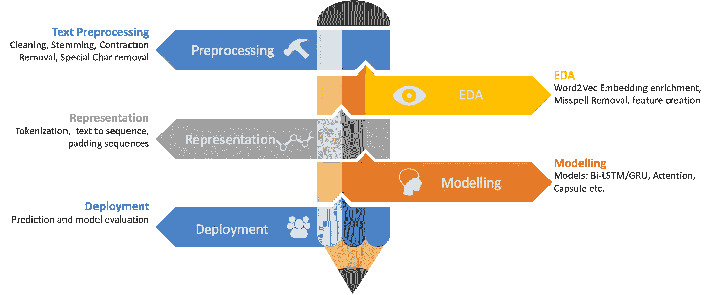
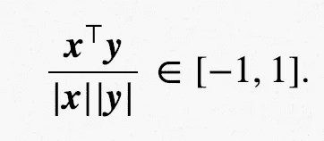
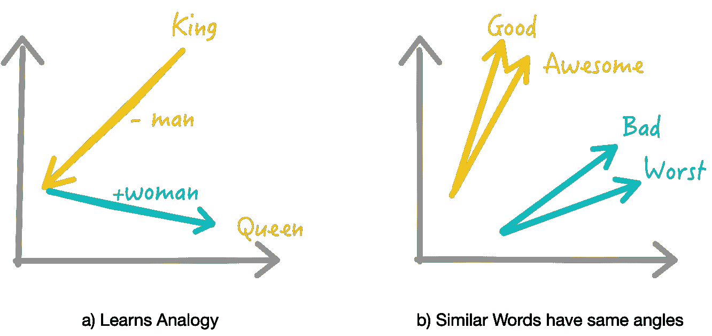
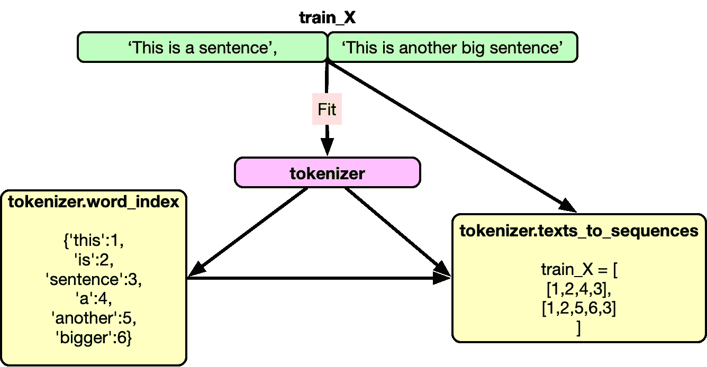
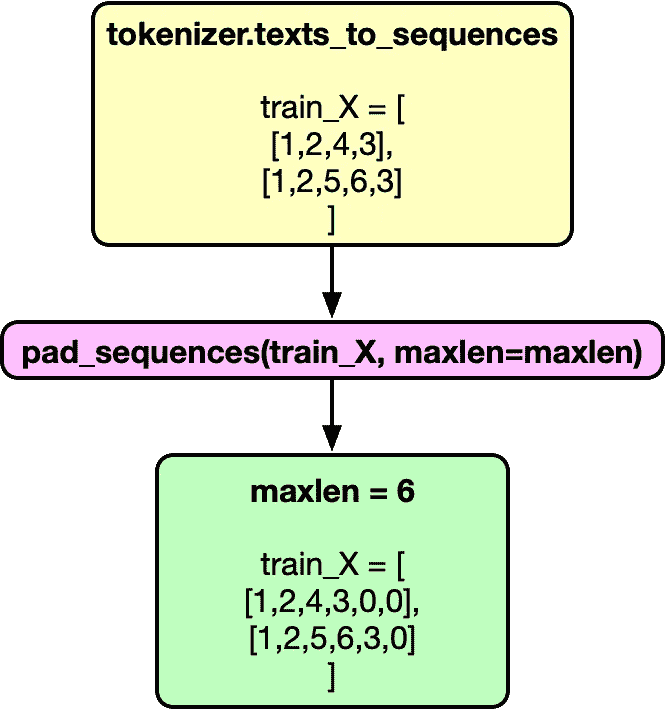
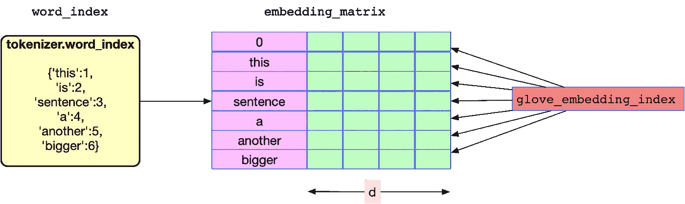
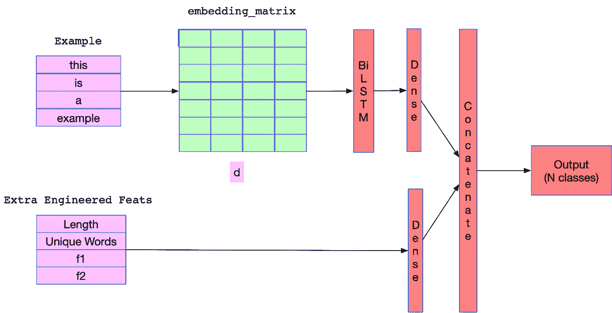

# 深度学习的文本预处理方法

> 原文：<https://towardsdatascience.com/nlp-learning-series-part-1-text-preprocessing-methods-for-deep-learning-20085601684b?source=collection_archive---------11----------------------->

## [NLP 学习系列](https://towardsdatascience.com/tagged/nlp-learning-series)(第一部分)

## 深度学习的文本预处理权威指南

Photo by [Raychan](https://unsplash.com/@wx1993?utm_source=medium&utm_medium=referral) on [Unsplash](https://unsplash.com?utm_source=medium&utm_medium=referral)

最近，我在 Kaggle 上发起了一个名为 Quora 问题不真诚挑战的 NLP 竞赛。这是一个关于文本分类的 NLP 挑战，在经历了比赛以及 kaggle 专家提出的宝贵内核后，问题变得更加清晰，我想到了分享知识。

因为我们有大量的材料要覆盖，我将这篇文章分成一系列的文章。第一篇文章，即这篇文章，将基于与深度学习模型一起工作的**预处理技术**，我们还将讨论**增加嵌入覆盖**。在第二篇文章的[中，我将试着带你了解一些**基本的传统模型**，如 TFIDF 和 SVM，它们已被用于文本分类，并试着评估它们的性能以创建一个基线。我们将在](/nlp-learning-series-part-2-conventional-methods-for-text-classification-40f2839dd061)[第三篇文章](/nlp-learning-series-part-3-attention-cnn-and-what-not-for-text-classification-4313930ed566)中更深入地研究**深度学习模型**，这些模型将专注于解决文本分类问题的不同架构。我们将尝试使用我们在本次比赛中未能使用的各种其他模型，如系列文章第四篇中的 **ULMFit 迁移学习**方法。

**作为旁注**:如果你想了解更多关于 NLP 的知识，我想推荐这个关于[高级机器学习专精](https://www.coursera.org/specializations/aml?siteID=lVarvwc5BD0-AqkGMb7JzoCMW0Np1uLfCA&utm_content=2&utm_medium=partners&utm_source=linkshare&utm_campaign=lVarvwc5BD0)中[自然语言处理](https://click.linksynergy.com/link?id=lVarvwc5BD0&offerid=467035.11503135394&type=2&murl=https%3A%2F%2Fwww.coursera.org%2Flearn%2Flanguage-processing)的超赞课程。您可以免费开始 7 天的免费试用。本课程涵盖了自然语言处理中从基础到高级的各种任务:情感分析、摘要、对话状态跟踪等等。

我可能需要一点时间来写完整个系列。在那之前，你可以看看我的其他帖子:【Kagglers 正在使用什么进行文本分类，其中谈到了 NLP 中使用的各种深度学习模型和[如何从 Keras 切换到 Pytorch](https://mlwhiz.com/blog/2019/01/06/pytorch_keras_conversion/) 。

首先让我解释一下文本分类的问题。**文本分类**是自然语言处理中的一项常见任务，它将一个长度不定的文本序列转换成一个文本类别。你怎么能利用这一点？

*   去寻找一篇评论的感悟。
*   在脸书这样的平台上找有毒评论
*   在 Quora 上找不真诚的问题。kaggle 上目前正在进行的比赛
*   在网站上寻找虚假评论
*   文字广告会不会被点击？

这些问题都有一些共同点。从机器学习的角度来看，这些本质上是相同的问题，只是目标标签发生了变化，其他什么都没有。也就是说，添加业务知识可以帮助使这些模型更加健壮，这就是我们在预处理数据以进行测试分类时想要加入的内容。虽然我在这篇文章中关注的预处理管道主要围绕深度学习，但大多数也适用于传统的机器学习模型。

但是，在经历所有步骤之前，让我先经历文本数据的深度学习管道的流程，以获得关于整个过程的更高层次的观点。

我们通常从清理文本数据和执行基本 EDA 开始。在这里，我们试图通过清理数据来提高数据质量。我们还试图通过移除 OOV(词汇外)单词来提高我们的 word2vec 嵌入的质量。这两个步骤之间通常没有太多的顺序，我通常在这两个步骤之间来回切换。接下来，我们创建一个可以输入深度学习模型的文本表示。然后我们开始创建模型并训练它们。最后，我们使用适当的指标评估模型，并获得相关股东的批准来部署我们的模型。如果这些术语现在没有多大意义，也不用担心。我将在这篇文章中尝试解释它们。

在这个连接处，让我们绕一点弯子来谈谈单词嵌入。在为我们的深度学习模型预处理数据时，我们必须考虑它们。

# word2vec 嵌入入门:

我们需要一种方法来表示词汇。一种方法是使用单词向量的热编码，但这并不是一个好的选择。一个主要的原因是，一个热门词向量不能准确地表达不同词之间的相似度，如余弦相似度。

给定一个热编码向量的结构，不同单词之间的相似度总是为 0。另一个原因是，随着词汇量的增加，这些热编码向量变得非常大。

Word2Vec 通过为我们提供单词的固定长度向量表示，并通过捕捉不同单词之间的相似性和类比关系，克服了上述困难。

单词向量的学习方式允许我们学习不同的类比。它使我们能够对单词进行代数运算，这在以前是不可能的。比如:什么是王者——男人+女人？它出来是女王。

Word2Vec 向量还帮助我们找出单词之间的相似性。如果我们试图找到与“好”相似的词，我们会发现“棒极了”、“棒极了”等等。word2vec 的这一特性使得它在文本分类中具有不可估量的价值。现在我们的深度学习网络明白了，“好”和“伟大”本质上是意思相近的词。

因此，简单来说，word2vec 为单词创建了向量。因此，对于字典中的每个单词(常见的二元模型也是如此)，我们都有一个 `**d**` **维向量。**我们通常使用预先训练的词向量，这些词向量是在对维基百科、推特等大型文本语料库进行训练后由他人提供给我们的。最常用的预训练单词向量是具有 300 维单词向量的 Glove 和 Fasttext。我们将在这个岗位上使用手套。

# 文本数据的基本预处理技术:

在大多数情况下，我们观察到文本数据并不完全干净。来自不同来源的数据具有不同的特征，这使得文本预处理成为分类管道中最重要的步骤之一。例如，来自 Twitter 的文本数据与 Quora 或一些新闻/博客平台上的文本数据完全不同，因此需要区别对待。有益的是，我将在这篇文章中讨论的技术对于你在 NLP 的丛林中可能遇到的任何类型的数据都足够通用。

## a)清除特殊字符并删除标点符号:

我们的预处理管道在很大程度上依赖于我们将用于分类任务的 word2vec 嵌入。*原则上，我们的预处理应该匹配在训练单词嵌入之前使用的预处理*。由于大多数嵌入并不提供标点符号和其他特殊字符的向量值，所以您首先要做的是消除文本数据中的特殊字符。这些是 Quora 问题数据中的一些特殊字符，我们使用`replace`函数来去除这些特殊字符。

这也可以借助简单的正则表达式来完成。但我通常喜欢上面的做法，因为它有助于理解我们从数据中删除的字符类型。

## b)清洁编号:

为什么我们要用`#` s 来代替数字？因为大多数嵌入都这样预处理过它们的文本。

**小 Python 技巧:**我们在下面的代码中使用了一个`if`语句来预先检查一个数字是否存在于一个文本中。因为`if`总是比`re.sub`命令快，而且我们的大部分文本不包含数字。

## c)消除拼写错误:

找出数据中的拼写错误总是有帮助的。由于这些单词嵌入在 word2vec 中不存在，我们应该用正确的拼写替换单词，以获得更好的嵌入覆盖率。下面的代码工件改编自 Peter Norvig 的拼写检查器。它使用 word2vec 单词排序来近似单词概率。因为 Google word2vec 显然在训练语料库中以频率递减的顺序排列单词。你可以用它在你的数据中找出一些拼写错误的单词。

一旦我们找到了拼写错误的数据，接下来要做的就是使用拼写错误的映射和正则表达式函数来替换它们。

## d)消除收缩:

缩写是我们用撇号写的单词。缩写的例子是像“不是”或“不是”这样的词。因为我们想标准化我们的文本，所以扩展这些缩写是有意义的。下面我们使用收缩映射和正则表达式函数来完成。

除了上述技术之外，还有其他文本预处理技术，如词干提取、词汇化和停用词去除。由于这些技术没有与深度学习 NLP 模型一起使用，所以我们不会讨论它们。

# 表示:序列创建

让深度学习成为 NLP 的 goto 选择的原因之一是，我们实际上不必从文本数据中手工设计特征。深度学习算法将一系列文本作为输入，像人类一样学习文本的结构。由于机器不能理解文字，它们希望数据是数字形式。所以我们希望将文本数据表示为一系列数字。为了理解这是如何做到的，我们需要了解一些关于 Keras Tokenizer 函数的知识。人们也可以使用任何其他记号赋予器，但 keras 记号赋予器对我来说似乎是个不错的选择。

## a)记号赋予器:

简单来说，记号赋予器是一个将句子拆分成单词的实用函数。`keras.preprocessing.text.Tokenizer`将文本标记化(拆分)成标记(单词),同时仅保留文本语料库中最常出现的单词。

num_words 参数只在文本中保留预先指定的字数。这是有帮助的，因为我们不希望我们的模型因为考虑很少出现的单词而受到很多干扰。在真实世界的数据中，我们使用 num_words 参数留下的大多数单词通常都是拼写错误的。缺省情况下，记号赋予器还会过滤掉一些不想要的记号，并将文本转换成小写。

一旦适合于数据，记号赋予器还保持单词的索引(单词字典，我们可以使用它来为单词分配唯一的数字),它可以被记号赋予器. word_index 访问。索引词典中的单词按频率顺序排列。

所以使用 tokenizer 的完整代码如下:

其中`train_X`和`test_X`是语料库中的文档列表。

## b)填充序列:

通常，我们的模型期望每个序列(每个训练示例)具有相同的长度(相同数量的单词/标记)。我们可以使用`maxlen`参数对此进行控制。

例如:

现在我们的训练数据包含了一个数字列表。每个列表都有相同的长度。我们还有`word_index`,它是文本语料库中最常出现的单词的字典。

# 嵌入浓缩:

正如我所说，我将使用手套 Word2Vec 嵌入来解释丰富。手套预训练向量在维基百科语料库上训练。(你可以在这里[下载它们](https://nlp.stanford.edu/projects/glove/))。这意味着一些可能出现在数据中的单词可能不会出现在嵌入中。我们该如何应对呢？让我们首先加载手套嵌入第一。

一定要把下载这些手套向量的文件夹路径放进去。这个`glove_embedding_index`包含什么？它只是一个字典，其中的键是单词，值是单词向量，一个长度为 300 的`np.array`。这部词典的长度大约是十亿。因为我们只想要我们的`word_index`中的单词的嵌入，我们将创建一个只包含所需嵌入的矩阵。

上面的代码运行良好，但是有没有一种方法可以让我们更好地利用 GLoVE 中的预处理？是的。当对 glove 进行预处理时，创建者没有将单词转换成小写。这意味着它包含一个单词的多个变体，如“usa”、“Usa”和“USA”。这也意味着，在某些情况下，虽然存在像“word”这样的单词，但它的小写模拟词(即“Word ”)并不存在。我们可以通过使用下面的代码来解决这个问题。

以上只是一个例子，说明了我们如何利用我们的嵌入知识来获得更好的覆盖率。有时，根据问题的不同，人们也可以通过使用一些领域知识和 NLP 技能向嵌入内容添加额外的信息来获得价值。例如，我们可以通过添加 Python 中 TextBlob 包中单词的极性和主观性，将外部知识添加到嵌入本身。

我们可以使用 TextBlob 获得任何单词的极性和主观性。相当整洁。因此，让我们尝试将这些额外的信息添加到我们的嵌入中。

工程嵌入是在后期阶段从深度学习模型获得更好性能的重要部分。通常，在项目阶段，我会多次重温这部分代码，同时尝试进一步改进我的模型。你可以在这里展示你的创造力，以提高你的`word_index`的覆盖率，并在你的嵌入中包含额外的特性。

# 更多工程特性

人们总是可以添加句子特定的特征，如句子长度、独特单词的数量等。作为向深度神经网络提供额外信息的另一个输入层。例如，我创建了这些额外的功能，作为 Quora 不真诚分类挑战的功能工程管道的一部分。

# 结论:

NLP 在深度学习领域仍然是一个非常有趣的问题，因此我鼓励你做大量的实验，看看什么可行，什么不可行。我试图为任何 NLP 问题的深度学习神经网络的预处理步骤提供一个完整的视角。但这并不意味着它是确定的。如果你想了解更多关于 NLP 的知识，这里有一门很棒的课程。如果你认为我们可以增加一些东西，请在评论中提及。

# 尾注和参考文献:

这篇文章是许多优秀的 Kagglers 们努力的结果，我将在这一部分尝试引用他们。如果我漏掉了某个人，请理解我不是故意的。

*   [如何:使用嵌入时进行预处理](https://www.kaggle.com/christofhenkel/how-to-preprocessing-when-using-embeddings)
*   [通过一些文本预处理提高你的分数](https://www.kaggle.com/theoviel/improve-your-score-with-some-text-preprocessing)
*   [Pytorch 基线](https://www.kaggle.com/ziliwang/baseline-pytorch-bilstm)
*   [Pytorch 启动器](https://www.kaggle.com/hengzheng/pytorch-starter)

[*这里的*](/nlp-learning-series-part-2-conventional-methods-for-text-classification-40f2839dd061) *是下一个帖子。*

*原载于 2019 年 1 月 17 日*[*mlwhiz.com*](https://mlwhiz.com/blog/2019/01/17/deeplearning_nlp_preprocess/)*。*