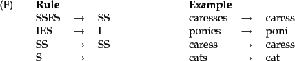
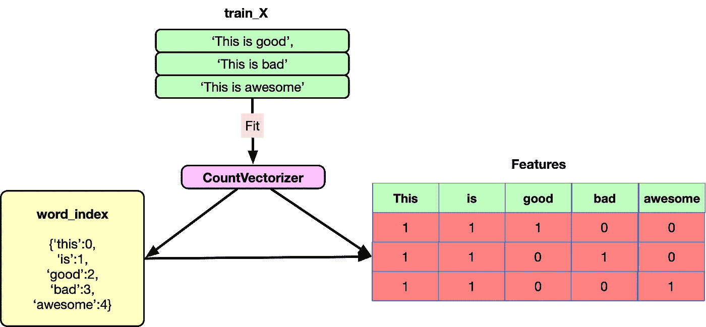
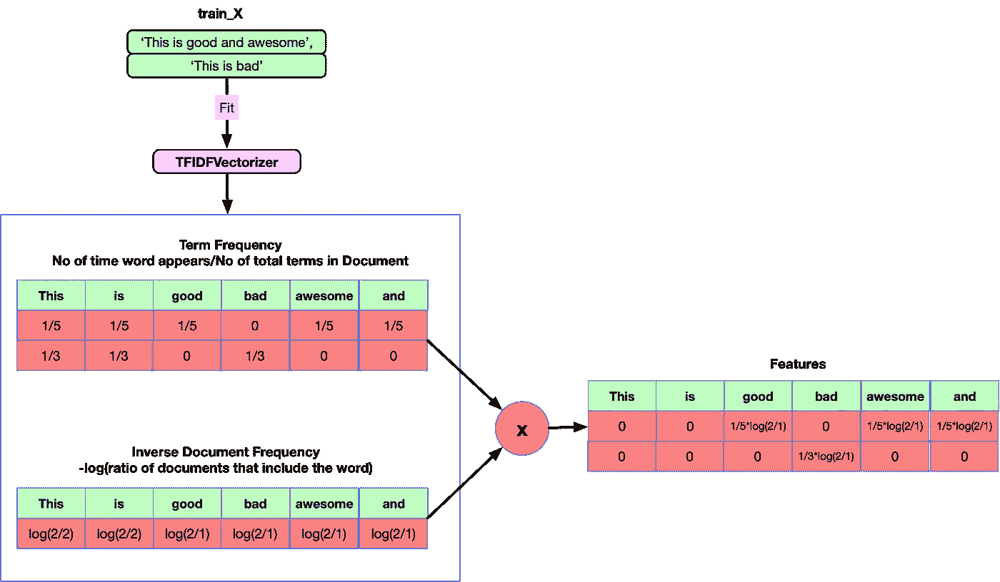
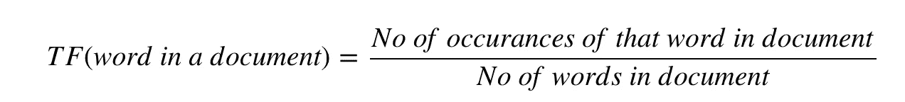
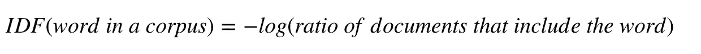
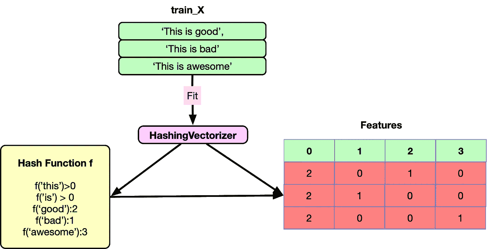
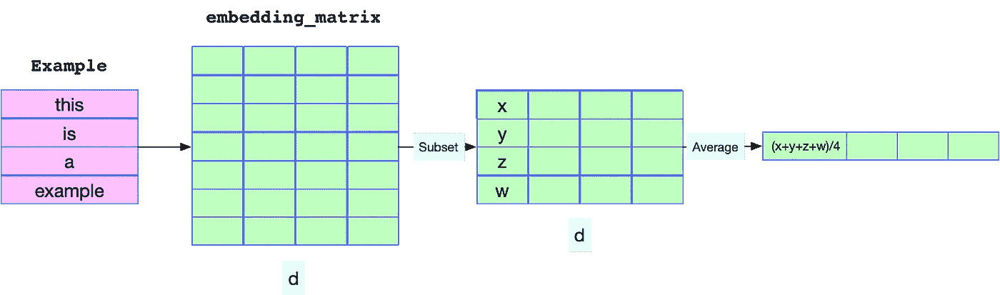

# 传统的文本分类方法

> 原文：<https://towardsdatascience.com/nlp-learning-series-part-2-conventional-methods-for-text-classification-40f2839dd061?source=collection_archive---------13----------------------->

## [NLP 学习系列](https://towardsdatascience.com/tagged/nlp-learning-series)(第二部分)

## 教机器学习文本


这是 NLP 文本分类系列的第二篇文章。给你一个回顾，最近我在 Kaggle 上开始了一个 NLP 文本分类比赛，叫做 Quora 问题不真诚挑战。我想通过一系列关于文本分类的博客文章来分享这些知识。[的第一篇帖子](https://mlwhiz.com/blog/2019/01/17/deeplearning_nlp_preprocess/)谈到了各种与深度学习模型和**一起工作的**预处理技术，增加了嵌入覆盖率**。在这篇文章中，我将尝试带你了解一些基本的传统模型，如 TFIDF、计数矢量器、哈希等。并尝试评估它们的性能以创建一个基线。我们将在[第三篇文章](/nlp-learning-series-part-3-attention-cnn-and-what-not-for-text-classification-4313930ed566)中更深入地研究**深度学习模型**，这些模型将专注于解决文本分类问题的不同架构。我们将尝试使用我们在本次比赛中未能使用的各种其他模型，如系列文章第四篇中的 **ULMFit 迁移学习**方法。**

**作为旁注**:如果你想了解更多关于 NLP 的知识，我想**推荐[高级机器学习专精](https://www.coursera.org/specializations/aml?siteID=lVarvwc5BD0-AqkGMb7JzoCMW0Np1uLfCA&utm_content=2&utm_medium=partners&utm_source=linkshare&utm_campaign=lVarvwc5BD0)中关于[自然语言处理](https://click.linksynergy.com/link?id=lVarvwc5BD0&offerid=467035.11503135394&type=2&murl=https%3A%2F%2Fwww.coursera.org%2Flearn%2Flanguage-processing)的这门超棒的课程**。您可以免费开始 7 天的免费试用。本课程涵盖了自然语言处理中从基础到高级的各种任务:情感分析、摘要、对话状态跟踪等等。您可以免费开始 7 天的免费试用。普通

我可能需要一点时间来写完整个系列。在那之前，你也可以看看我的其他帖子:【Kagglers 正在使用什么进行文本分类，它谈论了 NLP 中使用的各种深度学习模型和[如何从 Keras 切换到 Pytorch](https://mlwhiz.com/blog/2019/01/06/pytorch_keras_conversion/) 。

所以我们再次从第一步开始:预处理。

# 文本数据的基本预处理技术(续)

所以在上一篇文章中，我们讨论了各种用于深度学习的文本预处理方法。传统方法的大部分预处理保持不变。**我们仍然会删除特殊字符、标点符号和缩写**。但是当涉及到传统方法时，我们可能也想做词干化/词汇化。让我们来谈谈它们。

> 出于语法原因，文档将使用不同形式的单词，如 organize、organize 和 organizing。此外，还有一系列具有相似含义的衍生相关词，如民主、民主和民主化。

由于我们将在特征创建步骤中为单词创建特征，因此有必要将单词简化为一个共同的标准，以便“组织”、“组织”和“组织”可以由单个单词“组织”来引用

# a)词干

词干提取是使用粗略的启发式规则将单词转换成其基本形式的过程。例如，一个规则可以是从任何单词的末尾去掉“s”，这样“cats”就变成了“cat”。或者另一个规则是用“我”代替“ies ”,这样“ponies”就变成了“poni”。这里要注意的一个要点是，当我们对这个单词进行词干处理时，我们可能会得到一个像“poni”这样的无意义的单词。但是它仍然适用于我们的用例，因为我们计算特定单词的出现次数，而不是像传统方法那样关注这些单词的含义。出于完全相同的原因，它对深度学习不起作用。



通过在 python 中使用这个函数，我们可以非常简单地做到这一点。

# b)词汇化

词汇化与词干化非常相似，但它的目的是仅当字典中存在基本形式时才删除词尾。

一旦我们完成了对文本的处理，我们的文本必然会经历以下这些步骤。

# 文本表示

在传统的机器学习方法中，我们应该为文本创建特征。为了实现这一目标，有很多的表现形式。让我们一个一个来说。

# a)单词包—计数矢量器功能

假设我们有一系列的句子(文档)

```
X = [ 'This is good', 'This is bad', 'This is awesome' ]
```



单词包将创建一个所有句子中最常用单词的字典。对于上面的例子，字典应该是这样的:

```
word_index {'this':0,'is':1,'good':2,'bad':3,'awesome':4}
```

然后用上面的字典对句子进行编码。

```
This is good - [1,1,1,0,0] 
This is bad - [1,1,0,1,0] 
This is awesome - [1,1,0,0,1]
```

在 Python 中，我们可以通过使用 Python 中的 CountVectorizer 类非常简单地做到这一点。不用太担心名字重，它只是做了我上面解释的事情。它有许多参数，其中最重要的是:

*   **ngram_range:** 我在代码(1，3)中指定。这意味着在创建要素时，将考虑单字、双字和三元字。
*   **min_df:** 一个 ngram 应该出现在语料库中作为特征使用的最小次数。

然后，我们可以将这些特征用于任何机器学习分类模型，如逻辑回归、朴素贝叶斯、SVM 或 LightGBM。例如:

```
# Fitting a simple Logistic Regression on CV Feats 
clf = LogisticRegression(C=1.0) 
clf.fit(xtrain_cntv,y_train)
```

[这里的](https://www.kaggle.com/mlwhiz/conventional-methods-for-quora-classification/)是一个内核链接，我在 Quora 数据集上测试了这些特性。如果你喜欢，请不要忘记投赞成票。

# b) TFIDF 功能

TFIDF 是一种从句子中寻找特征的简单技术。在计数特征中，我们计算文档中出现的所有单词/ngrams，而在 TFIDF 中，我们只计算重要单词的特征。我们如何做到这一点？如果你想一个语料库中的文档，我们将考虑关于该文档中任何单词的两件事:



*   **词频:**这个词在文档中有多重要？



*   **逆文档频率:**术语在整个语料库中的重要性如何？



TFIDF 就是这两个分数的乘积。

直观上，一个人可以理解，如果一个单词在文档中出现多次，它就是重要的。但是这就产生了一个问题。像“a”、“the”这样的词在句子中多次出现。他们的 TF 分会一直很高。我们通过使用逆文档频率来解决这个问题，如果这个词很罕见，那么它就很高，如果这个词在整个语料库中很常见，那么它就很低。

本质上，我们希望在文档中找到不常见的重要单词。

在 Python 中，我们可以通过使用 Python 中的 TFIDFVectorizer 类非常简单地做到这一点。它有许多参数，其中最重要的是:

*   **ngram_range:** 我在代码(1，3)中指定。这意味着在创建要素时，将考虑单字、双字和三元字。
*   **min_df:** 一个 ngram 应该出现在语料库中作为特征使用的最小次数。

同样，我们可以将这些特征用于任何机器学习分类模型，如逻辑回归、朴素贝叶斯、SVM 或 LightGBM。[这里的](https://www.kaggle.com/mlwhiz/conventional-methods-for-quora-classification/)是一个内核的链接，我在 Quora 数据集上尝试了这些特性。如果你喜欢，请不要忘记投赞成票。

# c)散列特征

通常在一个文档语料库中会有很多元语法。我们的 tfidf 矢量器生成的特征数量超过了 2，000，000 个。这可能会在非常大的数据集上导致一个问题，因为我们必须在内存中保存一个非常大的词汇字典。解决这个问题的一个方法是使用哈希技巧。



人们可以将散列看作是将任何 ngram 映射到一个数字范围(例如 0 到 1024 之间)的单个函数。现在我们不必把语法存储在字典里。我们可以使用函数来获取任何单词的索引，而不是从字典中获取索引。

由于可能有超过 1024 个 n gram，不同的 n gram 可能映射到同一个数字，这称为冲突。我们提供的散列函数的范围越大，冲突的机会就越少。

在 Python 中，我们可以通过使用 Python 中的 HashingVectorizer 类非常简单地做到这一点。它有许多参数，其中最重要的是:

*   **ngram_range:** 我在代码(1，3)中指定。这意味着在创建要素时，将考虑单字、双字和三元字。
*   **n_features:** 你要考虑的特性的数量。上面我给的范围。

这里的是一个内核链接，我在 Quora 数据集上测试了这些特性。如果你喜欢，请不要忘记投赞成票。

# d) Word2vec 功能

在之前的帖子中，我们已经谈了一些关于 word2vec 的内容。我们也可以使用单词到 vec 特征来创建句子级别的专长。我们想为句子创建一个`d`维向量。为此，我们将简单地对一个句子中所有单词的单词嵌入进行平均。



我们可以在 Python 中使用以下函数来实现这一点。

[这里的](https://www.kaggle.com/mlwhiz/conventional-methods-for-quora-classification/)是一个内核的链接，我在 Quora 数据集上测试了这些特性。如果你喜欢，请不要忘记投赞成票。

# 结果

以下是不同方法在 Kaggle 数据集上的结果。我做了一份五层简历。


[这里的](https://www.kaggle.com/mlwhiz/conventional-methods-for-quora-classification/)是代码。如果你喜欢，请不要忘记投赞成票。还要注意，我没有对模型进行调优，所以这些结果只是粗略的。您可以尝试通过使用 hyperopt 执行超参数调整[或只是老式的网格搜索来获得更多性能，之后模型的性能可能会发生显著变化。](https://mlwhiz.com/blog/2017/12/28/hyperopt_tuning_ml_model/)

# 结论

虽然深度学习在 NLP 分类任务中表现得更好，但了解这些问题在过去是如何解决的仍然是有意义的，这样我们就可以了解问题的本质。我试图提供一个关于传统方法的视角，人们应该在转向深度学习方法之前也用它们进行实验来创建基线。如果你想进一步了解 NLP [，这里](https://click.linksynergy.com/link?id=lVarvwc5BD0&offerid=467035.11503135394&type=2&murl=https%3A%2F%2Fwww.coursera.org%2Flearn%2Flanguage-processing)是一门很棒的课程。您可以免费开始 7 天的免费试用。如果你认为我可以为这个流程添加一些东西，请在评论中提及。

# 尾注和参考文献

这篇文章是许多优秀的 Kagglers 们努力的结果，我将在这一部分尝试引用他们。如果我漏掉了某个人，请理解我不是故意的。

*   [**在 Kaggle 上逼近(几乎)任何 NLP 问题**](https://www.kaggle.com/abhishek/approaching-almost-any-nlp-problem-on-kaggle)
*   [**如何:使用嵌入时的预处理**](https://www.kaggle.com/christofhenkel/how-to-preprocessing-when-using-embeddings)

[*这里的*](/nlp-learning-series-part-3-attention-cnn-and-what-not-for-text-classification-4313930ed566) *是下一个帖子。*