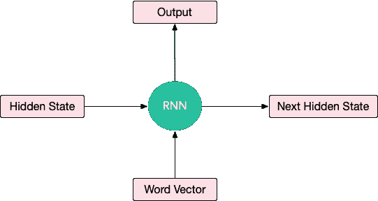
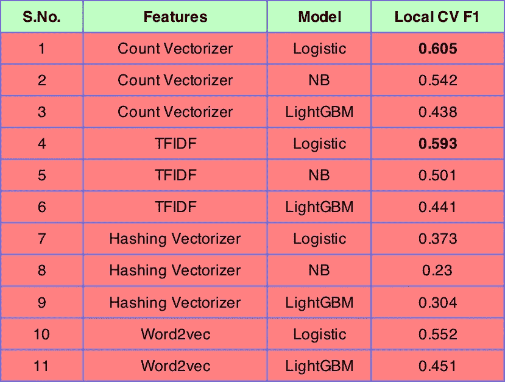

# 注意，CNN 和什么不适合文本分类

> 原文：<https://towardsdatascience.com/nlp-learning-series-part-3-attention-cnn-and-what-not-for-text-classification-4313930ed566?source=collection_archive---------2----------------------->

## [NLP 学习系列](https://towardsdatascience.com/tagged/nlp-learning-series)(第三部分)

## 让机器为我们阅读


Photo by [Francesco Ungaro](https://unsplash.com/@francesco_ungaro?utm_source=medium&utm_medium=referral) on [Unsplash](https://unsplash.com?utm_source=medium&utm_medium=referral)

T 他的帖子是 [NLP](https://amzn.to/2XSZBWV) 文本分类[系列](https://towardsdatascience.com/tagged/nlp-learning-series)的第三个帖子。给你一个回顾，我在 Kaggle 上开始了一个 NLP 文本分类竞赛，叫做 Quora 问题不真诚挑战。所以我想通过一系列关于文本分类的博文来分享这些知识。第一篇[帖子](https://mlwhiz.com/blog/2019/01/17/deeplearning_nlp_preprocess/)谈到了与深度学习模型和**一起工作的不同的**预处理技术，增加了嵌入覆盖面**。在[第二篇](https://mlwhiz.com/blog/2019/02/08/deeplearning_nlp_conventional_methods/)中，我讲述了一些**基本的常规模型**如 TFIDF、计数矢量器、哈希等。已经被用于文本分类并试图评估它们的性能来创建基线。在这篇文章中，我深入研究了深度学习模型和我们可以用来解决文本分类问题的各种架构。为了使这个帖子平台通用，我打算用 Keras 和 Pytorch 来编码。我将使用我们在本次比赛中未能使用的各种其他模型，如系列中第四篇文章中的 **ULMFit 迁移学习**方法。**

另外，如果你对在工作中使用的定制深度学习工作站或服务器感兴趣，Exxact Corporation 有一系列基于人工智能的解决方案，起价为 3700 美元，带有几个英伟达 RTX 30 系列 GPU，3 年保修和深度学习软件堆栈。

因此，让我试着介绍一下人们用来进行文本分类的一些模型，并试着为他们提供一个简单的直觉——还有，Keras 和 Pytorch 中的一些代码。所以你可以自己尝试一下。

# 1.TextCNN

Yoon Kim 在论文[卷积神经网络用于句子分类](https://www.aclweb.org/anthology/D14-1181)中首次提出了使用 CNN 对文本进行分类的想法。

**表象:**这个想法的核心直觉是将我们的文档视为图像。怎么会？假设我们有一个句子，maxlen = 70，嵌入大小= 300。我们可以创建一个形状为 70x300 的数字矩阵来表示这句话。对于图像，我们也有一个矩阵，其中各个元素是像素值。任务的输入不是图像像素，而是用矩阵表示的句子或文档。矩阵的每一行对应一个单词向量。


**卷积思想:**对于图像，我们水平和垂直移动我们的 conv 过滤器，对于文本，我们将内核大小固定为 filter_size x embed_size，即(3，300)，我们将垂直向下移动进行卷积，同时查看三个单词，因为在这种情况下我们的过滤器大小为 3。这个想法似乎是正确的，因为我们的卷积滤波器不分裂字嵌入。它会查看每个单词的完整嵌入。人们也可以把过滤器的大小想象成一元、二元、三元等。因为我们正在分别查看 1、2、3 和 5 个单词的上下文窗口。

下面是用 Pytorch 编码的文本分类网络:

对于 Keras 爱好者来说:

我是 Kaggle Kernels 的忠实粉丝。人们无法想象免费拥有所有这些计算机。你可以在这个 [kaggle 内核](https://www.kaggle.com/mlwhiz/textcnn-pytorch-and-keras)中找到上面两个代码片段的运行版本。在分叉和运行代码之后，一定要尝试使用它。如果你觉得有帮助，也请投票支持内核。

keras 模型和 Pytorch 模型表现相似，Pytorch 模型以微弱优势击败 Keras 模型。Pytorch 模型的折外 CV F1 分数为 0.6609，而 Keras 模型的相同分数为 0.6559。我在两个模型中使用了相同的预处理，以便更好地比较平台。

# 2.双向 RNN(LSTM/GRU):

TextCNN 很适合文本分类。它在近距离内处理单词。它可以一起看《纽约》。然而，它仍然不能处理特定文本序列中提供的所有上下文。它仍然不知道数据的顺序结构，其中每个单词都依赖于前一个单词。还是前一句的一句话。

RNN 会帮我们的。*他们可以使用隐藏状态记住以前的信息，并将其与当前任务联系起来。*

长短期记忆网络(LSTM)是 RNN 的一个子类，专门用于长时间记忆信息。此外，双向 LSTM 保持了两个方向上的上下文信息，这在文本分类任务中非常有用(但是对于时间序列预测任务不起作用，因为在这种情况下我们不知道未来)。


对双向 RNN 最简单的解释是，把 RNN 单元想象成一个黑盒，接受一个隐藏状态(向量)和一个字向量作为输入，给出一个输出向量和下一个隐藏状态。这个盒子具有一些权重，这些权重将使用损耗的反向传播来调整。此外，相同的单元格应用于所有单词，以便句子中的单词共享权重。这种现象被称为重量共享。



```
Hidden state, Word vector ->(RNN Cell) -> Output Vector , Next Hidden state
```

对于长度为 4 的序列，如**“你永远也不会相信”**，RNN 单元给出 4 个输出向量，这些向量可以连接起来，然后用作密集前馈架构的一部分。

在双向 RNN 中，唯一的变化是我们以通常的方式以及相反的方式阅读文本。因此，我们并行堆叠两个 rnn，因此我们可以追加 8 个输出向量。

一旦我们得到了输出向量，我们就将它们发送通过一系列密集层，最后通过 softmax 层来构建文本分类器。

在大多数情况下，您需要了解如何在神经网络中堆叠一些层以获得最佳结果。如果性能更好，我们可以在网络中尝试多个双向 GRU/LSTM 层。

由于 RNNs 的局限性，如不能记住长期依赖关系，在实践中，我们几乎总是使用 LSTM/GRU 来建模长期依赖关系。在这种情况下，你可以把上图中的 RNN 单元想象成 LSTM 单元或 GRU 单元。下面提供了一个示例模型。在构建模型时，可以将 CuDNNGRU 与 CuDNNLSTM 互换使用。(CuDNNGRU/LSTM 只是 LSTM/GRU 的实现，创建它们是为了在 GPU 上运行得更快。在大多数情况下，总是使用它们而不是普通的 LSTM/GRU 实现)

这是 Pytorch 中这个网络的一些代码。

此外，这里是相同的代码在 Keras。

你可以用 Pytorch 和 Keras kaggle 内核在我的 [BiLSTM 中运行这段代码。如果你觉得有帮助，请投票支持内核。](https://www.kaggle.com/mlwhiz/bilstm-pytorch-and-keras)

同样，在 BiLSTM 案例中，Pytorch 模型以微弱优势击败了 keras 模型。Pytorch 模型的折外 CV F1 分数为 0.6741，而 Keras 模型的相同分数为 0.6727。这个分数比 TextCNN 的表现提高了大约 1-2 %, text CNN 的表现相当不错。另外，请注意，它比传统方法大约好 6–7%。

# 3.注意力模型

Dzmitry Bahdanau 等人在他们的论文[中首次通过联合学习对齐和翻译](https://arxiv.org/abs/1409.0473)提出了注意力的神经机器翻译，但我发现 CMU 和微软在 2016 年联合撰写的关于[文档分类的层次注意力网络](https://www.cs.cmu.edu/~diyiy/docs/naacl16.pdf)的论文更容易阅读，并提供了更多的直觉。

所以让我们先谈谈直觉。过去的传统方法如 TFIDF/CountVectorizer 等。我们过去常常通过提取关键词来从文本中寻找特征。有些词比其他词更有助于确定文本的类别。然而，在这种方法中，我们丢失了文本的顺序结构。使用 LSTM 和深度学习方法，虽然我们可以照顾序列结构，但我们失去了对更重要的单词给予更高权重的能力。**我们能两全其美吗？**

答案是肯定的。实际上，**注意力是你所需要的全部**。用作者的话说:

> 不是所有的单词都对句子意思的表达有同等的贡献。因此，我们引入注意机制来提取对句子意义重要的词，并聚合这些信息词的表示以形成句子向量


本质上，我们希望为文本中的每个单词创建分数，这就是一个单词的注意力相似度分数。

为此，我们从权重矩阵(W)、偏差向量(b)和上下文向量 u 开始。优化算法学习所有这些权重。在这一点上，我想强调我非常喜欢神经网络的一点——如果你不知道一些参数，让网络学习它们。我们只需要担心如何创建要调优的架构和参数。

然后就是一系列的数学运算。请参见图中的详细说明。我们可以将 u1 视为 RNN 字输出的非线性。之后，v1 是 u1 与上下文向量 u 的点积，u 的乘幂。从直觉的角度来看，如果 u 和 u1 相似，v1 的值将会很高。因为我们希望分数的总和为 1，所以我们用 v 除以 v 的总和来得到最终分数 s

然后，这些最终得分乘以 RNN 单词输出，根据单词的重要性对其进行加权。然后将输出相加，并通过密集层和 softmax 发送，用于文本分类任务。

下面是 Pytorch 中的代码。**务必通读 pytorch 关注层代码。它只是做我上面解释的事情。**

Keras 的代码也一样。

同样，我对 Pytorch 和 Keras Kaggle 内核的关注包含了这段代码的工作版本。如果你觉得内核有用，请投票支持它。

该方法表现良好，Pytorch CV 分数达到约 0.6758，Keras CV 分数达到约 0.678。**这个成绩超过了我们通过 BiLSTM 和 TextCNN 所能达到的。**但是，请注意，我们还没有对任何给定的方法进行调优，因此分数可能会有所不同。

至此，我让您尝试新的架构，并尝试堆叠多个 GRU/LSTM 层来提高您的网络性能。你也可以考虑在这些网络中加入更多的技术，比如木桶，手工制作等。我的博客中提到了一些技巧和新技术:[我的第一枚银牌在文本分类和 Kaggle 方面教会了我什么？](https://mlwhiz.com/blog/2019/02/19/siver_medal_kaggle_learnings/)。另外，这是另一个 Kaggle 内核，它是我在这次比赛中获得银牌的参赛作品。

# 结果

以下是我在 Kaggle 数据集上尝试的所有不同方法的最终结果。我做了一份五层简历。

## a.常规方法:



## b.深度学习方法:


**PS:** 注意，我并没有对上述模型进行调优，所以这些结果只是粗略的。您可以尝试通过使用 hyperopt 或老式的网格搜索来执行超参数调整[来获得更高的性能。](https://mlwhiz.com/blog/2017/12/28/hyperopt_tuning_ml_model/)

# 结论

在这篇文章中，我解释了人们用于文本分类任务的各种深度学习架构。在下一篇文章中，我们将进一步探究 [NLP](https://amzn.to/2XSZBWV) 空间中的下一个新现象 BERT 和 ULMFit 凭借他们的直觉进行迁移学习。在[媒体](https://medium.com/@rahul_agarwal)上关注我，或者订阅[我的博客](https://mlwhiz.ck.page/a9b8bda70c)来了解我的下一篇文章。

另外，如果你想了解更多关于 NLP 的知识，这里的是一门很好的课程。您可以免费开始 7 天的免费试用。

让我知道，如果你认为我可以添加更多的东西；我会试着融入它。

干杯！！！

[*这里的*](/nlp-learning-series-part-4-transfer-learning-intuition-for-text-classification-4eb90495c19f) *是下一个帖子。*

*原载于 2019 年 3 月 9 日*[*mlwhiz.com*](https://mlwhiz.com/blog/2019/03/09/deeplearning_architectures_text_classification/)*。*