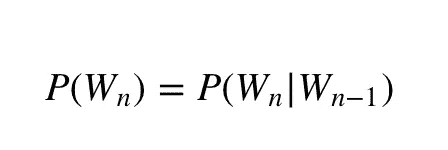
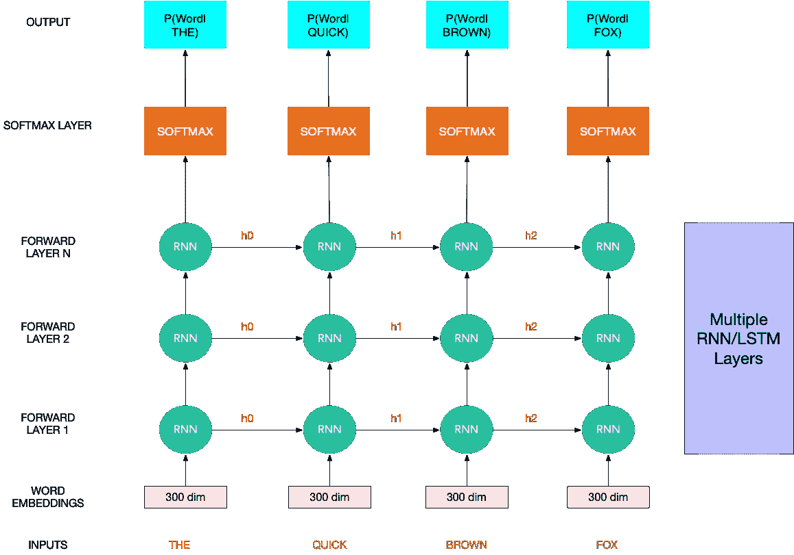
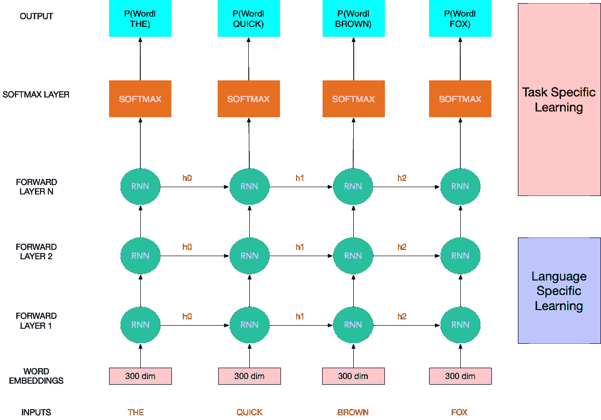
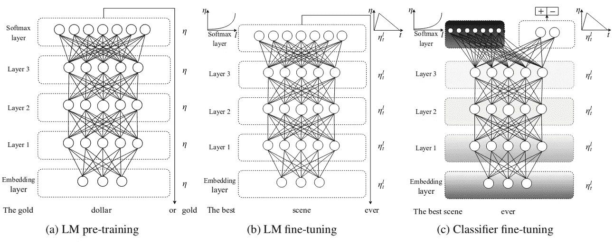
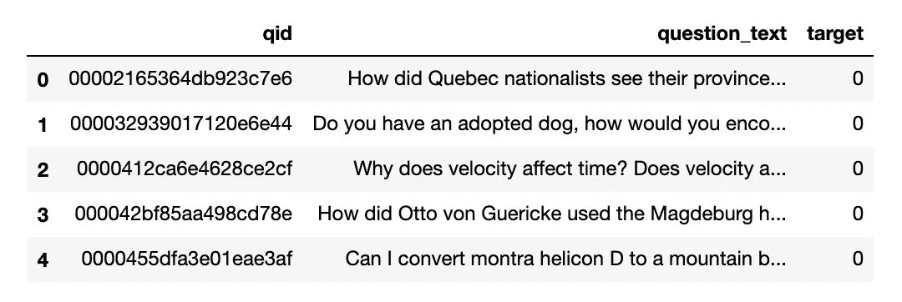
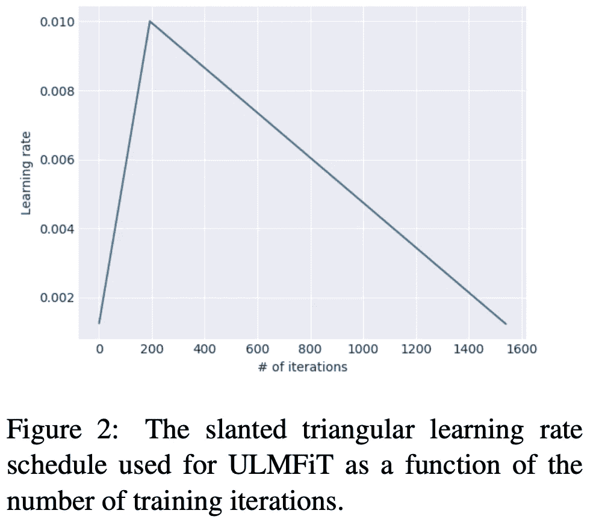
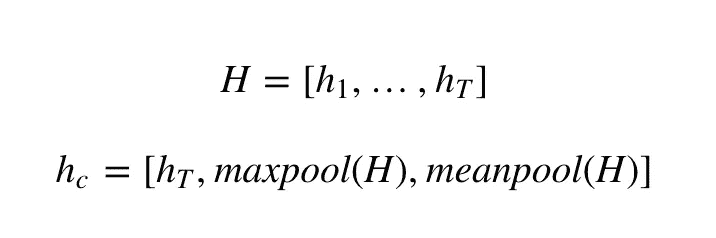
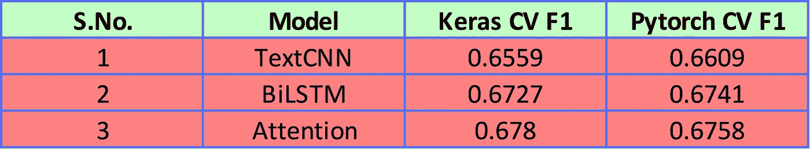
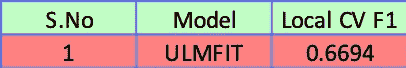

# 用于文本分类的迁移学习直觉

> 原文：<https://towardsdatascience.com/nlp-learning-series-part-4-transfer-learning-intuition-for-text-classification-4eb90495c19f?source=collection_archive---------11----------------------->

## [NLP 学习系列](https://towardsdatascience.com/tagged/nlp-learning-series)(第四部分)

## 让机器为我们阅读


这篇文章是 NLP 文本分类系列的第四篇文章。给你一个回顾，我在 Kaggle 上开始了一个 NLP 文本分类竞赛，叫做 Quora 问题不真诚挑战。所以我想通过一系列关于文本分类的博文来分享这些知识。[的第一篇帖子](https://mlwhiz.com/blog/2019/01/17/deeplearning_nlp_preprocess/)谈到了不同的**预处理技术，这些技术与深度学习模型**和**一起工作，增加了嵌入覆盖率**。在[第二篇](https://mlwhiz.com/blog/2019/02/08/deeplearning_nlp_conventional_methods/)中，我讲述了一些**基本的常规模型**如 TFIDF、计数矢量器、哈希等。已经被用于文本分类并试图评估它们的性能来创建基线。在[第三篇文章](https://mlwhiz.com/blog/2019/03/09/deeplearning_architectures_text_classification/)中，我深入研究了**深度学习模型和我们可以用来解决文本分类问题的各种架构**。在这篇文章中，我将尝试使用 ULMFit 模型，这是一种用于 NLP 的迁移学习方法。

**作为旁注**:如果你想了解更多关于 NLP 的知识，我想**推荐[高级机器学习专精](https://www.coursera.org/specializations/aml?siteID=lVarvwc5BD0-AqkGMb7JzoCMW0Np1uLfCA&utm_content=2&utm_medium=partners&utm_source=linkshare&utm_campaign=lVarvwc5BD0)中[自然语言处理](https://click.linksynergy.com/link?id=lVarvwc5BD0&offerid=467035.11503135394&type=2&murl=https%3A%2F%2Fwww.coursera.org%2Flearn%2Flanguage-processing)的这门优秀课程**。您可以免费开始 7 天的免费试用。本课程涵盖了自然语言处理中从基础到高级的各种任务:情感分析、摘要、对话状态跟踪等等。您可以免费开始 7 天的免费试用。

在将迁移学习的概念引入 NLP 应用程序之前，我们首先需要了解一点语言模型。

# 语言模型和 NLP 迁移学习直觉；

用最基本的术语来说，语言模型的目标是在给定一串输入单词的情况下**预测下一个单词。**过去，许多不同的方法被用来解决这个特殊的问题。使用马尔可夫假设的概率模型就是这种模型的一个例子。



在最近的时代，人们已经使用 *RNNs/LSTMs* 来创建这样的语言模型。它们将单词嵌入作为输入，并在每个时间状态返回字典单词上下一个单词概率的概率分布。下面显示了这样的一个例子，其中下面的神经网络使用多层堆叠的 RNN 细胞来学习语言模型以预测下一个单词。



*现在，我们为什么需要语言建模的概念？或者预测下一个单词如何与当前的文本分类任务联系起来？*直觉与神经网络的训练方式有关。在维基百科这样的大规模语料库上训练后，可以预测下一个单词的神经网络已经学习了特定语言的大量结构。我们能在网络的权重中使用这些知识来为我们带来优势吗？是的，我们可以，这也是 NLP 中迁移学习思想的来源。为了让这种直觉更具体，让我们认为我们的神经网络分为两部分-

*   **语言特定**:神经网络的下半部分是语言特定的。也就是说**学习语言的特征**。这一部分可以用来将我们从语言语料库中获得的知识转移到我们当前的任务中
*   **特定于任务的**:我将我们网络的上部称为特定于任务的。训练这些层中的权重，以便它**学习预测下一个单词。**



现在，随着它进入许多图像的迁移学习模型，我们将语言特定部分与一些密集和 softmax 层堆叠在一起(我们的新任务)，并在我们的新任务上进行训练，以实现我们想要做的事情。

# ULMFit:

现在，NLP 中迁移学习的概念并不是全新的，早在 2015-16 年，人们就已经使用语言模型进行迁移学习，但效果不佳。**那么现在发生了什么变化？**

发生变化的是，像杰瑞米·霍华德和塞巴斯蒂安·鲁德这样的人已经就如何训练这些网络做了大量的研究。因此，我们已经用迁移学习方法在许多文本数据集上取得了最先进的结果。

让我们跟随他们写的 [ULMFit 论文](https://arxiv.org/pdf/1801.06146.pdf)中的关键研究发现和代码一起跟进。

# 迁移学习网络训练方式的改变:



为了按照 ULMFiT 训练模型，我们需要采取以下三个步骤:

a) **创建基本语言模型:**在捕获高级自然语言特征的通用领域语料库上训练语言模型
b) **在任务特定数据上微调基本语言模型:**在目标任务数据上微调预训练的语言模型
c) **在任务特定数据上微调基本语言模型层+任务特定层:**在目标任务数据上微调分类器

因此，让我们按照 FastAI 库提供给我们的代码，一个接一个地完成这三个步骤。

## a)创建基础语言模型:

这项任务可能是最耗时的任务。这个模型类似于视觉任务的 resnet50 或 Inception。在论文中，他们使用了语言模型 AWD-LSTM，这是一种常规的 LSTM 架构，通过各种调整的压差超参数进行训练。该模型在 Wikitext-103 上进行训练，Wikitext-103 由 28，595 篇预处理的维基百科文章和 1.03 亿个单词组成。我们不会自己执行这个任务，将使用令人难以置信的 FastAI 库来使用这个模型，如下所示。以下代码将获取我们的数据并对其进行预处理，以便在 AWD_LSTM 模型中使用，同时加载该模型。

这也是我们根据 FastAI 模型所需的用法对数据进行预处理的地方。例如:

```
print(train_df)
```



```
print(data_lm)
--------------------------------------------------------------------TextLMDataBunch;

Train: LabelList (1306122 items)
x: LMTextList
xxbos xxmaj how did xxmaj quebec nationalists see their province as a nation in the 1960s ?,xxbos xxmaj do you have an adopted dog , how would you encourage people to adopt and not shop ?,xxbos xxmaj why does velocity affect time ? xxmaj does velocity affect space geometry ?,xxbos xxmaj how did xxmaj otto von xxmaj guericke used the xxmaj magdeburg hemispheres ?,xxbos xxmaj can i convert montra xxunk d to a mountain bike by just changing the tyres ?
y: LMLabelList
,,,,
Path: .;

Valid: LabelList (375806 items)
x: LMTextList
xxbos xxmaj why do so many women become so rude and arrogant when they get just a little bit of wealth and power ?,xxbos xxmaj when should i apply for xxup rv college of engineering and xxup bms college of engineering ? xxmaj should i wait for the xxup comedk result or am i supposed to apply before the result ?,xxbos xxmaj what is it really like to be a nurse practitioner ?,xxbos xxmaj who are entrepreneurs ?,xxbos xxmaj is education really making good people nowadays ?
y: LMLabelList
,,,,
Path: .;

Test: None
```

标记化的准备数据基于 FastAI 开发人员的大量研究。为了让这篇文章更完整，我也分享了一些**令牌定义**。

*   *xxunk* 代表未知单词(当前词汇表中没有的单词)
*   *xxpad* 是用于填充的标记，如果我们需要将几个不同长度的文本成批重组的话
*   *xxbos* 表示数据集中文本的开始
*   *xxmaj* 用于表示原文中下一个单词以大写字母开头
*   *xxup* 用于表示原文中的下一个单词全部大写

## b)根据任务特定数据微调基本语言模型

当我们看代码时，这个任务也很简单。我们如何进行培训的具体细节才是最重要的。

本文介绍了这一学习阶段的两个一般概念:

*   **区别性微调:**

**主要思想是:**由于不同的层捕捉不同类型的信息，所以要对它们进行不同程度的微调。*区别微调允许我们以不同的学习速率调整每一层，而不是对模型的所有层使用相同的学习速率*。在论文中，作者建议首先只微调最后一层，然后以 2.6 的因子降低学习速率来解冻所有层。

*   **倾斜三角形学习率:**



根据作者的说法:*“为了使其参数适应特定任务的特征，我们希望模型在训练开始时快速收敛到参数空间的合适区域，然后优化其参数”*

**的主要思想**是在开始阶段使用**高学习率来增加学习，在时期**的后期阶段使用低学习率来微调。

在 Quora 数据集上训练我们的语言模型之后，我们应该能够看到我们的模型在语言模型任务本身上的表现。FastAI 库为我们提供了一个简单的函数。

```
# check how the language model performs 
learn.predict("What should", n_words=10)
---------------------------------------------------------------
'What should be the likelihood of a tourist visiting Mumbai for'
```

## c)在任务特定数据上微调基本语言模型层+任务特定层

这是特定任务学习发生的阶段，即我们添加分类层并*微调它们以执行我们当前的文本分类任务。*

作者用两个额外的线性块扩充了预训练的语言模型。每个块使用批量归一化和丢弃，中间层使用 ReLU 激活，最后一层使用 softmax 激活输出目标类的概率分布。这些任务特定层的参数是唯一从零开始学习的参数。

在这里，作者还推导出一些新颖的方法:

*   **串联池:**

作者不仅使用所有隐藏状态的连接，而且使用所有隐藏状态的最大池和平均池表示作为线性层的输入。



*   **逐步解冻:**

作者建议*从最后一层开始逐渐解冻模型，因为这一层包含最少的一般知识，而不是一次微调所有层，这将冒着**灾难性遗忘(忘记我们迄今为止从语言模型中学到的一切)的风险。***作者首先解冻最后一层，并微调所有解冻层一个历元。然后，他们解冻下一个较低的冻结层，并重复，直到他们微调所有层，直到在最后一次迭代收敛。函数`slice(2e-3/100, 2e-3)`意味着我们用从最大值到最小值的不同学习率来训练每一层。

人们可以使用以下公式立即得到试验数据的预测值:

```
test_preds = np.array(learn.get_preds(DatasetType.Test, ordered=True)[0])[:,1]
```

我是 Kaggle Kernels 的忠实粉丝。人们无法想象免费拥有所有这些计算机。 ***你可以在这个*** [***kaggle 内核***](https://www.kaggle.com/mlwhiz/ulmfit) ***中找到上面代码的运行版本。在分叉和运行代码之后，一定要尝试使用它。如果你觉得有帮助，也请投票支持内核。***

# 结果:

以下是我在 Kaggle 数据集上尝试的所有不同方法的最终结果。我做了一份五层简历。

# a.常规方法:


# b.深度学习方法:



# c.迁移学习方法(ULMFIT):



与深度学习方法相比，取得的结果不是很好，但我仍然喜欢迁移学习方法的想法，并且使用 fastAI 实现它非常容易。此外，运行代码花费了 9 个小时，而其他方法需要 2 个小时。

*即使这种方法不适用于该数据集，但它对其他数据集来说是一种有效的方法，因为该论文的作者在不同的数据集上取得了相当好的结果——这绝对是一种值得尝试的真正方法。*

**PS:** 注意，我没有对上述模型进行调优，所以这些结果只是粗略的。你可以尝试通过使用 hyperopt 或老式的网格搜索来执行超参数调整[来获得更高的性能。](https://mlwhiz.com/blog/2017/12/28/hyperopt_tuning_ml_model/)

# 结论:

最后，这篇文章总结了我的 NLP 学习系列。写这篇文章花了很多时间，但这种努力是值得的。我希望它对你的工作有所帮助。当我有时间的时候，我会试着写一些关于这个话题的文章。*在*[*Medium*](https://medium.com/@rahul_agarwal)*关注我，或者订阅我的博客以了解我的下一篇文章。*

另外，如果你想进一步了解 NLP，这里有一门很好的课程。您可以免费开始 7 天的免费试用。

让我知道，如果你认为我可以添加更多的东西；我会试着融入它。

干杯！！！

*原载于 2019 年 3 月 30 日 mlwhiz.com**T21*[。](https://mlwhiz.com/blog/2019/03/30/transfer_learning_text_classification/)