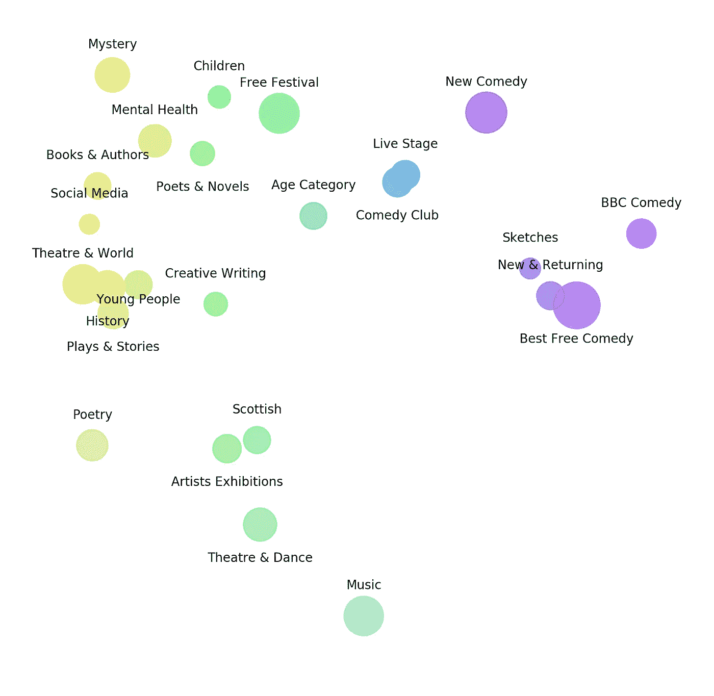

# 基于 2019 年爱丁堡边缘数据的 NLP

> 原文：<https://towardsdatascience.com/nlp-on-edinburgh-fringe-2019-data-aa71dca818b4?source=collection_archive---------27----------------------->


## 对爱丁堡边缘事件的网页抓取和文本分析

在这篇文章中，我们深入到基本的刮网站，清理文本数据，和自然语言处理(NLP)。我把这个项目的背景建立在爱丁堡边缘艺术节上，这是世界上最大的艺术节，目前正在 8 月 2 日到 26 日之间举行。

## 从网页抓取获取 Python 中的数据

为了便于分析，我想获取有关条纹节期间发生的所有事件的文本。此文本数据位于多个网页中，手动提取会花费很长时间。

Python 库**请求**就是在这里帮助我们的，因为它可以用来对特定的网页进行 HTTP 请求。从作出 HTTP 请求的响应中，可以获得网站文本数据。然而，这个文本数据是一个很大的文本卷轴，在这里实现了库**beauty lump**来解析从网页得到的返回 HTML，这样我们就可以高效地只提取我们想要的内容。

下面的代码片段演示了如何向网页发出请求，并通过 BeautifulSoup 解析响应:

```
import requests
from bs4 import BeautifulSoup# URL to query
url = '[https://url_to_query'](https://url_to_query')# Scrape html from the URL
response = requests.get(url)# Use html parser on webpage text
soup = BeautifulSoup(response.text, 'html.parser')
```

在返回的变量 soup 中，我们可以使用诸如**soup . find _ all(‘，CLASS _ =‘CLASS _ NAME’)**之类的命令来搜索 HTML 中的特定类。使用这种方法，我获得了 5，254 个节日事件的数据，包括事件名称字段、事件的简短描述、票价和正在执行的演出数量。

## 探索边缘数据

获得数据集之后，下一步通常是探索你所拥有的。我很想知道这些活动的票价分布情况。此数据的受限视图如下所示:


Distribution of events by ticket price (view limited to cost up to £60)

从图表中，我们可以看到，超过 25%的活动是免费参加的，其中 5-20 持有很大一部分的分布。对数据进行更深入的分析后发现，这些节目的成本超过 60 英镑，其中大多数都是技术大师班或食品/饮料品尝会。我真正感兴趣的是节目类型，为此我们需要开始处理文本数据。

## 清洁

在数据科学项目中使用文本时，数据在传递给我们要应用的任何模型之前，几乎总是需要某种程度的清理。利用这些数据，我将事件名称和描述文本组合到一个名为**df[“text”]**的字段中。下面的代码显示了为清理文本而采取的一些步骤:

```
import string
import pandas

def remove_punctuation(s):
 s = ‘’.join([i for i in s if i not in frozenset((string.punctuation))])
 return s# Transform the text to lowercase
df[‘text’] = df[‘text’].str.lower()# Remove the newline characters
df[‘text’] = df[‘text’].replace(‘\n’,’ ‘, regex=True)# Remove punctuation
df[‘text’] = df[‘text’].apply(remove_punctuation)
```

## 词汇袋(BOW)

现在，数据帧中的每一行都包含一个经过清理的文本数据字段，我们可以继续检查它背后的语言。一种更简单的方法叫做单词包(BOW ),它创建了一个包含数据中出现的所有独特单词的词汇表。我们可以使用从 **sklearn** 引入的**计数矢量器**来完成这项工作。作为设置矢量器的一部分，我们包含了参数**stop words =‘English’，**，它从数据集中删除常见的单词，例如 *the，and，of，to，in，*等。以下代码对我们的文本执行此操作:

```
from sklearn.feature_extraction.text import CountVectorizer

# Initialise our CountVectorizer object
vectorizer = CountVectorizer(analyzer=”word”, tokenizer=None, preprocessor=None, stop_words='english')

# fit_transform fits our data and learns the vocabulary whilst transforming the data into feature vectors
word_bag = vectorizer.fit_transform(df.text)

# print the shape of our feature matrix
word_bag.shape
```

最后一行打印了我们创建的矩阵的形状，在本例中，它的形状为(5254，26，869)。这是我们语料库中所有单词的稀疏矩阵，以及它们在每个提供的句子中的出现。这个矩阵的一个好处是它可以显示我们数据集中最常见的单词；以下代码片段显示了如何操作:

```
# Get and display the top 10 most frequent words
freqs = [(word, word_bag.getcol(idx).sum()) for word, idx in vectorizer.vocabulary_.items()]
freqs_sort = sorted(freqs, key = lambda x: -x[1])
for i in freqs_sort[:10]:
    print(i)
```

根据边缘数据，我们的数据中出现频率最高的前十个词是:

```
('comedy', 1411)
('fringe', 1293)
('new', 927)
('theatre', 852)
('edinburgh', 741)
('world', 651)
('life', 612)
('festival', 561)
('music', 557)
('join', 534)
```

这是意料之中的，并没有告诉我们太多的深度。让我们试着绘制事件之间的联系。

## TF-IDF 和余弦相似性

当在 NLP 中工作时，我们通常旨在通过查看组成文本的单词来理解特定的文本字符串是关于什么的。衡量一个单词有多重要的一个标准是它的词频。这是一个单词在文档中出现的频率。但是，有些词可以出现很多次，但可能并不重要；其中一些是已经被删除的停用词。

我们可以采取的另一种方法是查看一个术语的*逆文档频率* (IDF)，它减少了常用词的权重，增加了在文档集合中不经常使用的词的权重。我们可以把 TF 和 IDF 结合起来(TF-IDF)。TF-IDF 是一种用于强调在给定观察中频繁出现的单词，同时不强调在许多观察中频繁出现的单词的方法。这种技术在确定哪些单词将成为好的特征方面非常有用。对于这个项目，我们将使用来自 **scikit-learn** 的 TF-IDF 矢量器。我们可以使用以下代码使我们的文本适合 TF-IDF 模型:

```
from sklearn.feature_extraction.text import TfidfVectorizer as TFIV

vctr = TFIV(min_df=2,
 max_features=None,
 strip_accents=’unicode’,
 analyzer=’word’,
 token_pattern=r’\w{1,}’,
 ngram_range=(1, 2),
 use_idf=True,
 smooth_idf=1,
 sublinear_tf=1,
 stop_words = ‘english’)

X = vctr.fit_transform(df.text)
```

从矩阵 X 中，我们可以以单词向量的形式理解每个事件的文本。为了找到相似的事件，我们将使用一种叫做余弦相似度的方法，我们也可以从 **sklearn** 导入这种方法。下面的代码片段演示了如何对单个事件(X[5])执行此操作，输出显示了最相关的事件及其相似性得分(得分为 1 表示相同的文本)。

```
from sklearn.metrics.pairwise import linear_kernelcosine_similarities = linear_kernel(X[5], X).flatten()
related_docs_indices = cosine_similarities.argsort()[:-5:-1]
cos = cosine_similarities[related_docs_indices]print(related_docs_indices)
print(cos)[5  33         696        1041      ]
[1\. 0.60378536 0.18632652 0.14713335]
```

对所有事件重复这一过程会创建所有事件以及相似事件如何联系在一起的地图。


Gephi network graph showing cosine similarities >0.2 for all events, coloured by LDA topic

关于上面的网络图，有趣的是大量的事件与网络中的其他事件没有关系。这些分散在网络的边缘，突出了边缘艺术节上展示的原创程度。在中间，我们可以看到一些事件之间高度重叠的集群。在项目的最后阶段，我们对这些集群进行建模，并尝试为它们分配主题。

## 主题建模

潜在狄利克雷分配(LDA)是一种基于词频生成主题的模型。我们在这里使用它来寻找我们的边缘数据中关于正在发生的事件类型的特定主题。下面的代码显示了如何开始使用这种方法:

```
from sklearn.decomposition import LatentDirichletAllocationvectorizer = CountVectorizer(analyzer="word",
                             min_df=20,
                             token_pattern=r'\w{1,}',
                             ngram_range=(2, 4),
                             preprocessor=None,
                             stop_words='english')

word_bag = vectorizer.fit_transform(df.text)lda = LatentDirichletAllocation(n_topics=25,
   max_iter=50,
   learning_method=’online’,
   learning_offset=40.,
   random_state=0).fit(word_bag)names = vectorizer_stop.get_feature_names()for topic_idx, topic in enumerate(lda.components_):
    print("Topic %d:" % (topic_idx))
    print(" ".join([names[i]
                    for i in topic.argsort()[:-5 - 1:-1]]))
```

上面的代码只是运行 LDA 模型并打印输出主题和最重要的单词的一个例子。根据 LDA 的输出，我使用主坐标分析来创建我们主题的 2D 投影:



Topic modelling from LDA method

能够通过运行 LDA 来绘制主题对于观察主题重叠的地方和调整模型非常有用。它还提供了一种方法来理解节日期间发生的不同类型的事件，如音乐、喜剧、诗歌、舞蹈和写作。

## 结束语

我们的分析表明，有了 NLP 方法和技术的基础，我们可以询问一个小的文本数据集来获得洞察力。尽管 BoW 模型很简单，但它可以快速查看文本中出现的单词数量和主要使用的单词，尽管对于我们的数据来说，像“喜剧”、“边缘”和“爱丁堡”这样的单词是最常见的，这并不令人惊讶。

在此基础上，TF-IDF 提供了一种开始考虑句子而不是单词的方法，增加了余弦相似性，提供了一种开始分组观察的方法。这向我们展示了原始事件的范围，在其他事件之间很少出现共同的文本。

最后，使用 LDA，我们让我们的模型产生主题，其中事件组被分配给一个主题。这使我们能够衡量整个节日期间发生的主要事件类型。

NLP 还有其他几种方法值得研究。作为项目的一部分，我还使用了 Word2Vec 和 TSNE；然而，这些研究的结果还没有公布。