# NLP 第 3 部分|文本数据的探索性数据分析

> 原文：<https://towardsdatascience.com/nlp-part-3-exploratory-data-analysis-of-text-data-1caa8ab3f79d?source=collection_archive---------3----------------------->

## 让我们从员工评估中收集一些见解


Photo by [Luke Chesser](https://unsplash.com/@lukechesser?utm_source=medium&utm_medium=referral) on [Unsplash](https://unsplash.com?utm_source=medium&utm_medium=referral)

这是关于使用 python 的 NLP 的三部分系列的继续。请随意查看我的其他文章。([第一部分](/scraping-the-web-using-beautifulsoup-and-python-5df8e63d9de3)，[第二部分](/preprocessing-text-data-using-python-576206753c28))

让我们更好地理解我们新清理的数据集。
探索性数据分析(EDA)是数据分析师熟悉他们的数据以推动直觉并开始制定可测试假设的过程。这个过程通常利用描述性统计和可视化。

像往常一样，让我们从导入必要的库并打开数据集开始。

```
import pandas as pd
import numpy as np
import nltk
import pickle
import pyLDAvis.sklearn
from collections import Counter
from textblob import TextBlob
from nltk.tokenize import word_tokenize
from nltk.probability import FreqDist
from sklearn.feature_extraction.text import CountVectorizer
from sklearn.feature_extraction.text import TfidfVectorizer
from sklearn.decomposition import LatentDirichletAllocation, NMF
from wordcloud import WordCloud, ImageColorGenerator
import matplotlib.pyplot as plt
import seaborn as sns%matplotlib inline
pd.options.mode.chained_assignment = None
pd.set_option('display.max_colwidth', 100)with open('indeed_scrape_clean.pkl', 'rb') as pickle_file:
    df = pickle.load(pickle_file)
```

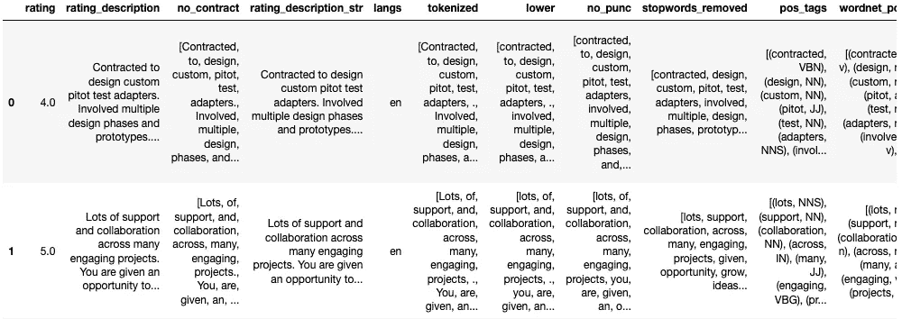

如果您还记得我们以前的教程，我们经历了一系列预处理步骤来清理和准备我们的数据进行分析。我们的最终数据集包含许多列，但最后一列“lemmatized”包含我们最终清理的单词列表。我们将覆盖现有的数据框架，因为我们只对“rating”和“lemmatized”列感兴趣。

```
df = df[['rating', 'lemmatized']]
df.head()
```

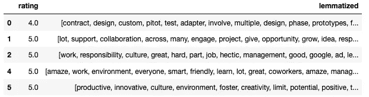

# 情感分析

情感分析是确定作者的态度或观点的过程，其范围从-1(消极态度)到 1(积极态度)。我们将使用 TextBlob 库来分析情感。TextBlob 的情绪()函数需要一个字符串，但我们的“lemmatized”列当前是一个列表。让我们把列表转换成一个字符串。

```
df['lemma_str'] = [' '.join(map(str,l)) for l in df['lemmatized']]
df.head()
```

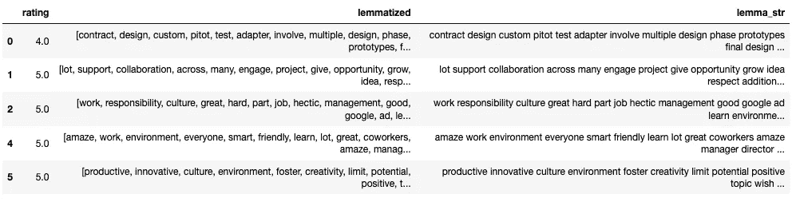

现在我们可以将“lemma_str”列传递到情感()函数中来计算情感。因为我们有“评级”栏，我们可以验证情感分析能够多好地确定作者的态度。也就是说，我们确实看到了明显的错误，因为评级#5 的评级为 5，但情绪相当低。

```
df['sentiment'] = df['lemma_str'].apply(lambda x: TextBlob(x).sentiment.polarity)
df.head()
```

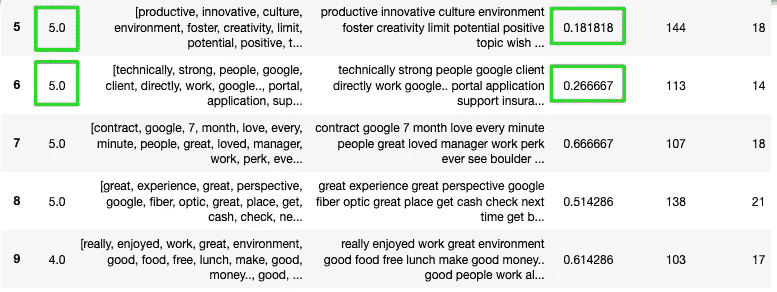

当比较我们的情绪直方图时，我们可以看到，我们得出的绝大多数情绪评级都是非常积极的。当我们将其与“评级”栏进行比较时，我们可以看到类似的模式出现。我们不仅对情绪分析的准确性感到满意，而且可以看到员工对公司的整体态度非常积极。难怪谷歌经常被列入福布斯最佳工作场所名单。

```
plt.figure(figsize=(50,30))
plt.margins(0.02)
plt.xlabel('Sentiment', fontsize=50)
plt.xticks(fontsize=40)
plt.ylabel('Frequency', fontsize=50)
plt.yticks(fontsize=40)
plt.hist(df['sentiment'], bins=50)
plt.title('Sentiment Distribution', fontsize=60)
plt.show()
```

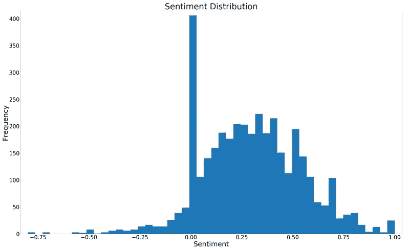

```
x_rating = df.rating.value_counts()
y_rating = x_rating.sort_index()
plt.figure(figsize=(50,30))
sns.barplot(x_rating.index, x_rating.values, alpha=0.8)
plt.title("Rating Distribution", fontsize=50)
plt.ylabel('Frequency', fontsize=50)
plt.yticks(fontsize=40)
plt.xlabel('Employee Ratings', fontsize=50)
plt.xticks(fontsize=40)
```

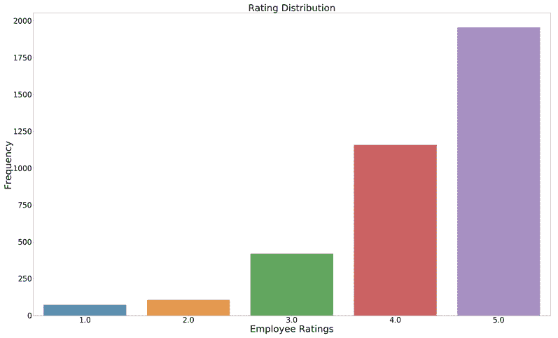

```
plt.figure(figsize=(30,10))
plt.title('Percentage of Ratings', fontsize=20)
df.rating.value_counts().plot(kind='pie', labels=['Rating5', 'Rating4', 'Rating3', 'Rating2', 'Rating1'],
                              wedgeprops=dict(width=.7), autopct='%1.0f%%', startangle= -20, 
                              textprops={'fontsize': 15})
```

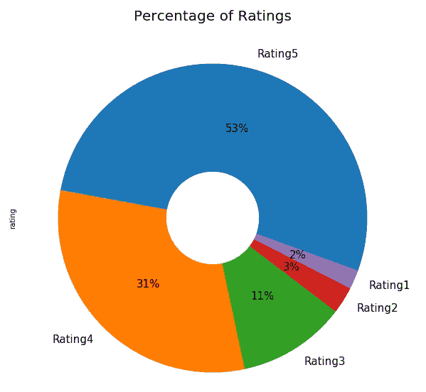

```
polarity_avg = df.groupby('rating')['sentiment'].mean().plot(kind='bar', figsize=(50,30))
plt.xlabel('Rating', fontsize=45)
plt.ylabel('Average Sentiment', fontsize=45)
plt.xticks(fontsize=40)
plt.yticks(fontsize=40)
plt.title('Average Sentiment per Rating Distribution', fontsize=50)
plt.show()
```

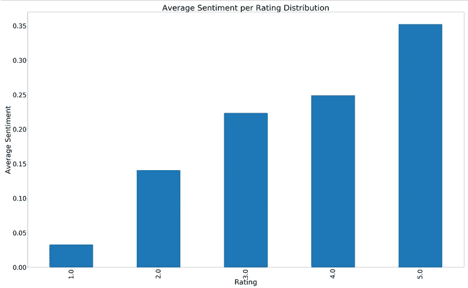

让我们创建两个额外的特性“word_count”来确定每次评论的字数，创建“review_len”来确定每次评论的字数。

```
df['word_count'] = df['lemmatized'].apply(lambda x: len(str(x).split()))df['review_len'] = df['lemma_str'].astype(str).apply(len)
```

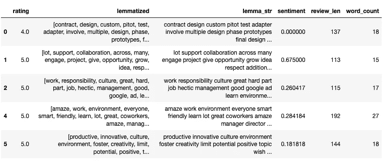

虽然差异并不大，但基于字母和单词计数的最长评论似乎是负面和中性的。似乎心怀不满的员工通常会在他们的评估中提供更多细节。这种结果并不少见，因为人类倾向于抱怨细节，而赞美简短。这可以通过检查下面的相关矩阵来进一步确认。评分和情绪都与“review_len”和“word_count”负相关。这可以解释相反的关系，因为每次评论的字母和单词数增加了总体评分，而情绪下降了。然而，相关性再次相当小，然而是负的。

```
letter_avg = df.groupby('rating')['review_len'].mean().plot(kind='bar', figsize=(50,30))
plt.xlabel('Rating', fontsize=35)
plt.ylabel('Count of Letters in Rating', fontsize=35)
plt.xticks(fontsize=40)
plt.yticks(fontsize=40)
plt.title('Average Number of Letters per Rating Distribution', fontsize=40)
plt.show()
```

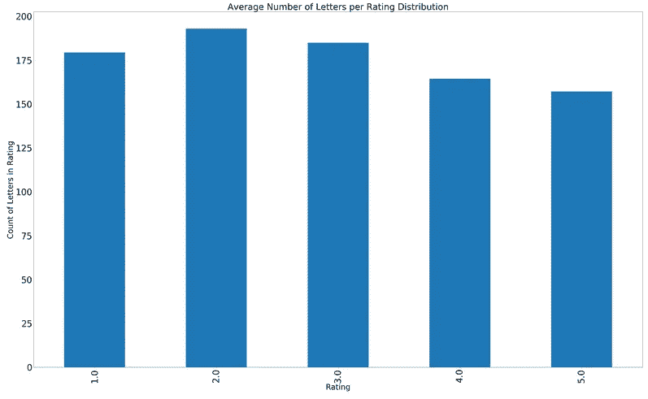

```
word_avg = df.groupby('rating')['word_count'].mean().plot(kind='bar', figsize=(50,30))
plt.xlabel('Rating', fontsize=35)
plt.ylabel('Count of Words in Rating', fontsize=35)
plt.xticks(fontsize=40)
plt.yticks(fontsize=40)
plt.title('Average Number of Words per Rating Distribution', fontsize=40)
plt.show()
```

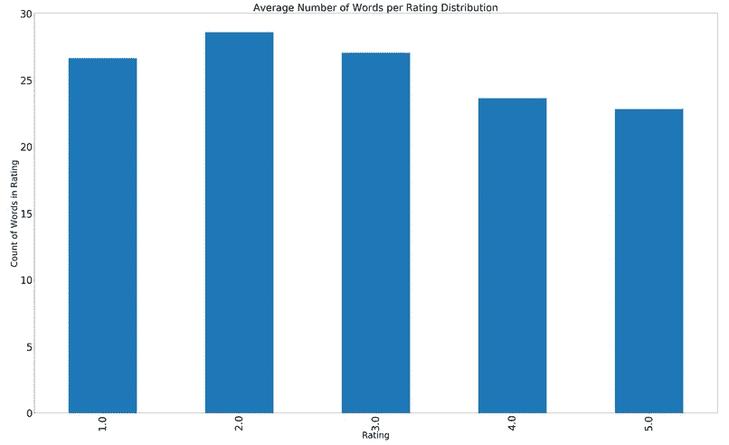

```
correlation = df[['rating','sentiment', 'review_len', 'word_count']].corr()
mask = np.zeros_like(correlation, dtype=np.bool)
mask[np.triu_indices_from(mask)] = True
plt.figure(figsize=(50,30))
plt.xticks(fontsize=40)
plt.yticks(fontsize=40)
sns.heatmap(correlation, cmap='coolwarm', annot=True, annot_kws={"size": 40}, linewidths=10, vmin=-1.5, mask=mask)
```

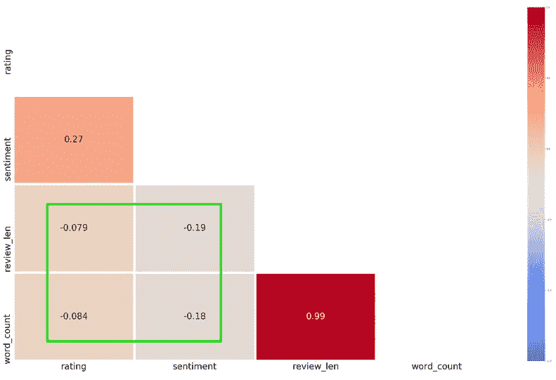

# 词频分析

让我们深入看看实际的评论本身。最常见的词是什么？按评分最常见的词有哪些？对这些问题的回答将为谷歌员工的观点提供进一步的见解。

NLTK 有一个很棒的名为“FreqDist”的库，它允许我们确定语料库中最常见术语的数量。首先，我们需要将我们单独的标记化评论列表转换成一个综合的可重复标记列表，将所有评论存储在一起。最后，我们向 FreqDist()传递“allwords”对象，并应用“most_common(100)”函数来获取 100 个最常见的单词。

```
words = df['lemmatized']
allwords = []
for wordlist in words:
    allwords += wordlistprint(allwords)
```

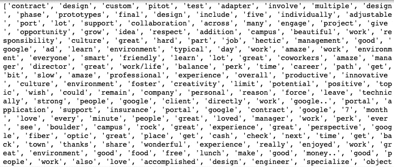

```
mostcommon = FreqDist(allwords).most_common(100)wordcloud = WordCloud(width=1600, height=800, background_color='white').generate(str(mostcommon))
fig = plt.figure(figsize=(30,10), facecolor='white')
plt.imshow(wordcloud, interpolation="bilinear")
plt.axis('off')
plt.title('Top 100 Most Common Words', fontsize=100)plt.tight_layout(pad=0)
plt.show()
```

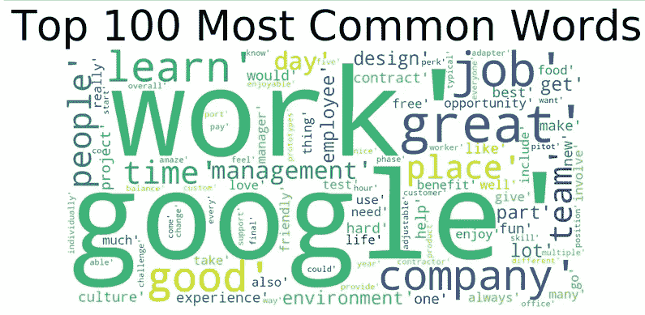

```
mostcommon_small = FreqDist(allwords).most_common(25)
x, y = zip(*mostcommon_small)plt.figure(figsize=(50,30))
plt.margins(0.02)
plt.bar(x, y)
plt.xlabel('Words', fontsize=50)
plt.ylabel('Frequency of Words', fontsize=50)
plt.yticks(fontsize=40)
plt.xticks(rotation=60, fontsize=40)
plt.title('Frequency of 25 Most Common Words', fontsize=60)
plt.show()
```

词频分析的结果肯定支持评论的总体积极情绪。诸如“伟大”、“工作”、“人”、“团队”、“公司”等术语都指向一个积极的公司环境，员工喜欢一起工作。

> 基于诸如“工作”、“谷歌”、“工作”和“公司”等术语在语料库中出现频率如此之高的事实，移除它们可能是个好主意(即将它们添加到我们的停用词中)。

也就是说，一个公司总是可以改进的。因此，让我们来看看每个评价中最常用的词。

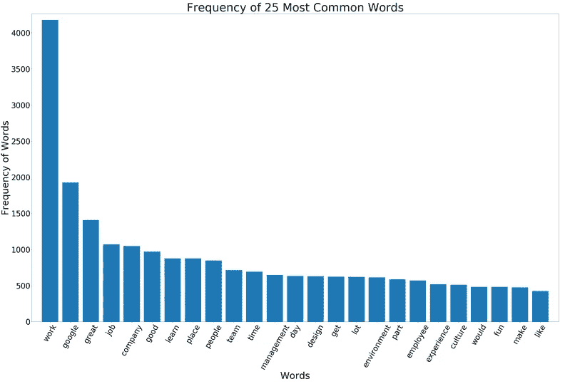

这似乎是评分= 1 的评论中最常见的词，与“管理”、“经理”、“人”有关。我们在解释这些结果时必须小心，因为根据上面打印的饼状图，只有 2%的评论评级为 1。

```
group_by = df.groupby('rating')['lemma_str'].apply(lambda x: Counter(' '.join(x).split()).most_common(25))group_by_0 = group_by.iloc[0]
words0 = list(zip(*group_by_0))[0]
freq0 = list(zip(*group_by_0))[1]plt.figure(figsize=(50,30))
plt.bar(words0, freq0)
plt.xlabel('Words', fontsize=50)
plt.ylabel('Frequency of Words', fontsize=50)
plt.yticks(fontsize=40)
plt.xticks(rotation=60, fontsize=40)
plt.title('Frequency of 25 Most Common Words for Rating=1', fontsize=60)
plt.show()
```

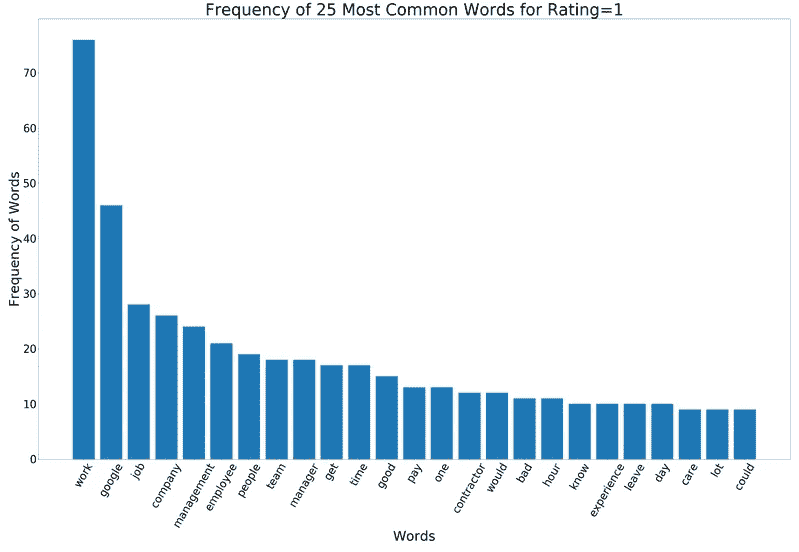

评分为 2 的评论有一个共同的主题“经理”、“管理”。评级分布再次非常不均衡，但这确实给了我们一些改进组织的线索。

```
group_by_1 = group_by.iloc[1]
words1 = list(zip(*group_by_1))[0]
freq1 = list(zip(*group_by_1))[1]
plt.figure(figsize=(50,30))
plt.bar(words1, freq1)
plt.xlabel('Words', fontsize=50)
plt.ylabel('Frequency of Words', fontsize=50)
plt.yticks(fontsize=40)
plt.xticks(rotation=60, fontsize=40)
plt.title('Frequency of 25 Most Common Words for Rating=2', fontsize=60)
plt.show()
```

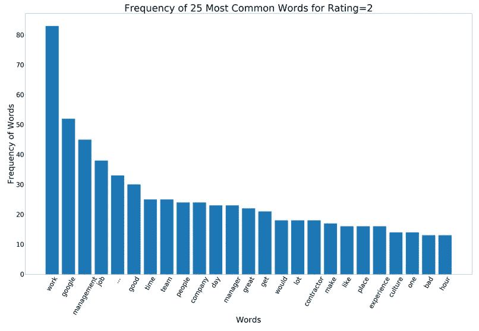

很难从“中性”评级中获得准确的见解，因为员工对公司没有任何过于积极或消极的看法。话虽如此，有趣的是,“管理”再次成为十大热门词汇。到目前为止，大约 14%的员工对谷歌的管理层持负面或中立的态度(没什么好或不好的可说)。像“工作”和“谷歌”这样的词似乎扭曲了所有评级的分布，从未来的分析中删除这些词是一个好主意。

请注意“…”，我们还需要执行一些数据处理。😞

```
group_by_2 = group_by.iloc[2]
words2 = list(zip(*group_by_2))[0]
freq2 = list(zip(*group_by_2))[1]
plt.figure(figsize=(50,30))
plt.bar(words2, freq2)
plt.xlabel('Words', fontsize=50)
plt.ylabel('Frequency of Words', fontsize=50)
plt.yticks(fontsize=40)
plt.xticks(rotation=60, fontsize=40)
plt.title('Frequency of 25 Most Common Words for Rating=3', fontsize=60)
plt.show()
```

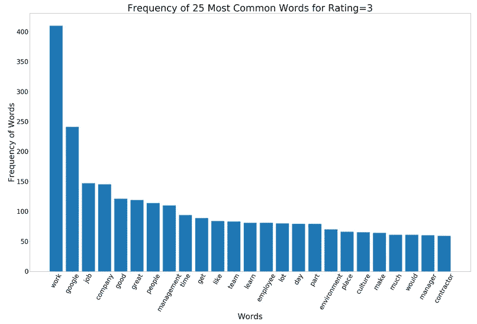

评分为 4 和 5 的术语非常相似，因为员工似乎喜欢他们的工作，喜欢与他们一起工作的人，并且重视谷歌的环境/文化。比如“设计”、“学习机会”、“人”、“时间”、“团队”都有出现。也就是说，我们在排名前 10 位的单词中没有看到“管理”或“经理”。这是非常有见地的，因为它有助于验证评级 1、2 和 3 的结果。最后但同样重要的是，这些词频(即。等级 4 和 5)是从大量评论中得出的，这只会增加这些结果的有效性；管理当然是一个需要改进的领域。

```
group_by_3 = group_by.iloc[3]
words3 = list(zip(*group_by_3))[0]
freq3 = list(zip(*group_by_3))[1]
plt.figure(figsize=(50,30))
plt.bar(words3, freq3)
plt.xlabel('Words', fontsize=50)
plt.ylabel('Frequency of Words', fontsize=50)
plt.yticks(fontsize=40)
plt.xticks(rotation=60, fontsize=40)
plt.title('Frequency of 25 Most Common Words for Rating=4', fontsize=60)
plt.show()
```

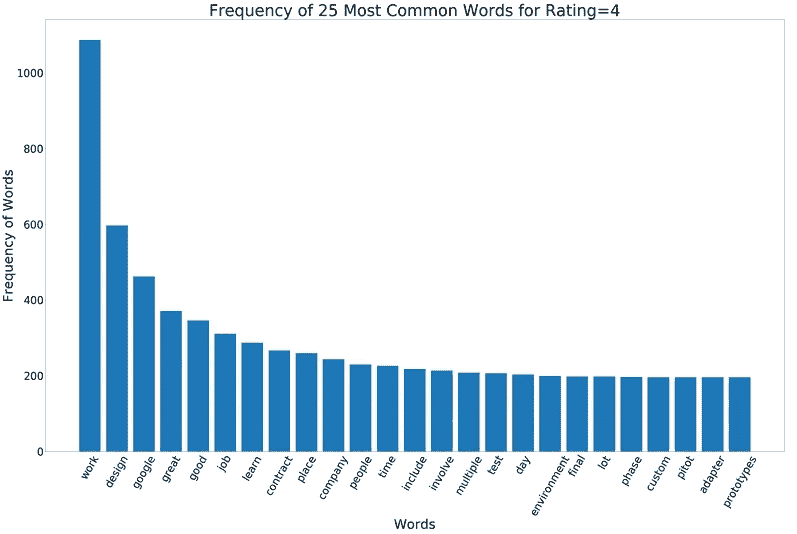

```
group_by_4 = group_by.iloc[4]
words4 = list(zip(*group_by_4))[0]
freq4 = list(zip(*group_by_4))[1]
plt.figure(figsize=(50,30))
plt.bar(words4, freq4)
plt.xlabel('Words', fontsize=50)
plt.ylabel('Frequency of Words', fontsize=50)
plt.yticks(fontsize=40)
plt.xticks(rotation=60, fontsize=40)
plt.title('Frequency of 25 Most Common Words for Rating=5', fontsize=60)
plt.show()
```

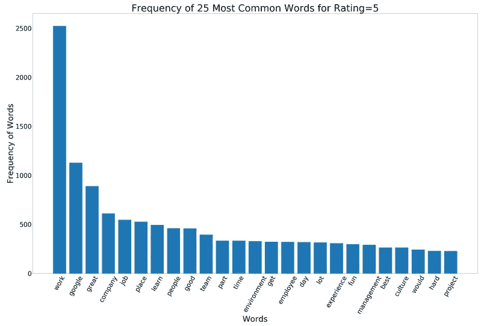

# 主题建模

最后，让我们应用一些主题建模算法来帮助我们的评论导出特定的主题。在我们确定每个评级的主题之前，我们必须执行一个额外的处理步骤。现在我们的数据/文字对我们人类来说仍然是可读的，而计算机只能理解数字。我们需要将文本转换成数字或向量。

## 计数矢量器

对记号进行矢量化的 CountVectorizer 方法将所有单词/记号转置为特征，然后提供每个单词的出现次数。结果称为文档术语矩阵，如下所示。

首先，我们创建矢量器对象。Max_df=0.9 将删除出现在 90%以上评论中的单词。Min_df=25 将删除出现在少于 25 条评论中的单词。接下来，我们创建备用矩阵作为 fit_transform()的结果。最后，我们创建一个所有单词/特征的列表。结果就是我们的文档术语矩阵。每行代表单个员工的评价，并统计每个词/特征在每次评价中出现的次数。

```
tf_vectorizer = CountVectorizer(max_df=0.9, min_df=25, max_features=5000)tf = tf_vectorizer.fit_transform(df['lemma_str'].values.astype('U'))
tf_feature_names = tf_vectorizer.get_feature_names()doc_term_matrix = pd.DataFrame(tf.toarray(), columns=list(tf_feature_names))
doc_term_matrix
```

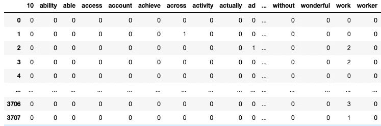

## 潜在狄利克雷分配(LDA)主题建模

既然我们已经为主题建模准备好了数据，我们将使用潜在狄利克雷分配(LDA)方法来确定语料库中的主题。在我们的模型中，我们将产生 10 个单独的主题(即 n _ 组件)。一旦创建了模型，让我们创建一个函数来显示确定的主题。每个题目由 10 个单词组成。该函数将有三个必需的参数；LDA 模型、来自文档术语矩阵的特征名称以及每个主题的字数。

```
lda_model = LatentDirichletAllocation(n_components=10, learning_method='online', max_iter=500, random_state=0).fit(tf)no_top_words = 10def display_topics(model, feature_names, no_top_words):
    for topic_idx, topic in enumerate(model.components_):
        print("Topic %d:" % (topic_idx))
        print(" ".join([feature_names[i]
                          for i in topic.argsort()[:-no_top_words - 1:-1]]))

display_topics(lda_model, tf_feature_names, no_top_words)
```

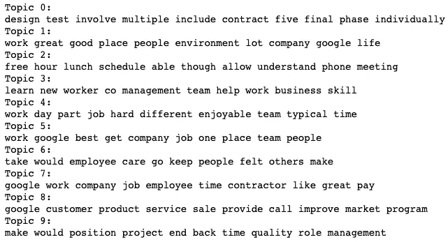

确定 LDA 模型产生的主题当然需要一点想象力。既然我们知道“工作”、“谷歌”、“工作”是很常见的作品我们几乎可以忽略它们。

主题 0:良好的设计流程

话题 1:良好的工作环境

话题 2:弹性工作时间

主题 3:技能培养

话题 4:困难但愉快的工作

话题 5:伟大的公司/工作

话题 6:关心员工

主题 7:优秀承包商薪酬

主题 8:客户服务

话题九:？

## 皮尔戴维斯

pyLDAvis 是一个交互式 LDA 可视化 python 库。每个圆圈代表一个独特的主题，圆圈的大小代表主题的重要性，最后，每个圆圈之间的距离代表主题之间的相似程度。选择一个主题/圆圈将显示一个水平条形图，显示与该主题最相关的 30 个单词，以及每个单词在该主题和整个语料库中出现的频率。

相关性度量有助于区分不同于/专用于主题的单词(λλ更接近 0.0)和具有被包括在所选主题中的高概率的单词(λλ更接近 1.0)。

```
pyLDAvis.enable_notebook()
panel = pyLDAvis.sklearn.prepare(lda_model, tf, tf_vectorizer, mds='tsne')
panel
```

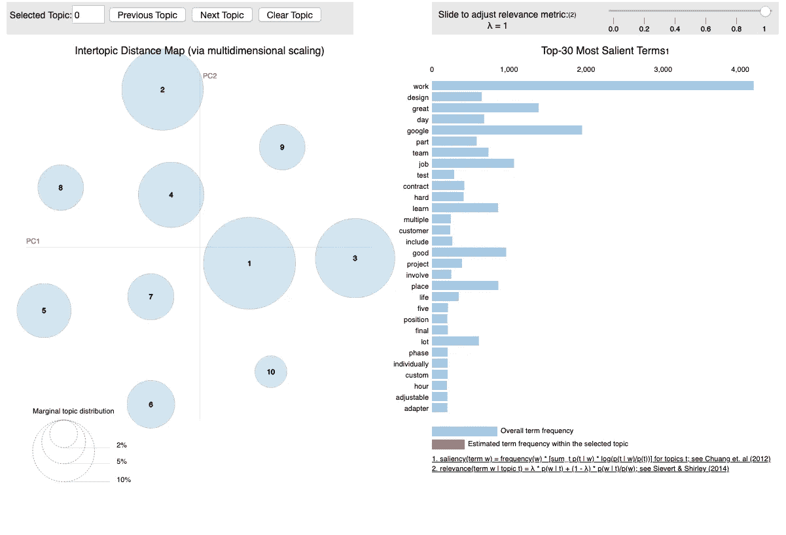

## TF-IDF

LDA 不是主题建模的唯一方法。让我们尝试另一种方法，名为非负矩阵分解(NMF)的方法，看看我们的主题是否可以稍微更加明确。我们将使用 TF-IDF(术语频率-逆文档频率)方法，而不是使用简单的 CountVectorizer 方法来对我们的单词/标记进行矢量化。TF-IDF 方法有助于降低高频词的权重/影响(即在我们的例子中是“工作”、“谷歌”和“工作”)。

与 CountVectorizer 方法非常相似，我们首先创建矢量器对象。Max_df=0.9 将删除出现在 90%以上评论中的单词。Min_df=25 将删除出现在少于 25 条评论中的单词。接下来，我们创建备用矩阵作为 fit_transform()的结果。最后，我们创建一个所有单词/特征的列表。

```
tfidf_vectorizer = TfidfVectorizer(max_df=0.90, min_df =25, max_features=5000, use_idf=True)tfidf = tfidf_vectorizer.fit_transform(df['lemma_str'])
tfidf_feature_names = tfidf_vectorizer.get_feature_names()doc_term_matrix_tfidf = pd.DataFrame(tfidf.toarray(), columns=list(tfidf_feature_names))
doc_term_matrix_tfidf
```

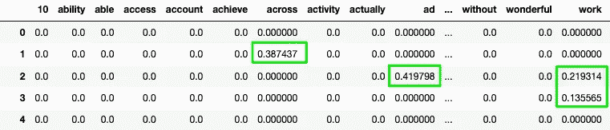

## 非负矩阵分解(NMF)

```
nmf = NMF(n_components=10, random_state=0, alpha=.1, init='nndsvd').fit(tfidf)display_topics(nmf, tfidf_feature_names, no_top_words)
```

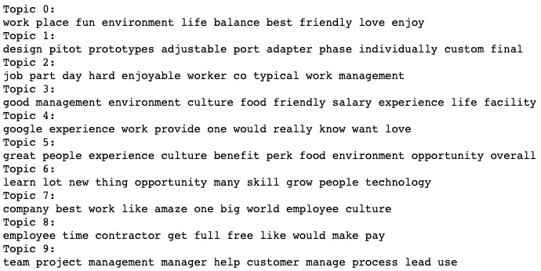

与 LDA 相比，通过 NMF 制作的主题似乎更加独特。

话题 0:有趣的工作文化

主题 1:设计过程

话题 2:愉快的工作

主题 3:

话题四:绝佳体验

话题 5:额外津贴

主题 6:学习机会

话题 7:伟大的公司/工作

主题 8:承包商员工体验

主题 9:管理

让我们把 LDA 和 NMF 的话题都添加到我们的数据框架中，以便进一步分析。让我们也将整数主题重新映射到我们主观导出的主题标签中。

```
nmf_topic_values = nmf.transform(tfidf)
df['nmf_topics'] = nmf_topic_values.argmax(axis=1)
lda_topic_values = lda_model.transform(tf)
df['lda_topics'] = lda_topic_values.argmax(axis=1)lda_remap = {0: 'Good Design Processes', 1: 'Great Work Environment', 2: 'Flexible Work Hours', 3: 'Skill Building', 4: 'Difficult but Enjoyable Work', 5: 'Great Company/Job', 6: 'Care about Employees', 7: 'Great Contractor Pay', 8: 'Customer Service', 9: 'Unknown1'}df['lda_topics'] = df['lda_topics'].map(lda_remap)nmf_remap = {0: 'Fun Work Culture', 1: 'Design Process', 2: 'Enjoyable Job', 3: 'Difficult but Enjoyable Work', 
             4: 'Great Experience', 5: 'Perks', 6: 'Learning Opportunities', 7: 'Great Company/Job', 
             8: 'Contractor Employee Experience', 9: 'Management'}df['nmf_topics'] = df['nmf_topics'].map(nmf_remap)
```

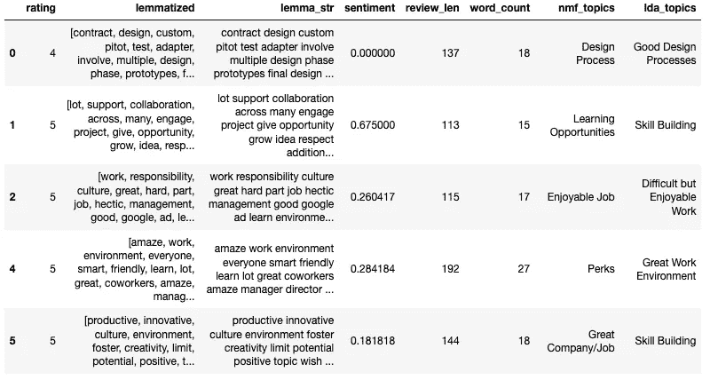

检查由 NMF 产生的主题的频率，我们可以看到前 5 个主题以相对相似的频率出现。请记住，这些是所有评论(正面、中立和负面)的主题，如果您记得我们的数据集是负面倾斜的，因为大多数评论都是正面的。

```
nmf_x = df['nmf_topics'].value_counts()
nmf_y = nmf_x.sort_index()
plt.figure(figsize=(50,30))
sns.barplot(nmf_x, nmf_y.index)
plt.title("NMF Topic Distribution", fontsize=50)
plt.ylabel('Review Topics', fontsize=50)
plt.yticks(fontsize=40)
plt.xlabel('Frequency', fontsize=50)
plt.xticks(fontsize=40)
```

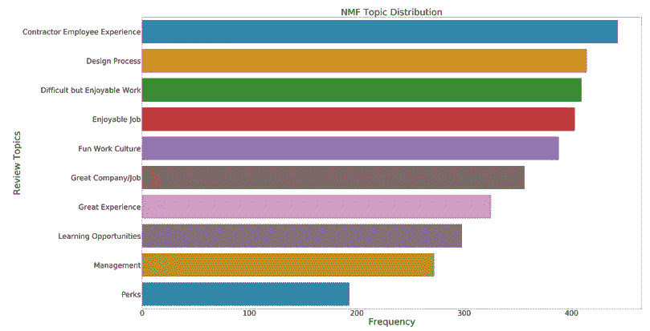

让我们将数据分开，根据评分 1 和 2 检查负面评论的主题。有趣的是，尽管有负面评价，员工们仍然非常喜欢他们的工作、文化和整个公司。由于我们数据集的偏斜，很难获得关于负面评论主题的准确观点(即相对少量的负面评论)。

```
df_low_ratings = df.loc[(df['rating']==1) | (df['rating']==2)]nmf_low_x = df_low_ratings['nmf_topics'].value_counts()
nmf_low_y = nmf_low_x.sort_index()
plt.figure(figsize=(50,30))
sns.barplot(nmf_low_x, nmf_low_y.index)
plt.title("NMF Topic Distribution for Low Ratings (1 & 2)", fontsize=50)
plt.ylabel('Frequency', fontsize=50)
plt.yticks(fontsize=40)
plt.xlabel('Review Topics', fontsize=50)
plt.xticks(fontsize=40)
```

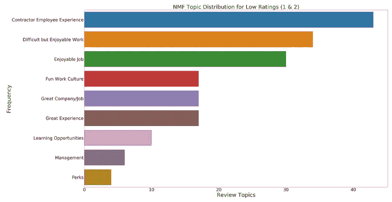

因为我们有更多正面的评论，所以通过 NMF 获得的话题会更准确。似乎承包商雇员构成了许多评论。员工们发现了一个高效的设计过程，工作虽然艰难但却令人愉快，并且对谷歌有一种总体上愉快的情绪。

```
df_high_ratings = df.loc[(df['rating']==4) | (df['rating']==5)]nmf_high_x = df_high_ratings['nmf_topics'].value_counts()
nmf_high_y = nmf_high_x.sort_index()
plt.figure(figsize=(50,30))
sns.barplot(nmf_high_x, nmf_high_y.index)
plt.title("NMF Topic Distribution for High Ratings (3 & 4)", fontsize=50)
plt.ylabel('Frequency', fontsize=50)
plt.yticks(fontsize=40)
plt.xlabel('Review Topics', fontsize=50)
plt.xticks(fontsize=40)
```

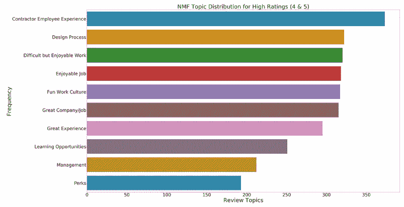

# 结论

从调查结果来看，谷歌的员工似乎非常乐于在谷歌工作。我们看到一个负偏态分布，84%的员工给谷歌打了 4 或 5 分(满分为 1-5 分的李克特量表)。一项情绪分析证实了这些结果，即使给谷歌打 2 到 3 分的员工平均情绪得分为正。

随着我们对数据的进一步挖掘，我们发现了一个有趣的现象，这需要用更多的数据来验证。当我们观察每个等级的术语/词频时，似乎“*经理/管理层”*周围的术语似乎出现在等级 1、2 和 3 中。如前所述，数据是有偏差的，因为大多数评级都是正面的，但有趣的是，有负面或中性评级的员工似乎经常提到*【管理层】*。

另一方面，给谷歌打 4 到 5 分的员工似乎在使用诸如*、【伟大】、【工作】、【工作】、【设计】、【公司】、【好】、【文化】、【人】等词汇。这些结果通过对我们语料库中的话题/主题的检查得到了轻微的证实。NMF 对主题的分析表明，给谷歌打 4 或 5 分的员工渴望讨论困难但愉快的工作、伟大的文化和设计过程。有趣的是，我们还看到没有提到“经理”和“管理”这样的术语，这也说明并有助于验证我们之前的见解。*

谷歌仍然是许多人首选的雇主，84%的评论是正面的。也就是说，我们从谷歌的管理者和/或管理技术中发现了一个潜在的改进领域。

你能想到我们可以探索的任何其他 EDA 方法和/或策略吗？把它们贴在下面的评论里。此外，如果你有任何建设性的反馈或看到我犯了一个错误，请叫我出来😃

# **谢谢！**