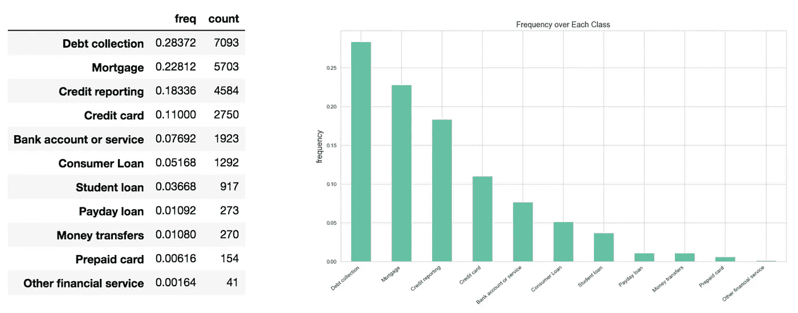
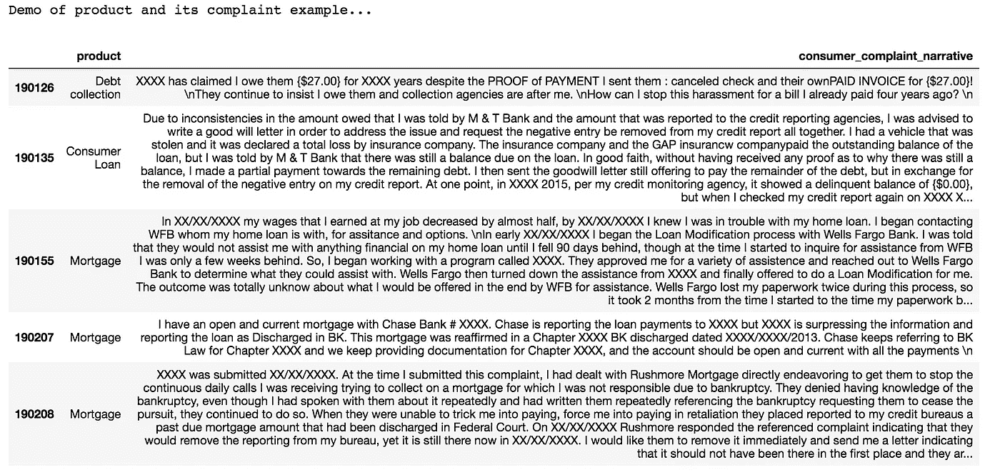
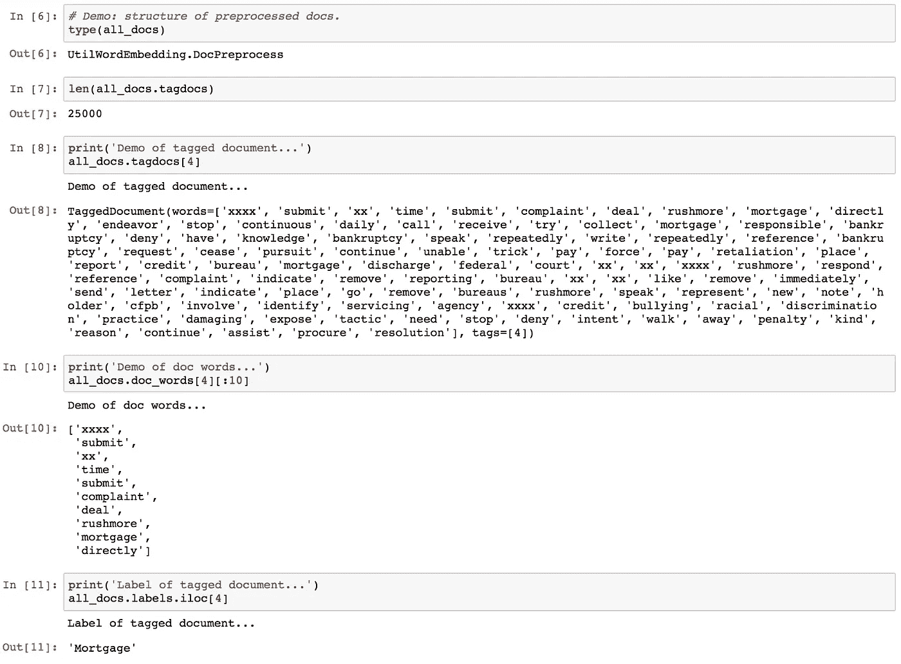
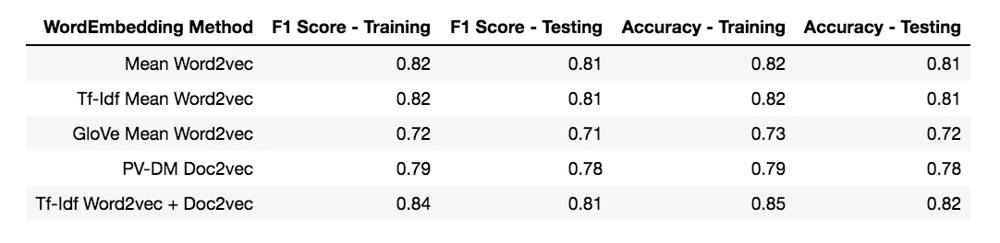

# [NLP]不同单词嵌入对文本分类的性能

> 原文：<https://towardsdatascience.com/nlp-performance-of-different-word-embeddings-on-text-classification-de648c6262b?source=collection_archive---------3----------------------->


Photo by [Kate Stone Matheson](https://unsplash.com/@kstonematheson?utm_source=medium&utm_medium=referral) on [Unsplash](https://unsplash.com?utm_source=medium&utm_medium=referral)

## 在 word2vec、TF-IDF 加权、GloVe 和 doc2vec 之间进行比较

# 诱因

已经有一段时间不能写新帖了，很难过，但现在我终于又回来分享我刚刚获得的一些知识。这次是关于 NLP 的。

作为 NLP 的新手，我想尝试一下，测试一下创建文档向量的不同方法在文本分类上的表现。这篇文章将高度关注特征工程方面，即单词矢量化，而不是建模。因此，没有进一步的原因，让我们开始吧。

## 简介

这里研究的单词嵌入是 word2vec、TF-IDF 加权 word2vec、训练前手套 word2vec 和 doc2vec。需要的软件包是 Gensim、Spacy 和 Scikit-Learn。Spacy 用于文档预处理，包括停用词去除和基于其词性的自定义标记选择。Gensim 主要用于训练 word2vec 和 doc2vec，最后，Scikit-Learn 用于分类器构建和训练。

## 快速小结

在对不同的单词嵌入/平均方法进行一系列比较后，结果表明**定制训练单词嵌入**及其平均方法，无论是简单均值还是 TF-IDF 加权都具有最佳性能，而相反，手套单词嵌入或定制训练 Doc2vec 的性能略差于前者。

此外，即使我们试图将 word2vec 和 doc2vec 连接成一个完整的特性集，它的性能与只使用平均单词嵌入是一样的。换句话说，不需要同时使用 word2vec 和 doc2vec。

## 特别鸣谢以下帖子和作者

在创建我的用于文本预处理的 **python 类对象**时，我参考了这些写得很好的帖子。

*   nadbor 的文章[“使用 Word2vec 的文本分类”](http://nadbordrozd.github.io/blog/2016/05/20/text-classification-with-word2vec/)演示了如何编写自己的类来计算 doc 的平均单词嵌入，无论是简单平均还是 TF-IDF 加权。
*   [《多类文本分类模型比较与选择》Susan Li](/multi-class-text-classification-model-comparison-and-selection-5eb066197568)教我如何写出漂亮的平均函数用于单词嵌入。
*   本教程[“关于 IMDB 情感数据集的 Gensim Doc2vec 教程”](https://github.com/RaRe-Technologies/gensim/blob/3c3506d51a2caf6b890de3b1b32a8b85f7566ca5/docs/notebooks/doc2vec-IMDB.ipynb)对如何通过 Gensim 创建 Doc2vec 进行了逐步指导。
*   Le&的《句子和文档的分布式表示》Mikolov 对 doc2vec 下发生的事情做了清晰易懂的解释。

# 数据准备

我将在这里使用的数据集是帖子[1]中提到的关于金融产品/服务的消费者投诉数据集。数据集由[美国州长 CFPB](https://catalog.data.gov/dataset/consumer-complaint-database) 收集并发布，同时我们也可以从 [Kaggle](https://www.kaggle.com/cfpb/us-consumer-finance-complaints) 下载数据集。

原始数据集包含 50 多万条记录，列包括*产品、子产品、问题、消费者投诉、公司回应消费者等..*我们将使用**产品**作为文本标签，使用**消费者 _ 投诉 _ 叙述**作为文本本身。在删除了消费者投诉中的几行缺失值后，我们只剩下大约 6 万条记录。为了减轻计算压力，我将只对前 25000 条记录进行实验。

现在，让我们看看频率是如何在每个标签中分布的。



Distribution of Each Label in the Dataset

我们可以看出，这是一个高度不平衡的数据集，其中**讨债和抵押**占总记录的一半，而最稀缺的类别**预付卡和其他金融服务**在数据集中仅占不到 1%。

以下是(标签、文本)示例的演示。



Demo of Product(Label), Consumer Complaints(Text)

# 文档预处理

现在是第一步——文档预处理。在我们基于输入文本创建自己的单词嵌入之前，我们需要对文本进行预处理，使其符合 Gensim 要求的输入格式。它包括从单词标记化、二元语法检测、词条化等开始的多个步骤..

在这里，我写了一个名为 **DocProcess** 的 python 类。这个类为我们实现了上面提到的所有底层工作，例如:

1.  首先，该类接收一系列文本，然后标记文本并删除所有标点符号。
2.  它有一个选项`build_bi`，表示是否建立二元语法，函数采用 Gensim。默认值为 False，如果选项`build_bi`设置为 True，那么该类将训练一个双字母检测器并为文本创建双字母单词。
3.  现在，所有经过处理的标记被连接起来，再次形成一个句子。
4.  文本再次被标记化，但这一次，文本中不允许的**停用词**和**词性**都将被移除，所有标记都将被**符号化**。这些标记存储为`self.doc_words` —每个文本的标记列表(doc)。
5.  最后，这些`self.doc_words`被打包成 **TaggedDocument** ，这是 Gensim 中的一个对象类型，供以后在 doc2vec 训练中使用。它存放在`self.tagdocs`

Snippet of Class “DocPreprocess”

有了这个类，我只需一行代码就可以轻松实现文档预处理。

```
from UtilWordEmbedding import DocPreprocess
import spacynlp = spacy.load('en_core_web_md')
stop_words = spacy.lang.en.stop_words.STOP_WORDSall_docs = DocPreprocess(nlp, stop_words, df['consumer_complaint_narrative'], df['product'])
```

现在我们来看看 doc 预处理的输出是什么样的。



The Content Stored in DocPreprocess Class

从上面我们可以看出，这个类已经存储了标记化的单词、标签和标记文档，这些都可以在以后使用。

# 单词模型— Word2vec 培训

由于文本被正确处理，我们准备通过 Gensim 训练我们的 word2vec。在这里，我为每个单词的嵌入选择了尺寸 100，窗口尺寸为 5。训练迭代 100 次。

```
word_model = Word2Vec(all_docs.doc_words, min_count=2, size=100, window=5, workers=workers, iter=100)
```


Photo by [Daria Nepriakhina](https://unsplash.com/@epicantus?utm_source=medium&utm_medium=referral) on [Unsplash](https://unsplash.com?utm_source=medium&utm_medium=referral)

> 现在是休息时间，很快，让我们继续…

# 每个文档的平均单词嵌入

好吧！现在我们手头有了单词嵌入，我们将使用单词嵌入来计算整个文本的代表向量。然后作为文本分类模型的特征输入。有多种方法可以得出 doc vector。首先，我们从简单的开始。

## (1)对单词嵌入的简单平均

这是一个相当简单的方法。它直接对文本中出现的所有单词嵌入进行平均。在这里，我改编了这两篇文章[2][3]中的代码，并创建了类**meanwodembedding vectorizer**。

Class of MeanWordEmbeddingVectorizer

它有`self.fit()`和`self.transform()`方法，以便与 scikit-learn 中的其他功能兼容。这个类做的事情相当简单。使用单词模型(训练单词嵌入)初始化该类，然后它可以将文本中的所有标记转换为向量，并进行平均以得出代表性的 doc 向量。如果 doc 没有标记，那么它将返回一个零向量。

只是提醒一下，`self.transform()`的输入必须是文档标记列表，而不是文档文本本身。

```
from UtilWordEmbedding import MeanEmbeddingVectorizermean_vec_tr = MeanEmbeddingVectorizer(word_model)
doc_vec = mean_vec_tr.transform(all_docs.doc_words)
```

## (2)单词嵌入的 TF-IDF 加权平均

不仅仅满足于简单的平均？我们可以进一步采用 TF-IDF 作为每个单词嵌入的权重。这将放大有效词在计算文档向量中的作用。这里，整个过程是在类**TfidfEmbeddingVectorizer**下实现的。同样，代码改编自相同的帖子源。

值得注意的一点是，我们在对文本进行平均时已经考虑到了**词频**，而没有考虑到**逆文档频率**，因此权重字面上就是 IDF，默认设置中未看到的词被赋予最大 IDF。代码片段可以在 [this gist](https://gist.github.com/TomLin/30244bcccb7e4f94d191a878a697f698) 中查看。

另一件要注意的事情是，我们需要先用标记来**拟合类，因为它必须事先遍历所有单词，以便计算 IDF。**

```
from UtilWordEmbedding import TfidfEmbeddingVectorizertfidf_vec_tr = TfidfEmbeddingVectorizer(word_model)
tfidf_vec_tr.fit(all_docs.doc_words)  # fit tfidf model first
tfidf_doc_vec = tfidf_vec_tr.transform(all_docs.doc_words)
```

## (3)利用预训练手套单词嵌入

让我们包括另一个选项—利用现有的预训练单词嵌入，看看它在文本分类中的表现如何。在这里，我按照[斯坦福大学自然语言处理课程(CS224N)笔记本](http://web.stanford.edu/class/cs224n/materials/Gensim%20word%20vector%20visualization.html)的说明，将 GloVe word embedding 导入 Gensim 进行计算，以计算文本上的平均单词嵌入。

顺便说一句，我还尝试对手套向量应用 TF-IDF 加权方法，但发现结果与 Tf-IDF 加权平均 doc 向量的结果基本相同。因此，我省略了演示，这里只包括手套字向量的简单平均。

```
# Apply word averaging on GloVe word vector.
glove_mean_vec_tr = MeanEmbeddingVectorizer(glove_word_model)
glove_doc_vec = glove_mean_vec_tr.transform(all_docs.doc_words)
```

## (4)直接应用 Doc2vec 培训

最后但同样重要的是，我们还有一个选择—直接训练 doc2vec，不需要对所有单词嵌入进行平均。这里我选择了 **PV-DM 型号**来训练我的 doc2vec。

该脚本主要参考自 Gensim 教程[4]。同样，为了节省所有的劳动，我为它创建了一个类 **DocModel** 。这个类只需要接受 **TaggedDocument** 然后我们调用`self.custom_train()`方法，doc 模型会自己训练。

Class of DocModel

注意到`self.custom_train()`可以选择使用*固定学习率*。据说固定的学习速率达到更好的效果[5]如这里所引用的，

> 1.随机化输入句子的顺序，或者
> 
> 2.在几次迭代过程中手动控制学习速率。

但这并没有发生在我的实验中。当我手动降低学习率时(下面的代码)，我发现 doc2vec 模型不能正确推断最相似的 doc。也就是说，如果我输入来自同一个文档的*文档向量*,`self.test_orig_doc_infer()`不会返回与最相似文档相同的文档，尽管它应该这样做。

顺便提一下，`self.test_orig_doc_infer()`方法用于测试给定来自原始文档的*文档向量*的预测文档是否确实返回与最相似文档相同的文档。如果是这样，我们可以公平地判断该模型成功地捕捉了整个文档的隐含意义，从而给出了具有代表性的文档向量。

```
# Failed Attempt (Not achieving better result.)
for _ in range(fixed_lr_epochs):
   self.model.train(utils.shuffle([x for x in self.docs]),
                total_examples=len(self.docs),
                epochs=1)
   self.model.alpha -= 0.002
   self.model.min_alpha = self.model.alpha  # fixed learning rate
```

因此，相反，只保留默认设置就足以达到更好的效果。这里，学习率被设置为 0.025，训练时期为 100，并且应用负采样。

```
from UtilWordEmbedding import DocModel# Configure keyed arguments for Doc2Vec model.
dm_args = {
    'dm': 1,
    'dm_mean': 1,
    'vector_size': 100,
    'window': 5,
    'negative': 5,
    'hs': 0,
    'min_count': 2,
    'sample': 0,
    'workers': workers,
    'alpha': 0.025,
    'min_alpha': 0.025,
    'epochs': 100,
    'comment': 'alpha=0.025'
}# Instantiate a pv-dm model.
dm = DocModel(docs=all_docs.tagdocs, **dm_args)dm.custom_train()
```

## (5)标签

最后，不要忘记标签！！！

```
target_labels = all_docs.labels
```

# 准备分类模型

现在，我们已经准备好了所有必要的材料——不同类型的功能。让我们通过实验来观察它们对分类性能的影响。在这里，我将使用**基本逻辑模型**作为基础模型，并加入之前创建的不同类型的特征。因此，要比较它们的有效性。

除了比较每种单词嵌入平均方法的效果，我还尝试将 word2vec 和 doc2vec 连接在一起，看看它是否能进一步提升性能。

我一起用了 TF-IDF 加权词嵌入和 PV-DM doc2vec。结果表明，它提高了训练数据集的准确性(也许是过拟合的标志？)，但与单独使用 TF-IDF word2vec 相比，在测试数据集上没有显著改善。

# 反光

我们来考察一下哪个单词嵌入的表现最差。令人惊讶的是，预训练手套单词嵌入和 doc2vec 在文本分类上的表现相对较差，准确率分别为 0.73 和 0.78，其他都在 0.8 以上。也许，这是因为定制训练的 word2vec 特别适合这个数据集，因此为手头的文档提供了最相关的信息。

这并不一定意味着我们不应该再使用 GloVe word embedding 或 doc2vec，因为在推理阶段，我们可能会遇到单词模型中没有单词嵌入的新单词。在这种情况下，手套单词嵌入将对其在宽词汇量上的覆盖有很大帮助。

至于 doc2vec，我们可以说它可以帮助训练好的单词嵌入来进一步提高文本分类模型的性能，尽管它很小，也很适合选择退出。



Table of Classification Performance over Different Word Embedding

完整的 jupyter 笔记本可以在[这个链接](https://github.com/TomLin/Playground/blob/master/04-Model-Comparison-Word2vec-Doc2vec-TfIdfWeighted.ipynb)下找到。

## 参考

[1] Susan Li，[用 Doc2Vec 进行多类文本分类& Logistic 回归](/multi-class-text-classification-with-doc2vec-logistic-regression-9da9947b43f4) (2018)，*走向数据科学*

[2]纳德博尔，[文字分类用 Word2Vec](http://nadbordrozd.github.io/blog/2016/05/20/text-classification-with-word2vec/) (2016)， *DS 绝杀*

[3]苏珊·李，[多类文本分类模型比较与选择](/multi-class-text-classification-model-comparison-and-selection-5eb066197568) (2018)，*走向数据科学*

[4] [Gensim Doc2Vec 关于 IMDB 情感数据集的教程](https://github.com/RaRe-Technologies/gensim/blob/3c3506d51a2caf6b890de3b1b32a8b85f7566ca5/docs/notebooks/doc2vec-IMDB.ipynb)(2018)*github*

[5]雷迪姆·řehůřek's， [Doc2vec 教程](https://rare-technologies.com/doc2vec-tutorial/) (2014)，*稀有技术*