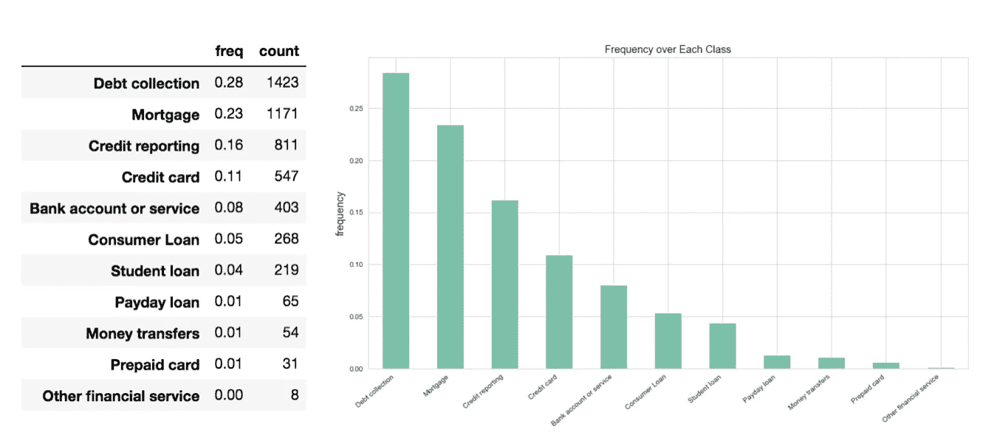
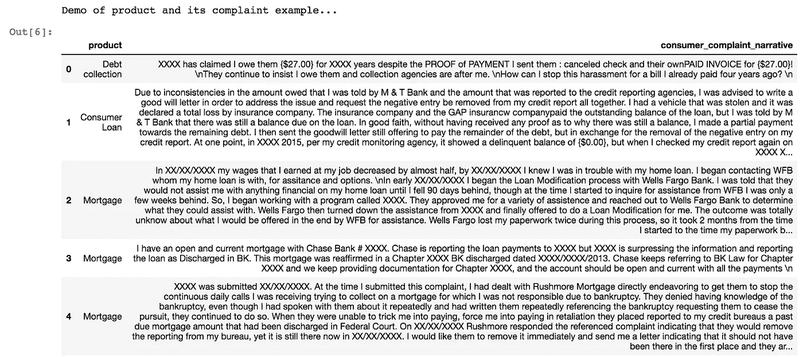
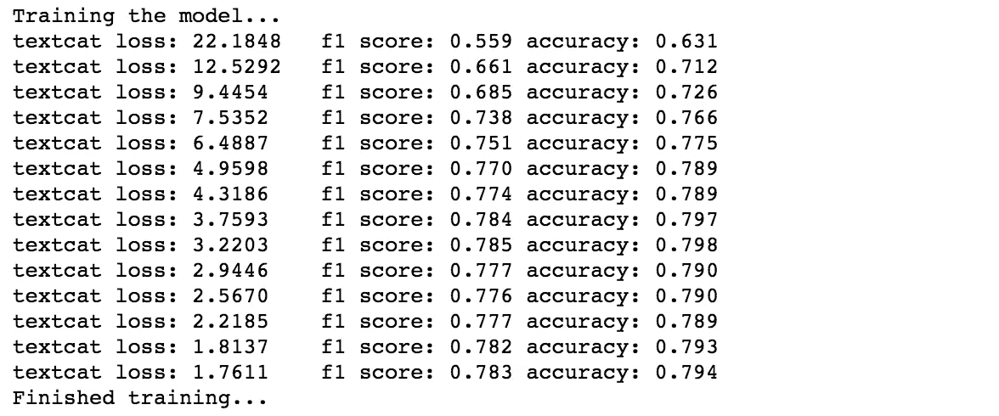
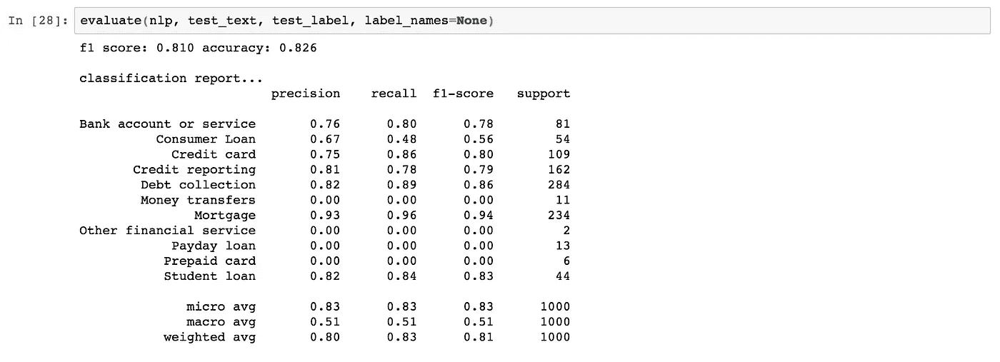
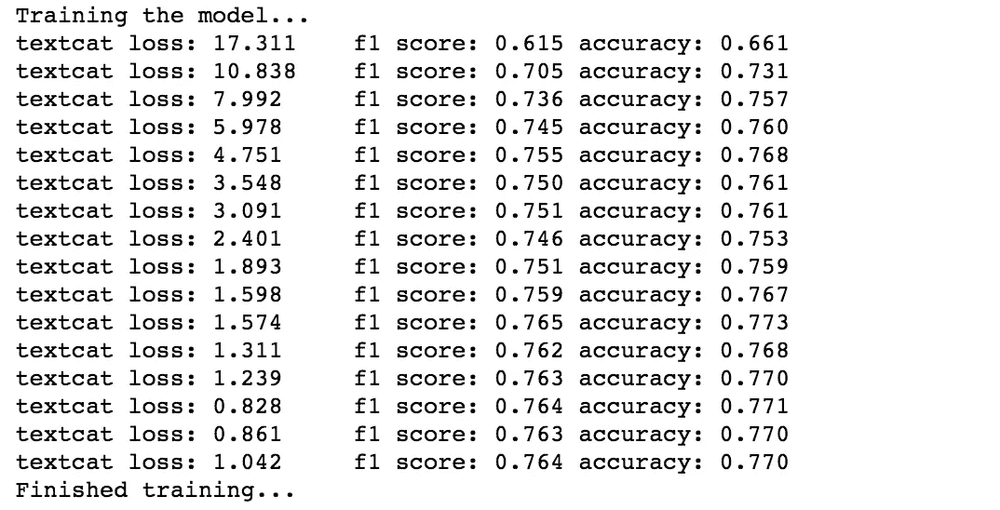
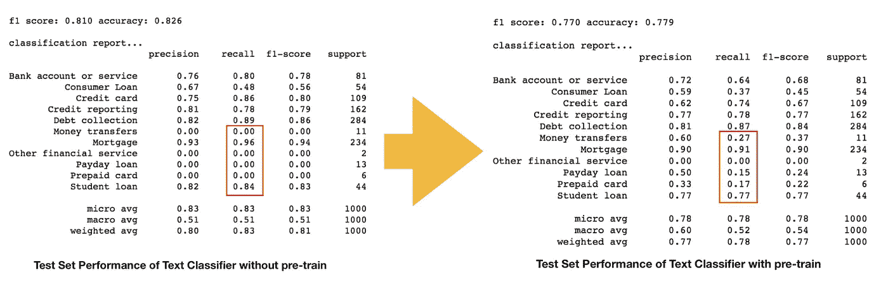

# [NLP]具有预训练令牌的空间分类器 2vec 与没有预训练的空间分类器

> 原文：<https://towardsdatascience.com/nlp-spacy-classifier-with-pre-train-token2vec-vs-one-without-pre-train-2f05d2179290?source=collection_archive---------16----------------------->


Photo by [Mark Zamora](https://unsplash.com/@mmm_mark?utm_source=medium&utm_medium=referral) on [Unsplash](https://unsplash.com?utm_source=medium&utm_medium=referral)

## 尝试 spaCy 的伯特风格的预训练语言模型

继[我之前的文章](/nlp-performance-of-different-word-embeddings-on-text-classification-de648c6262b)关于利用文字嵌入建立文本分类器。在这篇文章中，我将在另一个众所周知的 NLP 包 spaCy 上进行实验，并尝试不同的建模来看看它们的性能如何。

从 spaCy v2.1 开始，它引入了`pretrain`命令的新特性，允许我们为手头的文档启动语言模型定制。它被宣称可以进一步提高精确度，并且在我们只有有限的标记数据集的情况下特别有用[1]。标记数据的不可用性或有限大小对我来说是一个真正令人头痛的问题，我相信对大多数其他数据科学从业者来说也是如此。因此，新推出的功能对我们所有人来说都是一剂强有力的止痛药。今天，我将尝试并检查它如何在准确性和 f1 的得分上有利于文本分类器。

## 快速小结

结果表明，未经预训练的分类器在 f1 和准确率上都有较高的得分。尽管如此，还是要有所保留。如果我们仔细观察，经过预训练的人在识别稀有类方面表现得更好。如果识别稀有类很重要，它仍然有自己的优点。

值得注意的是，spaCy `pretrain`函数或类似的 BERT 风格预训练背后的概念不同于常用的词向量[2]，词向量指的是我们通过 gensim 训练的自定义词 2vec，例如，并作为文本分类器的输入。Spacy `pretrain`发起并训练所谓的语言模型。我还不太明白这两者的区别，希望几天后，一旦我对这两者有了更好的理解，我可以分享另一篇关于其背后理论的文章。但是我们不要推迟体验新功能，为什么不尝试一下呢。

再次，首先，让我向下面的贡献者致敬。思路和做法参考自以下帖子。

*   努兹克[3]的太空之旅(第二部分)
*   Poonam Ligade 使用 SpaCy 进行文本分类[4]

## **熟悉数据**

在这个案例中，我将使用的数据是**消费者对金融产品/服务的投诉**。也可以从这个 [Gov. link](https://catalog.data.gov/dataset/consumer-complaint-database) 和 [Kaggle](https://www.kaggle.com/cfpb/us-consumer-finance-complaints) 中拉出。

该数据集包括“接收日期、产品、问题、消费者投诉、公司”等列特别是，我将使用`product`作为**类标签**，使用`consumer_complaint_narrative`作为**建模输入**。此外，我对一个包含 5000 条记录的样本集进行了子集划分，从而减少了计算资源的消耗。这些记录都是无缺失值的。下面是每个类标签的分布。



Distribution of Class Label in Sample Dataset

我们可以说这是非常不平衡的，前两个班级占了所有记录的一半。这对识别稀缺类别的模型提出了挑战。



Preview of product(label) and input(consumer_complaint_narrative)

## 准备训练、有效和测试数据集

使用 spaCy 构建文本分类器的一个好处是我们可以跳过繁琐的数据预处理阶段。Spacy 会为我们做得很好。我们需要做的就是通过 spaCy 把原始的文本数据转换成需要的文本格式，然后剩下的就交给它了。这里我写了一个代码片段来计算每个数据分割的大小——训练 60%,有效 20%,测试 20%。然后我调用`train_test_split`两次，分别将数据分成三组。

Train/Valid/Test Dataset Split

## 将数据集转换为 spaCy 兼容格式

现在是核心部分，首先我对标签进行一次性编码，并编写一个自定义函数将文本输入和标签转换为列表。

之后，特别是在有效和测试集上，我再次将文本和标签分开，为以后的计算精度做准备。

Dataframe to List in Compliance with spaCy Input Format

现在我们准备构建空间分类器。注意，我们需要在模型本身中添加每个类标签，以便它可以在训练时识别它们。另外，我们事先从 sklearn 导入`f1_score`和`accuracy_score`。

Construct Spacy Text Classifier

## 培养

现在，我们已经具备了开始训练的所有先决条件。在训练片段中，我采用了一些技巧。一个是训练过程将每几次迭代**评估**模型。另一个是**提前停止**。一旦模型在几次连续迭代中没有表现出 f1 分数提高的迹象，训练过程将停止并立即保存最佳性能模型。这种做法使培训过程更有效率。从进度打印输出中，我们观察到一条非常平滑的学习曲线，表明 textcat 很好地捕捉了输入数据，并能够逐渐做出更好的预测。该模型在 f1 中的得分为 0.78，在验证集中的准确率为 0.79。然而，它在未知测试集上的表现如何？

Training Block of spaCy Textcat



Training Progress

## 测试集评估

在这里，我编写了一个自定义函数`evaluate`来评估模型的性能。有趣的是，经过训练的模型在测试集上获得了更高的分数，其中 f1 分数为 0.81，准确度为 0.82。



Trained Model Performance on Test Set


Photo by [Nuno Silva](https://unsplash.com/@nmsilva?utm_source=medium&utm_medium=referral) on [Unsplash](https://unsplash.com?utm_source=medium&utm_medium=referral)

# 使用预训练 token2vec 语言模型进行训练

我们从没有预先训练语言模型的分类器中看到相当令人满意的结果。但是，让我们试验一下，看看当我们应用一个时，它会进一步提高多少。首先，我们需要在文档上实现 spaCy `pretrain`并保存 token2vec 模型。但是在我们开始预培训之前，我们需要将文件转换成需要的格式，这里我将其保存为`text.jsonl`格式转换的详细实现可以在[的笔记本](https://github.com/TomLin/Playground/blob/master/05-Try-out-Spacy-Pretrain.ipynb)附录部分找到。

**注意到**，预训练过程是极其计算密集型的。我在 GCP 上启动了一个计算引擎，配备了 8 核 CPU 和 32GB RAM 来支持训练，但完成前 500 次训练迭代仍然需要 10 个多小时。训练速度大概是每秒 9000 字。因此，在应用训练前功能时，请牢记这一挑战。下面是启动空间预训练的命令。此外，我设置`--use-vectors`使用现有英语模型的向量。

```
python -m spacy pretrain <docs> en_core_web_lg <output_dir> --use-vectors 
```

## 构造简单的 CNN 文本

正如在[github 问题](https://github.com/explosion/spaCy/issues/3448)中所提到的，如果我们想要合并预训练语言模型，并加载预训练权重，我们需要将模型架构切换到`simple_cnn`。下面的代码片段只强调了与以前模型的区别。

*   指定模型架构。

```
if 'textcat' not in nlp.pipe_names:
    textcat = nlp.create_pipe('textcat',
                              config={'architecture':'simple_cnn',
                              'exclusive_classes':True})
    nlp.add_pipe(textcat, last=True)
# otherwise, get it, so we can add labels to it
else:
    textcat = nlp.get_pipe('textcat')
```

*   加载训练前重量。

```
# Train model
other_pipes = [pipe for pipe in nlp.pipe_names if pipe != 'textcat']
with nlp.disable_pipes(*other_pipes):  # only train textcat
    optimizer = nlp.begin_training() # initiate a new model

    with open(pretrain_model_path, 'rb') as file_:
        textcat.model.tok2vec.from_bytes(file_.read())
```

## 培养

与之前的模型相比，我们可以看出培训损失在一开始就显著下降。但另一方面，f1 的分数和准确性不如以前的车型。那很有趣。似乎合并预训练模型并没有提高文本分类器的性能。



Training Progress with pre-train tok2vec

## 测试集评估

但是让我们更深入地研究一下。我们可以看出，虽然预训练的分类器具有较低的 f1 和准确度分数，但它在识别稀有类方面表现得稍好。例如，在“货币转账、发薪日贷款、预付费卡”的类别上，新的分类器成功地识别了每个类别中 10 ~ 30%的情况，但是，先前的分类器在所有情况下都失败了。



## 结论

通过比较具有预训练语言模型的分类器和没有预训练语言模型的分类器，我们可以更好地判断具有预训练语言模型的分类器是否性能更好，如果是，性能提高多少。从上面的实验来看，结果是预训练的一个在 f1 和准确性上得分较低，但它在识别罕见情况上工作得更好。这取决于我们希望应用这些模型的使用场景。如果我们更强调一般性能，那么我们可能只是坚持以前的分类器。尽管如此，如果我们对识别罕见的案例更感兴趣，也许，预培训的实践可能值得一试。

如果你有兴趣了解更多，完整的脚本可以在[这本笔记本](https://github.com/TomLin/Playground/blob/master/05-Try-out-Spacy-Pretrain.ipynb)中找到。

## 参考

[1] [伯特/乌尔姆菲特/埃尔莫式的预训](https://spacy.io/usage/v2-1#pretraining)，*空间文件*

[2] [通过迁移学习提高准确性](https://spacy.io/usage/training#transfer-learning)，*空间文档*

[3] Nuszk，[spaCy 的牛逼功能之旅(第 2/2 部)](https://medium.com/eliiza-ai/a-tour-of-awesome-features-of-spacy-part-2-2-d7bd628a81ce)， *Eliiza-AI*

[4] Poonam Ligade，[文本分类使用 SpaCy](https://www.kaggle.com/poonaml/text-classification-using-spacy) ， *Kaggle*