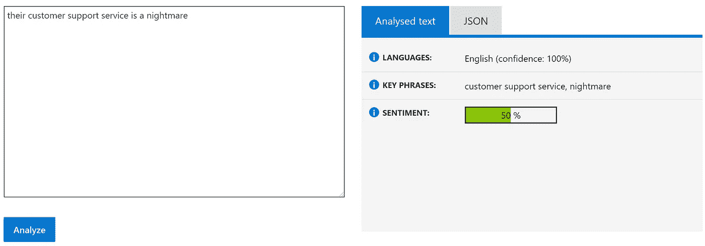
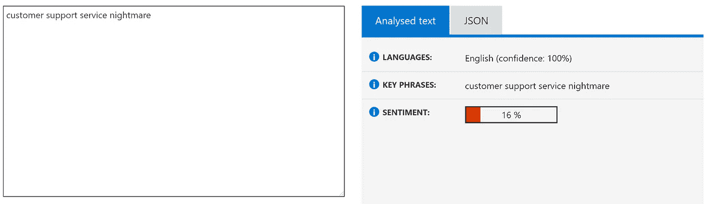
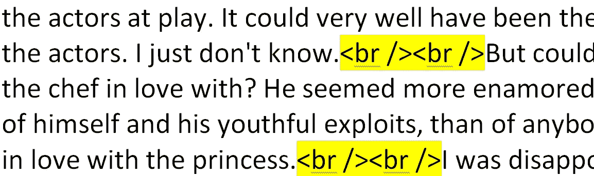

# 自然语言处理文本预处理:实用指南和模板

> 原文：<https://towardsdatascience.com/nlp-text-preprocessing-a-practical-guide-and-template-d80874676e79?source=collection_archive---------3----------------------->


传统上，文本预处理是自然语言处理(NLP)任务的重要步骤。它将文本转换为更容易消化的形式，以便机器学习算法能够更好地执行。

# **文本预处理的重要性**

为了说明文本预处理的重要性，让我们考虑一个针对客户评论的情感分析任务。

假设一个客户反馈说“他们的客户支持服务是一场噩梦”，一个人肯定可以清楚地识别评论的情绪是负面的。然而对于机器来说，这并不简单。

为了说明这一点，我用 [Azure 文本分析 API](https://azure.microsoft.com/en-in/services/cognitive-services/text-analytics/) 进行了实验。馈入同一个评论，API 返回 50%的结果，即中性情绪，这是错误的。



Azure text analytics API results as of publication date (30 Aug 2019)

然而，如果我们已经执行了一些文本预处理，在这种情况下只是删除一些停用词(下面将进一步解释，但现在，将停用词视为非常常见的词，这样它们在我们的 NLP 任务中不会有太大帮助)，我们将看到结果变成 16%，即负面情绪，这是正确的。



Azure text analytics API results after our own preprocessing

因此，如图所示，如果处理得当，文本预处理有助于提高 NLP 任务的准确性。

*边注:上面的 Azure 例子实际上更有趣，因为按理说，* [*Azure 的文本分析 API 应该已经将文本作为其模型*](https://docs.microsoft.com/en-in/azure/cognitive-services/text-analytics/how-tos/text-analytics-how-to-sentiment-analysis) *的一部分进行了处理，但不知何故，停用词似乎混淆了其模型。*

# 文本预处理概述

那么我们如何着手进行文本预处理呢？通常，有 3 个主要组件:

*   标记化
*   正常化
*   噪声消除

简而言之，**记号化**就是将文本串分割成更小的片段，或者“记号”。段落可以被标记成句子，句子可以被标记成单词。**规范化**旨在将所有文本置于一个公平的竞争环境中，例如，将所有字符转换为小写。**噪声去除**清理文本，例如，去除多余的空白。

详情请参考[马修·梅奥](https://medium.com/u/a0bc63d95eb0?source=post_page-----d80874676e79--------------------------------)的这篇[伟大的文章](https://www.kdnuggets.com/2017/12/general-approach-preprocessing-text-data.html)。

# 文本预处理步骤列表

根据上面的概述，我们在每个组件下执行了一系列步骤。

1.  删除 HTML 标签
2.  删除多余的空格
3.  将重音字符转换为 ASCII 字符
4.  扩大收缩
5.  删除特殊字符
6.  小写所有文本
7.  将数字转换成数字形式
8.  删除号码
9.  删除停用词
10.  词汇化

完整代码的链接可以在文章的底部找到，但是请继续阅读以理解所采取的重要步骤。

必要的依赖关系如下:

```
from bs4 import BeautifulSoup
import spacy
import unidecode
from word2number import w2n
import contractions# load spacy model, can be "en_core_web_sm" as well
nlp = spacy.load('en_core_web_md')
```

# 删除 HTML 标签

如果评论或文本是从网上搜集来的，它们很可能会包含一些 HTML 标签。因为这些标签对我们的 NLP 任务没有用，所以最好删除它们。



Highlighted texts show HTML tags

为此，我们可以使用 BeautifulSoup 的 HTML 解析器，如下所示:

```
def strip_html_tags(text):
    """remove html tags from text"""
    soup = BeautifulSoup(text, "html.parser")
    stripped_text = soup.get_text(separator=" ")
    return stripped_text
```

# 转换重音字符

“你想去我们的咖啡馆喝拿铁吗？”

带有像“latté”和“café”这样的重音符号的单词可以被转换并标准化为“latte”和“cafe ”,否则我们的 NLP 模型会将“latté”和“latte”视为不同的单词，即使它们指的是同一事物。为此，我们使用模块 unidecode。

```
def remove_accented_chars(text):
    """remove accented characters from text, e.g. café"""
    text = unidecode.unidecode(text)
    return text
```

# 扩大收缩

缩写是缩短的单词，例如，不要和不能。将这样的词扩展到“不要”和“不能”，有助于规范文字。

我们使用收缩模块来扩展收缩。

```
def expand_contractions(text):
    """expand shortened words, e.g. don't to do not"""
    text = contractions.fix(text)
    return text
```

*注意:根据您的 NLP 任务，这一步是可选的，因为 spaCy 的标记化和词条化函数将执行相同的效果来扩展诸如 can't 和 don't 之类的缩写。稍微不同的是，spaCy 会把“we 're”扩展成“we be ”,而 py 缩略会给出结果“we are”。*

# 数字处理

我们处理数字有两个步骤。

其中一个步骤涉及将数字字转换成数字形式，例如 7 到 7，以标准化文本。为此，我们使用 word2number 模块。示例代码如下:

```
text = """three cups of coffee"""doc = nlp(text)tokens = [w2n.word_to_num(token.text) if token.pos_ == 'NUM' else token for token in doc]

print(tokens) # result: [3, cups, of, coffee]
```

另一步是删除数字。稍后您将会看到，我们能够通过将参数设置为*真*或*假*值来打开或关闭这些步骤。移除数字对于情感分析可能是有意义的，因为数字不包含关于情感的信息。然而，如果我们的 NLP 任务是提取发送给聊天机器人的消息中订购的机票数量，我们肯定不希望删除数字。

# 停用词

如前所述，停用词是非常常见的单词。像“我们”和“是”这样的词可能对诸如情感分析或文本分类这样的 NLP 任务没有任何帮助。因此，我们可以删除停用词，以节省处理大量文本的计算时间和精力。

在我们的例子中，我们使用了 spaCy 内置的停用词，但是我们应该谨慎，并相应地修改停用词列表。例如，对于情感分析，单词“not”在诸如“not good”的文本的含义中是重要的。然而，spaCy 将“not”作为停用词。因此，我们通过以下代码修改停用词:

```
# exclude words from spacy stopwords list
deselect_stop_words = ['no', 'not']
for w in deselect_stop_words:
    nlp.vocab[w].is_stop = False
```

# 词汇化

词汇化是将一个词转换成其基本形式的过程，例如，“caring”转换成“care”。我们使用 spaCy 的引理器来获得单词的引理或基本形式。示例代码:

```
text = """he kept eating while we are talking"""
doc = nlp(text)# Lemmatizing each token
mytokens = [word.lemma_ if word.lemma_ != "-PRON-" else word.lower_ for word in doc]print(mytokens) 
# result: ['he', 'keep', 'eat', 'while', 'we', 'be', 'talk']
```

另一种获得单词基本形式的方法是词干分析法。我们没有在文本预处理代码中使用它，但是如果处理速度是最重要的考虑因素，你可以考虑使用词干。但是请注意，词干分析是一种粗糙的启发式方法，它将单词的词尾砍掉，因此，结果可能不是好的或真实的单词。例如，堵塞“关心”将导致“汽车”。

# 现在和接下来的步骤

综上所述，全文预处理代码如下:

[https://gist . github . com/jiahao 87/d57a 2535 C2 ed 7315390920 ea 9296d 79 f](https://gist.github.com/jiahao87/d57a2535c2ed7315390920ea9296d79f)

运行该函数的示例代码如下:

```
# text = """I'd like to have three cups   of coffee<br /><br />from your Café. #delicious"""

text_preprocessing(text) 
# result: ['like', 'cup', 'coffee', 'cafe', 'delicious']
```

要打开或关闭特定步骤，我们可以将相关参数设置为*真*或*假*值。例如，为了不删除数字，将参数“remove_num”设置为*假*。

```
# example to not remove numbers
text_preprocessing(text, remove_num=False)
```

之后，我们可以将处理过的文本转换成可以用数字表示的东西。这样做的两种主要方法是一键编码和单词嵌入向量。我们将在下一篇文章中探讨这些问题。

最后，请注意，有[专家](https://twitter.com/peteskomoroch/status/1068318945382297600)表达了文本预处理负面影响而不是增强深度学习模型性能的观点。尽管如此，文本预处理对于非深度学习模型来说无疑是至关重要的。

感谢阅读，我希望代码和文章是有用的。如果您有任何问题或建议，也请随时发表评论。

# 参考

*   [https://www . kdnugges . com/2017/12/general-approach-预处理-text-data.html](https://www.kdnuggets.com/2017/12/general-approach-preprocessing-text-data.html)
*   [https://www . kdnugges . com/2018/08/practices-guide-processing-understanding-text-2 . html](https://www.kdnuggets.com/2018/08/practitioners-guide-processing-understanding-text-2.html)
*   [https://docs . Microsoft . com/en-in/azure/cognitive-services/text-analytics/how-tos/text-analytics-how-to-情操分析](https://docs.microsoft.com/en-in/azure/cognitive-services/text-analytics/how-tos/text-analytics-how-to-sentiment-analysis)
*   [https://pypi.org/project/contractions/](https://pypi.org/project/contractions/)
*   [https://pypi.org/project/word2number/](https://pypi.org/project/word2number/)