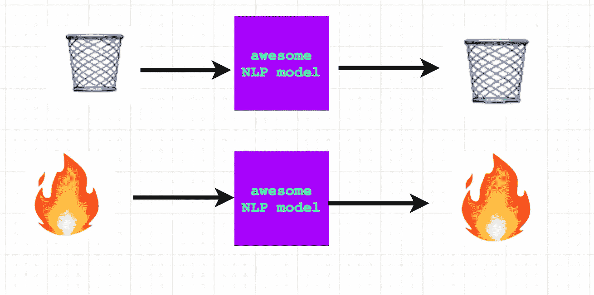

# Python 中的 NLP 文本预处理和清理管道

> 原文：<https://towardsdatascience.com/nlp-text-preprocessing-and-cleaning-pipeline-in-python-3bafaf54ac35?source=collection_archive---------21----------------------->


我们通过语言表达人类的经历。语言是我们交流、表达情感、倾听、思考和交谈的方式。在过去的十年中，自然语言处理(NLP)取得了巨大的进步，计算机可以像人类一样分类、生成和响应语言。这些模型和算法已经开始给计算机提供理解人类经验的工具。这些领域增长的最重要原因是因为可以进行特征工程设计然后输入模型的数据呈指数增长。

# 特征工程:

站在自然语言处理前沿的数据科学家、博士、机器学习工程师和数据工程师花了大部分时间清理和探索数据集。

## 垃圾进垃圾出

如果向模型提供最新的数据，它们将产生最新的结果；模型如果被喂以垃圾就会产生垃圾，因此数据清洗是整个机器学习过程中最重要的部分之一。如果你训练的是像 BERT 或老派 word2vec 这样的艺术级变形金刚，那也没关系。您提供给模型的数据质量将决定您获得的结果的质量。



garbage in garbage out; data on fire in data on fire out

特征工程和数据清理不是乏味和无意义的任务——它们是重要的过滤机制，其工作方式与人脑处理语言的方式相同。当人类年轻时，他们学会如何从一种语言中分离噪音，然后通过该语言中最重要的单词和短语找到该语言的意义。这个过程类似于文本预处理。文本预处理将语料库分解成更小的部分，然后从这些部分中提取最重要的信息，模型将从这些信息中获取意义。

给我看看代码！

# 管道中的步骤

## 📜**，**👀,📊(加载、查看和分析数据) **:**

任何机器学习管道的第一步都是加载数据！为了更好地衡量，我们还将查看数据以确保所有内容都正确加载，并收集一些基本的统计数据，如字数、行数和字符数。这将让我们很好地了解我们在管道中的下一步工作是什么。我使用的是路透社的数据集，可以在[这里](https://www.kaggle.com/nltkdata/reuters/download#1)找到。

```
data_folder = Path("/Users/emilyelia/Downloads/reuters/reuters/reuters/training")
file_to_open = data_folder / "104"
f = open(file_to_open)print(f.read())
num_lines =0
num_words =0
num_chars =0
with open(file_to_open, 'r') as f:
    for line in f:
        words = line.split()num_lines += 1
        num_words += len(words)
        num_chars += len(line)print ("numbers of words", num_words)
print("number of lines", num_lines)
print("number of chars", num_chars)
```

## 符号化:

标记化是下一个预处理步骤。它获取文本语料库，并将其拆分为“标记”(单词、句子等)。).

这个过程不像使用某种分离器那么简单。分隔符在很多不同的情况下都不起作用，例如带点的缩写，如“Dr .”或句点。在句末。需要一个更复杂的模型来正确地进行标记化，但是不要担心，因为标记化是 nltk 等常用 NLP 库中的内置特性。

```
from nltk.tokenize import sent_tokenize, word_tokenize
f = open(file_to_open)
#use built in tokenize to seperate each indiviual word
nltk_words = word_tokenize(f.read())
print(f"Tokenized words: {nltk_words}")
```

# 清洁:

清理是从语料库中删除所有不必要内容的过程。不必要的内容包括停用词和标点符号，因为它们不会给整个语料库增加任何价值或意义。

## 标点

标点去除是一个重要的步骤，因为标点不提供任何附加的价值或对整个语料库和语料库的矢量化的洞察。最好在标记化步骤之后删除标点符号，因为之前这样做可能会导致一些不可预见的结果。

## **停止字**

停用词是你正在使用的语言中最常见的词。根据您使用的库，有 50-100 个停用词，它们不像“the”、“an”和“it”那样增加意思。移除这些单词不会改变您正在处理的语料库的含义，并且会导致更好的结果，因为剩余的单词对于确定语料库的含义是最重要的。

```
print(nltk_words)
punctuation = list(string.punctuation)
stopWords = set(stopwords.words('english'))
filter = []
for w in nltk_words:
    if w.lower()not in stopWords and w not in punctuation:
        filter.append(w)
```

# 正常化

正常化是返回到标准形式或状态的过程。就文本预处理而言，它意味着获取数字、缩写和特殊字符，并将其转换为文本。这一过程使用了我们的大脑在处理特殊字符、拼写错误和缩写时所使用的相同联想，即把它们与我们用自己选择的语言说、读或想的单词联系起来。我正在使用可以在[这里](https://github.com/EFord36/normalise)找到的库规格化。

最常见的标准化特征是日期、数字、缩写、货币、百分比和拼写错误。在 normalise 中，你必须列出你想要拼写的缩写，然后调用 normalise 函数来执行其余的规范化。

```
from normalise import normalise
abbr = {
    "lb": "pounds",
    "USDA": "United States Department of Agriculture",
    "cts": "cents",
    "U.S.": "United States"
}
normalise(text, user_abbrevs=abbr)
nt =normalise(filter, user_abbrevs=abbr)
display( ' '.join(nt))
```

这些规范化确保模型能够理解所有必须处理的文本，因为数字、特殊字符、拼写错误和缩写将与语料库中的所有其他内容具有相同的表示。

点击这里查看整个项目！

 [## emil yelia/自定义-NLP-文本-预处理-管道

### 此时您不能执行该操作。您已使用另一个标签页或窗口登录。您已在另一个选项卡中注销，或者…

github.com](https://github.com/emilyelia/Custom-NLP-Text-Preprocessing-Pipeline)