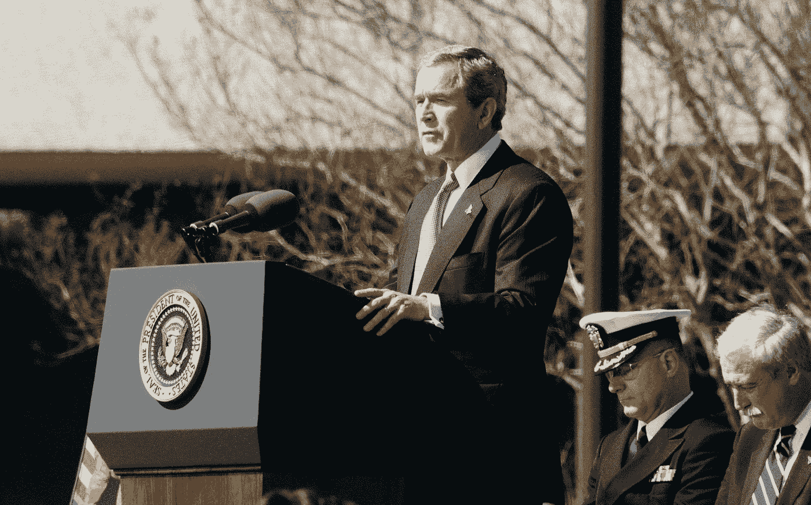
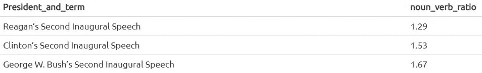
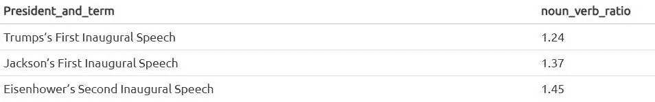

# NLP——使用 SpacyR 分析总统演讲

> 原文：<https://towardsdatascience.com/nlp-using-spacyr-to-analyze-presidential-speeches-49c10ef37aef?source=collection_archive---------35----------------------->

## 词类分析的简单指南



Photo by [History in HD](https://unsplash.com/@historyhd?utm_source=unsplash&utm_medium=referral&utm_content=creditCopyText) on [Unsplash](https://unsplash.com/s/photos/speech?utm_source=unsplash&utm_medium=referral&utm_content=creditCopyText)

## 友好的名词

2018 年 4 月，以色列 Herzliya 跨学科中心的两名研究人员 Michal Reifen-Tagar 和 Orly Idan 发表了论文 [*“玫瑰还有其他名字吗？微妙的语言暗示会影响棘手冲突中的愤怒和相应的政策支持”*。](https://journals.sagepub.com/doi/abs/10.1177/0956797618772823?journalCode=pssa)作者测量了在巴以冲突背景下对某些政策的不同支持和厌恶程度。有趣的是，他们发现，为了减少紧张和增加支持，在制定政策时，最好更多地依靠名词而不是动词。

受这些发现的启发，我想知道美国总统过去是否使用过这种技巧来释放一些紧张情绪并获得支持，即使这是在直觉层面上发生的。为此，我利用自然语言处理方法分析了他们的第一次和第二次就职演说。

## 斯帕西尔

对于词性分析，我使用了 *SpacyR* 。 *Spacyr* 是 Python (Cython) *spaCy* 的 R 包装器，它被集成到 *quanteda* 中。这个包，除了别的以外，帮助解析和标记文档，同时标记每个标记作为语音的一部分的功能(名词、动词、代词、形容词等)。

*注意:SpacyR 的安装可能会比较棘手。这里参考文档* [*！*](https://spacyr.quanteda.io/articles/using_spacyr.html)

## 密码

第一步是为第一个和第二个学期的演讲数据集创建*tibles*，解析它们，并删除空格和标点符号。变量 *doc_id* 包含演讲的年份和发表演讲的总统；*文字栏*发言的转写；并且 *pos* 列为每个单词提供了一个标记，表示其类型。

```
#Loading packages
library("spacyr")
library(tibble)
spacy_initialize()#Creating tibble
First_term <- as_tibble( data.frame(doc_id = first_term$doc_id, text = first_term$text, stringsAsFactors = F)#Parsing tibble
first_term_parsed <- spacy_parse(first_term)#Removing spaces and punctuation
first_term_parsed <- first_term_parsed [first_term_parsed$pos!=”SPACE” & first_term_parsed$pos!=”PUNCT”, ]first_term_parsedtable(first_term_parsed$pos)sum(table(first_term_parsed$pos))
```

一旦我们有了解析过的词表，就该找出演讲中名词和动词用法的区别了。使用余弦相似性，我选择了三个最相似和最不相似的演讲，并为它们创建了一个名词/动词比率。

注意:余弦相似性的代码没有显示，因为它是一个独立的主题。如果你对我们如何确定文档之间的相似性感到好奇，并且对这个在文本分析中非常重要的话题感到好奇，我推荐你 [*这篇文章*](https://www.sciencedirect.com/topics/computer-science/cosine-similarity) *或者在这里* *看一下 text2vec 文档* [*。*](http://text2vec.org/similarity.html#cosine_similarity)

我们词类分析的第一步是找出名词相对于演讲中使用的其他类型单词的份额。

```
#Share of nouns **sum**(first_term_parsed**$**pos**==**"NOUN")**/sum**(**table**(first_term_parsed**$**pos))*****100#Share of verbs 
**sum**(first_term_parsed**$**pos**==**"VERB")**/sum**(**table**(first_term_parsed**$**pos))*****100
```

有了演讲中的名词和动词的份额后，我们需要计算一个名词/动词比，用名词的总数除以动词的总数。这是结果:

## 最相似的演讲



上表显示，克林顿的第二次就职演说的名词/动词比高于里根的第二任期演说。这可能表明克林顿在第二任期的演讲中比里根更倾向于和解/呼吁团结。然而，乔治·w·布什的第二任期演讲(2005 年)是这三个演讲中名词/动词比率最高的一个。很可能，由于处于伊拉克战争的中期，布什在相对“平静”的年代比其他总统使用了更多与动词相关的名词，旨在为他的政策和对外干预获得更多支持。

现在让我们看看三个最不同的演讲的名词动词比率。

## 最不相似的演讲



这里我们可以看到，特朗普的名词动词比率最低。巧合吗？用一种好的方式来说，他较少使用名词和动词，这可能表明，不太在乎传递和解信息的外交官和政治家的名词/动词比率较低。面临战争的艾森豪威尔的名词/动词比率高于特朗普和杰克逊，但低于 2005 年的小布什。处于战争状态和在就职演说中使用名词之间有关联吗？我们将不得不把这个问题留待下次讨论。

## 激烈的对话？

所以现在你知道了。每当你发现自己处于一个棘手的情况下，使用更多的名词而不是动词可以帮助你获得对你的想法的支持，甚至可能减少房间里的紧张气氛！

*感谢阅读！欢迎随时在下方留言或联系*[*LinkedIn*](https://www.linkedin.com/in/carlos-ahumada/)*或*[*Twitter*](https://twitter.com/CarlosNeyra)*。我很乐意与您联系，分享有关政治、通信和数据科学的故事。*