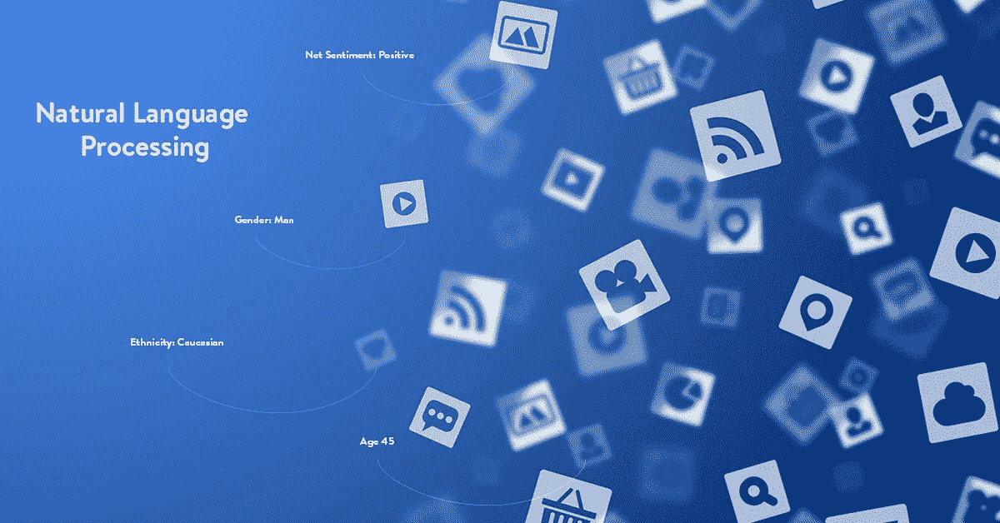
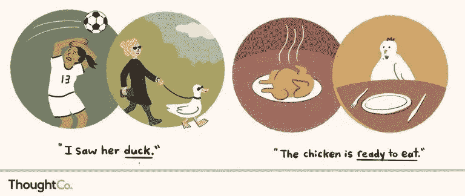
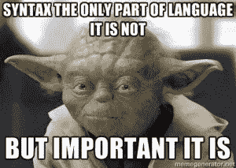
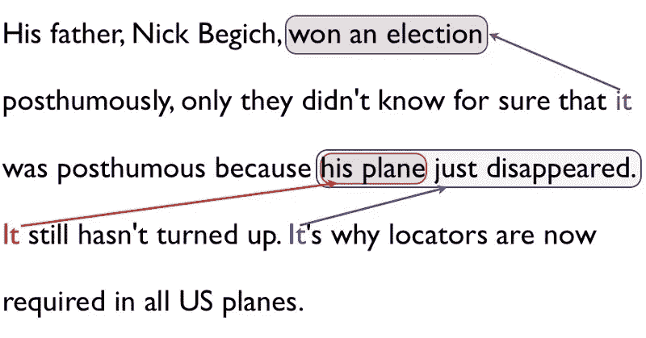
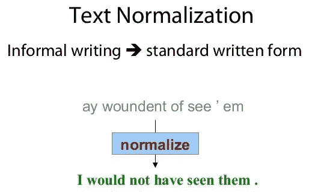
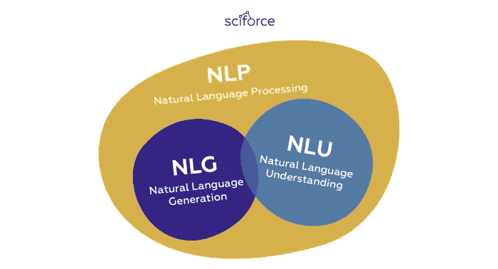
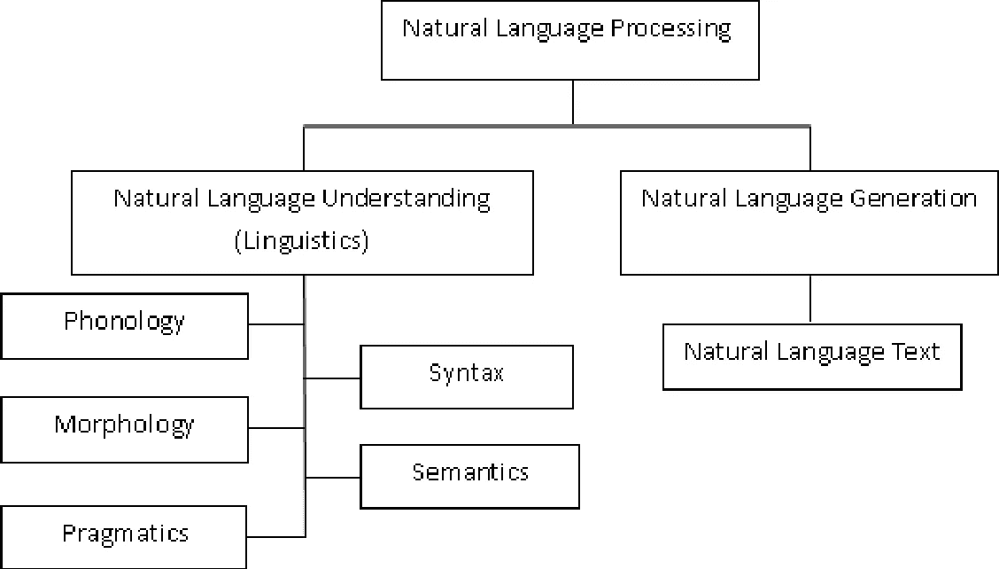
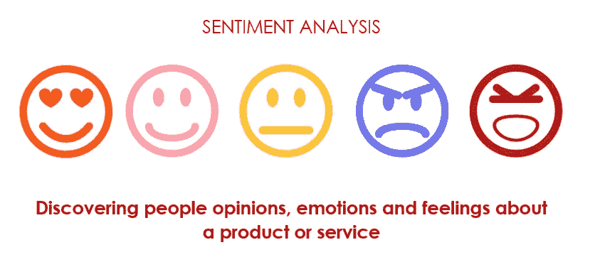

# 自然语言处理综合指南。

> 原文：<https://towardsdatascience.com/nlp-with-spacy-part-1-beginner-guide-to-nlp-4b9460652994?source=collection_archive---------26----------------------->

## 带有空间的自然语言处理。(第一部分)

> 自然语言处理在几乎每个领域都有广泛的应用，在动手之前需要一定的深度知识。

Applications of NLP.

*这是 spaCy 系列自然语言处理(NLP)的第一部分。下一篇文章给出了使用 spaCy 的 NLP 代码的基础知识。*

# 简介:

我们都知道不断发展的技术以结构化的形式产生大量的原始数据，这些数据具有预定义的格式，可用于在数据库中搜索，如数字、文本等。另一方面，非结构化数据没有预定义的格式，不容易找到，这使得收集、处理和分析图像、视频、文件等变得更加困难。这些类型的数据每天都在生成，数量太大了 **2.5 万亿字节的数据**，而且刚刚开始加速。我从来没有听说过**这个词“Quintillion”**除非在网络上指出。

> 你知道吗？？
> 
> 代表百万的零的个数是 6，代表万亿的零的个数是 18。
> 
> 百万-> 1000000
> 
> 万亿->1000000000000000000

相当于每天产生**10 亿千兆字节**的数据。你可能想知道这是一个很大的数字。这是因为数据来自各个地方，比如用来收集购物者信息的传感器、社交媒体网站上的帖子、数码照片、视频购买交易、手机 GPS 信号等等。

问题是我们如何处理、分析和转换这些对我们有意义的数据，这有助于解决我们自己的需求和新的技术问题。

**自然语言处理**将有助于分析文本相关问题。因为这篇文章是关于 NLP 的，所以我们只关注它。其他类别的数据不在本文讨论范围之内。

# 您将从本文中学到什么:

1.  什么是自然语言处理？
2.  自然语言处理的子集。
3.  NLP 有哪些应用？

# 1.什么是自然语言处理？

在一系列算法和规则的帮助下，计算机能够理解人类并用大量人类语言与人类交流，并扩展其他语言相关的任务。使用 NLP，可以在更短的时间内执行某些任务，如自动语音和自动文本书写。由于大数据(文本)的发展，为什么不使用具有高计算能力、能够全天工作并且能够运行几种算法来立即执行任务的计算机呢？

> 继语音识别和视觉研究取得成功之后，自然语言处理是人工智能中最有针对性的研究领域。

虽然它是几十年前开始的，但大多数人缺乏 NLP 的经验。因为很难通过下面列出的挑战来训练机器:

*   **歧义:**当一个单词有不同的意思或者一个句子在上下文中有不同的意思甚至一个句子指的是讽刺的时候就是挑战。

Lack of clarity in meaning.

*   它包括歧义，分为两种类型:**词汇歧义和句法歧义**

> **词汇歧义**是一个单词中存在两种或两种以上可能的意思。
> 
> **句法歧义**是在一个句子或单词序列中存在两种或两种以上可能的意思。

Source: ThoughtCo.

*   **句法:**想想一个句子如何有效，它基于两个叫做句法和语义的东西，其中**句法**指的是**语法规则**，另一方面，**语义**是那个结构内的词汇符号的**含义**。人们改变句子的顺序，这在某些情况下是有效的，但不是所有的情况。

*   **共指:**指同一个人、事物、国家..前面用代词提到的句子或短语。

Coreference.

*   标准化:I t 是一种众所周知的技术，用于机器学习和深度学习。完成此步骤是因为数据具有不同的单位比例，并将这些值转换回相同的单位比例。在自然语言处理中，我们将非正式单词转换成标准形式，并使其适合于进一步处理。

Source: Slideshare.net

它包括规范来自社交媒体的文本、URL、文本表情符号、带有特殊字符的公司名称，例如 Yahoo！，还包括拼写错误的单词、标签、新单词和术语。标准化没有唯一的最佳方式。

为了完成这个任务，我们使用了 NLU 的形态学部分。

*   **讥讽:**同字异义指歧义话题。假设有人做错了什么，你回答说非常好或做得很好。对于计算机来说，理解讽刺也是一个挑战，因为这与普通对话有很大不同。

Your Machine asks.

# 2.自然语言处理的子集。

当我谈到 NLP 时，它不只是一个。它包含嵌入其中的两个主题。自然语言理解(NLU)和自然语言生成(NLG)。

Source: Sciforce

Classification of NLP.

## == >自然语言处理(NLP):

*   这是一个将输入(非结构化)文本数据转换为人类可读格式并使用统计技术处理文本的过程。

## == >自然语言理解(NLU):

*   顾名思义，在任何建模和分析之前都要理解原始文本，只有在开始处理之前，机器才应该得到底层术语。

1.  音系学:系统地组织声音的研究。
2.  **形态学:**它是一门研究词的结构、构成、词与词之间的关系、构成事物、分析词义和词汇功能的学科。
3.  **语用学:**它是研究如何使用单词、符号、标志和推断的意思
4.  **句法:**是指将单词或词组排列成有意义的句子，遵循语法规则。
5.  **语义学:**它关注的是单词的意义以及如何将单词组合成有意义的短语和句子。

## == >自然语言生成(NLG):

*   当计算机把数据从某种内在的表达形式写成有意义的短语或句子时。
*   它包括——文本规划、句子规划、文本实现

**文本规划:**从知识库中保留相关信息。

**句子规划:**帮助选择完成有意义句子所需的单词。

**文本实现:**根据维基百科，实现也是自然语言生成的一个子任务，涉及到用一种人类语言(英语、法语等)创建一个实际的文本。)从语法表示。

# 3.NLP 有哪些应用？

Sentiment Analysis.

> 情感分析有助于公司从数据中了解利弊和见解，也能够对业务战略做出必要的改变。

Chatbots.

> 聊天机器人为客户常见问题提供标准解决方案，并为客户提供个性化帮助。

Virtual Assistants.

仅举几个应用，如文本分类、信息提取、语义解析、问题回答、释义检测、语言生成、多文档摘要、机器翻译、语音和字符识别等等。

# 结论:

1.  自然语言处理是人工智能的一个子集，它负责教计算机理解人类语言并对其采取行动。
2.  它面临着**挑战**，这些挑战既缺乏流程，也缺乏性能。
3.  NLP 包括两个子集，称为**自然语言理解和自然语言生成**，这有助于将文本处理到下一个级别。
4.  这涉及到对语言学的大量学习和理解。
5.  大量的**应用**比如情感分析、聊天机器人、虚拟助手等等，这些都有利于我们使用自然语言处理。
6.  通过利用数据和高级计算硬件的力量，我们可以很快训练出模型。

就这样，希望你们喜欢 NLP 的总结。下一部分将使用 spaCy 对 NLP 基础知识进行编码。

> 快乐学习:)

# 参考资料:

1.  IBM "[https://www . slide share . net/yun Yao Li/adaptive-parser centric-text-normalization](https://www.slideshare.net/YunyaoLi/adaptive-parsercentric-text-normalization)"研究经理兼研究人员李云耀。
2.  Sigmoider，NLP 入门[https://medium . com/@ gon . es buyo/get-started-with-NLP-part-I-d 67 ca 26 cc 828](https://medium.com/@gon.esbuyo/get-started-with-nlp-part-i-d67ca26cc828)
3.  阿玛·朱昆特拉，书名是《学问》，【https://www.slideshare.net/amarjukuntla/learning-93260612】[。](https://www.slideshare.net/amarjukuntla/learning-93260612)
4.  [https://www . upgrad . com/blog/5-面向企业的自然语言处理应用/](https://www.upgrad.com/blog/5-applications-of-natural-language-processing-for-businesses/)
5.  [http://michealaxelsen.com/blog/?p=347](http://michealaxelsen.com/blog/?p=347)