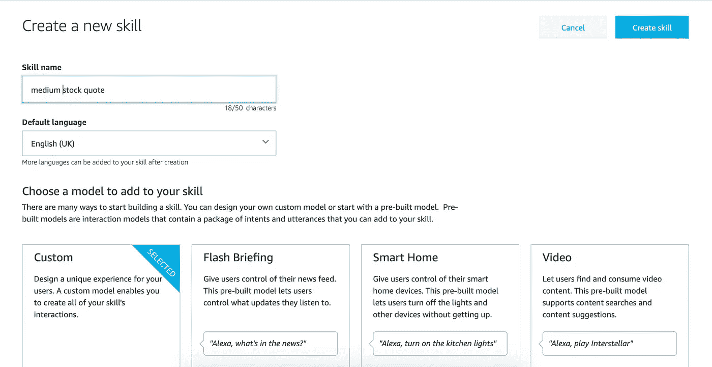
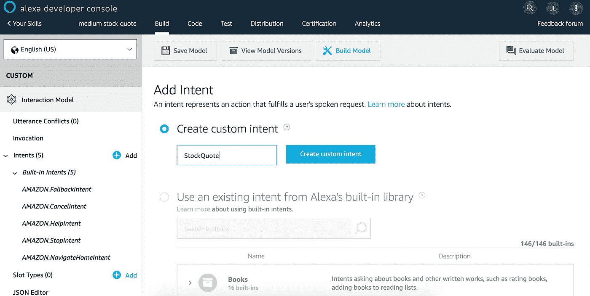
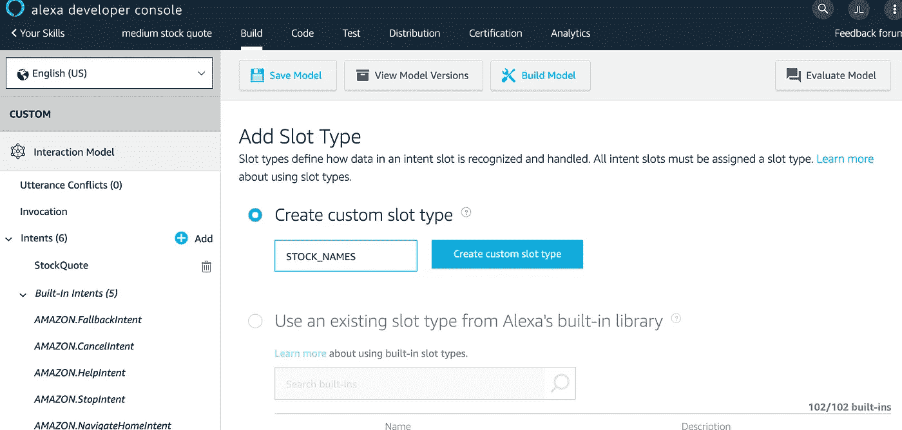
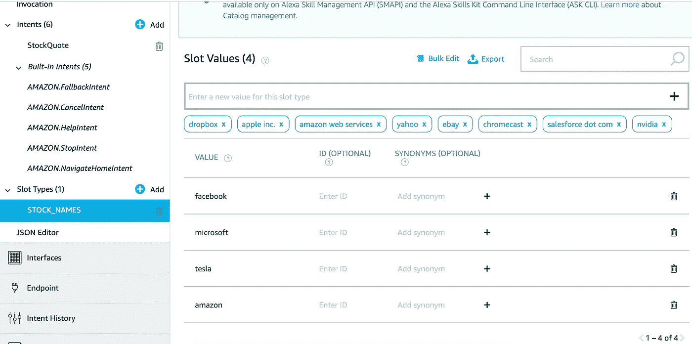
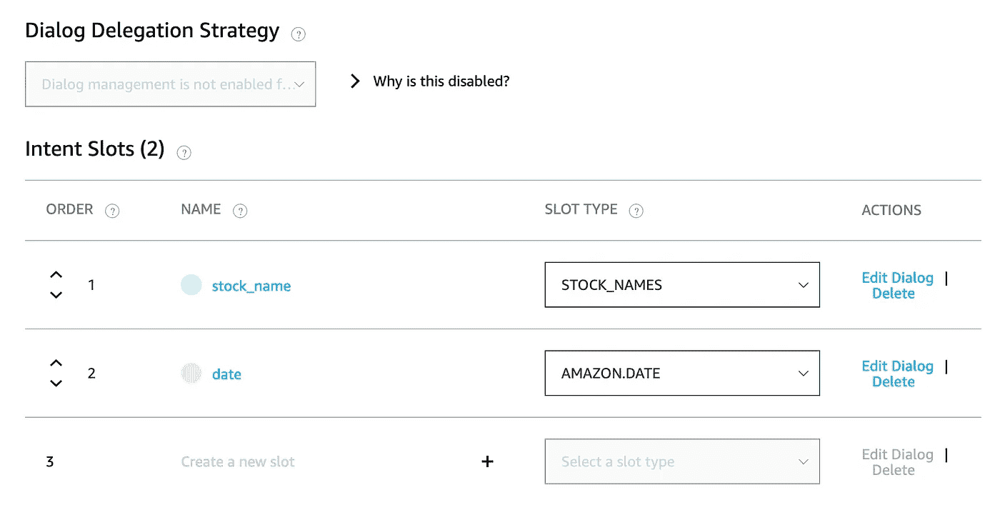
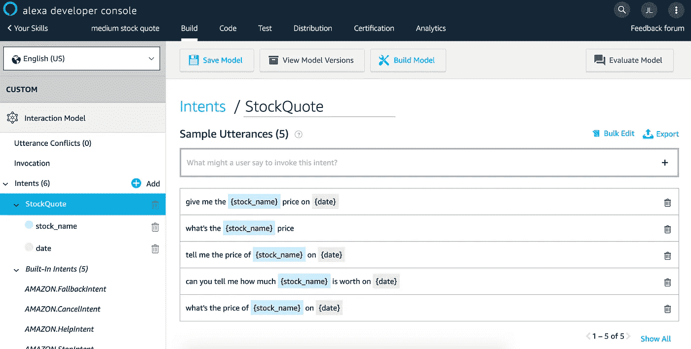
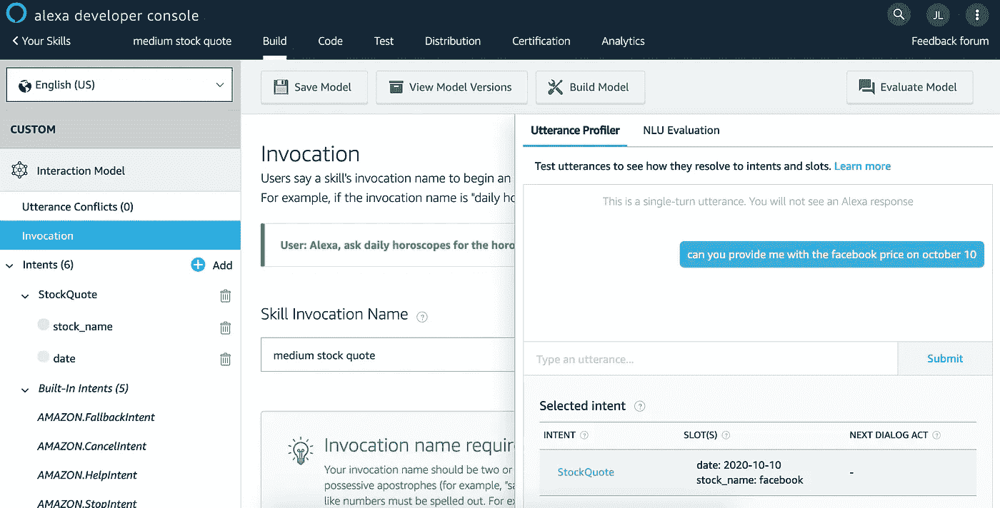

# NLU 系列:建立理解人类语言的 Alexa 技能

> 原文：<https://towardsdatascience.com/nlu-series-building-an-alexa-skill-which-understands-human-language-b63b82a273f?source=collection_archive---------37----------------------->


Photo by [Rock'n Roll Monkey](https://unsplash.com/@rocknrollmonkey?utm_source=medium&utm_medium=referral) on [Unsplash](https://unsplash.com?utm_source=medium&utm_medium=referral)

(这篇文章也可以在[我的博客](https://kylelix7.github.io/)中找到)

毫无疑问，人工智能已经出现在我们的日常生活中。从无人驾驶汽车到无收银商店，这个主题越来越自然地出现了。这两个例子是计算机视觉+机器学习的结果。它们是机器如何看待和理解主题的例子。但是，对机器来说，倾听和理解人类也很重要。一个例子是语音助手，像[亚马逊 Alexa](https://developer.amazon.com/en-US/alexa) 。驱动语音助手的技术是 NLU，自然语言理解。根据[维基百科](https://en.wikipedia.org/wiki/Natural-language_understanding)，“自然语言理解(NLU)或自然语言解释(NLI)是人工智能中自然语言处理的一个子主题，处理机器阅读理解。自然语言理解被认为是一个人工智能难题

我正在写一个关于如何用 AWS 技术构建 NLU 应用程序的系列文章。在这篇文章中，我将展示如何建立一种能够理解人类语言并做出反应的技能。它可以部署在亚马逊 Echo 设备上运行，如 [Echo show 5](https://www.amazon.com/dp/B07HZLHPKP?ref_=assoc_tag_ph_1524211038043&_encoding=UTF8&camp=1789&creative=9325&linkCode=pf4&tag=blog023b-20&linkId=944dcd05e4f666805bb414dec8a7fc12) 、 [Echo dot](https://www.amazon.com/gp/product/B07FZ8S74R/ref=as_li_tl?ie=UTF8&camp=1789&creative=9325&creativeASIN=B07FZ8S74R&linkCode=as2&tag=blog023b-20&linkId=f77535db9b6be96f4e26adb89f360c4c) 或 [New Echo](https://www.amazon.com/gp/product/B07NFTVP7P/ref=as_li_tl?ie=UTF8&camp=1789&creative=9325&creativeASIN=B07NFTVP7P&linkCode=as2&tag=blog023b-20&linkId=4ee4fd7cdfdb1af70d9f8ca0509bae66) 。

首先，我们需要了解 NLU 的基本情况。

# 意图

意图是对用户自然语言输入的响应。例如，在航空订票应用程序中。意图可以是预订门票、取消门票或查看门票详情。当用户输入进来时，NLU 需要分类以找到合适的(最有可能匹配的)意图。这依赖于训练基于话语的模型。

# 言论

话语是用户为了实现意图而向 NLU 输入的口头或打字短语。简单地说，这就是用户如何用语言表达他们的意图。例如“我可以预订一张从西雅图到北京的机票吗？”或者“我想买一张 9 月 19 日的票”。为了使 NLU 能够基于话语对意图进行分类，需要用预定义的话语示例来训练模型。

# 时间

语槽是实现意图所需要的话语中的变量。例如，在预订机票时，变量可以是出发日期、返回日期、目的地、出发城市。

# **创造技能**

如果你还没有一个[开发者账户](https://developer.amazon.com/alexa/console/ask)，那就开一个吧。

然后开始创建自定义技能，选择“从头开始”。



# 创建一个意图

接下来，我们需要创建一个意图。在这篇文章中，我将建立一个可以告诉客户股票历史价格的技巧。我们添加了一个名为“股票报价”的意向，然后点击“创建自定义意向”。



# 如果没有要使用的内置，请添加插槽类型

接下来，我们必须为股票名称创建自定义插槽类型，因为没有这样的内置插槽类型。创建一个名为“STOCK_NAMES”的新槽类型，并给它一些值。为了简单起见，我在这里只添加了四个股票名称。



# 添加话语来训练模型

现在，我们将回到目的，开始使用新的槽类型来定义我们的槽(变量)。这里有两个槽，一个用于股票名称，另一个用于日期。它们的类型是“股票名称”和“亚马逊”。日期”分别。



我们将为该技能提供一些话语示例，以便它能够理解这一意图。然后点击“建立模型”，就会建立一个可以理解这种意图的自然语言的模型。含义相似但不一定相同的输入将被归类为股票报价意向。



如果你对这是如何存储的感兴趣，你可以点击“json 编辑器”，它以 JSON 格式显示模型。

```
{
    "interactionModel": {
        "languageModel": {
            "invocationName": "medium stock quote",
            "intents": [
                {
                    "name": "AMAZON.FallbackIntent",
                    "samples": []
                },
                {
                    "name": "AMAZON.CancelIntent",
                    "samples": []
                },
                {
                    "name": "AMAZON.HelpIntent",
                    "samples": []
                },
                {
                    "name": "AMAZON.StopIntent",
                    "samples": []
                },
                {
                    "name": "AMAZON.NavigateHomeIntent",
                    "samples": []
                },
                {
                    "name": "StockQuote",
                    "slots": [
                        {
                            "name": "stock_name",
                            "type": "STOCK_NAMES"
                        },
                        {
                            "name": "date",
                            "type": "AMAZON.DATE"
                        }
                    ],
                    "samples": [
                        "give me the {stock_name} price on {date}",
                        "what's the {stock_name} price",
                        "tell me the price of {stock_name} on {date}",
                        "can you tell me how much {stock_name} is worth on {date}",
                        "what's the price of {stock_name} on {date}"
                    ]
                }
            ],
            "types": [
                {
                    "name": "STOCK_NAMES",
                    "values": [
                        {
                            "name": {
                                "value": "facebook"
                            }
                        },
                        {
                            "name": {
                                "value": "microsoft"
                            }
                        },
                        {
                            "name": {
                                "value": "tesla"
                            }
                        },
                        {
                            "name": {
                                "value": "amazon"
                            }
                        }
                    ]
                }
            ]
        }
    }
}
```

# 验证模型是否能理解人类

点击调用，用人类语言测试。正如你所看到的，我使用稍微不同的短语来询问关于 face book 的股票价格，NLU 可以识别这是为了股票报价的意图，并正确地提取插槽。



到目前为止，我们已经成功地建立了一个理解人类语言的模型(分类以获得正确的意图)。在下一篇文章中，我将展示如何开发一个托管在 AWS lambda 上的端点来处理用户的请求。敬请期待！

如果你想了解更多关于机器学习的知识，educative.io 网站上有一系列[课程很有帮助。这些课程包括像基本的 ML，NLP，图像识别等主题。](https://www.educative.io/profile/view/6083138522447872?aff=VEzk)

参考:

[介绍亚马逊 Lex:构建语音/文本聊天机器人的服务——2017 年 3 月 AWS 在线技术讲座](https://www.youtube.com/watch?v=tAKbXEsZ4Iw)

[自然语言处理实践:用 Python 理解、分析和生成文本第一版](https://www.amazon.com/gp/product/1617294632/ref=as_li_tl?ie=UTF8&camp=1789&creative=9325&creativeASIN=1617294632&linkCode=as2&tag=blog023b-20&linkId=a13f8b793f4650793082a86bdcb744d7)

以前的帖子:

[我关于金融和科技的帖子](https://medium.com/@fin.techology/my-posts-about-finance-and-tech-7b7e6b2e57f4?source=your_stories_page---------------------------)

[我关于 FAANG 访谈的帖子](https://medium.com/@fin.techology/my-posts-about-faang-interview-20e529c5f13f?source=your_stories_page---------------------------)

[全栈开发教程:将 AWS Lambda 无服务器服务集成到 Angular SPA 中](/full-stack-development-tutorial-integrate-aws-lambda-serverless-service-into-angular-spa-abb70bcf417f)

[全栈开发教程:用运行在 AWS Lambda 上的无服务器 REST API 提供交易数据](/full-stack-development-tutorial-serverless-rest-api-running-on-aws-lambda-a9a501f54405)

[全栈开发教程:在 Angular SPA 上可视化交易数据](/full-stack-development-tutorial-visualize-trading-data-on-angular-spa-7ec2a5749a38)

[强化学习:Q 学习简介](https://medium.com/@kyle.jinhai.li/reinforcement-learning-introduction-to-q-learning-444c951e292c)