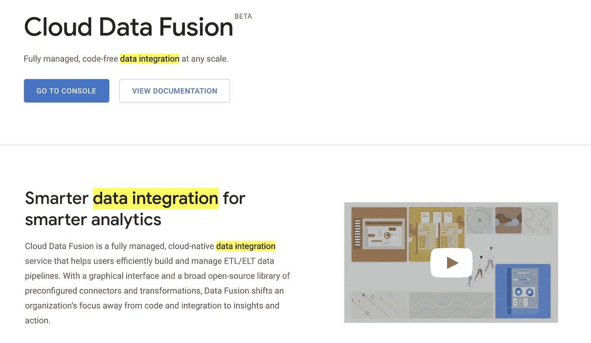
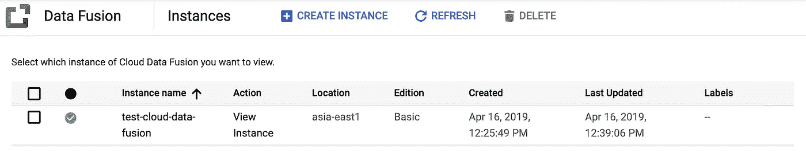
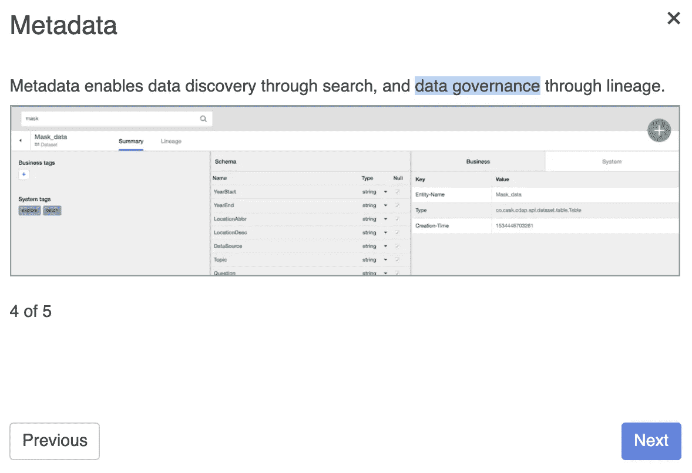
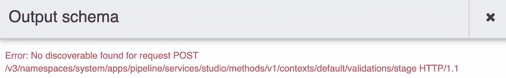
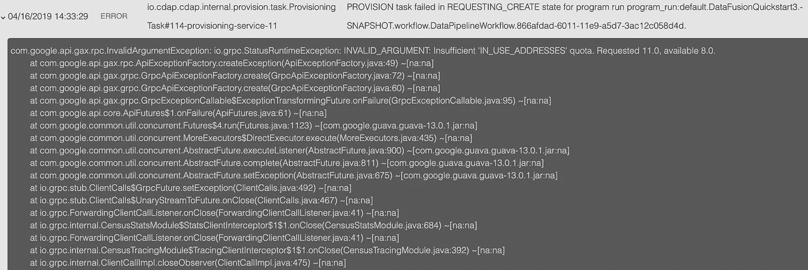

# 无代码数据管道:云数据融合的第一印象

> 原文：<https://towardsdatascience.com/no-code-data-pipelines-a-first-impression-of-cloud-data-fusion-2b6f117a3ce8?source=collection_archive---------14----------------------->

## 云数据融合本质上是一个构建数据管道的图形化、无代码工具。它看起来像这样:

Cloud Data Fusion in action. GIF borrowed from Google’s [announcement](https://cloud.google.com/blog/products/data-analytics/google-cloud-smart-analytics-accelerates-your-business-transformation).

在本帖中，我将分享我对该产品的第一印象。这绝不意味着是一个完整的回顾——我只是触及了表面。希望您能了解什么是云数据融合，以及是否值得花时间仔细研究一下。

在深入细节之前，让我们考虑一下云数据融合的历史背景。

## ETL /数据集成/数据管道的简史

如果你在 data scientist 成为 21 世纪最性感的工作之前在数据/分析领域工作过，你可能知道图形 ETL(提取-转换-加载)工具已经在企业数据仓库环境中广泛使用。事实上，如果你访问任何大型银行或零售商的总部，很有可能他们的数据仓库环境仍然被锁定在一些专有的图形 ETL 工具中，如 [DataStage](https://www.ibm.com/us-en/marketplace/datastage) 或 [SSIS](https://docs.microsoft.com/en-us/sql/integration-services/sql-server-integration-services?view=sql-server-2017) 。

随着初创公司和大型科技公司的崛起——它们都严重依赖数据进行产品开发——代码(通常是开源的)对于构建数据管道变得更加重要。这方面的一个例子是**气流**在数据管道编排中的流行——无论是在初创公司还是大型科技公司。

谷歌已经通过 [Cloud Composer](/airflow-by-google-a-first-impression-of-cloud-composer-f4d9f86358cf) 利用了气流的出现。

传统企业世界和勇敢的新技术世界之间的鸿沟，在这两个阵营的语言中表露无遗。企业人士称之为“数据集成”，而技术人员则称之为“数据管道”。

在云数据融合的营销中，谷歌使用了这两个术语，但“数据集成”如此突出并非巧合:

Cloud Data Fusion: Data integration FTW

谷歌正在寻求云数据融合的*公司*。他们的企业定价起价约为每月 3，000 美元，这进一步证明了这一点。

与此同时，即使在创业潮人中，也有一股大趋势朝着 [#NoCode](https://www.nocode.tech/) 发展(只需[查看 Twitter](https://twitter.com/search?q=%23nocode&src=typed_query) 中的大量例子)。因此，谷歌推出云数据融合作为无代码数据管道产品的时机看起来很合适。

## 云数据融合入门

与大多数谷歌云平台(GCP)产品一样，云数据融合非常容易上手。您只需启用云数据融合 API，创建一个实例，并配置适当的 IAM 权限。在我的例子中，在`asia-east-1`区域中启动一个基础版实例需要大约 15 分钟。

一旦您的实例启动，确保您为服务帐户设置了权限，如这里的[所述](https://cloud.google.com/data-fusion/docs/how-to/create-instance)。

云数据融合方便地使用谷歌认证，当你登录时，你可以浏览一下界面。

快速补充说明:术语“数据治理”在入职培训中使用的事实进一步证明了 Google 的目标是企业:

Data governance — a term seldom heard in the startup world!

云数据融合有一个“枢纽”，在这里你可以获得单独的组件或完整的数据管道。一个简单管道的例子是他们的 quickstart，它读取存储在云存储中的《纽约时报》(NYT)的文章，解析和清理数据，并将 25 美元以下的顶级书籍加载到 BigQuery 中。

选择此管道(并可选地定制它)后，单击“部署”使管道可执行。

从那里，有一个“运行”按钮，您可以使用它来执行作业。如您所料，您还可以安排作业定期运行。

## 遇到的问题

下面是我在使用云数据融合时遇到的一些问题。如果我读过文档，我很有可能会发现这里到底发生了什么。如果从事云数据融合工作的人看到这篇文章，这些错误可能会成为人们可能遇到的问题。

When trying to output the schema of a BigQuery table.

Isn’t NUMERIC a fairly standard data type? And how do I get around the isse? I don’t understand how I can remove ‘difficulty’.

Looks like I’ve exceeded some kind of quota?

## 结论

总的来说，云数据融合真的感觉像是一个针对大型企业的产品，这些企业可能希望将他们的 ETL 工作转移到 Google 云平台。

我个人怀疑云数据融合会在创业公司中获得牵引力，但似乎很明显，这不是谷歌这款产品的目标受众。

对于传统企业来说，至少有两个原因可以解释为什么迁移到云数据融合是有意义的。

首先，每月 1-3，000 美元的价格**很有可能低于企业数据集成领域的许多替代产品。看看[的 DataStage](https://www.ibm.com/cloud/information-server/pricing) ，了解一下竞争对手可能会收取多少费用。**

其次，由于云数据融合建立在[木桶数据应用平台(CDAP)](https://cdap.io/) 之上，因此锁定风险较低。具体来说，您可以获得可移植性，因为您可以导出您的数据管道，并将它们带到另一个支持 CDAP 的平台上。旁注:[谷歌大约一年前收购了卡斯克](https://blog.cdap.io/2018/05/cask-is-joining-google-cloud/)(CDAP 的主要贡献者)。

你对云数据融合有什么想法？

*由*[*Alex Svanevik*](https://medium.com/u/e63babffc184?source=post_page-----2b6f117a3ce8--------------------------------)*，数据科学家* [*D5 —数据科学家*](https://d5.ai) *。*