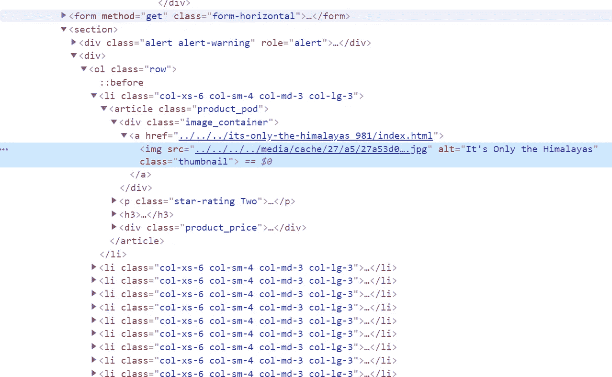
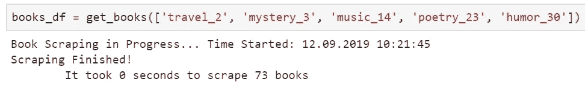
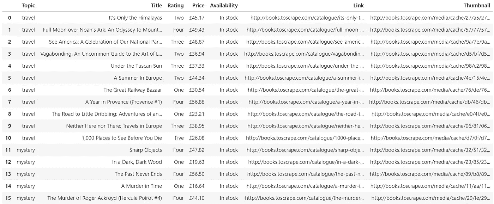

# 没有数据集？没问题。自己刮一个。

> 原文：<https://towardsdatascience.com/no-dataset-no-problem-scrape-one-yourself-57806dea3cac?source=collection_archive---------17----------------------->

## 啊…网页抓取。我敢肯定你听说过它，你可能已经这样做了，或者至少想过这样做。


Photo by [Markus Spiske](https://unsplash.com/@markusspiske?utm_source=medium&utm_medium=referral) on [Unsplash](https://unsplash.com?utm_source=medium&utm_medium=referral)

我已经做过很多次了。见鬼，几个月前，我在一个本地数据科学会议上做了一个报告，主题是将数据科学用于房地产市场分析。

前 30 多张幻灯片是关于网络搜索的，以及我如何搜索最受欢迎的本地房屋买卖网站。观众中有这样一个人，他在演讲结束时的问答部分做了自我介绍，他是那个网站的经理之一。

呀。

不用说，这次谈话不太愉快。所以这里的要点是——**小心使用网络抓取**，它会让你很快陷入麻烦。

***“那我为什么还要考虑网络抓取？”***

我很高兴你问了。主要原因是——在现实世界中很难找到好的数据集——有时自己制作一个更容易。

就像我的情况一样，有一些关于房价的数据集，但没有一个与我居住的国家有关，当然也与我所在的城镇无关。网络抓取是唯一的出路。

为什么你应该考虑网络抓取的另一个好理由是下面的— **做起来很有趣！当然，在你学会正确的语法之前，你会不断地敲打自己的脑袋，但是几次之后，这真的变成了一个令人愉快的过程。**

‘好吧，好吧，说重点！’

这足够做一个介绍和基本的推理了。

在开始网络搜集之前，请务必阅读这篇关于网络搜集中的[道德规范的精彩文章](/ethics-in-web-scraping-b96b18136f01)。

现在，让我们进入正题。

# 寻找要刮的网站

今天早些时候，我努力寻找一个体面的页面刮除。不是说没有——肯定有——但是，你怎么说呢，让我向你展示如何从 CNN 抓取文章并不是最合法的事情。

然后我偶然发现了这一页——要刮的书[——这确实是展示刮是如何工作的最好的地方，没有人会生气。](http://books.toscrape.com)

当你打开这个页面时，你会在左侧看到主题浏览器，当你点击其中任何一个，你会被重定向到包含该主题书籍的网页。

*顺利！*

点击“旅行”,网址将变为:

```
[http://books.toscrape.com/catalogue/category/books/**travel_2**/index.html](http://books.toscrape.com/catalogue/category/books/travel_2/index.html)
```

我真的不知道他们为什么需要加上' *_2* '，但事情就是这样。点击了几个主题类别后，我列出了以下列表:

*   *旅行 _2*
*   *谜 _3*
*   *音乐 _14*
*   *诗歌 _23*
*   *幽默 _30*

你可能已经猜到了，这是一个主题列表，我将会得到这些主题的书籍。以下是《旅行》中第一本书的样子:


A book thumbnail obtained from [http://books.toscrape.com](http://books.toscrape.com/)

这就是每本书的样子，这意味着我必须有一些方法来获得感兴趣的数据，这些数据是:

1.  主题
2.  标题
3.  评级
4.  价格
5.  有效性
6.  图书 URL
7.  缩略图 URL

# 第一步。查找 HTML 标签及其类别

***等等，什么？我需要了解 HTML？***

就一点点。对你来说，知道最基本的 HTML 标签就足够了——这很容易被谷歌搜索到——所以我不会在这上面花时间。

现在打开[这个链接](http://books.toscrape.com/catalogue/category/books/travel_2/index.html)就能看到“旅游”类别的所有书籍。按下 **CTRL + SHIFT + I** 启动开发者控制台。在这里，您可以检查并进一步深入任何 HTML 标签。

我已经通过右键单击其中一本书并按下 ***Inspect*** 进行了操作。所以现在开发人员控制台看起来像这样:



Developer Console after Inspecting the Book

你看到这个 ***文章*** 标签了吗？这是这个网页抓取过程的基线。在这个标签中包含了上面列出的 7 个点的所有数据。你可以通过点击箭头图标展开某个标签来找到它们。

如果你不想深入研究，以下是列表:

1.  **标题**:*H3*->-T20(*标题*属性)
2.  **图书链接**:*div*(class*image _ container*)->-*a*(*href*property)
3.  **图书缩略图**:*div*(class*image _ container*)->*img*(*src*property)
4.  **等级** : *p* (等级*星级* ) - > ( *等级*属性)-最后一项
5.  **价格**:*div*(class*product _ Price*)->p(class*Price _ color*)
6.  **供货**:*div*(class*product _ price*)->p(class*in stock 供货*)
7.  **主题** —将从 URL 中提取

好了，现在你什么都知道了！嗯，除了如何把这变成一个有意义的代码。这就是下一节的内容。

# 第二步。编写一个抓取脚本

这是这个想法的大纲。您需要编写一个脚本:

*   接受主题列表作为参数
*   基于提供的主题参数生成完整的 URL 列表
*   打开每一个 URL，提取主题中每本书的 7 个兴趣点
*   将结果保存到字典中
*   为用户提供一些基本的信息
*   返回填充字典的熊猫数据帧表示

***‘但看起来工作量很大……’***

我知道，相信我。我已经编写了获取 100 多个属性的脚本，所以这个对我来说不是什么大问题，但是如果这是你的第一次，可能会有问题。

幸运的是，每次的想法都是一样的。**标签和类别会变，但理念不变。**

哦，差点忘了给你提供必要的进口( *facepalm* )。他们在这里:

```
import datetime
import numpy as np
import pandas as pd
from collections import OrderedDictimport requests
from bs4 import BeautifulSoup
```

我现在要用整个剧本来抨击你——一开始可能看起来有点吓人，但我相信你:

Web scraping script — [https://gist.github.com/dradecic/2cf982730b0f9f1666a0117c9987ffe9](https://gist.github.com/dradecic/2cf982730b0f9f1666a0117c9987ffe9)

我真的尽力解释了里面的每一行代码。现在该由你来深入研究脚本，看看为什么一切都是这样进行的( ***剧透警告*** *:这真的没有那么难*)。

# 第三步。享受成果

现在，运行这个脚本并将结果存储在一个变量中是世界上最简单的事情:



Calling get_books function

这很快。从更大的网站抓取更多的内容有时需要几个小时，所以不要习惯这种 0 秒完成的事情。

现在，您可以检查新创建的数据帧的外观:



Scraped DataFrame

# 最后的话

恭喜你。你刚刚获得了一项新技能。我认为这是任何有抱负的数据科学家的基本原则。但是记住这一点，

> 能力越大，责任越大——蜘蛛侠本·帕克

所以明智地使用你的新技能，不要让自己陷入困境。

直到下一次…

*喜欢这篇文章吗？成为* [*中等会员*](https://medium.com/@radecicdario/membership) *继续无限制学习。如果你使用下面的链接，我会收到你的一部分会员费，不需要你额外付费。*

[](https://medium.com/@radecicdario/membership) [## 通过我的推荐链接加入 Medium-Dario rade ci

### 作为一个媒体会员，你的会员费的一部分会给你阅读的作家，你可以完全接触到每一个故事…

medium.com](https://medium.com/@radecicdario/membership)