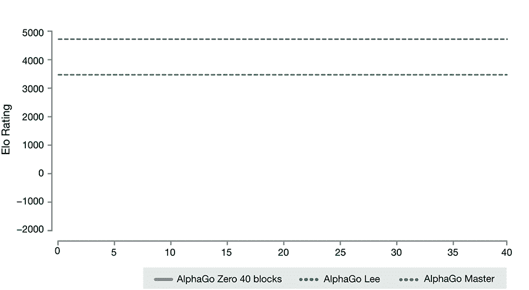
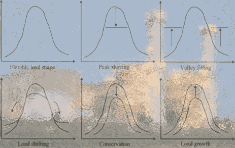

# 没有智能储能，就没有快速(足够)的能量转换！

> 原文：<https://towardsdatascience.com/no-fast-enough-energy-transition-without-intelligent-energy-storage-72cfbd3c096b?source=collection_archive---------25----------------------->

## 人工智能和能量存储快速需要强耦合，以便针对激烈的气候变化与可再生能源进行有效过渡

Credit: Photo by [Adrian Schwarz](https://unsplash.com/photos/XS7q-baZrmE?utm_source=unsplash&utm_medium=referral&utm_content=creditCopyText) on [Unsplash](https://unsplash.com/search/photos/fast?utm_source=unsplash&utm_medium=referral&utm_content=creditCopyText)

AI 现在越来越多的用于市场(数据)分析，用于政治预测或者用于无人驾驶汽车运营等。这可能在政治上，经济上，甚至科学上都很有趣，但是我们在更危急的情况下需要人工智能。在人类无法独自解决的挑战中，我们正面临着全球性的威胁。无论是与医疗“对抗”(疫情病毒或癌症扩散)，还是增加我们金融系统的弹性或稳健性，或是预测风暴或恶劣天气事件。人工智能就像是我们大脑的延伸，我们需要它来帮助我们。

但是有一个挑战压倒了我们，那就是气候变化。而且它发生的速度比我们想象的要快得多！因此，我们需要在人工智能和能量存储之间建立密切的关系，以确保所需的能量转换跟上全球变暖加速的步伐。

 [## 气候危机引发了激烈的争论。只有激进的措施才会奏效

### 全球变暖将要求我们的生活方式发生巨大变化

www.theguardian.com](https://www.theguardian.com/environment/2019/may/18/climate-crisis-heat-is-on-global-heating-four-degrees-2100-change-way-we-live) 

Credit: Photo by [h heyerlein](https://unsplash.com/photos/t7-hqrujXsg?utm_source=unsplash&utm_medium=referral&utm_content=creditCopyText) on [Unsplash](https://unsplash.com/collections/1645664/fantasy?utm_source=unsplash&utm_medium=referral&utm_content=creditCopyText)

# 人工智能，服务于能源转型？

虽然人工智能多年来一直在能源领域取得进展，但许多人担心，有一天，它可能会妨碍人类日常生活中的行为。这些恐惧激发了许多像《黑客帝国》这样的电影。它令人着迷，但也令人恐惧，几乎令人恐惧！

但是今天，这些恐惧有了新的转变，它们来自另一个根源。一些报告显示，62%的全球温室气体排放(GHG)直接或间接归因于材料和能源的提取和加工，这些材料和能源构成了我们的消费产品、服务和生计，它们在很大程度上依赖于“所谓的”无限资源。

 [## 格陵兰岛的冰盖在不断扩大。现在，它正以惊人的速度下滑

### 格陵兰冰盖的融化速度是 20 世纪 80 年代的 6 倍。所有的融水都直接抬高了…

www.livescience.com](https://www.livescience.com/65302-greenland-ice-melting-so-much-faster.html?jwsource=cl) 

为了对抗这种 GHG 污染，有必要彻底审查我们的经济和消费模式，重新思考我们的产品(生命周期、生产、寿命终止)或能源来源和分配。这一次，随着对人工智能在某些领域的重要性的理解，我们可以将其视为解决方案，而不是可怕的事情。在能量转换中尤其如此。人工智能简化了这种高度复杂的过渡，尤其是节省了宝贵的时间！

不管怎样，如果我们不改变解决问题的方式和方法，那不仅仅是一场对抗气候变化的战斗，而是一场战争。从各方面来看，我们都处于弱势。一个主要原因是能量转换的速度(有点)慢。我们无法满足能源需求。这就是为什么人工智能如果使用得当，可以增强我们应对这一威胁的能力。

Credit: Intelligent Energy Storage (CC BY-NC-SA 2.0), © Smart Phases Inc. (DBA Novacab) [https://flic.kr/p/2eJYwpE](https://flic.kr/p/2eJYwpE)

# 能源转换的长期性

温室效应和气候变化的长期、复杂动态，化石燃料长达几个世纪的路径依赖、持续使用或路径依赖，锁定战略，现有能源行为者和机构的应对和不稳定，甚至公平和正义问题，都是许多相关挑战的基础，并增加了国家和全球(公共或私人)治理解决这些挑战的难度。

因此，历史专业知识可能会增强我们的理解，许多研究表明，摆脱当前的全球能源系统是至关重要的，包括牛津大学的 [Sovacool](https://www.oxfordscholarship.com/view/10.1093/oso/9780198802242.001.0001/oso-9780198802242-chapter-2) 或 [Grubler](https://www.sciencedirect.com/science/article/pii/S0301421512002054?via%3Dihub) 令人信服地写道，“下一次能源过渡的必要性是显而易见的，因为当前的能源系统在社会、经济和环境标准的所有方面都是不可持续的”。[芙凯](https://www.sciencedirect.com/science/article/pii/S2214629616301979)曾指出

> “能源转换相对罕见且旷日持久的性质意味着，从历史经验中寻找未来可能如何发展的教训至关重要。”

此外，通常情况下，转型会持续很长时间或比预期的时间更长(“持久”的性质)，他概述说，这里观察到的最快的历史能源转型是三十年(在特定部门的情况下)。一个特定部门需要 30 年，而涉及所有部门和服务的全面(或大规模)能源转型需要更长的时间。在气候变化不可逆转地超过 1.5-2.0 摄氏度的门槛之前，我们没有足够的时间来应对气候变化。

 [## 联合国警告说，我们有 12 年的时间来限制气候变化灾难

### IPCC 称，迫切需要改变以降低极端高温、干旱、洪水和贫困的风险

www.theguardian.com](https://www.theguardian.com/environment/2018/oct/08/global-warming-must-not-exceed-15c-warns-landmark-un-report) 

由[能源转换历史研究](https://energyhistory.eu/fr/dossier/past-present-and-prospective-energy-transitions-invitation-historians)确定的几个问题领域，提出了关于能源转换的性质、多样性和复杂性的知识发展的重要而棘手的问题。它们包括许多种“小调”和“大调”(或“大”)转场之间的区别。这对我们理解过渡的规模、速度、持续时间、平滑度和(不)连续性或其他“特殊”属性的能力，以及对我们指导或管理它们的能力，都是很重要的。事实上，研究表明，能源服务的价格在创造刺激能源转型的激励措施方面发挥了至关重要的作用。但另一个关键因素是新技术是否为消费者提供了新的价值特征，即使初始价格更高，这也有助于创造一个市场。相反，可能推迟转型的一个关键因素是现有行业和衰落行业的反应。然而，政府已经，在几个(只是几个！)的例子，创造了监管环境，以刺激能源向低污染能源的过渡。是的，这可以再做一次，但前提是政治意愿与替代能源项目同时存在。

# 人工智能和专家系统的巧妙结合

智能人工智能和可再生能源储能的巧妙结合可能会起到催化剂的作用，刺激导致某些能源转换的过程。过去的能源转型对衰落的现有产业产生了重大影响，但也改善了能源独立、经济转型甚至不平等。这就是我们需要用创新的理论和方法，以可持续发展的方式在更大范围内复制的东西。

根据颇具影响力的可持续发展[转型研究网络](http://www.transitionsnetwork.org/files/STRN_research_agenda_20_August_2010%282%29.pdf)的研究议程，该领域的研究认识到，许多环境问题需要在人类活动和社会的关键领域进行深刻的结构性变革，包括能源系统。它断言，一个密钥:

> “可持续发展面临的挑战是，现有系统往往很难被‘驱逐’，因为它们被各种锁定过程所稳定，导致路径依赖型发展和‘陷阱’”。

能源电网的转型、新服务的出现、新参与者: [prosummers](https://medium.com/@aditya.vikram/the-rise-of-prosumers-and-what-it-means-for-consumer-companies-26d408325934) 、[consumer ' actors](https://medium.com/@Jitips/consumactor-the-real-advertising-cornerstone-2b5e00b1fd21)以及自我消费等新模式，改变了电网本身的运营要求和约束，并对日益庞大的数据进行管理，如果不求助于人工智能，这些数据将无法工作。智能电网这个术语已经出现了很多年。它承诺电网将适应新的用途，更有弹性，更高效，一言以蔽之:智能。

Credit: Intelligent Power Generation Control (CC BY-NC-SA 2.0), © Smart Phases Inc. (DBA [Novacab](http://www.novacab.us)) [https://flic.kr/p/Sbb1K4](https://flic.kr/p/Sbb1K4)

# 踢(AI)轮胎！

理解指数增长潜力的另一种方法是用现在可用的多种方法之一来实践这项技术。你无法想象它是如何在数量惊人的主题上工作的，以及这个生态系统如何真正感觉像一群拓荒者在清理土地，等待被征服。你必须触摸它，尝试它，踢轮胎！就在几年前，在我的领域，在能源领域，通过储能或人工智能获得的收益似乎是无法实现的。你现在可以找到许多有效使用人工智能的用法和技术。所有这一切都取决于有能力塑造这些算法。因为，我们经常考虑人类的教育，但是人工智能的无限学习曲线。我们更喜欢务实和具体的方法，在前进的时候让我们慢下来。这种人工智能的能源转换就像 30 年前在商业中使用计算机和数据库一样重要。

世界上有很多这样的例子。这一术语不仅适用于电力，它还被称为智能燃气电网、智能水电网、智能区域供热甚至智能工厂网络或电网，所有规模的电网都受到关注。然而，特别是在今天，智能电网是没有真正学习能力的自动化网络，这是掺有人工智能的真正智能网络的前提。

Credit: AlphaGo Zero: Learning from scratch, © DeepMind Technologies Limited [https://buff.ly/2vcRdDK](https://buff.ly/2vcRdDK)

如果我们将这些智能电网的人工智能成熟度与人工智能游戏的成熟度进行比较，我们目前更接近于 IBM 象棋游戏人工智能( [DeepBlue](https://www.ibm.com/ibm/history/ibm100/us/en/icons/deepblue/) ，1997)，而不是谷歌围棋游戏([deep mind 博客](https://deepmind.com/blog/alphago-zero-learning-scratch/)中的 AlphaGo Zero 或[自然界中的 alpha Go Zero](https://www.nature.com/articles/nature24270.epdf?author_access_token=VJXbVjaSHxFoctQQ4p2k4tRgN0jAjWel9jnR3ZoTv0PVW4gB86EEpGqTRDtpIz-2rmo8-KG06gqVobU5NSCFeHILHcVFUeMsbvwS-lxjqQGg98faovwjxeTUgZAUMnRQ)，2017)。可以看看 alpha go“The Film”踢踢轮胎！亲眼看看人工智能学习曲线的一个例子。

# 日益增加的复杂性

你可以想象这样一个智能工具在能源领域会产生什么样的影响。在部署中，智能储能( [IES](http://bit.ly/2VJNKtf) )的集成甚至更早。具体而言，智能电网和储能的“真正智能”集成所面临的挑战是应对能源消费者和生产者的新需求，以及他们的状态和运营所需的大量数据。直接影响是能源网络的复杂性急剧增加。复杂性的增加是个好消息！它告诉我们，我们正在进行或实现我们的能量转换。

真的开始了，但还没实现。这种转变导致了几次破裂。以我将在本文中重点讨论的电网为例，我知道它适用于上述所有其他类型的智能电网。**第一次颠覆**是从分层不对称网格向一组分布式动态网格的转变。我们从发电厂生产能源并分配给消费者的模式转向每个人都可以自己或在社区内生产、消费、销售、购买甚至自我消费的模式。简而言之，新的网络模型是一个动态的分布式模型，其中每个人都可以是个人、城市、个人或城市的社区、行业或中心。

Peak shaving, load shifting, valley filling, conservation while the total load is growing

**第二次破裂**是从变化很小的接近恒定的生产转变为与可再生能源(ENR)和必要的能源储存相关的大量间歇和致命的生产。

**第三个**是电网运营商对电网的部分失控，原因是出现了有自己平衡逻辑的新用途:电动汽车、自耗社区等。这一切都需要完成，同时还需要调峰、移载、填谷、节能，因为总负荷仍在增长。这导致了电网结构的流量和孤岛的出现，矛盾地加强了平衡全球网络的需要。

# 天才工具

有些人正在用一种简单的方式来定义人工智能是“能够以相关的方式学习和决定的软件”。其他人会说它是“一套开发复杂计算机程序的理论和技术，能够模拟人类智能的某些特征(推理、学习……)”去年一月在达沃斯举行的世界经济论坛讨论了不同的主题[(参考文献。EnergyVoice](https://www.energyvoice.com/opinion/192162/tech-and-the-climate-agenda-two-key-themes-from-davos-2019/) )包括人工智能在真正目的驱动的技术开发中的能源转换中的用途。有人解释说，人工智能可以促进产品的生态设计，更好地将可再生能源纳入能源组合，简化新商业模式的开发，新商业模式的设计将更加节能，特别是管理(和减少)大规模的各种废物。人工智能可以允许快速发展有利于能源转型的可实现的循环经济，而且有紧迫性！

Credit: Realizing the Energy Transition (CC BY-NC-SA 2.0), © World Economic Forum / Ciaran McCrickard [https://flic.kr/p/2dgYGyN](https://flic.kr/p/2dgYGyN)

而且，它可以帮助应对最大的挑战，并确保扩大规模是可以实现的。引领低碳能源转型所需的复杂技术网络需要能够扩大规模，以适应全球需求。这方面最突出的例子之一是大规模和长期的能量储存。具体来说，人工智能会在关联数据之前快速计算出许多数据，从而使它们变得可用。

现在几乎每个人都清楚，人工智能本身不是一个简单的话题，而是一个影响每个可以想象的领域的天才工具。将能量存储与 AI(智能能量存储)进行优化集成，以高效地执行清洁能源的能量转换是一条自然的前进道路。这将“扰乱”传统方式，但这种结合有可能解决最大的(指数级增长的)挑战。解释[组合](http://bit.ly/2vXzxK5)工具这种指数能力的一种方式是，随着世界变得日益复杂，人工智能算法在处理高度复杂和非线性的情况时极其有效。没有从 IES 中获得的优化，能量转换不能做得又好又快，返回不再是一个选项！在“[组合效应](https://twitter.com/smbilodeau/status/1129357131440955397)中，工业企业还可以帮助满足偏远地区的某些短缺，从而减少地域不平等。

因此，IES 是一种新的解决方案，既能减少我们对环境的影响，又能将可持续发展完美地融入全球经济。

# 快速可靠地控制能源消耗和生产

因此，人工智能可以适应电力行业的许多行业，如果不是所有行业的话。但是这是怎么回事呢？当用于生产或能源消耗时，人工智能可以通过传感器工作，这些传感器安装在控制系统中。这些传感器可以分析任何数据，例如温度、振动或流量。

这允许数据的实时处理。由于这一点，系统的异常或故障检测和支持更快。一旦问题突出，有缺陷的系统或设备可以被替换，这最大限度地提高了能源效率，同时避免浪费(例如:蒸汽管线泄漏或太阳能电池板或存储模块间歇性故障)。

很快，人工智能甚至能够检测微弱的信号，分析组件的过时情况，并在醒来时推荐它！系统的维护将得到优化，生产不会中断。

简而言之，人工智能代表了更好地考虑能源过渡的真正解决方案。它的主要优点是:它适用于不同的行业。此外，想法融合推动它，使它总是更优。

# 电网现代化战略的工业工程

IES 可以帮助运营商或监管机构建立多年的转型电网现代化计划。重点是能力建设，从增强态势感知到部署智能基础设施。工业工程师确保大规模和分布式可再生能源的整合以及成为客户未来的电网是未来战略的核心原则。这是一个复杂的集成计划，包括分析、客户授权、DER 和批量可再生能源管理、集成系统、网络自动化以及物理和网络安全。因此，对于智能电网部署，ie 应该从一开始就存在。这意味着探索互联客户市场，交易能源的未来可能会是什么样子，以及像纽约州[改革能源愿景](https://rev.ny.gov/)或加利福尼亚州 [AB 2868](https://www.utilitydive.com/news/california-looks-to-next-steps-as-utilities-near-energy-storage-targets/525441/) 这样的创新监管是否会对其他管辖区产生影响。

 [## 改革能源愿景(修订版)

### 改革能源愿景(REV)是州长科莫为纽约州制定的全面能源战略。REV 帮助消费者…

rev.ny.gov](https://rev.ny.gov/) 

通过严格的假设、敏感性和情景分析，人工智能为公用事业开发商业案例，以确保对新技术的投资得到优化和加速，并确保为未来的可再生能源项目很好地整合了能源存储。

Credit: Optimizing power generation with Hybrid Energy Storage and AI (CC BY-NC-SA 2.0), © Smart Phases Inc. (DBA [Novacab](http://www.novacab.us)), [https://flic.kr/p/SbanLV](https://flic.kr/p/SbanLV)

2018 年，法国议会议员、著名数学家塞德里克·维拉尼(Cédric Villani)提交了一份议会报告，严肃地命名为 ***，赋予人工智能*** 一种意义。在一个由七名专家组成的团队的包围下，他质疑了法国和欧洲在人工智能方面的战略:

> “像许多在 20 世纪 90 年代开始职业生涯的数学家一样，我深深低估了人工智能的影响，在那个时候，人工智能最终给出了很少的结果，……在 2010 年代见证其性能的惊人改善是多么令人惊讶。[……]此外，近年来，没有人能够逃避这个主题的多样性，因此他在经济和社会讨论中变得无处不在，”Cédric Villani 在他的前言中说。

Credit: Photo by [Steve Halama](https://unsplash.com/photos/WCOn45tjSyo?utm_source=unsplash&utm_medium=referral&utm_content=creditCopyText) on [Unsplash](https://unsplash.com/search/photos/solar-power?utm_source=unsplash&utm_medium=referral&utm_content=creditCopyText)

在全球减少碳足迹的优先目标方面，报告建议将人工智能的努力集中在两个领域:优化运输模式和向更合理和污染更少的农业过渡。

怎么会？维拉尼甚至提出了一项行业政策，这将产生不可忽视的质量效应，并构成能源转型的一大进步。与此同时，不要忘记对接收这些特殊工具的数据中心产生的热量进行系统化回收！因为有了明天的人工智能，任何东西都不会再丢失了。

好的一面是，人工智能和能源存储也带来了生态和能源转型方面的一整套解决方案。2018 年议员维拉尼的报告补充道:

> “人工智能为理解和保护环境开辟了全新的视角。无论是在识别和保护生物多样性、修复损害、模拟我们行动的影响、优化资源利用、开发可再生能源方面，人工智能都可以帮助减少我们的所有消耗，并放大我们的所有行动。”

这是一个好消息，但我们不能等待政策开始将这些创新技术整合到我们的电网中，无论是大电网还是小电网。这也将极大地有助于在日益增加的(强度和发生率)风暴、火灾、干旱、洪水和其他气候变化影响面前快速提高电网的弹性；不仅改善二氧化碳排放，还改善能源效率、独立性和响应能力，尤其是在偏远社区。能量转换需要尽快进行。现在是我们“奋力”建设未来的时候了。

所以，热身你的生物神经元吧！

**前方可能会有一场“快速而激烈”的能量转换！**

Photo by [toine Garnier](https://unsplash.com/photos/iRnUeA04kUY?utm_source=unsplash&utm_medium=referral&utm_content=creditCopyText) on [Unsplash](https://unsplash.com/search/photos/fast-car?utm_source=unsplash&utm_medium=referral&utm_content=creditCopyText)

___________________________________________________________________

这篇文章是荷兰国际集团的夏羽·比洛多关于**人工智能和能量储存**的系列文章的一部分。工程博士，对外经济合作中心。智能阶段首席技术官( [Novacab](http://www.novacab.us) )、加拿大[工程师协会会员](https://engineerscanada.ca/about/committees/operational/public-affairs-advisory)和[能源中心](https://www.energycentral.com/member/profile/217621/activity)专家撰稿人。

您可以在此找到其他文章:

 [## 人工智能在一个“别无选择，只能让它聪明”的能源行业！

### 可再生能源的繁荣对电力部门来说是一个很好的机会&用聪明的方式对抗气候变化…

towardsdatascience.com](/artificial-intelligence-in-a-no-choice-but-to-get-it-smart-energy-industry-1bd1396a87f8)  [## 组合效应对抗蝴蝶效应

### 人工智能促进储能，为可再生能源提供弹性和效率…

towardsdatascience.com](/the-combo-effect-against-the-butterfly-effect-bf7dd7a507a0)