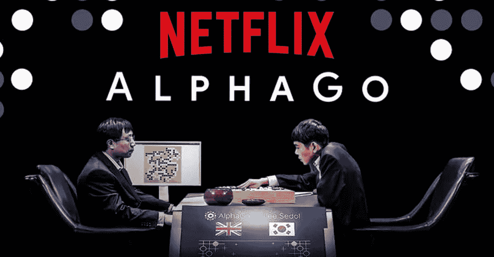
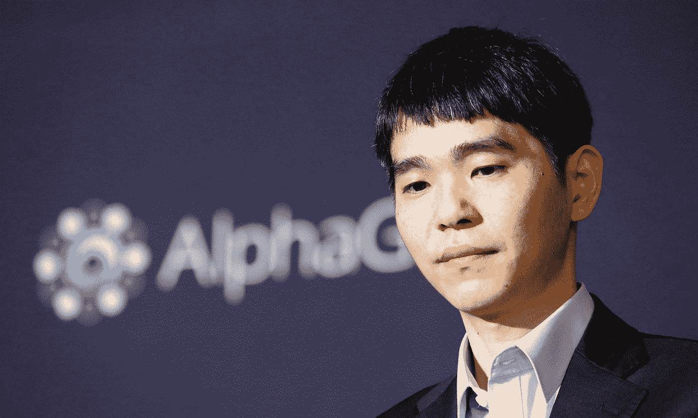
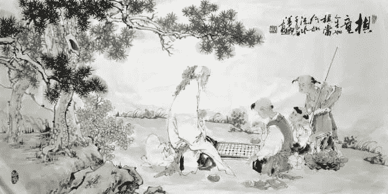
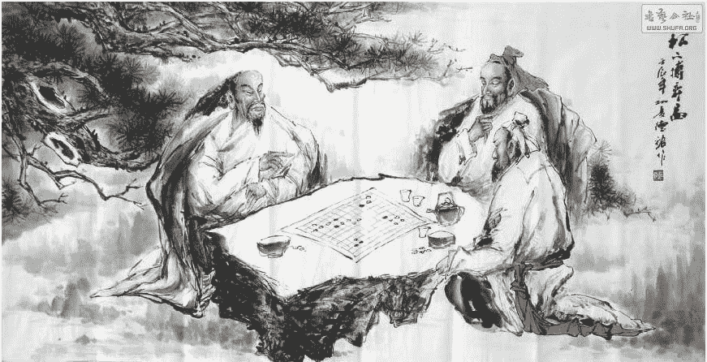
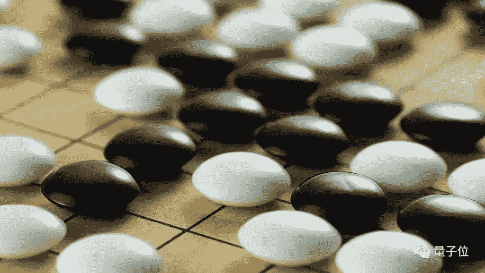

# 没有人能打败 AlphaGo，这是一件好事

> 原文：<https://towardsdatascience.com/no-human-can-beat-alphago-so-what-3401b40fa0f0?source=collection_archive---------17----------------------->

## 为什么围棋大师李世石不应该为输给 AlphaGo 感到遗憾

Photo from Netflix

韩国围棋大师李时斗最近宣布退出职业围棋比赛。原因？他觉得无论自己怎么努力，都赢不了 AlphaGo 这样的 AI 围棋手。这是他在与谷歌 DeepMind 的 AlphaGo 的竞争中历史性失败的一个相当可悲的决定和发展。这给了整件事情一个更戏剧性的基调。然而，人类围棋选手输给 AI，对围棋比赛和人类棋手来说，都不是世界末日。恰恰相反，我认为这可能意味着围棋游戏的一个全新篇章，也是我们回到围棋游戏发明初衷的一个机会。

# AlphaGo 对李时斗

Photo from [androidheadlines.com](https://www.androidheadlines.com/2016/03/alphago-ai-beats-world-champion-lee-sedol-round-1.html)

F 或者那些不熟悉发生的事情，据[维基](https://en.wikipedia.org/wiki/AlphaGo_versus_Lee_Sedol):

> **AlphaGo 对 Lee Sedol** ，也被称为**谷歌 DeepMind 挑战赛**，是 18 届世界冠军 [Lee Sedol](https://en.wikipedia.org/wiki/Lee_Sedol) 和 [AlphaGo](https://en.wikipedia.org/wiki/AlphaGo) 之间的五局[围棋](https://en.wikipedia.org/wiki/Go_(game))比赛，AlphaGo 是由[谷歌 DeepMind](https://en.wikipedia.org/wiki/Google_DeepMind) 开发的[计算机围棋](https://en.wikipedia.org/wiki/Computer_Go)程序，于 2016 年 3 月 9 日至 15 日在韩国[首尔](https://en.wikipedia.org/wiki/Seoul)进行 AlphaGo 赢了除了第四局以外的所有比赛；[【1】](https://en.wikipedia.org/wiki/AlphaGo_versus_Lee_Sedol#cite_note-BBC_News_13_March_2016-1)所有比赛都是靠辞职赢的。这场比赛被拿来与 1997 年深蓝和加里·卡斯帕罗夫的历史性比赛相比较。—维基百科

除了看似戏剧性的失败，李时斗实际上是唯一一个真正打败 AlphaGo 的人类棋手，即使只有一场比赛。但这次失败深深伤害了这位人类围棋大师的信心，他在首尔接受韩联社采访时说:

> “随着人工智能在围棋比赛中的首次亮相，我意识到即使我通过疯狂的努力成为第一，我也没有达到顶峰，”李说。“就算我成为第一，也有一个实体是无法被打败的，”

为了纪念他的退役，他计划与韩国 NHN 娱乐公司开发的另一名人工智能围棋手 HanDol 进行比赛，Han dol 已经击败了 5 名韩国顶级围棋手。

那么，如何看待所有这些呢？这是否意味着围棋手不再有价值，因为人工智能已经可以做得更好了？既然人类永远赢不了机器，围棋就不值得玩吗？这是否意味着人类智慧的终结和人工智能统治人类的开始？答案是一个响亮的不，但要问为什么，我们需要回到最初的围棋比赛。

# 围棋游戏的起源

Go is a very ancient game. It’s said that [Emperor Yao(尧)](https://en.wikipedia.org/wiki/Emperor_Yao) of ancient China invented the Go game to teach his naughty son. His son DanZhu(丹朱) was very combative, yet refused to read any book his parents throw his way. How do you talk sense into this kind of kid? Well, entice him to play games of course! It turns out, DanZhu enjoyed the Go game very much. The competitive nature of the game plays into his combative personality, yet to win consistently, he needs to be more patient, smart and strategic. So he gradually learned all these and his parents were much happier. It’s a rather old and simplified story, but it tells one thing: **Go is not created to see who is the best, it is created for educational purposes.** I’ve learned to play Go when I was 12 years old and I still remembered our teacher telling us:

> “要赢得围棋比赛，你需要擅长计算当前的棋步，同时也要考虑长远。你需要积累一些小的优势，但永远不要忘记大局。你需要足够的勇气在需要的时候打一场漂亮的仗，但如果你知道你赢不了，也不要太鲁莽。当你落后时，你需要有耐心等待最佳出击时机。当你领先时，不自满和犯错就更难了。做到这些，你就可以开始在围棋比赛中竞争了”

这个游戏有如此多的深度和如此高的“技能上限”,没有人可以声称他已经掌握了它。据说那是天堂里的人玩的游戏。抛开神话不谈，围棋作为一种游戏，绝对可以塑造一个人的性格，磨砺他的心智，强化他的意志。所有这些都比赢得比赛本身更有价值。

# 围棋是一种交流方式

There is an old saying in Chinese that goes **“a person’s Go game style echos his personality(棋如其人)”**. It’s easy to hide one’s true nature under well-organized words, but it’s much harder to hide when you’re in a fiercely played game. Go game used to be part of the interview process when ancient Chinese emperors hire his officers. It’s also a way to communicate. Since it’s very popular in ancient China, anyone knows how to read knows how to play Go. Engaging in a healthy competitive Go game is the fastest way to know another person. From your opponent’s playstyle, you’ll quickly know what kind of person he is. Is he conservative and not taking any risks? Is he used to follow some textbook moves or like to think out-of-the-box? After several games, no matter who wins or loses, you’ll know.

# 人类在围棋上被 AI 打败，没什么大不了的

So the million-dollar question is: Does human beaten by AI on Go game change any of the above traits of the game? The answer is obviously no. People can still use Go to cultivate their brain and will. Making friends and finding respect for opponents. It is still a fun game with tons of depth. Winning is not all that important. There is a saying in Go community that goes **“A game with a heavy reward can never generate beautiful and brilliant matches(争棋无名局)”.** This means if people care too much about winning, their creativity will get surpassed and they will all play safe, resulting in very boring games.

没错，人类现在连赢围棋都不如 AI，但这有什么大不了的？有些事情人类做得更好，有些事情计算机做得更好。事实上，有很多事情电脑比人类做得更好。计算数字，处理信息，不犯错误。我很少看到有人心情不好说“ *OMG，我再也不做数学了，因为我的电脑比我好！*“人们只是说，“*好吧，计算机在计算数字上比我们强。太好了。让我们用它来做脏活，让我们专注于发明新的更强大的算法*。对吗？事实上，这正是导致 AI 发明并最终导致 AlphaGo 诞生的原因。围棋游戏也不例外。如果我们停止“**人工智能对人类**的心态，拥抱“**人工智能为人类**工作”的理念，那么新的巨大可能性将会出现。

# 人工智能围棋的未来将是光明的

Ke Jie, Photo from Sohu.com

Lee Se-dol 的故事可能有点悲伤，但与 AlphaGo 有关的另一个故事完全是另一种风格。在中国职业比赛中排名第一的中国年轻围棋大师[柯洁](https://en.wikipedia.org/wiki/Ke_Jie)也与 AlphaGo 进行了一场三局比赛，输得很惨。三场比赛都输了，他毫无胜算。他的反应是什么？他显然对他强大的机器对手心存敬畏，但同时，**他很好奇，非常好奇**。他说，与 AlphaGo 对弈感觉就像打开了另一个完全不同的世界的大门。AlphaGo 玩游戏的方式不像他以前遇到的任何事情，他已经是一名经验丰富的球员，并在中国和国外赢得了大量奖项。然后，他彻底研究了他输掉的三场比赛，试图从中吸取教训，并从中成长。你知道后来发生了什么吗？他在职业比赛中取得了令人兴奋的 12 连胜，击败了路上的每一个对手。

不同的心态导致不同的结果。相似的输球游戏，不同的玩家，不同的结果，让我们思考。也许输给 AI 并不是一件坏事。我们人类总是最善于从过去的错误中学习，变得更好。

> 适应和成长，学习和创造，这是人类肯定能比计算机做得更好的事情，只有天空才是极限。

# 一切都是可能的

Photo by [Dominik Schröder](https://unsplash.com/@wirhabenzeit?utm_source=medium&utm_medium=referral) on [Unsplash](https://unsplash.com?utm_source=medium&utm_medium=referral)

自从我们改变了心态，围棋手可以做很多事情。

首先，也许李时斗先生可以加入一个人工智能团队，尝试帮助开发一种可以击败 AlphaGo 的新算法。他已经计划玩“HanDol”人工智能，也许在未来，他可以建立一个“人工智能围棋联盟”，并通过击败 AlphaGo 来复仇，他帮助开发了一个名为“Se-dol Go”的新人工智能棋手。

或者，柯洁先生可以利用他从 AlphaGo 中学到的知识，帮助开发一个基于人工智能的围棋训练系统，以提高人类棋手的游戏水平。用 AI 做测试工具，探索验证。

也许人工智能社区和围棋社区应该合作开发不同风格的人工智能围棋选手，并让他们在一个联盟中比赛，我们可能会看到许多漂亮的游戏，并推进围棋游戏理论。

> 当 AI 和人类一起工作时，只有天空才是极限。

觉得这篇文章有用？在 Medium 上关注我([李立伟](https://medium.com/u/72c98619a048?source=post_page-----dbe7106145f5----------------------))或者你可以在 Twitter [@lymenlee](https://twitter.com/lymenlee) 或者我的博客网站【wayofnumbers.com】T4 上找到我。你也可以看看我下面最受欢迎的文章！

 [## “这是 CS50”:开始数据科学教育的愉快方式

### 为什么 CS50 特别适合巩固你的软件工程基础

towardsdatascience.com](/this-is-cs50-a-pleasant-way-to-kick-off-your-data-science-education-d6075a6e761a)  [## 一枚硬币的两面:杰瑞米·霍华德的 fast.ai vs 吴恩达的 deeplearning.ai

### 如何不通过同时参加 fast.ai 和 deeplearning.ai 课程来“过度适应”你的人工智能学习

towardsdatascience.com](/two-sides-of-the-same-coin-fast-ai-vs-deeplearning-ai-b67e9ec32133)  [## 你需要了解网飞的“朱庇特黑仔”:冰穴📖

### 是时候让 Jupyter 笔记本有个有价值的竞争对手了

towardsdatascience.com](/what-you-need-to-know-about-netflixs-jupyter-killer-polynote-dbe7106145f5)