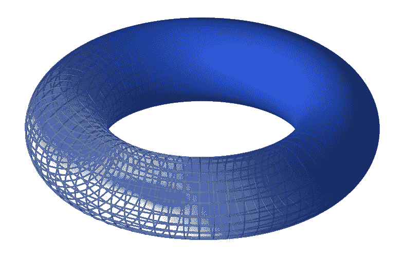

# 没有基础研究就没有创新

> 原文：<https://towardsdatascience.com/no-innovations-without-fundamental-research-cdb4b2b5df37?source=collection_archive---------36----------------------->

## 如今数学无处不在。但是，为什么资助纯数学研究对任何经济的创新都是必要的呢？下面是我脚踏实地的解释。

# 1.什么是数学，它研究什么？

数学经常被认为是深奥的。许多人不知道职业数学家真正做什么，也不知道数学中是否还有什么有待发现的东西。我将尝试解决下面的第一个问题。第二个问题的答案是:不，数学是无限的，总会有东西被发现(你可以[从数学上证明](https://en.wikipedia.org/wiki/G%C3%B6del%27s_incompleteness_theorems))。

数学的来源在历史上在于两个领域:几何和数论。我们每个人都在学校学过几何:计算三角形、正方形、圆形等的面积。问题是这种几何学是几百年前人们做的。目前，几何已经采用了如此复杂的形式，以至于试图在一篇短文中解释它会错过目标(简言之，现代几何通过观察它们的形状和动力学来研究复杂的几何对象。Etale 上同调、栈、层、方案——这些都是数学术语。另一方面，我们有数论，它着重于研究自然数:1，2，3，4，…每个自然数都可以表示为质数的乘积:2，3，5，7，11，…，即只能被自身和 1 整除的数。

经过三千年的发展，素数及其研究仍然在现代数学中发挥着主要作用。它们也被用于工业——由于对质数的研究，我们可以安全地在网上购物，而不用担心我们的数据。了解非常大的素数有助于数据加密。数字是计算机的母语。

在数学中，人们通过给出证明来确保给定的陈述是正确的。简单来说，证明是一系列逻辑句子，以确定性(公理)开始，并导致所需假设的推导。例如，我们可以问是否有无穷多个质数。这是真的；证据很短。然而，一个稍微复杂一点的问题——是否存在无限多对差为 2 的素数(我们称这样的素数为“孪生”)，比如 3 和 5、5 和 7、11 和 13、17 和 19——直到今天仍然没有证明。数学家们认为这是真的，但是还没有人能够找到一个论证来证明这种说法。

直到 2013 年，张一堂[才取得了突破](http://www.newyorker.com/magazine/2015/02/02/pursuit-beauty)，尽管这是对孪生素数理解的一大进步，但仍然无法完全回答这个问题。数学是活的。现在有很多数学家解决不了的问题。有新的答案，但也有新的问题，因为每一个被证实的说法都开启了新的可能性。

# 2.数学研究是什么样子的？

纯抽象数学的研究主要在于阅读和思考。假设我对一个公开的问题感兴趣——就像我上面描述的关于素数对的问题。我该如何证明呢？第一步是了解到目前为止关于这个问题的所有知识。我会阅读并试图理解解决这个问题的最新数学文章。正如我所说的，数学家现在无法解决它，所以我不会在任何地方找到证明，而只会找到可能接近结果的结果。例如，张证明了存在某个数 N，使得存在无穷多对最多相差 N 的素数，如果我们能够证明可以取 N 等于 2，那么问题就解决了。

在第一步中，我将考虑是否可以改进张的结果，例如通过证明差为 n 的素数对的结果，其中 n 小于 n。这将使我们更接近于解决初始问题。

进一步的研究阶段是思考和更多的阅读。此外，还有与其他数学家的合作。在这个问题上思考足够长的时间，我将能够制定更简单的问题，可以被其他数学家更好地理解。数学是一种社会活动——仅仅找到一个证明是不够的，还需要能够向他人解释它。验证是必要的。这就是为什么会议和研讨会对数学家来说如此重要，因为它们是讨论正在进行的研究和交流思想的平台。

不幸的是，最常见的是原始问题无论如何都无法解决。尽管如此，情况并不坏，因为一般来说，有可能在目前已取得的成果上取得小小的进步，或者注意到其他人在他们的研究中所忽略的东西。这是写文章的基础，这将是进一步研究的基础。数学是几代数学家累积的成果。

# 3.为什么有必要资助纯数学？

创新。这个词在最近几年经常被重复。我们希望我们的经济具有创新性。我们需要处于全球发展前沿的高素质专家和专业人员。如何实现？知识是关键。

像生物学、化学和物理学这样描述世界的领域的核心是数学。物理学家用数学方法模拟我们的世界。它在生物学、化学以及 It 方面都是相似的。没有良好的数学基础，就不可能改进现代技术。最抽象的数学扮演着公理的角色——我们的进步基于此。多亏了它，我们有了电脑、互联网、智能手机、飞机或太空旅行。

有人可能会问，为什么不直接资助生产有用产品的工程师？问题是工程师们把他们的计算建立在来自物理学的理论基础上。首先，在我们着手做某件事之前，我们必须知道它在理论上是可能的。但是我们只能资助物理学家吗？然而这是必要的，如果没有抽象数学的数学基础，他们的工作是不可能的，因为抽象数学的培养没有考虑到应用。

从事抽象数学研究的数学家参与跨学科项目提高了研究的质量。数学家对研究的本质有更正式的看法和更广阔的视角，因为他们不寻求直接的应用。他们感兴趣的是完全理解这个主题。这就是为什么他们经常设计元语言来描述现象。这方面的一个例子是逻辑的正式发展，它允许计算机的创造和编程。第一批 IT 专家来自逻辑，而逻辑本身仍然是处理编程所必需的。在未来，同样的事情可能会发生在经济学、社会学或生物学领域，这些领域需要精确的语言来获得有价值的结果。在这里，我将只提到博弈论，它已经在经济学和社会学中找到了应用，以及加密货币比特币，它是基于密码学(再次是数论！).

数学家自己处理数学，因为他们在其中发现美。对他们来说，申请的问题实际上是次要的。反正也不可能先验地说哪个数学领域会有用，哪个不会。英国数学家 g .哈代夸口说，他研究的数学是如此抽象，以至于永远无法应用。Fate 希望他的研究目前被生物学家和 IT 专家用来解决具体问题(见 [Hardy-Weinberg 原理](https://en.wikipedia.org/wiki/Hardy%E2%80%93Weinberg_principle))。

从经济角度来看，大多数数学研究都没有经济上的正当理由——它们在五年或十年内都不会有回报。然而，它们是几十年来最好的投资，因为它们可以留住高素质的科学家，为任何进一步的发现奠定基础，并为其他领域和企业的团队提供支持。这也适用于其他基础研究，即旨在理解某些东西而非构建任何东西的研究。基础研究的例子包括:了解大脑的功能、原子的结构或质数之间的关系。

# 4.数学与经济

我认为数学是一个任何国家都可以在相对较短的时间内取得世界级成功的领域。与化学家、生物学家或实验物理学家需要的昂贵实验室相比，研究是廉价的。通过雇用合适的人和建立数学家可以思考的环境，一个人有机会与世界上最发达的国家竞争。

数学家不需要太多。他们所需要的是不用教学生的时间，这样他们就可以完全投入到研究中去。效果将很快显现。国家的数学水平越高，潜在的科技水平就越高，因为没有数学就无法理解现代科学或工程。

创新只有通过数学的发展才有可能——深入的分析思维和对细节的关注可以推动科学和工程的发展，创造出真正独一无二的东西。