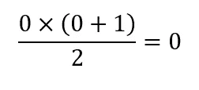
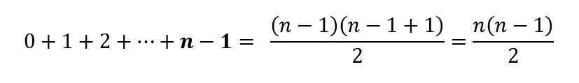
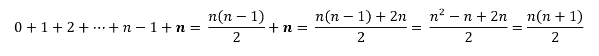
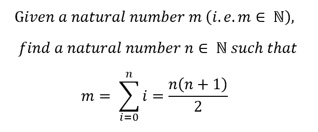
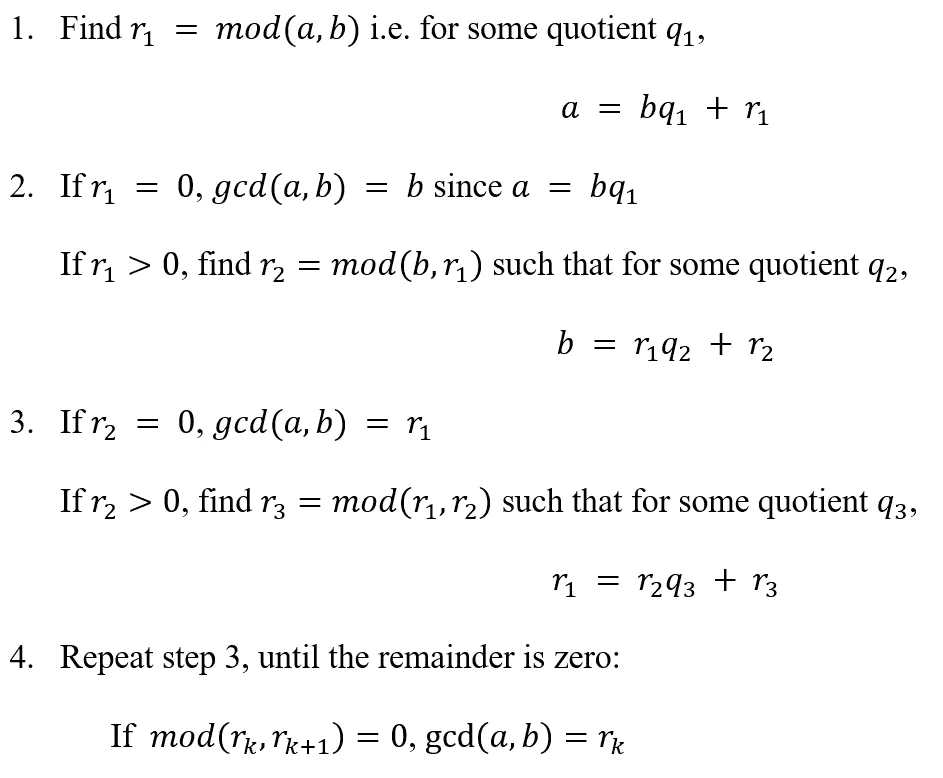
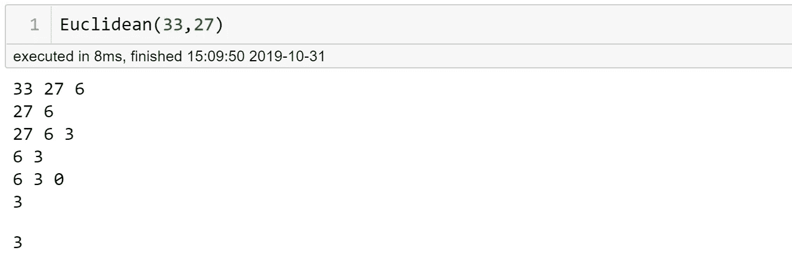

# 无需知道结局:递归算法和数学归纳法

> 原文：<https://towardsdatascience.com/no-need-to-know-the-end-recursion-algorithm-and-mathematical-induction-5a9e4c747c3c?source=collection_archive---------16----------------------->

当我第一次学习数学归纳法和用线性代数解线性系统时，它们对我来说是如此神奇，我觉得自己就像电影《黑客帝国》中最终看到矩阵的尼奥。

我已经多年没有学习它们了(不要问我有多少年了，我不想让你猜我的年龄)，但我清楚地记得，我认为我理解计算机的思维和世界是如何在很短的时间内工作的——我可以一次解多个线性方程，我可以证明系统中模式的存在。我很快会告诉你数学归纳法是如何工作的(希望你能有一秒钟像 Neo 一样的感觉)，但让我先告诉你这个。当我最近了解到一个递归算法时，它让我想起了我学习数学归纳法的时候。好神奇好聪明！每当我得到这些让我震惊的神奇技术时，我一定要仔细分析它们，直到我知道它们是如何工作的。在这篇文章中，我想与你分享我在递归算法和数学归纳法之间发现的相似之处，以及它们如何帮助我实现该算法。

数学归纳法是一种证明数学性质或公式的技术，适用于每个自然数(0 和正整数)或每个整数(正整数)。

例如，让我们证明从 0(或 1)到 n 的正整数相加的等式:

首先证明当 n = 0 时:

第二，**假设**从 0 到 n-1 的加法等式成立:

第三，使用上一步中的假设，证明该等式适用于从 0 到 n 的加法:

这证明了该方程适用于每个自然数，因为:

1.  它适用于最小的数字 0(或者有时是 1)；
2.  如果等式对一个自然数成立，那么对下一个连续的数也成立；
3.  对 0 为真所以对 1 为真，然后对 2 为真，对 3 为真以此类推……(这是我脑子被炸飞的点！)

递归算法是一种调用自身的算法。例如，我有一个自然数， **m，**，我想检查一下 **m** 是否是从 0 到某个数字 **n** 的连续自然数之和，并找出数字 **n** 。这意味着:

这是我们之前证明的方程的倒退。如果我选择 m 为 6，那么 n 就是 3，因为 6 = 1+2+3。然而，如果我选择 m 为 7，那么 n 不存在。要在 Python 中构建一个算法来查找 n，让我们像下面这样计划:

1.  如果 m 是 0，那么 n=0
2.  如果 m>0，更新 n = n+1，然后检查 m-n 是否=0
3.  如果 m-n =0，我们找到 n。如果 m-n>0，则更新 m =m-n，并返回步骤 2。如果 m-n<0，则 n 不存在

我们重复第 2 步和第 3 步，直到相减后的数字变成 0 或负数。我们不知道要重复多少次，所以我们不应该使用 for 循环。当我们需要在不知道终点的情况下重复这个过程时，递归算法非常有用。

我发现数学归纳法和递归算法在三点上非常相似:

1.  基本案情应当成立；在第一个例子中，n=0，在第二个例子中，m = 0
2.  换人是用来过箱子的；在第一个例子中，数列中的最后一个数用于等式中，而在第二个例子中，m 和 n 被更新，直到 m 变为 0 或小于 0

3.没有固定的终点:数学归纳法用于无限数量的序列，递归算法用于没有固定索引范围的迭代。

当我意识到这些相似性时，似乎更容易知道何时使用递归算法以及如何构建它。使用这三样东西，递归算法被分解成两个部分，这两个部分也是何时使用该算法的指示符:

1.  找到一个代表基本情况的参数值，看看它能否结束您将要构建的循环
2.  找到一个重复的模式，看看是否可以简单地通过更新变量值来表达

为了查看这些部件的运行情况，让我们使用欧几里德算法，创建一个函数来计算两个整数 a 和 b 的最大公约数(gcd ),其中 a >b。

从步骤 1 和步骤 4 中，我们看到基本情况是一个数可以被另一个数整除。此外，当余数为正时，对于下一步，我们更新除数和被除数:r₀ = b，r₁，…，rₖ，前一步的余数成为下一步的除数。因此，我们看到递归算法将是一个很好的函数。

